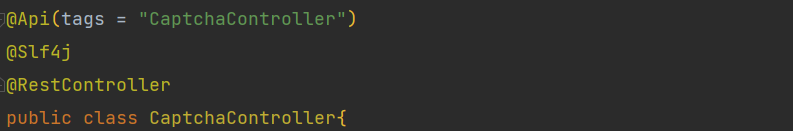
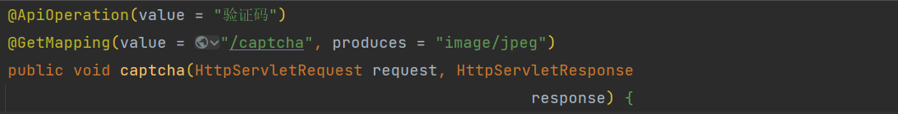
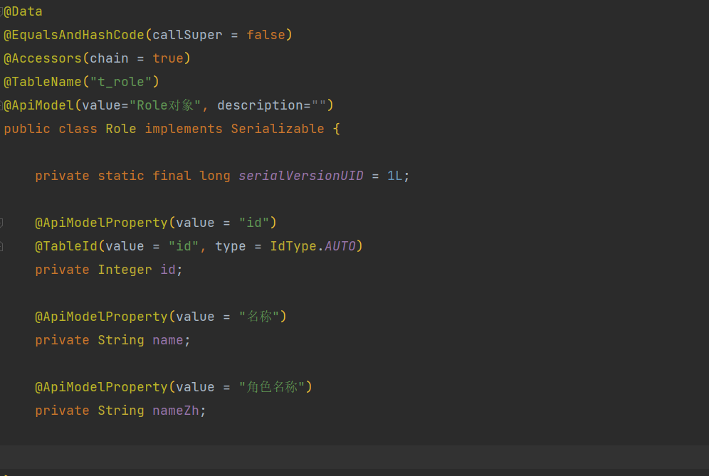

# 接口文档工具

## 引入依赖

```xml
 <!-- swagger2 依赖(用于接口文档) -->
<dependency>
    <groupId>io.springfox</groupId>
    <artifactId>springfox-swagger2</artifactId>
    <version>2.7.0</version>
</dependency>
<!-- Swagger第三方ui依赖 -->
<dependency>
    <groupId>com.github.xiaoymin</groupId>
    <artifactId>swagger-bootstrap-ui</artifactId>
    <version>1.9.6</version>
</dependency>
```

## 使用

### 添加使用注解 @Api

```java
@Api(tags = "CaptchaController")
```



### 方法添加注解 @ApiOperation

```java
@ApiOperation(value = "验证码")
```



### 实体类添加注解 @ApiModel/@ApiModelProperty

```Java
@ApiModel(value="Role对象", description="")
....
@ApiModelProperty(value = "角色名称")    

```



## 访问连接

```xml
http://localhost:8088/doc.html
```


# PageHelper分页插件

链接:https://github.com/pagehelper/Mybatis-PageHelper

## 引入依赖

```xml
<!--mybatis 分页插件-->
<dependency>
    <groupId>com.github.pagehelper</groupId>
    <artifactId>pagehelper</artifactId>
    <version>${pagehelper.version}</version>
</dependency>
```

## 配置PageHelper相关属性

### 方法一

```yaml

# 配置pagehelper参数
pagehelper:
    helperDialect: mysql
    reasonable: true
    supportMethodsArguments: true
    params: count=countSql
```

### 方法二

```java

@Configuration
public class PageHelperConfig {
    @Bean
    public PageHelper getPageHelper(){
        PageHelper pageHelper=new PageHelper();
        Properties properties=new Properties();
        properties.setProperty("helperDialect","mysql");
        properties.setProperty("reasonable","true");
        properties.setProperty("supportMethodsArguments","true");
        properties.setProperty("params","count=countSql");
        pageHelper.setProperties(properties);
        return pageHelper;
    }
}
```

## 使用

```java
//pageNum:表示第几页  pageSize:表示一页展示的数据
PageHelper.startPage(pageNum,pageSize);
```

