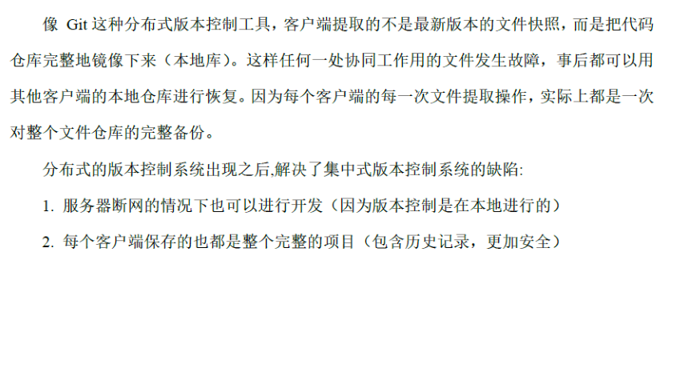
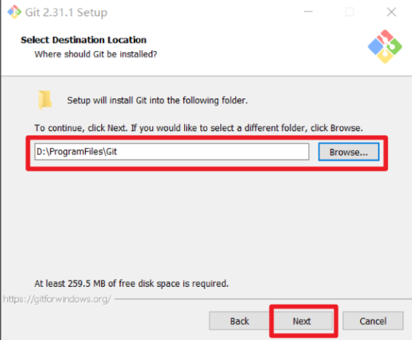
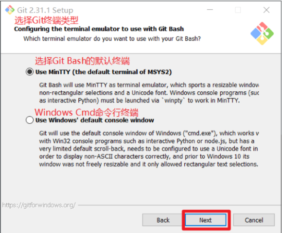
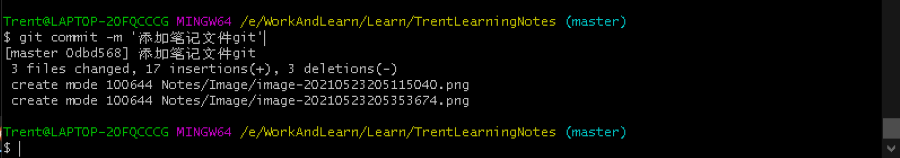

# Git

## Git、GitHub、Gitee、GitLab大纲介绍

## 1.1集中式版本控制

### 1.1.1 SVN

## 1.2分布式版本控制

### 1.2.1 Git

## 1.3 Git工作机制

​	git add .  --> (暂存区可以随时删除)--> git commit -m "" -->(会生成历史本版不能删除) ->git push-->(推送到远程库)

## 1.4 Git和代码托管中心

1. GitLab:组建自己的代码托管中心(局域网下)
2. GitHub:外网代码托管中心
3. Gitee: 国内的

## 1.5 Git安装

选择 Git安装位置，要求是非中文并且没有空格的目录，然后下一步。

Git选项配置，推荐默认设置，然后下一步。

Git安装目录名，不用修改，直接点击下一步。

Git的默认编辑器，建议使用默认的 Vim编辑器，然后点击下一步。

默认分支名设置，选择让 Git决定，分支名默认为 master，下一步。

修改 Git的环境变量，选第一个，不修改环境变量，只在 Git Bash里使用 Git。

选择后台客户端连接协议，选默认值 OpenSSL，然后下一步。

配置Git文件的行末换行符， Windows使用 CRLF Linux使用 LF，选择第一个自动
转换，然后继续下一步。

选择Git终端类型，选择默认的 Git Bash终端，然后继续下一步。

选择Git pull合并的模式，选择默认，然后下一步。

选择Git的凭据管理器，选择默认 的跨平台的凭据管理器 ，然后下一步 。

其他配置，选择默认设置，然后下一步。

实验室功能，技术还不成熟， 有已知的 bug，不要勾选，然后点击右下角的 Install按钮，开始安装 Git。

# 2.1 Git常用命令

| 命令                                    |      作用      |
| :-------------------------------------- | :------------: |
| git config global user.name 用户名 设置 |  设置用户签名  |
| git config global user.email 邮箱       |  设置用户签名  |
| git init                                |  初始化本地库  |
| git status                              | 查看本地库状态 |
| git add 文件名                          |  添加到暂存区  |
| git commit -m "日志信息" 文件名         |  提交到本地库  |
| git reflog                              |  查看历史记录  |
| git reset --hard 版本号                 |    版本穿梭    |
| git log                                 | 详细的历史记录 |

## 2.2 Git 操作命令

### 2.2.1 编辑

 1. 编辑vim  (vim 文件名)

    vim Notes/Git.md 

 2. 编辑退出

    按 ESC，左下角就可以进行输入

    `:w` 保存但不退出

    `:wq` 保存并退出

    `:q` 退出

    `:q!` 强制退出，不保存

    `:e!` 放弃所有修改，从上次保存文件开始再编辑命令历史 

### 2.2.2 git 常用命令

 1. git status 查看本地库状态

    

2. git add 

   git add Notes/Git.md

   

   git add .

   

3. git commit -m '日志记录'

   git commit -m '添加笔记文件git'

   

4. git push (远程推送)

   

5. git reflog

   

6. git log

    

7. cat 文件名

   cat Notes/Git.md

   

### 2.2.3 回溯版本 

Git reset --hard 版本号 (穿梭到指定的版本)

git reset head

这样的话，我们就可以回到开始了。但这个操作好像仅限于在master之类的分支上，如果是在一个新的远程分支，就会出现：

Unstaged changes after reset

解决的办法如下2种办法：

1.git add .

git reset --hard

2.git stash

git stash drop

出现这种现象的原因好像是因为在新分支上，repos感知不到这个阶段的改变，你要用 add 或 stash, 让其知晓，才能做想要的回滚。

### 3.1 Git 分支

