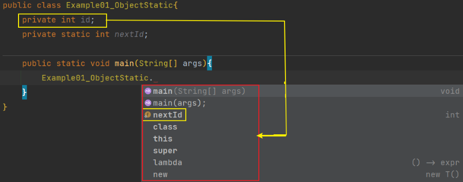

# Java

# No.4 object and Class 

## 用户自定义类

### 实体类

实例域标记应为private

### 构造器

构造器与类同名,在构造类对象时构造器会运行,以便初始化实例域. 构造器伴随new操作符的执行被调用

* 构造器与类同名
* 每个类可以有一个以上的构造器
* 构造器可以有>=0个参数
* 构造器没有返回值
* 构造器伴随new操作一起调用

注意: 不要再构造器里面进行与实例域重名的局部变量


### 隐式参数与显式参数

显式参数，就是平时见到的在方法名括号中间的参数，就是所谓能看得见的参数。

隐式参数，是在类的方法中调用了类的实例域。这个被调用的实例域就是隐式参数。隐式参数被this指定。

显隐式转换:

```java
public class test {
	public static void main(String[] args) {
		int a = 2;
		double b = 1.2;
		// 由a->b, 取值范围小的转向取值范围大的，为隐式转换
		b = a;
		System.out.println(b);
 
		int a1 = 3;
		double b1 = 5.8;
		// 由b->a, 取值范围大的转向取值范围小的，为强制转换（显示转换）
		a1 = (int) b1;
		System.out.println(a1);
	}
}
```


###  封装的优点

封装杜绝了外部类对实例域值得破坏

优点一:对于内部改变不会影响其他得代码

优点二:可以在对实例域值修改可以进行检查或其它操作.而直接改实例域值则不会有这些操作

### 4.3.7 Final实例域

```java
private final String n="";

private final StringBuilder  nn=new StringBuilder("");
```

final关键字在修饰StringBuilder类时:存储在nn变量中的对象引用不会在指向其它的StringBuilder对象.不过该对象可以更改,与变量n不同

## 静态域/方法

### 静态域

```java
public class Example01_ObjectStatic{
	private int id;
	private static int nextId;
}
```

被static关键字修饰的实例域为静态域

对于Example01_ObjectStatic来说:

​	有1000个Example01_ObjectStatic类的对象,就有1000个实例域id。但是只有一个静态域nextId。即使没有Example01_ObjectStatic类的对象，静态域nextId依然存在，静态域nextId只属于类，不属于对象。

==对于静态与可以被类直接调用==



### 静态常量

<u>静态变量使用的少当静态常量使用的多</u>

```java
private[public] final static String constant="changliangbukebian";
```

### 静态方法

* 静态方法是没有this参数的方法
* 静态方法内可以访问类中的静态域


在下面两种情况下使用静态方法：

* 一方法不需要访问对象状态，其所需参数都是通过显式参数提供（例如： Math.pow)
* 一个方法只需要访问类的静态域（例如：Employee.getNextId)

### 方法参数

方法参数是指方法得到所有参数值的一个拷贝

方法参数共有两种类型:

* 基本数据类型(数值,布尔)
* 对象引用

## 对象构造

* ==重载==:多个方法相同的名字,不同的参数,不同的返回值类型 <-- -->(==重写==)

* 无参数构造器:在类中会默认提供一个无参数构造器,并默认给实例域赋初始值

  ==(如果没有初始化类中的域， 将会被自动初始化为默认值（ 0、false 或null)==

* 如果构造器的第一个语句形如this(...)， 这个构造器将调用同一个类的另一个构造器

* 初始化数据域的方法：1.在构造器中设置值 2.在声明中赋值 3.初始代码块

调用构造器的具体步骤：

1. 所有数据域被初始化为默认值（0、false 或null)。

  2. 按照在类声明中出现的次序， 依次执行所有域初始化语句和初始化块。
  3. 如果构造器第一行调用了第二个构造器， 则执行第二个构造器主体
  4. 执行这个构造器的主体

## 包

### 静态导入

```java
import static chapter_four.Example01_ObjectStatic.ss;
```

使用 import static 可以导入类中的静态方法\静态域,而省去加类名前缀

# 

导读：

​	-类、超类和子类					-参数数量可变的方法

​	-object：所有类的超类			  -枚举类

​	-泛型数组列表					  -反射

​	-对象包装器与自动装箱			   -继承的设计技巧


# No.5 Inherit

## 类、超类和子类

### 定义子类

使用关键字extend表示继承，继承是表明在子类上继承已知已存在的父类类上。已存在的可以称作超类、基类、父类。新创建的类可以称作子类、派生类、孩子类。

### 覆盖方法

子类继承超类之后可以把超类的方法进行覆盖 

可以使用super来引用超类的方法

```java
  @Override
	public double getSalary(){
		
		super.getSalary();
		return super.getSalary();
	}
```

子类不能直接的初始化超类的私有域，但可以借助super来进行超类的私有域初始化

```java
	public EmployeeTest(String n, double s, LocalDate h){
    
			super(n, s, h);
	}
```

继承层次：


#### ==多态==：

一个对象变量可以指向多个实际类型的现象称为多态

```java
		Object o1=new String();
		Object o2=new StringBuilder();
		Object o3=new StringBuffer();
```

### 方法调用过程

1. 编译器查看对象声明的类型和方法名-->
2. 会找出所引用方法名相同的重载方法如果存在参数类型完全匹配的则调用该方法(重载解析)-->
3. 如果是private 方法、static 方法、final 方法或者构造器， 那么编译器将可以准确地知道应该调用哪个方法， 我们将这种调用方式称为==静态绑定==(static binding)[==动态绑定==] 调用的方法依赖于隐式参数的实际类型-->　　
4. 虚拟机通过创建的每个类的方法表进行搜索实现动态绑定市级的调用的方法[==调用super.f(param)==]编译器将对隐式参数超类的方法进行搜索调用

### 阻止继承:final类和方法

string类引用final, ；

```Java
public final class String
    implements java.io.Serializable, Comparable<String>, CharSequence {
  
}
```

final修饰的类:此时子类不能在覆盖类中的方法,默认final类中的方法为final方法

​			 ==[不包括类中的实例域]==

final修饰的域:在构造对象之后就不能允许改变他们的值

[final声明方法或类主要是为了在子类中不会改变其语义]

### 强制类型转换

进行类型转换的唯一原因是：在暂时忽视对象的实际类型之后， 使用对象的全部功能。

```java
		Object object = new Object();

		if(object instanceof String){
      
				String d = (String) object;
		}
```

强制转换的要素:

* 只能在继承层次进行类型转换
* 在将超类转成子类之前,使用instanceof进行检测

###  抽象类

#### 特点

* 包含一个以上的抽象方法，类必须声明为抽象类

* 抽象类可以包含具体的域和具体方法[建议把具体方法和通用的域放在超类中]

* 类即使不含抽象方法，也可以将类声明为抽象类

* 声明为抽象类（abstract）的类不能再实例化对象

* 定义一个抽象类只能引用非抽象子类的对象

  ```java
  Person p = new Student("Vinee Vu" , "Economics") ;
  ```

### 受保护访问

1. -->仅对本类可见private。
2. -->对所有类可见public：
3. -->对本包和所有子类可见protected。
4. -->对本包可见—默认（很遗憾)，不需要修饰符。

## Object类

在没有明确指出超类时，则可以把object类认为是这个类的超类

==所有的数组类塱，不管是对象数组还是基本类型的数组都扩展了Object 类。==

```java
Object obj = new EmployeeC'Harry Hacker", 35000) ;
Employee e = (Employee) obj ;
Employee[] staff = new Employee[10];
obj = staff; // OK
obj = new int[10]; // OK
```

### equals

* 判断两个对象是否具有相同的引用

```Java
public class Employee{
  public boolean equals(Object othe「Object)
  {
      // a quick test to see if the objects are identical
      if (this == otherObject) return true;
      // must return false if the explicit parameter is null
      if (otherObject == null ) return false;
      // if the classes don' t match, they can' t be equal
      if (getClassO != otherObject .getClass())
      return false;
      // now we know otherObject is a non-null Employee
      Employee other = (Employee) otherObject;
      // test whether the fields have identical values
      return name.equals(other.name)
      && salary = other , sal ary
      && hi reDay. equals(other, hi reDay) :
  }
}
```

==为了防备name 或hireDay 可能为null 的情况， 需要使用Objects.equals 方法。如果两个参数都为null， Objects.equals(a，b) 调用将返回true ; 如果其中一个参数为null ,则返回false ;==

equals的特性:

1. 自反性：对于任何非空引用x, x.equals(0) 应该返回true
2. 对称性: 对于任何引用x和y, 当且仅当y.equals(x) 返回true, x.equals(y) 也应该返回true。
3. 传递性：对于任何引用x、y 和z, 如果x.equals(y) 返N true， y.equals(z) 返回true,x.equals(z) 也应该返回true。
4. 一致性：如果x 和y 引用的对象没有发生变化， 反复调用x.eqimIS(y) 应该返回同样的结果。
5. 对于任意非空引用x, x.equals(null) 应该返回false,

### hashCode 方法

散列码（ hash code ) 是由对象导出的一个整型值。散列码是没有规律的。

```java
public static void main(String[] args){
		String s =new String();
		String s2 =new String();
		String s3 =new String("dfsf");
		String s4 =new String();
		s="dfsf";
		s2="cccccccccc";
		s4=s3;
		System.out.println(s.hashCode());
		System.out.println(s2.hashCode());
		System.out.println(s3.hashCode());
		System.out.println(s4.hashCode());
	}
```


在类中重新定义equals则必须重新定义hashcode

还有更好的做法，需要组合多个散列值时， 可以调用ObjeCtS.hash 并提供多个参数。这个方法会对各个参数调用Objects.hashCode， 并组合这些散列值

```java
	@Override
	public int hashCode() {
        return Objects.hash(name,sex,phone);
	}
```

### toString 方法

它用于返回表示对象值的字符串。

```java
return "Example01[name =" +name+", sex="+sex + ", phone="+phone+ "] ";
return getClass().getName()+"[name =" +name+", sex="+sex + ", phone="+phone+ "] ";
```

tostring也可以供子类调用:

```java
public class Manager extends Employee
    public String toStringO
    {
        return super.toString() +"[bonus=" + bonus + "]";
    }
}
```

随处可见toString方法的主要原因是：只要对象与一个字符串通过操作符“ +”连接起来,Java编译就会自动地调用toString 方法，以便获得这个对象的字符串描述。

tostring是非常通用的调试工具

## 泛型数组列表

一旦确定了数组的大小， 改变它就不太容易了。在Java 中， 解决这个问题最简单的方法是使用Java 中另外一个被称为ArrayList 的类。它使用起来有点像数组，但在添加或删除元素时， 具有自动调节数组容量的功能，而不需要为此编写任何代码。

### ArrayList

ArrayList 是一个采用类型参数（ type parameter ) 的泛型类（ generic class )。为了指定数组列表保存的元素对象类型， 需要用一对尖括号将类名括起来加在后面，

```java
private ArrayList<Example01> example01 = new ArrayList<Example01>();
```

Java SE 5.0 以前的版本没有提供泛型类.在老版本中会使用Vector类实现动态数组.不过现在ArrayList类更加有效


### 访问数组列表元素

使用get 和set 方法实现访问或改变数组元素的操作，而不使用人们喜爱的[ ] 语法格式:

```java
example01.set(0,new Example01("gg","hh","48855598566"));

Example01 example01 = this.example01.get(2);
```

```
Example01 example01 = this.example01.get(2);
```

### 类型化与原始数组列表的兼容性

## 对象包装器与自动装箱

对象包装器类是不可变的， 即一旦构造了包装器， 就不允许更改包装在其中的值。同时， 对象包装器类还是final , 因此不能定义它们的子类。

```java
ArrayList<Integer> i=new ArrayList<>();
```

###  自动装箱

```java
i.add(3);

将自动转化为:
i.add(Integer.valueOf(3));
```

### 自动拆箱

```java
int x = i.get(1);

将自动转化为:
int i1 = i.get(1).intValue();
```

## 参数数量可变的方法

```java
public PrintStream printf(String format, Object ... args) {
        return format(format, args);
}

System.out.printf("%d %s",new Object[]{56,"fffff"});
```

. . . 是Java 代码的一部分，它表明这个方法可以接收任意数量的对象

## 枚举类

```java
public enum ii{aaa,bbb,ccc,ddd};
```

实际上， 这个声明定义的类型是一个类， 它刚好有4 个实例， 在此尽量不要构造新对象。如果需要的话， 可以在枚举类型中添加一些构造器、方法和域。当然， 构造器只是在构造枚举常量的时候被调用。下面是一个示例：

```java
	public enum ii{
		aaa("1"),bbb("2"),ccc("3"),ddd("4");
		private String lk;
		
		private ii(String lk){
			this.lk = lk;
		}
		public String getLk(){
			return lk;
		}
		
	}
```

## 反射

使用反射， Java 可以支持Visual Basic 用户习惯使用的工具。特别是在设计或运行中添加新类时， 能够快速地应用开发工具动态地查询新添加类的能力。

能够分析类能力的程序称为反射（ reflective )。反射机制的功能极其强大，在下面可以看到， 反射机制可以用来：

* 在运行时分析类的能力
* 在运行时查看对象， 例如， 编写一个toString 方法供所有类使用
* 实现通用的数组操作代码
* 利用Method 对象， 这个对象很像中的函数指针

###  Class类

在程序运行期间，Java 运行时系统始终为所有的对象维护一个被称为运行时的类型标识。这个信息跟踪着每个对象所属的类。虚拟机利用运行时类型信息选择相应的方法执行。

获得class对象的三种方法:

1.可以通过专门的Java 类访问这些信息。保存这些信息的类被称为Class,

```java
Example01 e;
...
Class aClass = e.getClass();
...
System.out.println(e.getClass() .getName() + " " + e.getNameO) ;
```

2.还可以调用静态方法forName 获得类名对应的Class 对象。

```java
String dassName = "java.util .Random";
Class cl = Class.forName(dassName) ;
```

如果类名保存在字符串中， 并可在运行中改变， 就可以使用这个方法。当然， 这个方法只有在dassName 是类名或接口名时才能够执行。否则， forName 方法将抛出一个checkedexception ( 已检查异常）。无论何时使用这个方法， 都应该提供一个异常处理器（ exception handler ) 

==为解决类加载所带来的时间消耗,可以使用通过调用Class.forName 手工地加载其他的类==

3.如果T 是任意的Java 类型（或void 关键字)，T.class将代表匹配的类对象。

```java
Class c = Random.class;
Class c1 = String.class;
Class c2 = int.class;
```

请注意， 一个Class 对象实际上表示的是一个类型， 而这个类型未必一定是一种类。例如，int 不是类， 但int.class 是一个Class 类型的对象。

------

Class 类实际上是一个泛型类。例如， Employee.class 的类型是Class<Employee>。没有说明这个问题的原因是： 它将已经抽象的概念更加复杂化了。在大多数实际问题中， 可以忽略类型参数， 而使用原始的Class 类。

虚拟机为每个类型管理一个Class 对象。因此， 可以利用=运算符实现两个类对象比较的操作。例如:

```java
if (e.getClass == Employee.class) . . .
```

还有一个很有用的方法newlnstance( )，可以用来动态地创建一个类的实例例如

```java
e.getClass0.newlnstance() ;


try{
    Example01 example011 = e.getClass().newInstance();
}catch( InstantiationException instantiationException ){
    instantiationException.printStackTrace();
}catch( IllegalAccessException illegalAccessException ){
    illegalAccessException.printStackTrace();
}
```

创建了一个与e 具有相同类类型的实例。newlnstance 方法调用默认的构造器（没有参数的构造器）初始化新创建的对象。如果这个类没有默认的构造器， 就会抛出一个异常

------

将forName 与newlnstance 配合起来使用， 可以根据存储在字符串中的类名创建一个对象

```java
try{
    String s ="java.util.Random";
    Object o = Class.forName(s).newInstance();
}catch( InstantiationException instantiationException ){
    instantiationException.printStackTrace();
}catch( IllegalAccessException illegalAccessException ){
    illegalAccessException.printStackTrace();
}catch( ClassNotFoundException classNotFoundException ){
    classNotFoundException.printStackTrace();
}
```

###  利用反射分析类的能力

反射机制最重要的内容-->检查类的结构(查看任意对象的数据域名称和类型)

在java.lang.reflect 包中有三个类:

Field: 描述类的域,getType方法用来描述域所属类型的class对象

Method: 描述类的方法

Constructor: 描述类的构造器

------

这三个类都有一个getName()的方法,用来返回项目的名称. 

还有一个getModifiers的方法它将返回一个整型数值,用不同的位开关描述public 和static 这样的修饰符使用状况

还可以用用java.lang.refleCt 包中的Modifiei•类的静态方法分析
getModifiers 返回的整型数值例如:

可以使用Modifier 类中的isPublic、isPrivate 或isFinal
判断方法或构造器是否是public、private 或final我们需要做的全部工作就是调用Modifier类的相应方法， 并对返回的整型数值进行分析， 另外， 还可以利用Modifier.toString 方法将修饰符打印出来

------

Class 类:

1. getFields、getMethods 和getConstructors 方法将分别返回类提供的
   public 域、方法和构造器数组， 其中包括超类的公有成员。
2. getDeclareFields、getDeclareMethods 和getDeclaredConstructors 方法将分别返回类中声明的全部域、方法和构造器， 其中包括私有和受保护成员，但不包括超类的成员。

### 在运行时使用反射分析对象

#### 受限于访问权限

查看对象域使用的是field类中的get方法,通过f域(f指对象域)返回一个对象例如:f.get(obj)返回一个对象.其值为obj域的当前值.

```java
Employee harry = new Employee("Harry Hacker", 35000, 10, 1, 1989) ;
Class cl = harry.getClass()；
// the class object representing Employee
Field f = cl.getDeclaredField("name") :
// the name field of the Employee class
Object v = f.get(harry) ;
// the value of the name field of the harry object , i .e., the String object "Harry Hacker"
```

实际上，这段代码存在一个问题。由于name 是一个私有域， 所以get 方法将会抛出一个
IllegalAccessException。只有利用get 方法才能得到可访问域的值。除非拥有访问权限，否则Java 安全机制只允许査看任意对象有哪些域， 而不允许读取它们的值。


```java
public void method01(){
		
    OrdinaryEntity ordinary = new OrdinaryEntity("mether go home", 565.56, "15688889999");
    Class aClass = ordinary.getClass();
    try{
        Field name = aClass.getDeclaredField("name");
        Object o = name.get(ordinary);
        System.out.println(o.toString());
    }catch( IllegalAccessException e ){
        e.printStackTrace();
    }catch( NoSuchFieldException e ){
        e.printStackTrace();
    }
}
```


#### 实现不受访问权限控制

反射机制的默认行为受限于Java 的访问控制。然而， 如果一个Java 程序没有受到安
全管理器的控制， 就可以覆盖访问控制。为了达到这个目的， 需要调用Field、Method 或
Constructor 对象的setAccessible 方法。例如

```java
f.setAtcessible(true) ;
```

setAccessible 方法是AccessibleObject 类中的一个方法， 它是Field、Method 和Constructor类的公共超类。这个特性是为调试、持久存储和相似机制提供的。

```java
public void method02() {
		OrdinaryEntity ordinary = new OrdinaryEntity("mether go home", 565.56, "15688889999");
		try{
			Field field = ordinary.getClass().getDeclaredField("name");
			field.setAccessible(true);
			System.out.println(field.isAccessible());
			System.out.println(field.getName());;
			Object o = field.get(ordinary);
			System.out.println(o.toString());
		}catch( NoSuchFieldException e ){
			e.printStackTrace();
		}catch( IllegalAccessException e ){
			e.printStackTrace();
		}
}
```


由于JDK的安全检查耗时较多.所以通过setAccessible(true)的方式关闭安全检查就可以达到提升反射速度的目的 

####  get方法转换用法

但在访问私有double类型的域时可以使用getDouble()方法

```java
public void method02() {
		OrdinaryEntity ordinary = new OrdinaryEntity("mether go home", 565.56, "15688889999");
		Field field=null;
		try{
			//field = ordinary.getClass().getDeclaredField("name");
			field = ordinary.getClass().getDeclaredField("sal");
			System.out.println("解除访问受限前"+field.isAccessible());
			field.setAccessible(true);
			System.out.println("解除访问受限后"+field.isAccessible());
			System.out.println(field.getName());
			//Object o = field.get(ordinary);
			double o = field.getDouble(ordinary);
			System.out.println(o);
		}catch( NoSuchFieldException e ){
			e.printStackTrace();
		}catch( IllegalAccessException e ){
			e.printStackTrace();
		}
	}
```


### 使用反射编写泛型数组代码

要获得新数组元素类型,要具有三个要素:

1. 首先获得a 数组的类对象。
2. 确认它是一个数组。
3. 使用Class 类（只能定义表示数组的类对象）的getComponentType 方法确定数组对应的类型。

通过aClass.getComponentType()获取对象的类型,根据类型拷贝数组

```java
	public Object copyObjectArray(Object o, int newlength){
		
		Class aClass = o.getClass();
		if(!aClass.isArray()) {
			return null;
		}
		Class componentType = aClass.getComponentType();
		int length = Array.getLength(o);
		//int length = ;
		Object newArray = Array.newInstance(componentType, newlength);
		System.arraycopy(o,0,newArray,0,Math.min(length,newlength));
		return newArray;
	}
```

### 调用任意方法

为了能够看到方法指针的工作过程， 先回忆一下利用Field 类的get 方法查看对象域的过
程。与之类似， 在Method 类中有一个invoke 方法， 它允许调用包装在当前Method 对象中
的方法。invoke 方法的签名是：

```java
Object invoke(Object obj, Object... args)
```

==返回类型是基本类型,invoke方法则返回的是包装类型==

可以通过getDeclaredMethods获得方法数组,通过invoke来调用当前对象的方法

```java
public void getMethodInvoke(){
		
		OrdinaryEntity ordinaryEntity = new OrdinaryEntity("mether go home", 565.56, "15688889999");
		Class aClass = ordinaryEntity.getClass();
		try{
			Method getName1 = aClass.getMethod("getName");
			Object nameValue = getName1.invoke(ordinaryEntity);
			System.out.println(nameValue);
    /**如何得到Method对象呢? 当然,可以通过调用getDeclareMethods方法,然后对返回的Method对象数组进行				查找,直到发现想要的方法为止。也可以通过调用Class类中的getMethod方法得到想要的方法*/
			Method[] declaredMethods = aClass.getDeclaredMethods();
			for (int i = 0; i < declaredMethods.length; i++) {
				Object invoke = declaredMethods[i].invoke(ordinaryEntity);
				System.out.println("for:"+invoke);
			}
			
		}catch( NoSuchMethodException e ){
			e.printStackTrace();
		}catch( InvocationTargetException e ){
			e.printStackTrace();
		}catch( IllegalAccessException e ){
			e.printStackTrace();
		}
	}
```


### 不要轻易的使用反射

1. 出错的可能性也比较大。如果在调用方法的时候提供了一个错误的参数，那么invoke 方法将会抛出一个异常
2. invoke 的参数和返回值必须是Object 类型的。这就意味着必须进行多次的类型转
   换。这样做将会使编译器错过检查代码的机会。查找错误比较困难
3. 使用反射获得方法指针的代码要比仅仅直接调用方法明显慢一些。

特别要重申： 建议Java 开发者不要使用Method 对象的回调功能。使用接口进行回调会使得代码的执行速度更快， 更易于维护。

## 继承设计的技巧

技巧:

1. 将公共操作和域放在超类

2. 不要使用受保护的域 

   ​	例如:protected定义的实例域\方法

   * 子类集合是无限制的， 任何一个人都能够由某个类派生一个子类，并
     编写代码以直接访问protected 的实例域， 从而破坏了封装性
   * 在Java 程序设计语言中，在同一个包中的所有类都可以访问proteced 域，而不管它是否为这个类的子类。
   * protected 方法对于指示那些不提供一般用途而应在子类中重新定义的方法很有用。

3. 使用继承实现“ is-a” 关系

   使用继承可以实现节省代码的目的

4. 除非所有继承的方法都有意义， 否则不要使用继承

5. 在覆盖方法时， 不要改变预期的行为

   在覆盖一个方法的时候， 不应该毫无原由地改变行为的内涵。

6. 使用多态， 而非类型信息
7. 不要过多地使用反射


# Interface

## 接口

接口不是类，而是对类的一组需求描述，这些类要遵从接口描述的统一格式进行定义。

### 接口特征

1.接口中的所有方法自动属于public,在接口声明方法时,不必提供关键字public

​		X.compareTo(y)时:

​			- 当x>y时: 返回一个正数

​			- 当x<y时: 返回一个负数

​			- 当x=y时: 返回0

2.接口中可以定义常量,但接口不能有实例域[实现接口的类会自动的继承定义的常量,在方法中可以直接的引用]

3.接口中在jdk8之前不能在接口中实现方法,但之后可以在接口中提供方法但是不能引用实例域(因为接口中没有实例域)

综合上面的特点可以知道,接口可以看作时没有实例域的抽象类

在实现接口的类中方法必须声明为public,否则,编译器将认为方法的访问范围为包可见(proteced)

### 抽象类与接口

每一个类只限定继承一个类,而抽象类是对通用行为的一个抽象,一个类只能继承一个抽象类,而对与接口可以继承多个.

### 静态方法

在Java SE 8 中，允许在接口中增加静态方法。理论上讲，没有任何理由认为这是不合法的。只是这有违于将接口作为抽象规范的初衷。

### 默认方法

可以为接口方法提供一个默认实现。必须用default 修饰符标记这样一个方法。

```java
public interface InterfaceDome{
	int max_value=56666;
	
	void method01();
	
	default void method02(){
	
	}
}
```

在接口中定义一个默认方法可以解决原先时间接口类的B类不会在自己的类中去实现不必要的方法.解决因不实现接口方法所带来的编译报错.并且可以在实现类中调用接口中的默认方法.

```java
public class InterfaceDomeImpl implements InterfaceDome{
	@Override
	public void method01(){
	    new InterfaceDomeImpl().method02();
	}
	public static void main(String[] args){
		InterfaceDomeImpl interfaceDome = new InterfaceDomeImpl();
		interfaceDome.method02();
	}
}
```

### 解决默认方法的冲突

如果先在一个接口中将一个方法定义为默认方法， 然后又在超类或另一个接口中定义了同样的方法， 会发生什么情况？

1. 超类优先。如果超类提供了一个具体方法， 同名而且有相同参数类型的默认方法会被忽略。
2. 接口冲突。如果一个超接口提供了一个默认方法， 另一个接口提供了一个同名而且参数类型（不论是否是默认参数）相同的方法， 必须覆盖这个方法来解决冲突。

在实现类中把两个接口类中相同的方法进行实现,并在实现类中的方法里面指定要使用接口中的方法:

```java
public class InterfaceDomeImpl implements InterfaceDome02,InterfaceDome{
	@Override
	public void method01(){
	    new InterfaceDomeImpl().method02();
	}
  
  /*********************************************************************/
  在实现类中覆盖method02()方法并在方法中指定要调用哪个接口同样的方法method02()
	@Override
	public void method02(){
		InterfaceDome02.super.method02();
	}
  /*********************************************************************/
  
	public static void main(String[] args){
		InterfaceDomeImpl interfaceDome = new InterfaceDomeImpl();
		interfaceDome.method02();
	}
}
```

==以上的方法解决歧义性==

当一个类继承一个带有method02()方法的类,并且还实现了InterfaceDome02接口[接口中同样有相同的method02()方法]. 这个时候会优先考虑类中的method02()方法.既==[类的优先性规则]==

## 接口示例

### 接口与回调

回调（ callback) 是一种常见的程序设计模式。在这种模式中， 可以指出某个特定事件发生时应该采取的动作。例如，可以指出在按下鼠标或选择某个菜单项时应该采取什么行动。(定时操作)

### Comparator 接口

### 对象克隆

Cloneable 接口，这个接口指示一个类提供了一个安全的clone 方法

```java
public class OrdinaryEntity implements Cloneable{
	....
	
	@Override
	public OrdinaryEntity clone() throws CloneNotSupportedException{
		return (OrdinaryEntity) super.clone();
	}
  ....
    
}

public static void main(String[] args){
		//克隆
		OrdinaryEntity miongminn = new OrdinaryEntity("miongminn", 5698, "15699887");
		try{
			OrdinaryEntity ordinaryEntity=miongminn.clone();
			System.out.println(ordinaryEntity.toString());
		}catch( CloneNotSupportedException e ){
			e.printStackTrace();
		}
}
```

使用clone方法可以初始化一个新的对象,两个对象之间不会彼此影响


## lambda 表达式

### 为什么引入lambda 表达式

lambda 表达式是一个可传递的代码块， 可以在以后执行一次或多次。

(线程,定时器)

### lambda 表达式的语法

```java
		//lambda 表达式的语法
		String[] s =new String[]{"ds","jj","kk","yy","ss","cc","hh","ff","hh","ll","gg"};
		System.out.println(Arrays.toString(s));
		Arrays.sort(s);
		System.out.println(Arrays.toString(s));
		System.out.println("**********");
		Arrays.sort(s,(first, second)->first.length()-second.length());
		System.out.println(Arrays.toString(s));
		
		Timer timer = new Timer(1000,event-> System.out.println("ddd"));
    timer.start();
    JOptionPane.showMessageDialog(null,"qq");
    System.exit(0);
```

你已经见过Java 中的一种lambda 表达式形式：参数， 箭头（->) 以及一个表达式。如果代码要完成的计算无法放在一个表达式中，就可以像写方法一样，把这些代码放在{}中，并包含显式的return 语句。例如：

```java
(String first, String second) ->
{
  if (first.lengthO < second.lengthO) return -1;
  else if (first.lengthO > second.lengthO) return 1;
  else return 0;
}
```

即使lambda 表达式没有参数， 仍然要提供空括号，就像无参数方法一样：

```java
0 -> { for (int i = 100; i >= 0;i ) System.out.println(i); }
```

如果可以推导出一个lambda 表达式的参数类型，则可以忽略其类型。例如：

```java
Comparator<String> comp
= (first, second) // Same as (String first, String second)
-> first.length() - second.length();
```

在这里， 编译器可以推导出first 和second 必然是字符串， 因为这个lambda 表达式将赋
给一个字符串比较器。

如果方法只有一参数， 而且这个参数的类型可以推导得出，那么甚至还可以省略小括号：

```java
ActionListener listener = event ->
System.out.println("The time is " + new Date()");
// Instead of (event) -> . . . or (ActionEvent event) -> . . .
```

无需指定lambda 表达式的返回类型。lambda 表达式的返回类型总是会由上下文推导得
出。例如，下面的表达式

```java
 (String first, String second) -> first.lengthO - second.lengthO
```

### 函数式接口

对于只有一个抽象方法的接口， 需要这种接口的对象时， 就可以提供一个lambda 表达式。这种接口称为函数式接口（ functional interface )。

### 方法引用

有时， 可能已经有现成的方法可以完成你想要传递到其他代码的某个动作

例子:

```java
Timer t = new Timer(1000, Systei.out::println) ;
Arrays.sort(strings，String::conpareToIgnoreCase)
```

以上可以得出,要用：:操作符分隔方法名与对象或类名。主要有3 种情况：

* object::instanceMethod
* Class::staticMethod
* Class::instanceMethod


```java
public class Exe1 {
    public static void main(String[] args) {
        ReturnOneParam lambda1 = a -> doubleNum(a);
        System.out.println(lambda1.method(3));

        //lambda2 引用了已经实现的 doubleNum 方法
        ReturnOneParam lambda2 = Exe1::doubleNum;
        System.out.println(lambda2.method(3));

        Exe1 exe = new Exe1();

        //lambda4 引用了已经实现的 addTwo 方法
        ReturnOneParam lambda4 = exe::addTwo;
        System.out.println(lambda4.method(2));
    }

    /**
     * 要求
     * 1.参数数量和类型要与接口中定义的一致
     * 2.返回值类型要与接口中定义的一致
     */
    public static int doubleNum(int a) {
        return a * 2;
    }

    public int addTwo(int a) {
        return a + 2;
    }
}
```


### 构造器引用

构造器引用与方法引用很类似，只不过方法名为new。例如，Person::new 是Person 构造器的一个引用。哪一个构造器呢？ 这取决于上下文

### 变霣作用域

### 处理lambda 表达式

### 再谈Comparator

## 内部类

内部类（ inner class ) 是定义在另一个类中的类。为什么需要使用内部类呢？ 其主要原因:

* 内部类方法可以访问该类定义所在的作用域中的数据， 包括私有的数据。
* 内部类可以对同一个包中的其他类隐藏起来。
* 当想要定义一个回调函数且不想编写大量代码时，使用匿名（anonymous) 内部类比较便捷。

### 使用内部类访问对象状态

## 代理 

假设有一个表示接口的Class 对象（有可能只包含一个接口)，它的确切类型在编译时无法知道。这确实有些难度。要想构造一个实现这些接口的类， 就需要使用newlnstance 方法或反射找出这个类的构造器。但是， 不能实例化一个接口，需要在程序处于运行状态时定义一个新类。

代理类可以在运行时创建全新的类。这样的代理类能够实现指定的接口

###   创建代理对象

创建一个代理对象， 需要使用Proxy 类的newProxylnstance 方法。这个方法有三个参数：

* 一个类加栽器（ class loader)。 作为Java 安全模型的一部分， 对于系统类和从因特网上下载下来的类，可以使用不同的类加载器。有关类加载器的详细内容将在卷n 第9章中讨论。目前， 用null 表示使用默认的类加载器。
* 一个Class 对象数组， 每个元素都是需要实现的接口。
* 一个调用处理器。

###   代理类的特性

所有的代理类都扩展于Proxy类。一个代理类只有一个实例域---调用处理器，它定义在Proxy的超类中。为了履行代理对象的职责,所需要的任何附加数据都必须存储在调用处理器中。

所有的代理类都覆盖了Object类中的方法toString、equals 和hashCode。如同所有的代理方法一样,这些方法仅仅调用了调用处理器的invoke。

没有定义代理类的名字，Sun虚拟机中的Proxy类将生成一个以字符串SProxy开头的类名。

对于特定的类加载器和预设的一组接口来说,只能有一个代理类。也就是说,如果使用同一个类加载器和接口数组调用两次newProxylustance 方法的话那么只能够得到同一个类的两个对象，也可以利用getProxyClass 方法获得这个类：

```java
Class proxyClass = Proxy.getProxyClass(null, interfaces);
```

代理类一定是public 和final。如果代理类实现的所有接口都是public,代理类就不属于某个特定的包；否则,所有非公有的接口都必须属于同一个包，同时，代理类也属于这个包。

可以通过调用Proxy类中的isProxyClass方法检测一个特定的Class对象是否代表一个代理类。

#  异常\断言\log

## 异常


## 断言

断言机制允许在测试期间向代码中插入一些检査语句。当代码发布时，这些插人的检测语句将会被自动地移走。

Java 语言引人了关键字assert。这个关键字有两种形式：

​	* assert 条件；

​    * assert 条件：表达式；

# GenericProgramDevise

## 泛型设计使用

泛型设计可以使很多不同类型的对象所重用

### 类型参数的好处

在Java中增加范型类之前， 泛型程序设计是用继承实现的。ArrayList类只维护一个Object引用的数组

```java
ArrayLi st files = new ArrayListO；
String filename = (String) files.get (O) ;
```

使用类型参数后

```java
ArrayList<String> files = new ArrayList<String>() :
String filename = files.get(0);
```

## 定义简单的泛型类

一个类型变量:

```java
public class SimpleGeneric<T>{
	private T name;
	private T sex;
	private T addre;
	public SimpleGeneric(){
		name = null;
		sex = null;
		addre = null;
	}
	public SimpleGeneric(T name, T sex, T addre){
		this.name = name;
		this.sex = sex;
		this.addre = addre;
	}
	public T getName(){
		return name;
	}
	public void setName(T name){
		this.name = name;
	}
	public T getSex(){
		return sex;
	}
	public void setSex(T sex){
		this.sex = sex;
	}
	public T getAddre(){
		return addre;
	}
	public void setAddre(T addre){
		this.addre = addre;
	}
}
```

两个类型变量:

```java
public class SimpleGeneric02<T,U>{
	private T name;
	private U phone;
	
	public SimpleGeneric02(){
		name = null;
		phone = null;
	}
	public SimpleGeneric02(T name, U phone){
		this.name = name;
		this.phone = phone;
	}
	public T getName(){
		return name;
	}
	public void setName(T name){
		this.name = name;
	}
	public U getPhone(){
		return phone;
	}
	public void setPhone(U phone){
		this.phone = phone;
	}
}
```

## 泛型方法

```java
public U getPhone(){
		return phone;
	}

```

## 类型变量的限定

```java
public static <T extends Coiparab1e> T main(T a) . . .
```

通过<T extends Coiparab1e>来限定类型变量从而获得compareTo方法

为什么使用关键字extends 而不是implements ?

T 和绑定类型可以是类， 也可以是接口。选择关键字extends 的原因是更接近子类的概念， 并且Java 的设计者也不打算在语言中再添加一个新的关键字（如sub)。

一个类型变量或通配符可以有多个限定， 例如：

```java
<T extends Comparable & Serializable>
```

通过&可以根据需要拥有多个接口超类型但限定中至多有一个类。如果用一个类作为限定，它必须是限定列表中的第一个。

## 泛型与虚拟机

### 类型擦除

原始类型的名字就是删去类型参数后的泛型类型名。擦除（ erased) 类型变M, 并替换为限定类型（无限定的变量用Object)。

### 翻译泛型表达式

```java
Pair<Employee> buddies = . .
Employee buddy = buddies.getFirstO；
```

擦除getFirst 的返回类型后将返回Object 类型。编译器自动插人Employee 的强制类型转换。也就是说，编译器把这个方法调用翻译为两条虚拟机指令：

* 对原始方法Pair.getFirst 的调用。
* 将返回的Object 类型强制转换为Employee 类型。

### 翻译泛型方法

```java
擦除前
public static <T extends Comparable〉T nrin(T[] a)
擦除后
public static Comparable min(Comparable!] a)  
```

### 调用遗留代码

设计Java 泛型类型时， 主要目标是允许泛型代码和遗留代码之间能够互操作。

在查看了警告之后，可以利用注解（ annotation ) 使之消失。注释必须放在生成这个警告的代码所在的方法之前， 如下：

```java
@SuppressWarnings("unchecked")
Dictionary<Integer, Components〉labelTable = slider.getLabelTableQ; // No warning
或者
@SuppressWarnings("unchecked")
public void configureSliderO { . . . }
```

## 约束与局限性

### 不能用基本类型实例化类型参数

### 运行时类型查询只适用于原始类型

所有类型查询只产生原始类型

```java
if (a instanceof Pair<String>) // Error
```

实际只是测试a是不是与pair的同一个类型

```java
if (a instanceof Pair<T>) // Error
  比如
Pair<String> p = (Pair<String>) a
```

同理使用getCalss总是返回原始类型

```java
Pair<String> stringPair = . .
Pair< Employee〉employeePair = . .
if (stringPair.getClassO == employeePair.getClass() // they are equal
```

其比较的结果是true, 这是因为两次调用getClass 都将返回Pair.class。

### 不能创建参数化类型的数组

不能实例化参数化类型的数组， 例如：

```java
Pair<String>[] table = new Pair<String>[10] ; // Error
```

这有什么问题呢？ 擦除之后， table 的类型是Pair[]。 可以把它转换为Object□ :

数组会记住它的元素类型， 如果试图存储其他类型的元素， 就会抛出一个Array-
StoreException 异常：

需要说明的是， 只是不允许创建这些数组， 而声明类型为Pair<String>[] 的变量仍是合法的。不过不能用new Pair<String>[10] 初始化这个变量。

### Varargs 警告

### 不能实例化类型变置

### 不能构造泛型数组

### 泛型类的静态上下文中类型变量无效

### 不能抛出或捕获泛型类的实例

### 可以消除对受查异常的检查

### 注意擦除后的冲突

## 泛型类型的继承规则

## 通配符类型

### 通配符概念

### 通配符的超类型限定

### 无限定通配符

### 通配符捕获

## 反射和泛型

### 泛型Class 类

现在，Class类是泛型的。例如，String.class实际上是一个：< 以8<8出呢>类的对象（事实上，是唯一的对象)。

==有空看下Class类==

### 使用Class<T> 参数进行类型匹配

示例:

```java
public static <T> Pai r<T> makePair(Class<T> c) throws InstantiationException,IllegalAccessException
{
		return new Pairofc.newInstanceO » c.newInstanceO) ;
}
```

调用这个方法:

```java
makePair(Employee.class)
```

### 虚拟机中的泛型类型信息

Java 泛型的卓越特性之一是在虚拟机中泛型类型的擦除,但是在擦除的类仍然保留一些泛型祖先的微弱记忆。例如， 原始的Pair 类知道源于泛型类Pair<T>， 即使一
个Pair 类型的对象无法区分是由PaiKString> 构造的还是由PaiKEmployee> 构造的。

可以使用反射API来确定:

* 这个泛型方法有一个叫做T 的类型参数。
* 这个类型参数有一个子类型限定， 其自身又是一个泛型类型。
* 这个限定类型有一个通配符参数。
* 这个通配符参数有一个超类型限定。
* 这个泛型方法有一个泛型数组参数。

换句话说，需要重新构造实现者声明的泛型类以及方法中的所有内容。但是，不会知道对于特定的对象或方法调用， 如何解释类型参数。

为了表达泛型类型声明， 使用java.lang.reflect 包中提供的接口Type。这个接口包含下列子类型：

* Class 类，描述具体类型。
* TypeVariable 接口 , 描述类型变量（如T extends Comparable<? super T>)
* WildcardType 接口， 描述通配符（如？super T)。
* ParameterizedType 接口， 描述泛型类或接口类型（如Comparable<? super T>)。
* GenericArrayType 接口， 描述泛型数组（如T[])。

