# 基础命令

## vim 编辑

 1. 编辑vim  (vim 文件名)

    vim Notes/Git.md 

 2. 编辑退出

    按 ESC，左下角就可以进行输入

    `:w` 保存但不退出

    `:wq` 保存并退出

    `:q` 退出

    `:q!` 强制退出，不保存

    `:e!` 放弃所有修改，从上次保存文件开始再编辑命令历史 

## which 查找文件路径

1. which

   用途：查找Linux命令文件并显示所在的位置

   搜索范围由 PATH 环境变量指定

   格式：which 命令或程序名

   echo $PATH 输出环境变量

```shell
which [fileName]
```

2. find /

```shell
find / -name idserver.war

查找文件
-name <表达式> 根据文件名查找文件
-iname <表达式> 根据文件名查找文件，忽略大小写
-path <表达式> 根据路径查找文件
-ipath <表达式> 根据路径查找文件，忽略大小写
```


# Linux

## 服务器之间免密连接

1. 首先在三台机器上配置对本机的ssh免密码登录
   ==ssh-keygen -t rsa==
   生成本机的公钥，过程中不断敲回车即可，ssh-keygen命令默认会将公钥放在/root/.ssh目录下
   ==cd /root/.ssh==
2. ==cp id_rsa.pub authorized_keys==
   将公钥复制为authorized_keys文件，此时使用ssh连接本机就不需要输入密码了
3. 接着配置三台机器互相之间的ssh免密码登录
   使用==ssh-copy-id -i hostname==命令将本机的公钥拷贝到指定机器的authorized_keys文件中

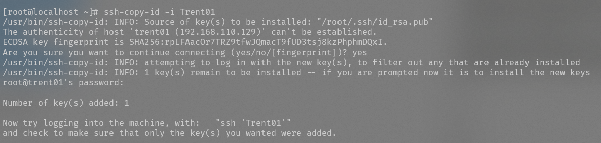

4. 使用cat authorized_keys命令在.ssh文件下查看服务器上保存的其他服务器的登录密钥

   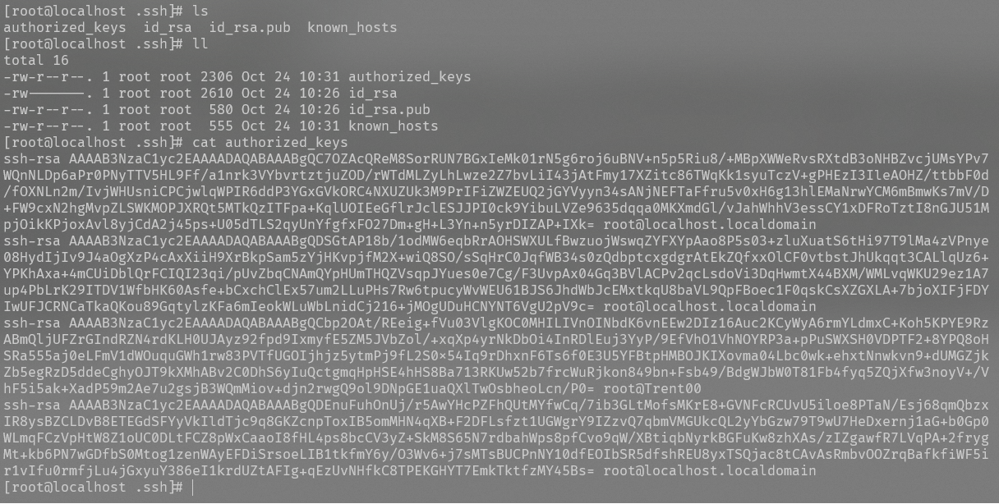

5. 简单做法是:在一台服务器上生成四台的密钥使用拷贝到其他的服务器

   scp authorized_keys ==TrentXX==:/root/.ssh

   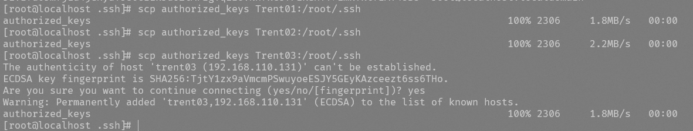

这样使用ssh hostsname命令就可以免密登录其他的主机

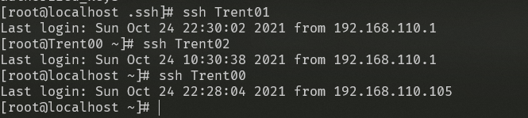

## redis解压安装

1. 解压文件到当前页

   ```
   tar -zvxf redis-6.2.6.tar.gz
   ```

   

2. 移动文件到 /urs/local目录下

   ```
    mv /root/redis-6.2.6  /usr/local/redis
   ```

   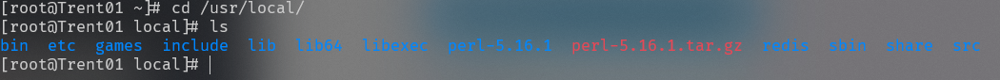

3. cd  /usr/local/redis目录，输入命令make执行编译命令

   ```
   make install
   ```

   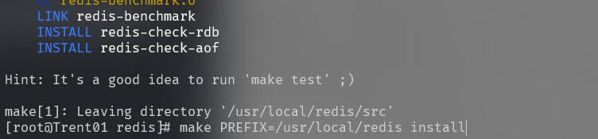

4. 安装

   ```
   make PREFIX=/usr/local/redis install
   ```

   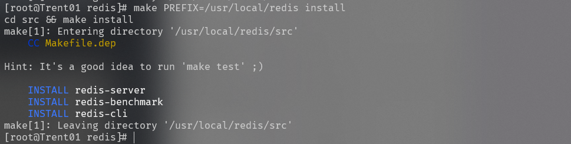

5. redis-server & 试运行

   ```
   redis-server &
   ```

## redis的生产环境启动方案

要把redis作为一个系统的daemon进程去运行的，每次系统启动，redis进程一起启动

（1）redis utils目录下，有个redis_init_script脚本
（2）将redis_init_script脚本拷贝到linux的/etc/init.d目录中，将redis_init_script重命名为redis_6379，6379是我们希望这个redis实例监听的端口号

​	

（3）修改redis_6379脚本的第6行的REDISPORT，设置为相同的端口号（默认就是6379）

​	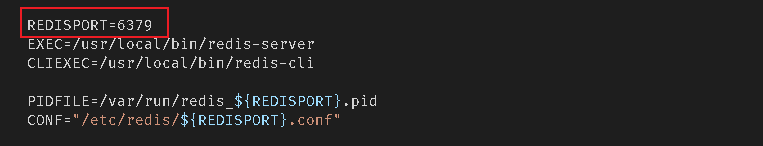

（4）创建两个目录：/etc/redis（存放redis的配置文件），/var/redis/6379（存放redis的持久化文件）

​	

（5）修改redis配置文件（默认在根目录下，redis.conf），拷贝到/etc/redis目录中，修改名称为6379.conf

（6）修改redis.conf中的部分配置为生产环境:

​		daemonize   	yes							 让redis以daemon进程运行
​		pidfile	 	/var/run/redis_6379.pid 		设置redis的pid文件位置
​		port			6379							设置redis的监听端口号
​		dir 			/var/redis/6379				 设置持久化文件的存储位置

（7）启动redis，执行cd /etc/init.d, chmod 777 redis_6379，./redis_6379 start


（8）确认redis进程是否启动，ps -ef | grep redis


（9）==让redis跟随系统启动自动启动==

在redis_6379脚本中，最上面，加入两行注释

#chkconfig:   2345 90 10

#description:  Redis is a persistent key-value database

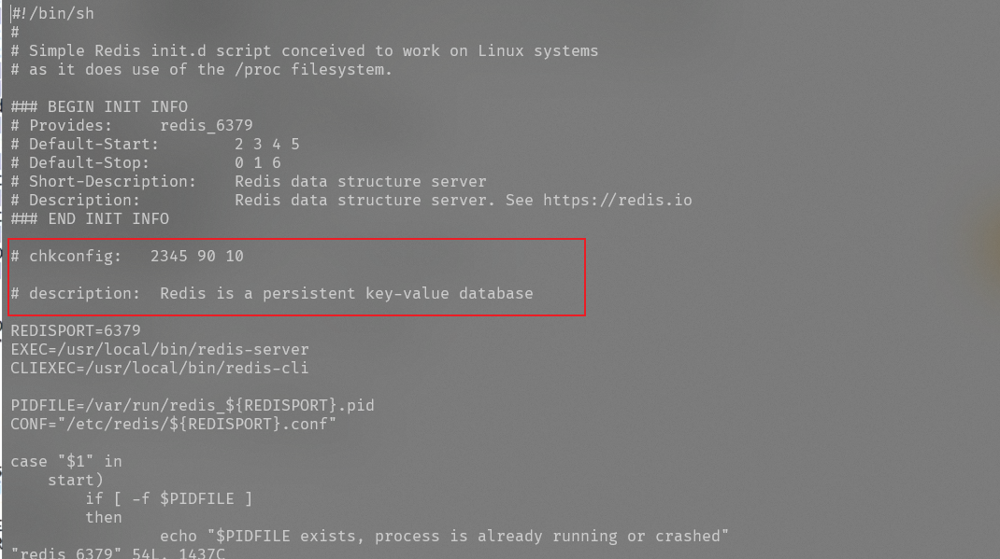

chkconfig redis_6379 on


## redis cli的使用

redis-cli SHUTDOWN，连接本机的6379端口停止redis进程

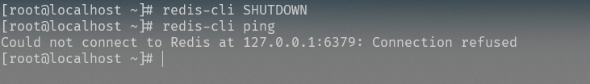

redis重启进程

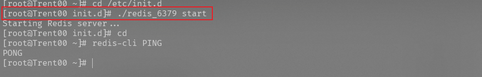

redis-cli -h 127.0.0.1 -p 6379 SHUTDOWN，制定要连接的ip和端口号

redis-cli PING，ping redis的端口，看是否正常


redis-cli，进入交互式命令行