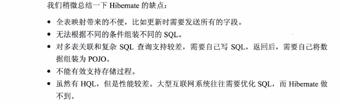
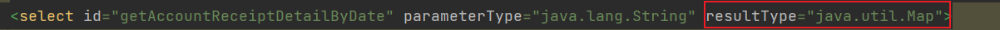
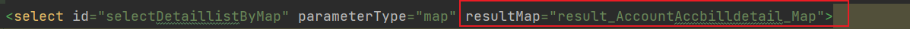
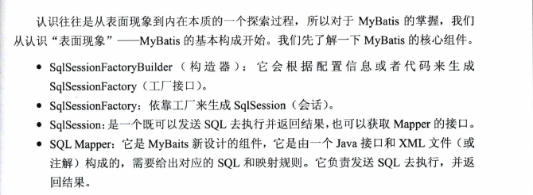
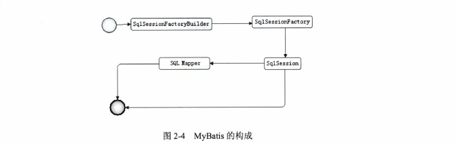

# 

## Hibernate

hibernate通过xml映射文件或注解提供的规则映射到数据库表上,它是一个全表映射的模型,可以使用HQL语言

## MyBatis

MyBatis是一个半自动映射的框架,需要手动的配置POJO,sql以及之间的映射关系.

MyBatis可以完成自动映射,在一些规则上可以完成自动映射,无需写任何映射规则.

## mybatis转义符号

| 符号     | 小于  | 小于等于 | 大于  | 大于等于 | 和     | 单引号  | 双引号  |
| -------- | ----- | -------- | ----- | -------- | ------ | ------- | ------- |
| 原符号   | <     | <=       | >     | >=       | &      | ’       | "       |
| 替换符号 | \&lt; | \&lt;=   | \&gt; | \&gt;=   | \&amp; | \&apos; | \&quot; |

