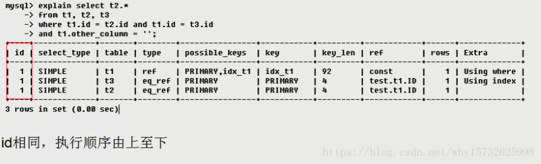
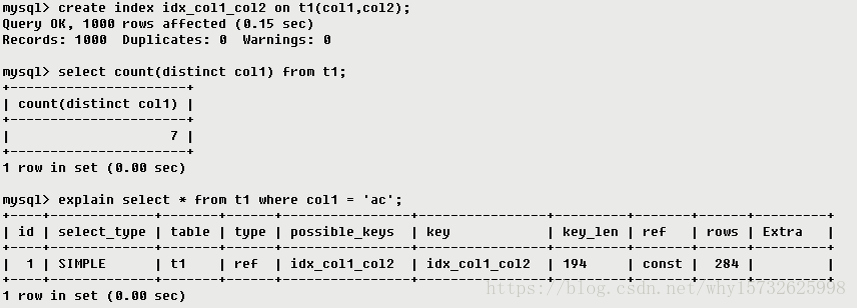

# 索引

## 8.1 簇索引和非簇索引
1.簇索引:
	  簇索引对表的物理数据页中的数据按列进行排序，然后再重新存储到磁盘上，即簇索引与数据是混为一体的，它的叶节点中存储的是实际的数据。
	2.非簇索引:
	非簇索引具有与表的数据完全分离的结构，使用非族索引不必将物理数据页中的数据按列排序。非簇索引的叶节点中存储了关键字的值和行定位器。行定位器的结构和存储内容取

决于数据的存储方式。如果数据是以簇素引方式存储的，则行定位器中存储的是簇索引的索引键；如果数据不是以索引方式存储的，则行定位器存储的是指向数据行的指针，

这种方式又称为堆存储方式( heap structure)。非族索引将行定位器按关健字进行排序，这个顺序与表的行在数据页中的排序是不匹配的。

由于非索引使用索引页存储，比索引需要更多的存储空间，且检索效率较低。但一个表只能建一个簇索引，当用户需要建立多个索引时，就需要使用非簇索引了、从理论上讲个表最多可以建249个非索引。


## 8.2 Explain 的使用方法

### 8.2.1 Explain概述 

  通过explain，我们可以分析出以下结果：
                             表的读取顺序
                             数据读取操作的操作类型
                             哪些索引可以使用
                             哪些索引被实际使用
                             表之间的引用
                             每张表有多少行被优化器查询

| id   | select_type | table | type | possible_keys | key  | key_len | ref  | rows | filtered | extra |
| ---- | ----------- | ----- | ---- | ------------- | ---- | ------- | ---- | ---- | -------- | ----- |
|      |             |       |      |               |      |         |      |      |          |       |

### 8.2.2 列含义

#### 8.2.2.1 Id

select查询的序列号，包含一组数字，表示查询中执行select子句或操作表的顺序
    id的结果共有三种相同的:
    1.id相同，执行顺序由上至下



2.id不同，如果是子查询，id的序号会递增，id值越大优先级越高，越先被执行


3.id相同不同，同时存在 --> ==(id如果相同，可以认为是一组，从上往下顺序执行；在所有组中，id值越大，优先级越高，越先执行)==


如上图所示，在id为1时，table显示的是 `<derived2>` ,这里指的是指向id为2的表，即t3表的衍生表。

#### 8.2.2.2 select_type

以下是常见使用到的值 分别用来表示查询的类型，主要是用于区别普通查询、联合查询、子查询等的复杂查询。


 simple: 简单的select查询，查询中不包含子查询或者union

 primary: 查询中若包含任何复杂的子部分，最外层查询则被标记为primary

 subquery: 在select或where列表中包含了子查询

 derived: 在from列表中包含的子查询被标记为derived（衍生），mysql会递归执行这些子查询，把结果放在临时表中

 union:  若第二个select出现在union之后，则被标记为union：若union包含在from子句的子查询中，外层select将被标记为：derived

 union result:  从union表获取结果的select

 dependent union：与union一样，出现在union 或union all语句中，但是这个查询要受到外部查询的影响

 dependent subquery：与dependent union类似，表示这个subquery的查询要受到外部表查询的影响

 materialized：被物化的子查询

 Uncacheable subquery：对于外层的主表，子查询不可被物化，每次都需要计算（耗时操作）

Uncacheable union：union操作中，内层的不可被物化的子查询（类似于uncacheable subquery）

#### 8.2.2.3 Table: 只表名

#### 8.2.2.4 Type

  type所显示的是查询使用了哪种类型，type包含的类型包括如下图所示的几种：

| all  | index | table | range | type | ref  | eg_ref | const, systen | null | rows | filtered | extra |
| ---- | ----- | ----- | ----- | ---- | ---- | ------ | ------------- | ---- | ---- | -------- | ----- |
|      |       |       |       |      |      |        |               |      |      |          |       |

从最好到最差依次是：
          ==system > const > eq_ref > ref > range > index > all==
    一般来说，得保证查询至少达到range级别，最好能达到ref。

1.system: 表只有一行记录（等于系统表），这是const类型的特列，平时不会出现，这个也可以忽略不计;

2.const: 表示通过索引一次就找到了，const用于比较primary key 或者unique索引。因为只匹配一行数据，所以很快。如将主键置于where列表中，MySQL就能将该查询转换为一个常量.


首先进行子查询得到一个结果的d1临时表，子查询条件为id = 1 是常量，所以type是const，id为1的相当于只查询一条记录，所以type为system。

3.eq_ref: 唯一性索引扫描，对于每个索引键，表中只有一条记录与之匹配。常见于主键或唯一索引扫描

4.ref: 非唯一性索引扫描，返回匹配某个单独值的所有行，本质上也是一种索引访问，它返回所有匹配某个单独值的行，然而，它可能会找到多个符合条件的行，所以他应该属于查找和扫描的混合体。



5.range: 只检索给定范围的行，使用一个索引来选择行，key列显示使用了哪个索引，一般就是在你的where语句中出现between、< 、>、in等的查询，这种范围扫描索引比全表扫描要好，因为它只需要开始于索引的某一点，而结束于另一点，不用扫描全部索引。


6.index: Full Index Scan，Index与All区别为index类型只遍历索引树。这通常比ALL快，因为索引文件通常比数据文件小。（也就是说虽然all和Index都是读全表，但index是从索引中读取的，而all是从硬盘读取的）


7.id: 是主键，所以存在主键索引

8.all: Full Table Scan 将遍历全表以找到匹配的行


#### 8.2.2.5 partitions

版本5.7以前，该项是explain partitions显示的选项，5.7以后成为了默认选项。该列显示的为分区表命中的分区情况。非分区表该字段为空（null）。

#### 8.2.2.6 Possible_keys和Key:

* possible_keys: 显示可能应用在这张表中的索引，一个或多个。查询涉及到的字段上若存在索引，则该索引将被列出，但不一定被查询实际使用。

* key:  

  1.实际使用的索引，如果为NULL，则没有使用索引。（可能原因包括没有建立索引或索引失效）

  

  2.查询中若使用了覆盖索引（select 后要查询的字段刚好和创建的索引字段完全相同），则该索引仅出现在key列表中

  

  

#### 8.2.2.7 Key_len

表示索引中使用的字节数，可通过该列计算查询中使用的索引的长度，在不损失精确性的情况下，长度越短越好。key_len显示的值为索引字段的最大可能长度，并非实际使用长度，即key_len是根据表定义计算而得，不是通过表内检索出的。


#### 8.2.2.8 Ref

显示索引的那一列被使用了，如果可能的话，最好是一个常数。哪些列或常量被用于查找索引列上的值。


#### 8.2.2.9 Rows

根据表统计信息及索引选用情况，大致估算出找到所需的记录所需要读取的行数，也就是说，用的越少越好


#### 8.2.2.10 Extra

包含不适合在其他列中显式但十分重要的额外信息:

1. Using filesort（九死一生）:--> 说明mysql会对数据使用一个外部的索引排序，而不是按照表内的索引顺序进行读取。MySQL中无法利用索引完成的排序操作称为“文件排序”.

   

2. Using temporary（十死无生）:--> 使用了用临时表保存中间结果，MySQL在对查询结果排序时使用临时表。常见于排序order by和分组查询group by。Using index（发财了）:--> 表示相应的select操作中使用了覆盖索引（Covering Index），避免访问了表的数据行，效率不错。如果同时出现

   

3. using where，表明索引被用来执行索引键值的查找；如果没有同时出现using where，表明索引用来读取数据而非执行查找动作.

   

   

4. Using where: -->表明使用了where过滤.

5. Using join buffer: --> 表明使用了连接缓存,比如说在查询的时候，多表join的次数非常多，那么将配置文件中的缓冲区的join buffer调大一些。

6. Impossible where: --> where子句的值总是false，不能用来获取任何元组  

   ```sql
   SELECT " FROM t_user WHERE id = '1' and id = '2'
   ```

7. Select tables optimized away:--> 在没有GROUPBY子句的情况下，基于索引优化MIN/MAX操作或者对于MyISAM存储引擎优化COUNT(")操作，不必等到执行阶段再进行计算，查询执行计划生成的阶段即完成优化。

8. Distinct:--> 优化distinct操作，在找到第一匹配的元组后即停止找同样值的动作

#### 8.2.2.11 filtered

使用explain extended时会出现这个列，5.7之后的版本默认就有这个字段，不需要使用explain extended了。这个字段表示存储引擎返回的数据在server层过滤后，剩下多少满足查询的记录数量的比例，注意是百分比，不是具体记录数。

### 8.2.3 实例分析


1. 执行顺序1：select_type为UNION，说明第四个select是UNION里的第二个select，最先执行【select name,id from t2】
2. 执行顺序2：id为3，是整个查询中第三个select的一部分。因查询包含在from中，所以为DERIVED【select id,name from t1 where other_column=’’】
3. 执行顺序3：select列表中的子查询select_type为subquery,为整个查询中的第二个select【select id from t3】
4. 执行顺序4：id列为1，表示是UNION里的第一个select，select_type列的primary表示该查询为外层查询，table列被标记为<derived3>,表示查询结果来自一个衍生表，其中derived3中的3代表该查询衍生自第三个select查询，即id为3的select。【select d1.name …】
5. 执行顺序5：代表从UNION的临时表中读取行的阶段，table列的< union1,4 >表示用第一个和第四个select的结果进行UNION操作。【两个结果union操作】		

## 8.3 索引优缺点

* 优点:

  1. 索引大大减小了服务器需要扫描的数据量
  2. 索引可以帮助服务器避免排序和临时表
  3. 索引可以将随机IO变成顺序IO
  4. 索引对于InnoDB（对索引支持行级锁）非常重要，因为它可以让查询锁更少的元组。在MySQL5.1和更新的版本中，InnoDB可以在服务器端过滤掉行后就释放锁，但在早期的MySQL版本中，InnoDB直到事务提交时才会解锁。对不需要的元组的加锁，会增加锁的开销，降低并发性。 InnoDB仅对需要访问的元组加锁，而索引能够减少InnoDB访问的元组数。但是只有在存储引擎层过滤掉那些不需要的数据才能达到这种目的。一旦索引不允许InnoDB那样做（即索引达不到过滤的目的），MySQL服务器只能对InnoDB返回的数据进行WHERE操作，此时，已经无法避免对那些元组加锁了。如果查询不能使用索引，MySQL会进行全表扫描，并锁住每一个元组，不管是否真正需要。
  5. 关于InnoDB、索引和锁：InnoDB在二级索引上使用共享锁（读锁），但访问主键索引需要排他锁（写锁）
* 缺点:

  1. 虽然索引大大提高了查询速度，同时却会降低更新表的速度，如对表进行INSERT、UPDATE和DELETE。因为更新表时，MySQL不仅要保存数据，还要保存索引文件。
  2. 建立索引会占用磁盘空间的索引文件。一般情况这个问题不太严重，但如果你在一个大表上创建了多种组合索引，索引文件的会膨胀很快。
  3. 如果某个数据列包含许多重复的内容，为它建立索引就没有太大的实际效果。
  4. 对于非常小的表，大部分情况下简单的全表扫描更高效；
* 索引只是提高效率的一个因素，如果你的MySQL有大数据量的表，就需要花时间研究建立最优秀的索引，或优化查询语句。
* 因此应该只为最经常查询和最经常排序的数据列建立索引。
* MySQL里同一个数据表里的索引总数限制为16个。


## 8.4 创建索引注意事项


## 8.5 索引的创建

### 8.5.1普通索引

```sql
create index sname_index on studentinfo(sname);
```

### 8.5.2 唯一索引 (与普通索引类似)

* 使用关键字创建唯一索引 (不允许两行中存在相同的索引值,但唯一索引可以拥有一行或多行,比如在insert或update语句中使用:在拥有唯一索引的数据中创建重复的行,则会被终止insert或update)

* 当创建唯一索引时,我们应该确保被创建的列不为空 (唯一索引遵循唯一性原则)

  ==在sql server中，唯一索引字段不能出现多个null值==

  ==在mysql 的innodb引擎中，是允许在唯一索引的字段中出现多个null值的,如果是组合索引，则列值的组合必须唯一。==

  根据NULL的定义，NULL表示的是未知，因此两个NULL比较的结果既不相等，也不不等，结果仍然是未知。根据这个定义，多个NULL值的存在应该不违反唯一约束，所以是合理的，在oracel也是如此。

```sql
create unique index snameunique_index on studentinfo(sname);
```

### 8.5.3 主键索引

```sql
alter table users add primary key ( id )
```

它是一种特殊的唯一索引，不允许有空值。一个表只能有一个主键。
一般是在建表的时候同时创建主键索引：

```sql
create table mytable( id int not null, username varchar(16) not null, primary key(id) ); 
```

当然也可以用 ALTER 命令。与之类似的，外键索引
如果为某个外键字段定义了一个外键约束条件，MySQL就会定义一个内部索引来帮助自己以最有效率的方式去管理和使用外键约束条件。

### 8.5.4 组合索引

```sql
alter table mytable add index name_city_age (name(10),city,age);
```

建立这样的组合索引，其实是相当于分别建立了下面三组组合索引：		

usernname,city,age

usernname,city

usernname

为什么没有 city，age这样的组合索引呢？这是因为MySQL组合索引“最左前缀”的结果。简单的理解就是只从最左面的开始组合。并不是只要包含这三列的查询都会用到该组合索引。

如果分别在 usernname，city，age上建立单列索引，让该表有3个单列索引，查询时和上述的组合索引效率也会大不一样，远远低于我们的组合索引。因为虽然此时有了三个索引，但MySQL只能用到其中的那个它认为似乎是最有效率的单列索引。

### 8.5.5 全文索引

```sql
alter table `table_name` add fulltext ( `column` )
```

FULLTEXT索引用于全文搜索。只有InnoDB和 MyISAM存储引擎支持 FULLTEXT索引和仅适用于 CHAR， VARCHAR和 TEXT列。