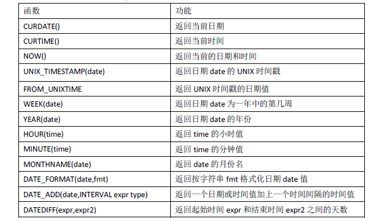
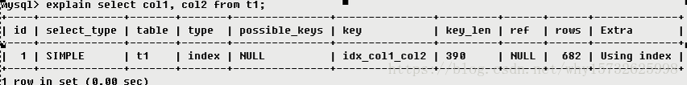
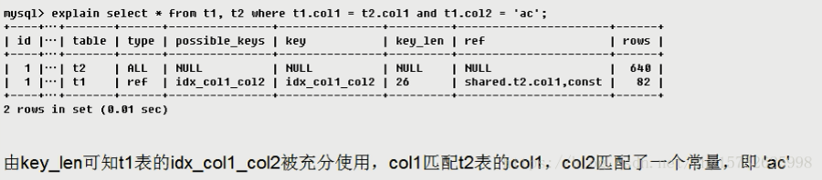
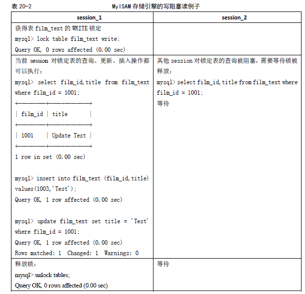

 

[toc]


#  SimpleQuery

## sql分类

* DDL：数据定义语句（Greate，drop，alter）
* DML：数据操纵语句（insert，select，delete，update）
* DCL：数据控制语句（grant，revoke）

##  DDL

###  删除数据库

```sql
drop databas name
```

### 创建数据库

```sql
create database name
use name
```

### 删除表

```sql
drop table name
```

### 修改表

```sql
alter table xxx modify [column] xxx 
```

###  添加列

```sql
alter table teacher
    add column ss varchar(20) not null default '添加列';
```

###  删除列

```sql
alter table teacher
    drop column ss;
```

###  修改列

```sql
alter table teacher
    modify ss varchar(30) null default 'dd';
alter table teacher
    alter column ss set default '';
    
# 改变列明时需要使用change关键字
alter table teacher
    change ss ff char(10) not null default '添加列';
alter table teacher
    change ff ss varchar(20) not null default '添加列';
```

###  给表添加注释

```sql
alter table student
    comment 'xxx';
```

###  给表中的列添加注释

```sql
alter table student
    modify sno char(10) not null comment 'ss';
    
alter table bookitem
    modify bookname varchar(60) not null comment '书名';
    
```

## DML

### insert

```sql
INSERT INTO tablename (field1,field2,……fieldn) VALUES(value1,value2,……valuesn);
```

###  updat

```sql

UPDATE tablename SET field1=value1，field2.=value2，……fieldn=valuen [WHERE CONDITION]

UPDATE t1,t2…tn set t1.field1=expr1,tn.fieldn=exprn [WHERE CONDITION]
```

###  delete

```sql
DELETE FROM tablename [WHERE CONDITION]

DELETE t1,t2…tn FROM t1,t2…tn [WHERE CONDITION]
```

### select

```sql
SELECT * FROM tablename [WHERE CONDITION]

```


##  排序

升序asc 降序desc [默认为asc]

```sql
SELECT * FROM tablename [WHERE CONDITION] [ORDER BY field1 [DESC|ASC] ， field2
[DESC|ASC]，……fieldn [DESC|ASC]]
```


当多列排序时会相对第一个进行排asc/desc序,然后进行第二列的asc/desc排序

```sql
select *
from
    teacher
order by sex asc, age desc;
```

多列降序

```sql
select *
from
    teacher
order by sal desc, age desc;
```

##  limit

查询前三条记录

```sql
select * from teacher order by sal limit 3
```

第二条记录开始显示三条记录

```sql
select * from teacher order by sal limit 1, 3
```


##  视图

###  创建视图

```sql
create view t_j_view as
select *
from
    teacher
where
    dname = '计算机';
```

###  查询视图

```sql
select *
from
    t_j_view;
```

##  distinct

distinct根据查询列来去重重复的数据

```sql
select tname from teacher;
```


```sql
select distinct tname
from
    teacher;
```


##  条件查询

```sql
select *
from
    teacher
where
    age <= 40
order by age;
```

##  模糊查询

###  '%'模糊

1. 左边计字的科目

```sql
select *
from
    teacher
where
    dname like '计%'
order by dname, sex;
```

2. 右边为机的模糊查询

```sql
select *
from
    teacher
where
    dname like '%机'
order by dname, sex;
```

3. 包含机字的模糊查询

```sql
select *
from
    teacher
where
    dname like '%机%'
order by dname, sex;
```

4. 中间模糊

```sql
# 中间模糊
select *
from
    course
where
    cname like '计算机%基础';
```

###  '_'模糊

==一个下划线代表一个字符或字==

```sql
# 查询计算机后面为两个字的条件
select *
from
    course
where
    cname like '计算机__';
```


```sql
#查询为五个字的条件查询
select *
from
    course
where
    cname like '_____';
```

###  '[]'模糊

满足括号内符号相似性即可 也是简单的数组,[1, 2, 3] 可能为1 12 123 23 13都适用

```sql
select *
from
    course
where
    cname like '[机]%';
    
select *
from
    course
where
    cname like '[计]___';
```

##  <>和!=

```sql
使用<>不会计算null
select * from teacher where sex <> '男' order by age;

select * from teacher where sex != '男' order by age;
```

##  is null 和is not null

==在查询条件内去吃一个条件可以使用is null解决==

```sql
and (xxx >= '2021-05-31' or xxx is null) 
```

```sql
Select *
From
    Teacher
Where
    Sal Is Null
Order By Age;

Select *
From
    Teacher
Where
    Sal Is Not Null
Order By Age;
```

##  between

```sql
Select *
From
    Teacher
Where 
    1=1
    and Age Between 30 And 50
Order By Age;
```

```sql
遇上面一样
Select *
From
    Teacher
Where
      Age >= 30
  And Age < 50
Order By Age;
```

# MultiTableQuery

##  简单表查询

```sql
select t.*, c.*
from
    teacher t,
    course c
where
    t.cno = c.cno
order by c.cno;
```

##  分阶段查询成绩

```sql
select *,
       case
           when mark >= 60 and mark < 80   then '及格'
           when mark >= 80 and mark < 90   then '良好'
           when mark >= 90 and mark <= 100 then '优秀'
           else '不及格' end as '成绩'
from
    student;
```

##  自连接查询

```sql
select distinct s1.sno, s1.sname, s1.cno, s1.dname, s1.mark, s1.sex
from
    student s1,
    student s2
where
      s1.sno = s2.sno
  and s1.mark >= 60
order by sno;
```

##  字符串拼接

```sql
select
	concat(sname, '(', dname, ')') name1,
  concat_ws('-', sname, dname) name2, mark '成绩',
  #加号的使用
  mark + 1 '成绩+1', cno
from
    student
```


##  cast表达式转换数值类型

```sql
select Create_Time,
       cast(create_time as date) '转换为date类型',
       cast(create_time as datetime) ‘转换为datetime类型’,
       cast(create_time as char(11)) ‘转换为char类型’
from
    vote_record
```


##  多表连接

```sql
select sname, any_value(tname), t.dname, cname, c.cno
from
    teacher t,
    student s,
    course c
where
      s.cno = c.cno
  and t.cno = c.cno
```


##  使用join连接

###  自然连接

```sql
# 自然连接
select sname, dname, cno, tname
from
    student s
        natural join teacher t;
# 等同于
select sname, s.dname, s.cno, tname
from
    teacher t,
    student s
where
      s.dname = t.dname
  and s.cno = t.cno;
```

###  内连接

```sql
select sname, s.dname, s.cno, tname
from
    student s
        inner join teacher t on s.cno = t.cno and s.dname = t.dname;
```

###  内连接不等值连接

```sql
select *
from
    student s
        inner join teacher t on s.cno = t.cno and s.dname <> t.dname
order by sname;
```

###  左外连接

左表缺少的用null填补

```sql
select *
from
    student
        left outer join course c on student.cno = c.cno;
```

###  右外连接

```sql
select *
from
    student s
        right outer join course c on s.cno = c.cno;
```

###  交叉连接

```sql
select *
from
    student s
        cross join course c on s.cno = c.cno
order by sname;
```

##  union和union all

使用union会去掉重复行,union all会查询全部

###  union

```sql
# union
select sno, sname, dname, cno
from
    student
where
    cno = 1
union
select sno, sname, dname, cno
from
    student
where
    cno = 10;
```


###  union all

```sql
# union all
select sno, sname, dname, cno
from
    student
where
    cno = 1
union all
select sno, sname, dname, cno
from
    student
where
    cno = 10;
```


###   order by 与 union

```sql
select sno, sname, dname, sex, cno, mark, type
from
    student
where
    cno = 1
union
select sno, sname, dname, sex, cno, mark, type
from
    student
where
    cno = 10
order by sno,mark desc  ;
```


#  AggregateFunction

##  聚合函数

###  聚合语法

```sql
SELECT [field1,field2,……fieldn] fun_name
FROM tablename
[WHERE where_contition]
[GROUP BY field1,field2,……fieldn
[WITH ROLLUP]] 是可选语法，表明是否对分类聚合后的结果进行再汇总。
[HAVING where_contition]
```


###  求和\计数\最大小值\均值

```sql
select  sum(sal) 'sum函数', count(*) '计算函数', count(sal) 'count计算不包含null', count(tname), max(sal), min(sal)
from
    teacher;
    
```


```sql
select avg(sal)'平均值'
from
    teacher;
    
```


###   聚集函数得重值运算

```sql
select avg(distinct sal  ) '去重平均',avg(all sal)'所有值平均', count(all dname),count(distinct dname)
from
    teacher;
```


## 组合函数

###  group by

```sql
select dname,sex,count(dname),max(sal)
from
    teacher group by dname,sex;
```


 ==group by对null值得处理 会把所有null处理分在同一组==

```sql
select sal,count(*)
from
    teacher
group by sal
order by sal;
```


###  with rollup

#with rollup会展示出dname分组后得信息比如:计算机总共有四人 男3女1


##  having

==having和where的区别在于having与分组有关,而where与单个列有关. having子句对应的列必须是分组的列在数据的分组聚合分析中， HAVING子句与 WHERE子句也可以共存。 WHERE子句在分组之前过滤数据，而 HAVING子句则过滤分组后的数据。==

having关键字表示对分类后的结果再次进行条件的过滤

```sql
select sal,count(*) as num
from
    teacher
group by sal
having num>=2;
```


```sql
select sal,count(*) as num
from
    teacher
group by sal
having num>=2
order by sal;
```


# DataType

## 数值类型

### 整数型

对于整型数据，MySQL 还支持在类型名称后面的小括号内指定显示宽度，例如int(5)表示当数值宽度小于5 位的时候在数字前面填满宽度，如果不显示指定宽度则默认为int(11)。

* tinyint      [1字节]   
* smallint     [2字节]
* mediumint    [3字节]
* int、integer [4字节]
* bigint       [8字节]

### 浮点数

* float        [4字节]
* double       [8字节]

### 定点数

becimal:已字符串的形式存储在数据库中,比浮点数精确适合用于存储高精度的数据.与浮点数一样可以用(M,D)表示显示M位数(整数位+小数位),D表示小数位的精度,MySQL保存数值时四舍五入

* dec    
* becimal   

### 位类型

bit(): 用于存放位字段值，BIT(M)可以用来存放多位二进制数，M 范围从1～64，如果不写则默认为1 位。对于位字段，直接使用SELECT 命令将不会看到结果，可以用bit()（显示为二进制格式）或者hex()（显示为十六进制格式）函数进行读取。

* bit         [1~8字节]

## 日期时间类型

* 如果要用来表示年月日，通常用DATE 来表示。
* 如果要用来表示年月日时分秒，通常用DATETIME 表示。
* 如果只用来表示时分秒，通常用TIME 来表示。
* 如果需要经常插入或者更新日期为当前系统时间，则通常使用TIMESTAMP 来表示。TIMESTAMP 值返回后显示为“YYYY-MM-DD HH:MM:SS”格式的字符串，显示宽度固定为19个字符。如果想要获得数字值，应在TIMESTAMP 列添加+0。
* 如果只是表示年份，可以用YEAR来表示，它比DATE占用更少的空间。YEAR 有2位或4位格式的年。默认是4位格式。在4位格式中，允许的值是1901～2155和0000。在2位格式中，允许的值是70～69，表示从1970～2069 年。MySQL 以YYYY 格式显示YEAR值。

## 字符类型


### CHAR 和VARCHAR 类型

### BINARY 和VARBINARY 类型

### ENUM 类型

ENUM 中文名称叫枚举类型，它的值范围需要在创建表时通过枚举方式显式指定，对1～255 个成员的枚举需要1 个字节存储；对于255～65535 个成员，需要2 个字节存储。最多允许有65535 个成员。下面往测试表t 中插入几条记录来看看ENUM 的使用方法。

### SET 类型

Set 和ENUM 类型非常类似，也是一个字符串对象，里面可以包含0～64 个成员。根据
成员的不同，存储上也有所不同。
 1～8   成员的集合，占1 个字节。
 9～16  成员的集合，占2 个字节。
 17～24 成员的集合，占3 个字节。
 25～32 成员的集合，占4 个字节。
 33～64 成员的集合，占8 个字节。

# Operator

## 算数运算符

| 运算符 | 作用           |
| ------ | -------------- |
| +      | 加法           |
| -      | 减法           |
| *      | 乘法           |
| /，DIV | 除法，返回商   |
| %，MOD | 除法，返回余数 |

```sql
select 0.1+ 0.3333 ,0.1-0.3333, 0.1*0.3333, 1/2,1%2;
```


## 比较运算符

| 运算符         | 作用                  |
| -------------- | --------------------- |
| =              | 等于                  |
| <>或!=         | 不等于                |
| <=> NULL       | 安全的等于(NULL-safe) |
| <              | 小于                  |
| <=             | 小于等于              |
| >              | 大于                  |
| >=             | 大于等于              |
| BETWEEN        | 存在与指定范围        |
| IN             | 存在于指定集合        |
| IS NULL        | 为NULL                |
| IS NOT NULL    | 不为NULL              |
| LIKE           | 通配符匹配            |
| REGEXP 或RLIKE | 正则表达式匹配        |

```sql
 select 1=0,1<>0,1!=0,1<0,1<=0,1>0,1>=0,1=1,NULL=NULL;
```


## 逻辑运算符


```sql
select not 0, not 1, not null ;
```


```sql
select 1 xor 1 ,0 xor 0,1 xor 0,0 xor 1,null xor 1;
```


## 位运算符


## 运算符的优先级


#  StringNumDateFunction

##  字符串函数


###  字符处理函数

```sql
select b.bookname, upper(b.bookname) as '大写', lower(b.bookname) '小写', ltrim(b.bookname) '去掉头部空格',
       rtrim(b.bookname) '去掉尾部空格', trim(b.bookname) '去掉首尾空格'
from
    bookitem b;
```


###  字符处理函数

```sql
select b.bookname, right(b.bookname, 6) '返回部分字符,从右边开始取6字符', left(b.bookname, 2) '从左边开始取2个字符',
       substring(b.bookname, 5, 3) '返回部分字符,从左边第5个开始 长度为3', replace(b.bookname, 'processing', 'Pro.') '把制定的字符替换为Pro.'
from
    bookitem b;
```


###  字符处理函数

```sql
Select B.Bookname, Locate('s', B.Bookname) '返回第一个字母s的位置',
       Substring(Bookname, 1, Locate('s', B.Bookname)) '从左边开始位置到locate位置的字符串',
       Concat(B.Bookname, '[', B.Quantity, ']') '字符串拼接', Insert(B.Bookname, 3, 1, '999') '将从第三个字符开始长为1个字符的替换为999'
From
    Bookitem B
```


### 字符处理函数

```sql
Select Lpad('beijing', 15, '2008') '在最左边开始填充直到字符为15', Rpad('beijing', 15, '2008') '在最右边开始填充直到字符为15',
       Repeat('beijing', 2) '字符重复2次', Strcmp('beijing', 'be') '从左开始用be比较beijing字符串,be匹配返回1,全匹配为0,不匹配为-1',
       Strcmp('beijing', 'ji') '不匹配', Strcmp('beijing', 'beijing') '全匹配';
       
```


##  算数运算符函数


###  算数运算符函数

```sql
Select Abs(-5689) '取绝对值', Sign(-56) '判断为负值', Sign(0) '判断为0值', Sign(56) '判断为正值',
			 Ceiling(5 >= 9) '返回>=表达式的最小值', Floor(5 <= 9) '返回<=表达式的最小值', Round(589.6699, 2) '精度为2的四舍五入';
```

!

###  算数运算符函数

cast(xx as kk) kk代指sql数据类型 允许的kk有--> 

[字符型(可带参数) : CHAR() ], 

[日期 : DATE] ,

[时间: TIME], 

[日期时间型 : DATETIME],

[浮点数 : DECIMAL],

[整数 : SIGNED ],

[无符号整数 : UNSIGNED]

```sql
Select Exp(2) '指数值', Sqrt(4) '开平方', Pi(), Rand() '随机数', Cast(Rand() * 10 As Signed) '0-9 整型随机数',
       Cast(Rand() * 100 As Decimal(4, 2)) '0-99随机数', Cast(-89 As Unsigned) '无符号整数', Round(59.26, 3) '';
```


##  时间类型函数




###  日期函数

```sql
Select C.Ctest, Day(C.Ctest) '返回日期的天', Month(C.Ctest) '返回日期的月', Year(C.Ctest) '返回日期的年',
       Date_Add(C.Ctest, Interval 1 Second) '加一秒', Date_Add(C.Ctest, Interval 1 Minute) '加一分',
       Date_Add(C.Ctest, Interval 1 Hour) '加一小时', Date_Add(C.Ctest, Interval 1 Day) '加一天'
From
    Course C;
```


###  日期函数

```sql
Select Ctest, Date_Add(Ctest, Interval 1 Month) '加一个月', Date_Add(Ctest, Interval 1 Year) '加一年',
       Date_Add(Ctest, Interval '1:1' Minute_Second) '加一分一秒', Date_Add(Ctest, Interval '1:1:1:1' Day_Second) '加一天一小时一分一秒',
       Datediff('1997-12-31 23:59:59', '1997-12-30') '两个日期的时间差', Datediff('1997-11-30 23:59:59', '1997-12-31') '日期差'
From
    Course;
```


###  日期函数

```sql
Select Ctest, Dayname(Ctest) '转换为英文日期', Monthname(Ctest) '英文月份', Curdate() '当前日期', Current_Time() '当前时间',
       Current_Date() '', Now() '当前日期时间,开始执行时得到', Sysdate() '执行时动态得到'
From
    Course;
```


###  日期函数

```sql
Select Ctest, Current_Timestamp '当前时间戳', Current_Timestamp() '当前时间戳', Date_Format(Ctest, '%Y%m%d%H%i%s') '1',
       Date_Format(Ctest, '%Y%m%D%h%i%s') '2', Date_Format(Ctest, 'YYYY-MM-DD HH:mm:ss') '3',
       Datediff(Sysdate(), '1995-02-18') '时间差(天数)', Timestampdiff(Year, '1995-02-18', Sysdate()) '时间差(年份)'#        ,convert(varchar, , 20)'该函数提供字符集之间的数据转换'
From
    Course;
```


###  日期函数

```sql
Select Timestampdiff(Year, '1995-02-18', Sysdate()) '时间差(年份)', Datediff(Sysdate(), '1995-02-18') '时间差(天数)',
       Timestampdiff(Month, '1995-02-18', Now()) '时间差(月份)',
       Timestampdiff(Hour, '1995-02-18 22:00:00', Sysdate()) '时间差(小时)',
       Timestampdiff(Minute, '1995-02-18 22:00:00', Now()) '时间差(分钟)',
       Timestampdiff(Second, '1995-02-18 22:00:00', Sysdate()) '时间差(秒)';
```


## 流程函数


###  流程函数

```sql
Select Sal, If(Sal > 2000, '高', '低') '类似三元比较运算符', Ifnull(Sal, 0.00) '判断sal是否为空,不为空则返回,为空则为0.00'
From
    Teacher;
```


### 流程函数

```sql
Select Mark,
       Case
           When Mark >= 60 And Mark < 70   Then '及格'
           When Mark >= 70 And Mark < 80   Then '一般'
           When Mark >= 80 And Mark < 90   Then '良好'
           When Mark >= 90 And Mark <= 100 Then '优秀'
           Else '不及格' End '成绩评级'
From
    Student;
```


### 流程函数

```sql
Select Mark,
       Case Mark
           When 60 Then '及格线'
           when 70 then '一般线'
           when 80 then '良好线'
           when 90 then '优秀线'
           else '不及格' end 'mark等于60,70...下'
From
    Student;
```


## 其它常用函数


INET_ATON(IP)和INET_NTOA(num)函数主要的用途是将字符串的IP 地址转换为数字表示的网络字节序，这样可以更方便地进行IP 或者网段的比较。

```sql
Select Database() '返回当前数据库名', Version() '返回当前数据版本', User() '返回当前登录用户名', Inet_Aton('127.0.0.1') '返回ip的数字表示',Inet_Ntoa(2130706433) '返回数字代表的IP地址',inet_aton('127.0.0.1')=inet_aton('12.0.0.1')'比较IP是否相等',md5('123456')'加密',sha1('123456')'加密';
```


# DataEngine

MySQL 5.0 支持的存储引擎包括MyISAM、InnoDB、BDB、MEMORY、MERGE、EXAMPLE、NDB Cluster、ARCHIVE、CSV、BLACKHOLE、FEDERATED 等，其中==InnoDB 和 BDB提供事务安全表==，其他存储引擎都是非事务安全表。

## 各种存储引擎的特性


## MyIsSAM

MyISAM 是MySQL 的默认存储引擎。MyISAM 不支持事务、也不支持外键，其优势是访问的速度快，对事务完整性没有要求或者以SELECT、INSERT 为主的应用基本上都可以使用这个引擎来创建表。

每个MyISAM 在磁盘上存储成3 个文件，其文件名都和表名相同，但扩展名分别是：

* .frm（存储表定义）；
* .MYD（MYData，存储数据）；
* .MYI （MYIndex，存储索引）。

数据文件和索引文件可以放置在不同的目录，平均分布IO，获得更快的速度。

MyISAM的表又支持3 种不同的存储格式，分别是：

* 静态（固定长度）表；
* 动态表；
* 压缩表。

其中，静态表是默认的存储格式。静态表中的字段都是非变长字段，这样每个记录都是固定长度的，这种存储方式的优点是存储非常迅速，容易缓存，出现故障容易恢复；缺点是占用的空间通常比动态表多。静态表的数据在存储的时候会按照列的宽度定义补足空格，但是在应用访问的时候并不会得到这些空格，这些空格在返回给应用之前已经去掉。但是也有些需要特别注意的问题，如果需要保存的内容后面本来就带有空格，那么在返回结果的时候也会被去掉，开发人员在编写程序的时候需要特别注意，因为静态表是默认的存储格式，开发人员可能并没有意识到这一点，从而丢失了尾部的空格。

动态表中包含变长字段，记录不是固定长度的，这样存储的优点是占用的空间相对较少，但是频繁地更新删除记录会产生碎片，需要定期执行OPTIMIZE TABLE 语句或myisamchk -r 命令来改善性能，并且出现故障的时候恢复相对比较困难

压缩表由myisampack 工具创建，占据非常小的磁盘空间。因为每个记录是被单独压缩的，所以只有非常小的访问开支。

##  InnoDB

InnoDB 存储引擎提供了具有提交、回滚和崩溃恢复能力的事务安全。但是对比MyISAM的存储引擎，InnoDB 写的处理效率差一些并且会占用更多的磁盘空间以保留数据和索引。

### 自动增长列

InnoDB自动增长可以手动插入,但手动插入的值为空或0,则自动插入增长后的值

```sql
alter table tname modify xxx varchar(32) auto_increment;
```

可以使用LAST_INSERT_ID()查询当前线程最后插入记录使用的值。如果一次插入了多条记录，那么返回的是第一条记录使用的自动增长值。

```sql
select LAST_INSERT_ID();
```

对于InnoDB 表，自动增长列必须是索引。如果是组合索引，也必须是组合索引的第一列，但是对于MyISAM 表，自动增长列可以是组合索引的其他列，这样插入记录后，自动增长列是按照组合索引的前面几列进行排序后递增的。例如，创建一个新的MyISAM 类型的表autoincre_demo，自动增长列d1 作为组合索引的第二列，对该表插入一些记录后，可以发现自动增长列是按照组合索引的第一列d2 进行排序后递增的

### 外键约束

MySQL 支持外键的存储引擎只有InnoDB，在创建外键的时候，要求父表必须有对应的索引，子表在创建外键的时候也会自动创建对应的索引。

当某个表被其他表创建了外键参照，那么该表的对应索引或者主键禁止被删除。

在导入多个表的数据时，如果需要忽略表之前的导入顺序，可以暂时关闭外键的检查；同样，在执行LOAD DATA 和ALTER TABLE 操作的时候，可以通过暂时关闭外键约束来加快处理的速度，关闭的命令是“SET FOREIGN_KEY_CHECKS = 0;”，执行完成之后，通过执行“SETFOREIGN_KEY_CHECKS = 1;”语句改回原状态。

### 存储方式

存储表和索引的两种方式:

* 使用共享表空间存储，这种方式创建的表的表结构保存在.frm 文件中，数据和索引保存在innodb_data_home_dir 和innodb_data_file_path 定义的表空间中，可以是多个文件。
* 使用多表空间存储，这种方式创建的表的表结构仍然保存在.frm 文件中，但是每个表的数据和索引单独保存在.ibd 中。如果是个分区表，则每个分区对应单独的.ibd文件，文件名是“表名+分区名”，可以在创建分区的时候指定每个分区的数据文件的位置，以此来将表的IO 均匀分布在多个磁盘上。

要使用多表空间的存储方式，需要设置参数innodb_file_per_table，并重新启动服务后
才可以生效，对于新建的表按照多表空间的方式创建，已有的表仍然使用共享表空间存储。
如果将已有的多表空间方式修改回共享表空间的方式，则新建表会在共享表空间中创建，但
已有的多表空间的表仍然保存原来的访问方式。所以多表空间的参数生效后，只对新建的表
生效。

多表空间的数据文件没有大小限制，不需要设置初始大小，也不需要设置文件的最大限
制、扩展大小等参数。

对于使用多表空间特性的表，可以比较方便地进行单表备份和恢复操作，但是直接复制.ibd 文件是不行的，因为没有共享表空间的数据字典信息，直接复制的.ibd 文件和.frm 文件恢复时是不能被正确识别的，但可以通过以下命令

```sql
ALTER TABLE tbl_name DISCARD TABLESPACE;
ALTER TABLE tbl_name IMPORT TABLESPACE;
```

将备份恢复到数据库中，但是这样的单表备份，只能恢复到表原来在的数据库中，而不能恢复到其他的数据库中。如果要将单表恢复到目标数据库，则需要通过mysqldump 和 mysqlimport 来实现。

==注意：即便在多表空间的存储方式下，共享表空间仍然是必须的，InnoDB 把内部数据词典和未作日志放在这个文件中。==

## MEMORY

## MERGE

## 如何选择合适的存储引擎

在选择存储引擎时，应根据应用特点选择合适的存储引擎，对于复杂的应用系统可以根
据实际情况选择多种存储引擎进行组合。

* MyISAM：默认的MySQL 插件式存储引擎。如果应用是以读操作和插入操作为主，只有很少的更新和删除操作，并且对事务的完整性、并发性要求不是很高，那么选择这个存储引擎是非常适合的。MyISAM 是在Web、数据仓储和其他应用环境下最常使用的存储引擎之一。
* InnoDB：用于事务处理应用程序，支持外键。如果应用对事务的完整性有比较高的
  要求，在并发条件下要求数据的一致性，数据操作除了插入和查询以外，还包括很多的更新、删除操作，那么InnoDB 存储引擎应该是比较合适的选择。InnoDB 存储引擎除了有效地降低由于删除和更新导致的锁定，还可以确保事务的完整提交（Commit）和回滚（Rollback），对于类似计费系统或者财务系统等对数据准确性要求比较高的系统，InnoDB 都是合适的选择。
* MEMORY：将所有数据保存在RAM 中，在需要快速定位记录和其他类似数据的环境
  下，可提供极快的访问。MEMORY 的缺陷是对表的大小有限制，太大的表无法CACHE 在内存中，其次是要确保表的数据可以恢复，数据库异常终止后表中的数据是可以恢复的。MEMORY 表通常用于更新不太频繁的小表，用以快速得到访问结果。
* MERGE：用于将一系列等同的MyISAM 表以逻辑方式组合在一起，并作为一个对象
  引用它们。MERGE 表的优点在于可以突破对单个MyISAM 表大小的限制，并且通过将不同的表分布在多个磁盘上，可以有效地改善MERGE 表的访问效率。这对于诸如数据仓储等VLDB环境十分适合。

# ChooseTheRightDaTaType

## CHAR 与VARCHAR

它们保存和检索的方式不同,char属于固定长度的字符类型,而varchar属于可变长度的字符类型.


char是固定长度,所以处理速度比varchar快,但占用存储空间,程序还需对行尾空格进行处理. 适合长度变化不大并且对查询速度较高要求的数据

随着MySQL 版本的不断升级，VARCHAR 数据类型的性能也在不断改进并提高，

* MyISAM 存储引擎：建议使用固定长度的数据列代替可变长度的数据列。
* MEMORY 存储引擎：目前都使用固定长度的数据行存储，因此无论使用CHAR 或
  VARCHAR 列都没有关系。两者都是作为CHAR 类型处理。
* InnoDB 存储引擎：建议使用VARCHAR 类型。对于InnoDB 数据表，内部的行存储格式没有区分固定长度和可变长度列（所有数据行都使用指向数据列值的头指针），因此在本质上，使用固定长度的CHAR 列不一定比使用可变长度VARCHAR 列性能要好。因而，主要的性能因素是数据行使用的存储总量。由于CHAR 平均占用的空间多于VARCHAR，因此使用VARCHAR 来最小化需要处理的数据行的存储总量和磁盘I/O 是比较好的。

## TEXT 与BLOB

保存较大文本时，通常会选择使用TEXT 或者BLOB，二者之间的主要差别是BLOB 能用来保存二进制数据，比如照片；而TEXT 只能保存字符数据，比如一篇文章或者日记。TEXT 和BLOB 中有分别包括TEXT、MEDIUMTEXT、LONGTEXT 和BLOB、MEDIUMBLOB、LONGBLOB3 种不同的类型，它们之间的主要区别是存储文本长度不同和存储字节不同，用户应该根据实际情况选择能够满足需求的最小存储类型

* ==BLOB 和TEXT 值会引起一些性能问题，特别是在执行了大量的删除操作时。==

删除操作会在数据表中留下很大的“空洞”，以后填入这些“空洞”的记录在插入的性能上
会有影响。为了提高性能，建议定期使用OPTIMIZE TABLE 功能对这类表进行碎片整理，避
免因为“空洞”导致性能问题。

```sql
OPTIMIZE TABLE xxx;
```

* ==可以使用合成的（Synthetic）索引来提高大文本字段（BLOB 或TEXT）的查询性能==

合成索引就是根据大文本字段的内容建立一个散列值，并把这个值存储在单独的数据列中，接下来就可以通过检索散列值找到数据行了。但是，要注意这种技术只能用于精确匹配的查询（散列值对于类似<或>=等范围搜索操作符是没有用处的）。可以使用MD5()函数生成散列值，也可以使用SHA1()或CRC32()，或者使用自己的应用程序逻辑来计算散列值。请记住数值型散列值可以很高效率地存储。同样，如果散列算法生成的字符串带有尾部空格，就不要把它们存储在CHAR 或VARCHAR 列中，它们会受到尾部空格去除的影响。合成的散列索引对于那些BLOB 或TEXT 数据列特别有用。用散列标识符值查找的速度比搜索BLOB 列本身的速度快很多。

步骤:

1. ```sql
   create table t (id varchar(100),context blob,hash_value varchar(40));
   ```

2. ```sql
   insert into t values(1,repeat('beijing',2),md5(context));
   insert into t values(2,repeat('beijing',2),md5(context));
   insert into t values(3,repeat('beijing 2008',2),md5(context));
   ```

3. 

2. 

4. 根据散列值查询'beijing 2008beijing 2008'对应行

```sql
select * from T where Hash_Value=md5(repeat('beijing 2008',2));
```


前缀索引，也就是只为字段的前n 列创建索引:

```sql
create index idx_Context on t(Context(100));
```

```sql
desc select * from t where context like 'beijing%'
```


* 在不必要的时候避免检索大型的BLOB或TEXT值。

例如，SELECT * 查询就不是很好的想法，除非能够确定作为约束条件的WHERE 子句只会找到所需要的数据行。否则，很可能毫无目的地在网络上传输大量的值。这也是BLOB 或TEXT
标识符信息存储在合成的索引列中对用户有所帮助的例子。用户可以搜索索引列，决定需要
的哪些数据行，然后从符合条件的数据行中检索BLOB或TEXT值。

* 把BLOB 或TEXT 列分离到单独的表中。

在某些环境中，如果把这些数据列移动到第二张数据表中，可以把原数据表中的数据列转换
为固定长度的数据行格式，那么它就是有意义的。这会减少主表中的碎片，可以得到固定长
度数据行的性能优势。它还可以使主数据表在运行SELECT * 查询的时候不会通过网络传输
大量的BLOB或TEXT值。

## 浮点数与定点数

1.浮点数一般用于表示含有小数部分的数值。当一个字段被定义为浮点类型后，如果插入数据的精度超过该列定义的实际精度，则插入值会被四舍五入到实际定义的精度值，然后插入，四舍五入的过程不会报错。在MySQL 中float、double（或real）用来表示浮点数。

2.定点数不同于浮点数，定点数实际上是以字符串形式存放的，所以定点数可以更加精确的保存数据。如果实际插入的数值精度大于实际定义的精度，则MySQL 会进行警告（默认的SQLMode 下），但是数据按照实际精度四舍五入后插入；如果SQLMode 是在TRADITIONAL（传统模式）下，则系统会直接报错，导致数据无法插入。在MySQL中，decima（l 或numberic）用来表示定点数。

```java
public class Test {
  public static void main(String[] args) throws Exception {
 		 System.out.print("7.22-7.0=" + subtract(7.22,7.0));
  }
  public static double subtract(double v1, double v2) {
 
    BigDecimal b1 = new BigDecimal(Double.toString(v1));
    BigDecimal b2 = new BigDecimal(Double.toString(v2));
    return b1.subtract(b2).doubleValue();
  }
}
```

## 日期类型选择

* 根据实际需要选择能够满足应用的最小存储的日期类型。如果应用只需要记录“年
  份”，那么用1 个字节来存储的YEAR 类型完全可以满足，而不需要用4 个字节来
  存储的DATE 类型。这样不仅仅能节约存储，更能够提高表的操作效率。

* 如果要记录年月日时分秒，并且记录的年份比较久远，那么最好使用DATETIME，
  而不要使用TIMESTAMP。因为TIMESTAMP 表示的日期范围比DATETIME 要短得多。

* 如果记录的日期需要让不同时区的用户使用，那么最好使用TIMESTAMP，因为日
  期类型中只有它能够和实际时区相对应。

  

# CharacterSet


## 怎样选择合适的字符集


# SubQuery

## 子查询

```sql
select *
from
    student s
where
    s.cno = (select cno from course c where c.cname = '计算机入门');
```

## 使用聚合函数的子查询

```sql
select *
from
    teacher
where
    age >= (select avg(age) from teacher)
order by age desc;
```

```sql
select *, (select count(*) from student s where s.cno = t.cno) as student_num
from
    teacher t;
```

## 使用In函数的子查询

```sql
select *
from
    student
where
    sno in (select sno from student where cno = 10);
```

## 使用Not In函数的子查询

```sql
select *
from
    student
where
    sno not in (select sno from student where cno = 10);
```

## 使用exist函数的子查询

```sql
select *
from
    student
where
    exists(select * from teacher t where t.cno = student.cno);
```

## 使用Not Exist函数的子查询

```sql
select *
from
    student
where
    not exists(select * from teacher t where t.cno = student.cno);
```

## 使用having函数的子查询

```sql
select t.dname, COUNT(*) as tdname
from
    teacher as t
group by t.dname
having
        COUNT(*) < (select COUNT(*) from student where cno in (select cno from teacher as t2 where t2.dname = t.dname));
```

## Example

查询教师所开计算机系课程，所开课程的学生均合格

通过两个子查询来实现

```sql
select *
from
    course
where
      cno in (select cno from teacher where dname = '计算机')
  and not exists(select * from student where cno = course.cno and mark < 60)
order by cno;
```


# View

视图的优势:

* 简单：使用视图的用户完全不需要关心后面对应的表的结构、关联条件和筛选条件，
  对用户来说已经是过滤好的复合条件的结果集。
* 安全：使用视图的用户只能访问他们被允许查询的结果集，对表的权限管理并不能
  限制到某个行某个列，但是通过视图就可以简单的实现。
* 数据独立：一旦视图的结构确定了，可以屏蔽表结构变化对用户的影响，源表增加
  列对视图没有影响；源表修改列名，则可以通过修改视图来解决，不会造成对访问
  者的影响。

## 创建视图的语法

```sql
CREATE [OR REPLACE] [ALGORITHM = {UNDEFINED | MERGE | TEMPTABLE}]
VIEW view_name [(column_list)]
AS select_statement
[WITH [CASCADED | LOCAL] CHECK OPTION]
```

## 修改视图的语法

```sql
ALTER [ALGORITHM = {UNDEFINED | MERGE | TEMPTABLE}]
VIEW view_name [(column_list)]
AS select_statement
[WITH [CASCADED | LOCAL] CHECK OPTION]
```

例子:

```sql
mysql> CREATE OR REPLACE VIEW staff_list_view AS
-> SELECT s.staff_id,s.first_name,s.last_name,a.address
-> FROM staff AS s,address AS a
-> where s.address_id = a.address_id ;
Query OK, 0 rows affected (0.00 sec)
```

以下类型的视图是不可更新:

* 包含以下关键字的SQL 语句：聚合函数（SUM、MIN、MAX、COUNT 等）、DISTINCT、GROUPBY、HAVING、UNION 或者UNION ALL。
* 常量视图。
* SELECT 中包含子查询。
* JION。
* FROM 一个不能更新的视图。
* WHERE 字句的子查询引用了FROM 字句中的表。

## 删除视图

```sql
DROP VIEW [IF EXISTS] view_name [, view_name] ...[RESTRICT | CASCADE]
```

例子:

```sql
drop view staff_list;
```

## 查看视图

使用SHOW TABLES 命令的时候不仅显示表的名字，同时也会显示视图的名字，而不存在单独显示视图的SHOW VIEWS 命令。

```sql
show tables;
```


```sql
SHOW TABLE STATUS [FROM db_name] [LIKE 'pattern']
show table status like 'ss'
```

```sql
show create view ss

```


# 表中复制

```sql
create table fff as
select sno, cno, sname
from
    student;
```

# 事务、隔离、锁、并发

```tex
# 事务的特点：
# atomic:(原子性)，事务的全有或全无。事务做为一个处理单元，处理完成扣要么保存
# 要么回滚不保留。
# consistent:(一致性)，事务完成或撤消后，都应该处于一致的状态。数据变化符后数据定义
# 规则，数据结束时，数据所有结构必须正确。
# isolated:(隔离性)，多个事务同时进行，他们之间应该互不干扰。事务处理过程中的暂时不一致
# 数据不能被其他事务应用，直到数据再次一致。
# durable：(永久性)，一旦事务引发了变化，事务提交后，所做的工作就永久的保存下来，
# 即使硬件和应用程序发生错吴，这些数据也会可靠一致。


# SQL中与事务有关的语句：
# set transaction:设置下一个要执行的事务的属性
# start transaction:开始事务
# set constraints:设置当前事务中约束模式。约束是否立刻应用于数据或者应用延迟到下一个事务。
# savepoint:在事务中建立保存点。类似断点
# release savepoint:释放保存点
# rollback：终止事务，取消事务进行的任何操作。返回事务开始点或者保存点。
# commit:提交事务
```

## 事务控制

通过SET AUTOCOMMIT、START TRANSACTION、COMMIT 和ROLLBACK 等语句支
持本地事务，具体语法如下

```sql
START TRANSACTION | BEGIN [WORK]
COMMIT [WORK] [AND [NO] CHAIN] [[NO] RELEASE]
ROLLBACK [WORK] [AND [NO] CHAIN] [[NO] RELEASE]
SET AUTOCOMMIT = {0 | 1}
```

* START TRANSACTION 或BEGIN 语句可以开始一项新的事务。
* COMMIT 和ROLLBACK 用来提交或者回滚事务。
* CHAIN 和RELEASE 子句分别用来定义在事务提交或者回滚之后的操作，CHAIN 会立
  即启动一个新事物，并且和刚才的事务具有相同的隔离级别，RELEASE 则会断开和客户端的连接。
* SET AUTOCOMMIT 可以修改当前连接的提交方式，如果设置了SET AUTOCOMMIT=0，
  则设置之后的所有事务都需要通过明确的命令进行提交或者回滚。

## 分布式事务的使用

当前分布式事务只支持InnoDB 存储引擎

使用分布式事务的应用程序涉及一个或多个资源管理器和一个事务管理器。

·资源管理器（RM）用于提供通向事务资源的途径。数据库服务器是一种资源管理器。
该管理器必须可以提交或回滚由RM 管理的事务。例如，多台MySQL 数据库作为多台资源
管理器或者几台Mysql 服务器和几台Oracle 服务器作为资源管理器。

·事务管理器（TM）用于协调作为一个分布式事务一部分的事务。TM 与管理每个事务
的RMs 进行通讯。一个分布式事务中各个单个事务均是分布式事务的“分支事务”。分布式
事务和各分支通过一种命名方法进行标识。

## 存储引擎与锁

MyISAM 和MEMORY 存储引擎:  支持表级锁定

BDB存储引擎:	支持页级锁定

InnoDB存储引擎: 支持行级锁定

默认情况下，表锁和行锁都是自动获得的，不需要额外的命令。但是在有的情况下，用户需要明确地进行锁表或者进行事务的控制，以便确保整个事务的完整性，这样就需要使用事务控制和锁定语句来完成。

## LOCK TABLE 和UNLOCK TABLE

LOCK TABLES: 可以锁定用于当前线程的表。如果表被其他线程锁定，则当前线程会等待，直到可以获取所有锁定为止

UNLOCK TABLES 可以释放当前线程获得的任何锁定。当前线程执行另一个LOCK TABLES 时,或当与服务器的连接被关闭时，所有由当前线程锁定的表被隐含地解锁，具体语法如下

```sql
LOCK TABLES
  tbl_name [AS alias] {READ [LOCAL] | [LOW_PRIORITY] WRITE}
  [, tbl_name [AS alias] {READ [LOCAL] | [LOW_PRIORITY] WRITE}] ...
UNLOCK TABLES
```


# Indexes

## 簇索引和非簇索引
1.簇索引:
	  簇索引对表的物理数据页中的数据按列进行排序，然后再重新存储到磁盘上，即簇索引与数据是混为一体的，它的叶节点中存储的是实际的数据。
	2.非簇索引:
	非簇索引具有与表的数据完全分离的结构，使用非族索引不必将物理数据页中的数据按列排序。非簇索引的叶节点中存储了关键字的值和行定位器。行定位器的结构和存储内容取

决于数据的存储方式。如果数据是以簇素引方式存储的，则行定位器中存储的是簇索引的索引键；如果数据不是以索引方式存储的，则行定位器存储的是指向数据行的指针，

这种方式又称为堆存储方式( heap structure)。非族索引将行定位器按关健字进行排序，这个顺序与表的行在数据页中的排序是不匹配的。

由于非索引使用索引页存储，比索引需要更多的存储空间，且检索效率较低。但一个表只能建一个簇索引，当用户需要建立多个索引时，就需要使用非簇索引了、从理论上讲个表最多可以建249个非索引。


## Explain 的使用方法

### Explain概述 

  通过explain，我们可以分析出以下结果：
                             表的读取顺序
                             数据读取操作的操作类型
                             哪些索引可以使用
                             哪些索引被实际使用
                             表之间的引用
                             每张表有多少行被优化器查询

| id   | select_type | table | type | possible_keys | key  | key_len | ref  | rows | filtered | extra |
| ---- | ----------- | ----- | ---- | ------------- | ---- | ------- | ---- | ---- | -------- | ----- |
|      |             |       |      |               |      |         |      |      |          |       |

### 列含义

#### Id

select查询的序列号，包含一组数字，表示查询中执行select子句或操作表的顺序
    id的结果共有三种相同的:
    1.id相同，执行顺序由上至下


2.id不同，如果是子查询，id的序号会递增，id值越大优先级越高，越先被执行


3.id相同不同，同时存在 --> ==(id如果相同，可以认为是一组，从上往下顺序执行；在所有组中，id值越大，优先级越高，越先执行)==


如上图所示，在id为1时，table显示的是 `<derived2>` ,这里指的是指向id为2的表，即t3表的衍生表。

#### select_type

以下是常见使用到的值 分别用来表示查询的类型，主要是用于区别普通查询、联合查询、子查询等的复杂查询。


 simple: 简单的select查询，查询中不包含子查询或者union

 primary: 查询中若包含任何复杂的子部分，最外层查询则被标记为primary

 subquery: 在select或where列表中包含了子查询

 derived: 在from列表中包含的子查询被标记为derived（衍生），mysql会递归执行这些子查询，把结果放在临时表中

 union:  若第二个select出现在union之后，则被标记为union：若union包含在from子句的子查询中，外层select将被标记为：derived

 union result:  从union表获取结果的select

 dependent union：与union一样，出现在union 或union all语句中，但是这个查询要受到外部查询的影响

 dependent subquery：与dependent union类似，表示这个subquery的查询要受到外部表查询的影响

 materialized：被物化的子查询

 Uncacheable subquery：对于外层的主表，子查询不可被物化，每次都需要计算（耗时操作）

Uncacheable union：union操作中，内层的不可被物化的子查询（类似于uncacheable subquery）

#### Table: 只表名

#### Type

  type所显示的是查询使用了哪种类型，type包含的类型包括如下图所示的几种：

| all  | index | table | range | type | ref  | eg_ref | const, systen | null | rows | filtered | extra |
| ---- | ----- | ----- | ----- | ---- | ---- | ------ | ------------- | ---- | ---- | -------- | ----- |
|      |       |       |       |      |      |        |               |      |      |          |       |

从最好到最差依次是：
          ==system > const > eq_ref > ref > range > index > all==
    一般来说，得保证查询至少达到range级别，最好能达到ref。

1.system: 表只有一行记录（等于系统表），这是const类型的特列，平时不会出现，这个也可以忽略不计;

2.const: 表示通过索引一次就找到了，const用于比较primary key 或者unique索引。因为只匹配一行数据，所以很快。如将主键置于where列表中，MySQL就能将该查询转换为一个常量.


首先进行子查询得到一个结果的d1临时表，子查询条件为id = 1 是常量，所以type是const，id为1的相当于只查询一条记录，所以type为system。

3.eq_ref: 唯一性索引扫描，对于每个索引键，表中只有一条记录与之匹配。常见于主键或唯一索引扫描

4.ref: 非唯一性索引扫描，返回匹配某个单独值的所有行，本质上也是一种索引访问，它返回所有匹配某个单独值的行，然而，它可能会找到多个符合条件的行，所以他应该属于查找和扫描的混合体。


5.range: 只检索给定范围的行，使用一个索引来选择行，key列显示使用了哪个索引，一般就是在你的where语句中出现between、< 、>、in等的查询，这种范围扫描索引比全表扫描要好，因为它只需要开始于索引的某一点，而结束于另一点，不用扫描全部索引。


6.index: Full Index Scan，Index与All区别为index类型只遍历索引树。这通常比ALL快，因为索引文件通常比数据文件小。（也就是说虽然all和Index都是读全表，但index是从索引中读取的，而all是从硬盘读取的）


7.id: 是主键，所以存在主键索引

8.all: Full Table Scan 将遍历全表以找到匹配的行


#### partitions

版本5.7以前，该项是explain partitions显示的选项，5.7以后成为了默认选项。该列显示的为分区表命中的分区情况。非分区表该字段为空（null）。

#### Possible_keys和Key:

* possible_keys: 显示可能应用在这张表中的索引，一个或多个。查询涉及到的字段上若存在索引，则该索引将被列出，但不一定被查询实际使用。

* key:  

  1.实际使用的索引，如果为NULL，则没有使用索引。（可能原因包括没有建立索引或索引失效）

  

  2.查询中若使用了覆盖索引（select 后要查询的字段刚好和创建的索引字段完全相同），则该索引仅出现在key列表中

  

  

#### Key_len

表示索引中使用的字节数，可通过该列计算查询中使用的索引的长度，在不损失精确性的情况下，长度越短越好。key_len显示的值为索引字段的最大可能长度，并非实际使用长度，即key_len是根据表定义计算而得，不是通过表内检索出的。


#### Ref

显示索引的那一列被使用了，如果可能的话，最好是一个常数。哪些列或常量被用于查找索引列上的值。



#### Rows

根据表统计信息及索引选用情况，大致估算出找到所需的记录所需要读取的行数，也就是说，用的越少越好


#### Extra

包含不适合在其他列中显式但十分重要的额外信息:

1. Using filesort（九死一生）:--> 说明mysql会对数据使用一个外部的索引排序，而不是按照表内的索引顺序进行读取。MySQL中无法利用索引完成的排序操作称为“文件排序”.

   

2. Using temporary（十死无生）:--> 使用了用临时表保存中间结果，MySQL在对查询结果排序时使用临时表。常见于排序order by和分组查询group by。Using index（发财了）:--> 表示相应的select操作中使用了覆盖索引（Covering Index），避免访问了表的数据行，效率不错。如果同时出现

   

3. using where，表明索引被用来执行索引键值的查找；如果没有同时出现using where，表明索引用来读取数据而非执行查找动作.

   

   

4. Using where: -->表明使用了where过滤.

5. Using join buffer: --> 表明使用了连接缓存,比如说在查询的时候，多表join的次数非常多，那么将配置文件中的缓冲区的join buffer调大一些。

6. Impossible where: --> where子句的值总是false，不能用来获取任何元组  

   ```sql
   SELECT " FROM t_user WHERE id = '1' and id = '2'
   ```

7. Select tables optimized away:--> 在没有GROUPBY子句的情况下，基于索引优化MIN/MAX操作或者对于MyISAM存储引擎优化COUNT(")操作，不必等到执行阶段再进行计算，查询执行计划生成的阶段即完成优化。

8. Distinct:--> 优化distinct操作，在找到第一匹配的元组后即停止找同样值的动作

#### filtered

使用explain extended时会出现这个列，5.7之后的版本默认就有这个字段，不需要使用explain extended了。这个字段表示存储引擎返回的数据在server层过滤后，剩下多少满足查询的记录数量的比例，注意是百分比，不是具体记录数。

### 实例分析


1. 执行顺序1：select_type为UNION，说明第四个select是UNION里的第二个select，最先执行【select name,id from t2】
2. 执行顺序2：id为3，是整个查询中第三个select的一部分。因查询包含在from中，所以为DERIVED【select id,name from t1 where other_column=’’】
3. 执行顺序3：select列表中的子查询select_type为subquery,为整个查询中的第二个select【select id from t3】
4. 执行顺序4：id列为1，表示是UNION里的第一个select，select_type列的primary表示该查询为外层查询，table列被标记为<derived3>,表示查询结果来自一个衍生表，其中derived3中的3代表该查询衍生自第三个select查询，即id为3的select。【select d1.name …】
5. 执行顺序5：代表从UNION的临时表中读取行的阶段，table列的< union1,4 >表示用第一个和第四个select的结果进行UNION操作。【两个结果union操作】		

## 索引概述

每种存储引擎（如MyISAM、InnoDB、BDB、MEMORY 等）对每个表至少支持16 个索引，总索引长度至少为256 字节。大多数存储引擎有更高的限制。

MyISAM 和InnoDB 存储引擎的表默认创建的都是BTREE 索引

MySQL 中还支持全文本（FULLTEXT）索引，该索引可以用于全文搜索。==MyISAM 存储引擎支持FULLTEXT 索引，并且只限于CHAR、VARCHAR 和TEXT列。索引总是对整个列进行的，不支持局部（前缀）索引。只有MyISAM 存储引擎支持空间类型索引，且索引的字段必须是非空的==

[默认情况下，MEMORY 存储引擎使用HASH 索引，但也支持BTREE 索引。]

## 设计索引的原则

* 搜索的索引列，不一定是所要选择的列。换句话说，最适合索引的列是出现在WHERE
  子句中的列，或连接子句中指定的列，而不是出现在SELECT 关键字后的选择列表中的列。
* 使用惟一索引。考虑某列中值的分布。索引的列的基数越大，索引的效果越好。例
  如，存放出生日期的列具有不同值，很容易区分各行。而用来记录性别的列，只含有“ M”和“F”，则对此列进行索引没有多大用处，因为不管搜索哪个值，都会得出大约一半的行。
* 使用短索引。如果对字符串列进行索引，应该指定一个前缀长度，只要有可能就应
  该这样做。例如，如果有一个CHAR(200)列，如果在前10 个或20 个字符内，多数值是惟一的，那么就不要对整个列进行索引。对前10 个或20 个字符进行索引能够节省大量索引空间，也可能会使查询更快。较小的索引涉及的磁盘IO 较少，较短的值比较起来更快。更为重要的是，对于较短的键值，索引高速缓存中的块能容纳更多的键值，因此，MySQL 也可以在内存中容纳更多的值。这样就增加了找到行而不用读取索引中较多块的可能性。
* 利用最左前缀。在创建一个n 列的索引时，实际是创建了MySQL 可利用的n 个索引。
  多列索引可起几个索引的作用，因为可利用索引中最左边的列集来匹配行。这样的列集称为最左前缀。
* 不要过度索引。不要以为索引“越多越好”，什么东西都用索引是错误的。每个额
  外的索引都要占用额外的磁盘空间，并降低写操作的性能。在修改表的内容时，索引必须进行更新，有时可能需要重构，因此，索引越多，所花的时间越长。如果有一个索引很少利用或从不使用，那么会不必要地减缓表的修改速度。此外，MySQL 在生成一个执行计划时，要考虑各个索引，这也要花费时间。创建多余的索引给查询优化带来了更多的工作。索引太多，也可能会使MySQL 选择不到所要使用的最好索引。只保持所需的索引有利于查询优化。
* 对于InnoDB 存储引擎的表，记录默认会按照一定的顺序保存，如果有明确定义的主
  键，则按照主键顺序保存。如果没有主键，但是有唯一索引，那么就是按照唯一索引的顺序保存。如果既没有主键又没有唯一索引，那么表中会自动生成一个内部列，按照这个列的顺序保存。按照主键或者内部列进行的访问是最快的，所以InnoDB 表尽量自己指定主键，当表中同时有几个列都是唯一的，都可以作为主键的时候，要选择最常作为访问条件的列作为主键，提高查询的效率。另外，还需要注意，InnoDB 表的普通索引都会保存主键的键值，所以主键要尽可能选择较短的数据类型，可以有效地减少索引的磁盘占用，提高索引的缓存效果。

## BTREE 索引与HASH 索引

Hash索引需要注意:

* 只用于使用=或<=>操作符的等式比较。
* 优化器不能使用HASH 索引来加速ORDER BY 操作。
* MySQL 不能确定在两个值之间大约有多少行。如果将一个MyISAM 表改为HASH 索
  引的MEMORY 表，会影响一些查询的执行效率。
* 只能使用整个关键字来搜索一行。

Btree索引:

* 当使用>、<、>=、<=、BETWEEN、!=或者<>，或者LIKE 'pattern'（其
  中'pattern'不以通配符开始）操作符时，都可以使用相关列上的索引。

下列范围查询适用于BTREE 索引和HASH 索引：

```sql
SELECT * FROM t1 WHERE key_col = 1 OR key_col IN (15,18,20);
```

下列范围查询只适用于BTREE 索引：

```sql
SELECT * FROM t1 WHERE key_col > 1 AND key_col < 10;
SELECT * FROM t1 WHERE key_col LIKE 'ab%' OR key_col BETWEEN 'lisa' AND 'simon';
```

当对索引字段进行范围查询的时候，只有BTREE 索引可以通过索引访问：

```sql
create index idx_mark on student(Mark);
explain Select * From Student where  Mark>80 and Mark<=100;
```


## 索引优缺点

* 优点:

  1. 索引大大减小了服务器需要扫描的数据量
  2. 索引可以帮助服务器避免排序和临时表
  3. 索引可以将随机IO变成顺序IO
  4. 索引对于InnoDB（对索引支持行级锁）非常重要，因为它可以让查询锁更少的元组。在MySQL5.1和更新的版本中，InnoDB可以在服务器端过滤掉行后就释放锁，但在早期的MySQL版本中，InnoDB直到事务提交时才会解锁。对不需要的元组的加锁，会增加锁的开销，降低并发性。 InnoDB仅对需要访问的元组加锁，而索引能够减少InnoDB访问的元组数。但是只有在存储引擎层过滤掉那些不需要的数据才能达到这种目的。一旦索引不允许InnoDB那样做（即索引达不到过滤的目的），MySQL服务器只能对InnoDB返回的数据进行WHERE操作，此时，已经无法避免对那些元组加锁了。如果查询不能使用索引，MySQL会进行全表扫描，并锁住每一个元组，不管是否真正需要。
  5. 关于InnoDB、索引和锁：InnoDB在二级索引上使用共享锁（读锁），但访问主键索引需要排他锁（写锁）
* 缺点:

  1. 虽然索引大大提高了查询速度，同时却会降低更新表的速度，如对表进行INSERT、UPDATE和DELETE。因为更新表时，MySQL不仅要保存数据，还要保存索引文件。
  2. 建立索引会占用磁盘空间的索引文件。一般情况这个问题不太严重，但如果你在一个大表上创建了多种组合索引，索引文件的会膨胀很快。
  3. 如果某个数据列包含许多重复的内容，为它建立索引就没有太大的实际效果。
  4. 对于非常小的表，大部分情况下简单的全表扫描更高效；
* 索引只是提高效率的一个因素，如果你的MySQL有大数据量的表，就需要花时间研究建立最优秀的索引，或优化查询语句。
* 因此应该只为最经常查询和最经常排序的数据列建立索引。
* MySQL里同一个数据表里的索引总数限制为16个。


## 创建索引注意事项


## 索引的创建

### 普通索引

```sql
create index sname_index on studentinfo(sname);
```

### 唯一索引 (与普通索引类似)

* 使用关键字创建唯一索引 (不允许两行中存在相同的索引值,但唯一索引可以拥有一行或多行,比如在insert或update语句中使用:在拥有唯一索引的数据中创建重复的行,则会被终止insert或update)

* 当创建唯一索引时,我们应该确保被创建的列不为空 (唯一索引遵循唯一性原则)

  ==在sql server中，唯一索引字段不能出现多个null值==

  ==在mysql 的innodb引擎中，是允许在唯一索引的字段中出现多个null值的,如果是组合索引，则列值的组合必须唯一。==

  根据NULL的定义，NULL表示的是未知，因此两个NULL比较的结果既不相等，也不不等，结果仍然是未知。根据这个定义，多个NULL值的存在应该不违反唯一约束，所以是合理的，在oracel也是如此。

```sql
create unique index snameunique_index on studentinfo(sname);
```

### 主键索引

```sql
alter table users add primary key ( id )
```

它是一种特殊的唯一索引，不允许有空值。一个表只能有一个主键。
一般是在建表的时候同时创建主键索引：

```sql
create table mytable( id int not null, username varchar(16) not null, primary key(id) ); 
```

当然也可以用 ALTER 命令。与之类似的，外键索引
如果为某个外键字段定义了一个外键约束条件，MySQL就会定义一个内部索引来帮助自己以最有效率的方式去管理和使用外键约束条件。

### 组合索引

```sql
alter table mytable add index name_city_age (name(10),city,age);
```

建立这样的组合索引，其实是相当于分别建立了下面三组组合索引：		

usernname,city,age

usernname,city

usernname

为什么没有 city，age这样的组合索引呢？这是因为MySQL组合索引“最左前缀”的结果。简单的理解就是只从最左面的开始组合。并不是只要包含这三列的查询都会用到该组合索引。

如果分别在 usernname，city，age上建立单列索引，让该表有3个单列索引，查询时和上述的组合索引效率也会大不一样，远远低于我们的组合索引。因为虽然此时有了三个索引，但MySQL只能用到其中的那个它认为似乎是最有效率的单列索引。

### 全文索引

```sql
alter table `table_name` add fulltext ( `column` )
```

FULLTEXT索引用于全文搜索。只有InnoDB和 MyISAM存储引擎支持 FULLTEXT索引和仅适用于 CHAR， VARCHAR和 TEXT列。 

# SQLOptimize

## 优化SQL 语句的一般步骤

### 通过show status 命令了解各种SQL 的执行频率

```sql
show [session|global]status
show status like 'Com_%';
```


Com_xxx 表示每个xxx 语句执行的次数:

* Com_select：执行select 操作的次数，一次查询只累加1。
* Com_insert：执行INSERT 操作的次数，对于批量插入的INSERT操作，只累加一次。
* Com_update：执行UPDATE 操作的次数。
* Com_delete：执行DELETE 操作的次数

上面这些参数对于所有存储引擎的表操作都会进行累计。下面这几个参数只是针对
InnoDB 存储引擎的，累加的算法也略有不同。

* Innodb_rows_read：select 查询返回的行数。
* Innodb_rows_inserted：执行INSERT 操作插入的行数。
* Innodb_rows_updated：执行UPDATE 操作更新的行数。
* Innodb_rows_deleted：执行DELETE 操作删除的行数。

对于事务型的应用，通过Com_commit 和Com_rollback 可以了解事务提交和回滚的情况，对于回滚操作非常频繁的数据库，可能意味着应用编写存在问题。

以下几个参数便于用户了解数据库的基本情况。

* Connections：试图连接MySQL服务器的次数。
* Uptime：服务器工作时间。
* Slow_queries：慢查询的次数。

### 定位执行效率较低的SQL 语句

可以通过以下两种方式定位执行效率较低的SQL语句:

1.通过慢查询日志定位那些执行效率较低的SQL语句,用--log-slow-queries[=file_name]选项启动时，mysqld 写一个包含所有执行时间超过long_query_time 秒的SQL 语句的日志文件。具体可以查看本书第26 章中日志管理的相关部分。

2.慢查询日志在查询结束以后才纪录，所以在应用反映执行效率出现问题的时候查询慢查询日志并不能定位问题，可以使用show processlist 命令查看当前MySQL 在进行的线程,包括线程的状态、是否锁表等，可以实时地查看SQL 的执行情况，同时对一些锁表操作进行优化。

### 通过EXPLAIN 分析低效SQL 的执行计划

## 索引问题

### 索引的存储分类

* MyISAM 存储引擎的表的数据和索引是自动分开存储的，各自是独立的一个文件
* InnoDB存储引擎的表的数据和索引是存储在同一个表空间里面,但可以有多个文件组成

MySQL 中索引的存储类型目前只有两种（BTREE 和HASH），具体和表的存储引擎相关：MyISAM 和InnoDB 存储引擎都只支持BTREE 索引；MEMORY/HEAP 存储引擎可以支持HASH和BTREE 索引。

MySQL 目前不支持函数索引，但是能对列的前面某一部分进索引，例如name 字段，可以只取name 的前4 个字符进行索引，这个特性可以大大缩小索引文件的大小，用户在设计表结构的时候也可以对文本列根据此特性进行灵活设计。下面是创建前缀索引的一个例子：

```sql
create index ind_company2_name on company2(name(4));
```

### 使用索引

1. 对于创建的多列索引，只要查询的条件中用到了最左边的列，索引一般就会被使用，举例说明如下:

```sql
create index ind_sales2_companyid_moneys on sales2(company_id,moneys);

explain select * from sales2 where company_id = 2006
```

可以发现即便where 条件中不是用的company_id 与moneys 的组合条件，索引仍然能用到，这就是索引的前缀特性。但是如果只按moneys 条件查询表，那么索引就不会被用到

2. 对于使用like 的查询，后面如果是常量并且只有％号不在第一个字符，索引才可能会被使用，来看下面两个执行计划：

```sql
索引不会生效
explain select * from company2 where name like '%3'

索引生效
explain select * from company2 where name like '3%'
```

3. 如果对大的文本进行搜索，使用全文索引而不用使用like ‘%…%’。
4. 如果列名是索引，使用column_name is null 将使用索引。如下例中查询name 为null的记录就用到了索引：

```sql
explain select * from company2 where name is null
```

### 存在索引但不使用索引

1. 如果MySQL 估计使用索引比全表扫描更慢，则不使用索引。例如如果列
   key_part1 均匀分布在1 和100 之间，下列查询中使用索引就不是很好：

```sql
SELECT * FROM table_name where key_part1 > 1 and key_part1 < 90;
```

2. 如果使用MEMORY/HEAP 表并且where 条件中不使用“=”进行索引列，那么不会用到索引。heap 表只有在“=”的条件下才会使用索引。
3. 用or 分割开的条件，如果or 前的条件中的列有索引，而后面的列中没有索引，那么涉及到的索引都不会被用到，例如：

```sql
show index from sales

explain select * from sales where year = 2001 or country = 'China'

```

4. 如果不是索引列的第一部分，如下例子

```sql
explain select * from sales2 where moneys = 1
```

5. 如果like 是以％开始

```sql
explain select * from company2 where name like '%3'
```

6. 如果列类型是字符串，那么一定记得在where 条件中把字符常量值用引号引起来，否则的话即便这个列上有索引，MySQL 也不会用到的，因为，MySQL 默认把输入的常量值进行转换以后才进行检索。如下面的例子中company2 表中的name字段是字符型,但是SQL 语句中的条件值294 是一个数值型值，因此即便在name 上有索引，MySQL 也不能正确地用上索引，而是继续进行全表扫描

```sql 
索引不生效
explain select * from company2 where name = 294
索引生效
explain select * from company2 where name = '294'
```

### 查看索引使用情况

如果索引正在工作，Handler_read_key 的值将很高，这个值代表了一个行被索引值读的次数，很低的值表明增加索引得到的性能改善不高，因为索引并不经常使用。

Handler_read_rnd_next 的值高则意味着查询运行低效，并且应该建立索引补救。这个值的含义是在数据文件中读下一行的请求数。如果正进行大量的表扫描,Handler_read_rnd_next 的值较高，则通常说明表索引不正确或写入的查询没有利用索引，具体如下

```sql
show status like 'Handler_read%';
```


从上面的例子中可以看出，目前使用的MySQL 数据库的索引情况并不理想。

## 两个简单实用的优化方法

### 定期分析表和检查表

1.分析表的语法如下：

```sql
ANALYZE [LOCAL | NO_WRITE_TO_BINLOG] TABLE tbl_name [, tbl_name] ...
```

本语句用于分析和存储表的关键字分布，分析的结果将可以使得系统得到准确的统计信息，使得SQL 能够生成正确的执行计划。如果用户感觉实际执行计划并不是预期的执行计划，执行一次分析表可能会解决问题。在分析期间，使用一个读取锁定对表进行锁定。这对于MyISAM, BDB 和InnoDB 表有作用。对于MyISAM 表，本语句与使用myisamchk -a 相当,下例中对表sales做了表分析：

```sql
analyze table Crashcourse.Student
```


2.检查表的语法如下：

```sql
CHECK TABLE tbl_name [, tbl_name] ... [option] ... option = {QUICK | FAST | MEDIUM | EXTENDED
| CHANGED}
```

检查表的作用是检查一个或多个表是否有错误。CHECK TABLE 对MyISAM 和InnoDB 表有作用。对于MyISAM 表，关键字统计数据被更新，例如：

```sql
check table Crashcourse.Teacher
```


### 定期优化表

优化表的语法如下：

```sql
OPTIMIZE [LOCAL | NO_WRITE_TO_BINLOG] TABLE tbl_name [, tbl_name] ...
```

如果已经删除了表的一大部分，或者如果已经对含有可变长度行的表（含有VARCHAR、BLOB 或TEXT 列的表）进行了很多更改，则应使用OPTIMIZE TABLE 命令来进行表优化。这个命令可以将表中的空间碎片进行合并，并且可以消除由于删除或者更新造成的空间浪费，但OPTIMIZE TABLE 命令只对MyISAM、BDB 和InnoDB 表起作用。

```sql
optimize table sales;
```


注意：ANALYZE、CHECK、OPTIMIZE 执行期间将对表进行锁定，因此一定注意要在数据库不繁忙的时候执行相关的操作。

## 常用SQL 的优化

### 大批量插入数据

1.对于MyISAM 存储引擎的表，可以通过以下方式快速的导入大量的数据。

```sql
ALTER TABLE tbl_name DISABLE KEYS;
loading the data
ALTER TABLE tbl_name ENABLE KEYS;
```

DISABLE KEYS 和ENABLE KEYS 用来打开或者关闭MyISAM 表非唯一索引的更新。在导入大量的数据到一个非空的MyISAM 表时，通过设置这两个命令，可以提高导入的效率。对于导入大量数据到一个空的MyISAM 表，默认就是先导入数据然后才创建索引的，所以不用进行设置。

下面例子中，用LOAD 语句导入数据耗时115.12 秒：

```sql
mysql> load data infile '/home/mysql/film_test.txt' into table film_test2;
Query OK, 529056 rows affected (1 min 55.12 sec)
Records: 529056 Deleted: 0 Skipped: 0 Warnings: 0
```

而用alter table tbl_name disable keys 方式总耗时6.34 + 12.25 = 18.59 秒，提高了6 倍多

```sql
mysql> alter table film_test2 disable keys;
Query OK, 0 rows affected (0.00 sec)

mysql> load data infile '/home/mysql/film_test.txt' into table film_test2;
Query OK, 529056 rows affected (6.34 sec)
Records: 529056 Deleted: 0 Skipped: 0 Warnings: 0

mysql> alter table film_test2 enable keys;
Query OK, 0 rows affected (12.25 sec)
```

2.提高InnoDB表的导入效率

[1].因为InnoDB 类型的表是按照主键的顺序保存的，所以将导入的数据按照主键的顺序排列，可以有效地提高导入数据的效率。

```sql
mysql> load data infile '/home/mysql/film_test3.txt' into table film_test4;
Query OK, 1587168 rows affected (22.92 sec)
Records: 1587168 Deleted: 0 Skipped: 0 Warnings: 0
```

[2].在导入数据前执行SET UNIQUE_CHECKS=0，关闭唯一性校验，在导入结束后执行SET UNIQUE_CHECKS=1，恢复唯一性校验，可以提高导入的效率。

例如，当UNIQUE_CHECKS=1 时：

```sql
mysql> load data infile '/home/mysql/film_test3.txt' into table film_test4;
Query OK, 1587168 rows affected (22.92 sec)
Records: 1587168 Deleted: 0 Skipped: 0 Warnings: 0
```

当SET UNIQUE_CHECKS=0 时：

```sql
mysql> load data infile '/home/mysql/film_test3.txt' into table film_test4;
Query OK, 1587168 rows affected (19.92 sec)
Records: 1587168 Deleted: 0 Skipped: 0 Warnings: 0
```

[3].如果应用使用自动提交的方式，建议在导入前执行SET UTOCOMMIT=0，关闭自动提交，导入结束后再执行SET AUTOCOMMIT=1，打开自动提交，也可以提高导入的效率。

例如，当AUTOCOMMIT=1 时：

```sql
mysql> load data infile '/home/mysql/film_test3.txt' into table film_test4;
Query OK, 1587168 rows affected (22.92 sec)
Records: 1587168 Deleted: 0 Skipped: 0 Warnings: 0
```

当AUTOCOMMIT=0 时：

```sql
mysql> load data infile '/home/mysql/film_test3.txt' into table film_test4;
Query OK, 1587168 rows affected (20.87 sec)
Records: 1587168 Deleted: 0 Skipped: 0 Warnings: 0
```

### 优化INSERT 语句

* 如果同时从同一客户插入很多行，尽量使用多个值表的INSERT 语句，这种方式将大大缩减客户端与数据库之间的连接、关闭等消耗，使得效率比分开执行的单个INSERT 语句快(在一些情况中几倍)。下面是一次插入多值的一个例子：

```sql
insert into test values(1,2),(1,3),(1,4)…
```

* 如果从不同客户插入很多行，能通过使用INSERT DELAYED 语句得到更高的速度。DELAYED 的含义是让INSERT 语句马上执行，其实数据都被放在内存的队列中，并没有真正写入磁盘，这比每条语句分别插入要快的多；LOW_PRIORITY 刚好相反，在所有其他用户对表的读写完后才进行插入；
* 将索引文件和数据文件分在不同的磁盘上存放（利用建表中的选项）
* 如果进行批量插入，可以增加bulk_insert_buffer_size 变量值的方法来提高速度，但是，这只能对MyISAM 表使用；
* 当从一个文本文件装载一个表时，使用LOAD DATA INFILE。这通常比使用很多INSERT 语句快20 倍。

### 优化GROUP BY 语句

默认情况下，MySQL对所有GROUP BY col1，col2....的字段进行排序。这与在查询中指定ORDER BY col1，col2...类似。因此，如果显式包括一个包含相同的列的ORDER BY子句，则对MySQL 的实际执行性能没有什么影响。如果查询包括GROUP BY但用户想要避免排序结果的消耗，则可以指定ORDER BY NULL
禁止排序，

### 优化ORDER BY 语句

在某些情况中，MySQL 可以使用一个索引来满足ORDER BY 子句，而不需要额外的排序。WHERE 条件和ORDER BY 使用相同的索引，并且ORDER BY 的顺序和索引顺序相同，并且ORDER BY 的字段都是升序或者都是降序。

例如，下列SQL 可以使用索引。

```sql
SELECT * FROM t1 ORDER BY key_part1,key_part2,... ;
SELECT * FROM t1 WHERE key_part1=1 ORDER BY key_part1 DESC, key_part2 DESC;
SELECT * FROM t1 ORDER BY key_part1 DESC, key_part2 DESC;
```

在以下几种情况下则不使用索引：

```sql
SELECT * FROM t1 ORDER BY key_part1 DESC, key_part2 ASC；
-- order by 的字段混合ASC 和DESC
SELECT * FROM t1 WHERE key2=constant ORDER BY key1；
-- 用于查询行的关键字与ORDER BY 中所使用的不相同
SELECT * FROM t1 ORDER BY key1, key2；
-- 对不同的关键字使用ORDER BY：
```

### 优化嵌套查询

MySQL 4.1 开始支持SQL 的子查询。这个技术可以使用SELECT 语句来创建一个单列的查询结果，然后把这个结果作为过滤条件用在另一个查询中。使用子查询可以一次性地完成很多逻辑上需要多个步骤才能完成的SQL 操作，同时也可以避免事务或者表锁死，并且写起来也很容易。但是，有些情况下，子查询可以被更有效率的连接（JOIN）替代。

```sql
explain select * from sales2 left join company2 on sales2.company_id =
company2.id where sales2.company_id is null
```

### MySQL 如何优化OR 条件

对于含有OR 的查询子句，如果要利用索引，则OR 之间的每个条件列都必须用到索引；如果没有索引，则应该考虑增加索引。
	例如，首先使用show index 命令查看表sales2 的索引，可知它有3 个索引，在id、year两个字段上分别有1 个独立的索引，在company_id 和year 字段上有1 个复合索引。

```sql
show index from sales2
*************************** 1. row ***************************
Table: sales2
Non_unique: 1
Key_name: ind_sales2_id
Seq_in_index: 1
Column_name: id
Collation: A
Cardinality: 1000
Sub_part: NULL
Packed: NULL
Null: YES
Index_type: BTREE
Comment:
*************************** 2. row ***************************
Table: sales2
Non_unique: 1
Key_name: ind_sales2_year
Seq_in_index: 1
Column_name: year
Collation: A
Cardinality: 250
Sub_part: NULL
Packed: NULL
Null: YES
Index_type: BTREE
Comment:
*************************** 3. row ***************************
Table: sales2
Non_unique: 1
Key_name: ind_sales2_companyid_moneys
Seq_in_index: 1
Column_name: company_id
Collation: A
Cardinality: 1000
Sub_part: NULL
Packed: NULL
Null: YES
Index_type: BTREE
Comment:
*************************** 4. row ***************************
Table: sales2
Non_unique: 1
Key_name: ind_sales2_companyid_moneys
Seq_in_index: 2
Column_name: year
Collation: A
Cardinality: 1000
Sub_part: NULL
Packed: NULL
Null: YES
Index_type: BTREE
Comment:
4 rows in set (0.00 sec)
```

```sql
explain select * from sales2 where id = 2 or year = 1998
*************************** 1. row ***************************
id: 1
select_type: SIMPLE
table: sales2
type: index_merge
possible_keys: ind_sales2_id,ind_sales2_year
key: ind_sales2_id,ind_sales2_year
key_len: 5,2
ref: NULL
rows: 2
Extra: Using union(ind_sales2_id,ind_sales2_year); Using where
```

可以发现查询正确的用到了索引，并且从执行计划的描述中，发现MySQL 在处理含有OR字句的查询时，实际是对OR 的各个字段分别查询后的结果进行了UNION。
	但是当在建有复合索引的列company_id 和moneys 上面做OR 操作的时候，却不能用到索引，具体结果如下：

```sql
mysql> explain select * from sales2 where company_id = 3 or moneys = 100\G;
*************************** 1. row ***************************
id: 1
select_type: SIMPLE
table: sales2
type: ALL
possible_keys: ind_sales2_companyid_moneys
key: NULL
key_len: NULL
ref: NULL
rows: 1000
Extra: Using where
```

### 使用SQL 提示

#### USE INDEX

添加USE INDEX 来提供希望MySQL 去参考的索引列表，就可以让MySQL 不再考虑其他可用的索引。

```sql
mysql> explain select * from sales2 use index (ind_sales2_id) where id = 3\G;
***************************
-- 1. row
***************************
id: 1
select_type: SIMPLE
table: sales2
type: ref
possible_keys: ind_sales2_id
key: ind_sales2_id
key_len: 5
ref: const
rows: 1
Extra: Using where
```

#### IGNORE INDEX

如果用户只是单纯地想让MySQL 忽略一个或者多个索引，则可以使用IGNORE INDEX 作为HINT。同样是上面的例子，这次来看一下查询过程忽略索引ind_sales2_id 的情况：

```sql
mysql> explain select * from sales2 ignore index (ind_sales2_id) where id = 3\G;
***************************
1. row 
***************************
id: 1
select_type: SIMPLE
table: sales2
type: ALL
possible_keys: NULL
key: NULL
key_len: NULL
ref: NULL
rows: 1000
Extra: Using where
```

#### FORCE INDEX

为强制MySQL 使用一个特定的索引，可在查询中使用FORCE INDEX 作为HINT。例如，当不强制使用索引的时候，因为id 的值都是大于0 的，因此MySQL 会默认进行全表扫描，而不使用索引，如下所示：

```sql
mysql> explain select * from sales2 force index (ind_sales2_id) where id > 0
\G;
*************************** 1. row ***************************
id: 1
select_type: SIMPLE
table: sales2
type: range
possible_keys: ind_sales2_id
key: ind_sales2_id
key_len: 5
ref: NULL
rows: 1000
Extra: Using where
```

# OptimizeDataBaseObject

## 优化表的数据类型

在MySQL 中，可以使用函数PROCEDURE ANALYSE()对当前应用的表进行分析，该函数可以对数据表中列的数据类型提出优化建议

```sql
SELECT * FROM tbl_name PROCEDURE ANALYSE();
SELECT * FROM tbl_name PROCEDURE ANALYSE(16,256);


CREATE TABLE `duck_cust` (
  `cust_num` mediumint(9) NOT NULL AUTO_INCREMENT,
  `cust_title` tinyint(4) DEFAULT NULL,
  `cust_last` char(20) NOT NULL,
  `cust_first` char(15) NOT NULL,
  `cust_suffix` enum('Jr.','II','III','IV','V','M.D.','PhD') DEFAULT NULL,
  `cust_add1` char(30) NOT NULL,
  `cust_add2` char(10) DEFAULT NULL,
  `cust_city` char(18) NOT NULL,
  `cust_state` char(2) NOT NULL,
  `cust_zip1` char(5) NOT NULL,
  `cust_zip2` char(4) DEFAULT NULL,
  `cust_duckname` char(25) NOT NULL,
  `cust_duckbday` date DEFAULT NULL,
  PRIMARY KEY (`cust_num`)
) ENGINE=MyISAM AUTO_INCREMENT=7 DEFAULT CHARSET=utf8mb4

INSERT INTO crashcourse.duck_cust (cust_num, cust_title, cust_last, cust_first, cust_suffix, cust_add1, cust_add2, cust_city, cust_state, cust_zip1, cust_zip2, cust_duckname, cust_duckbday) VALUES (1, 1, 'Irishlord', 'Red', 'III', '1022 N.E. Sea of Rye', 'A207', 'Seacouver', 'WA', '98601', '3464', 'Netrek Rules', '1967-10-21');
INSERT INTO crashcourse.duck_cust (cust_num, cust_title, cust_last, cust_first, cust_suffix, cust_add1, cust_add2, cust_city, cust_state, cust_zip1, cust_zip2, cust_duckname, cust_duckbday) VALUES (2, 4, 'Thegreat', 'Vicki', 'II', '2004 Singleton Dr.', '0', 'Freedom', 'KS', '67209', '4321', 'Frida Kahlo de Tomayo', '1948-03-21');
INSERT INTO crashcourse.duck_cust (cust_num, cust_title, cust_last, cust_first, cust_suffix, cust_add1, cust_add2, cust_city, cust_state, cust_zip1, cust_zip2, cust_duckname, cust_duckbday) VALUES (3, 9, 'Montgomery', 'Chantel', 'V', '1567 Terra Cotta Way', '0', 'Chicago', 'IL', '89129', '4444', 'Bianca', '1971-07-29');
INSERT INTO crashcourse.duck_cust (cust_num, cust_title, cust_last, cust_first, cust_suffix, cust_add1, cust_add2, cust_city, cust_state, cust_zip1, cust_zip2, cust_duckname, cust_duckbday) VALUES (4, 7, 'Robert', 'David', 'M.D.', '20113 Open Road Highway', '#6', 'Blacktop', 'AZ', '00606', '1952', 'Harley', '1961-12-04');
INSERT INTO crashcourse.duck_cust (cust_num, cust_title, cust_last, cust_first, cust_suffix, cust_add1, cust_add2, cust_city, cust_state, cust_zip1, cust_zip2, cust_duckname, cust_duckbday) VALUES (5, 5, 'Kazui', 'Wonko', 'PhD', '42 Cube Farm Lane', 'Gatehouse', 'Vlimpt', 'CA', '45362', '0', 'Fitzwhistle', '1961-12-04');
INSERT INTO crashcourse.duck_cust (cust_num, cust_title, cust_last, cust_first, cust_suffix, cust_add1, cust_add2, cust_city, cust_state, cust_zip1, cust_zip2, cust_duckname, cust_duckbday) VALUES (6, 6, 'Gashlycrumb', 'Karen', '', '3113 Picket Fence Lane', '0', 'Fedora', 'VT', '41927', '5698', 'Tess D urberville', '1948-08-19');
```


第二个语句告诉PROCEDURE ANALYSE()不要为那些包含的值多于16 个或者256 字节的ENUM 类型提出建议。如果没有这样的限制，输出信息可能很长；ENUM 定义通常很难阅读。

MySQL5.0可以使用 在8.0不能使用

## 通过拆分提高表的访问效率

对数据表进行拆分。如果针对MyISAM类型的表进行，那么有两种拆分方法。

1.第一种方法是垂直拆分，即把主码和一些列放到一个表，然后把主码和另外的列放到另一个表中。

如果一个表中某些列常用，而另外一些列不常用，则可以采用垂直拆分，另外垂直拆分可以使得数据行变小，一个数据页就能存放更多的数据，在查询时就会减少I/O 次数。其缺点是需要管理冗余列，查询所有数据需要联合（JOIN）操作。

2.第二种方法是水平拆分，即根据一列或多列数据的值把数据行放到两个独立的表中。水平拆分通常在以下几种情况下使用：

* 表很大，分割后可以降低在查询时需要读的数据和索引的页数，同时也降低了索引的层数，提高查询速度。
* 表中的数据本来就有独立性，例如，表中分别记录各个地区的数据或不同时期的数据，特别是有些数据常用，而另外一些数据不常用。
* 需要把数据存放到多个介质上。

例如，移动电话的账单表就可以分成两个表或多个表。最近3 个月的账单数据存在一个表中，3 个月前的历史账单存放在另外一个表中，超过1 年的历史账单可以存储到单独的存储介质上，这种拆分是最常使用的水平拆分方法。

水平拆分会给应用增加复杂度，它通常在查询时需要多个表名，查询所有数据需要UNION 操作。在许多数据库应用中，这种复杂性会超过它带来的优点，因为只要索引关键字不大，则在索引用于查询时，表中增加2 至3 倍数据量，查询时也就增加读一个索引层的磁盘次数，所以水平拆分要考虑数据量的增长速度，根据实际情况决定是否需要对表进行水平拆分。

## 逆规范化

反规范的好处是降低连接操作的需求、降低外码和索引的数目,还可能减少表的数目，相应带来的问题是可能出现数据的完整性问题。加快查询速度，但会降低修改速度。因此决定做反规范时,一定要权衡利弊,仔细分析应用的数据存取需求和实际的性能特点,好的索引和其他方法经常能够解决性能问题,而不必采用反规范这种方法

在进行反规范操作之前，要充分考虑数据的存取需求、常用表的大小、一些特殊
的计算（例如合计）、数据的物理存储位置等。常用的反规范技术有增加冗余列、增
加派生列、重新组表和分割表。

* 增加冗余列：指在多个表中具有相同的列，它常用来在查询时避免连接操作。
* 增加派生列：指增加的列来自其他表中的数据，由其他表中的数据经过计算生
  成。增加的派生列其作用是在查询时减少连接操作，避免使用集函数。
* 重新组表：指如果许多用户需要查看两个表连接出来的结果数据，则把这两个
  表重新组成一个表来减少连接而提高性能。
* 分割表：通过拆分提高表的访问效率

逆规范技术需要维护数据的完整性。无论使用何种反规范技术，都需要一定的管理来维护数据的完整性，常用的方法是批处理维护、应用逻辑和触发器。

* 批处理维护是指对复制列或派生列的修改积累一定的时间后，运行一批处理作
  业或存储过程对复制或派生列进行修改，这只能在对实时性要求不高的情况下
  使用。
* 数据的完整性也可由应用逻辑来实现，这就要求必须在同一事务中对所有涉及
  的表进行增、删、改操作。用应用逻辑来实现数据的完整性风险较大，因为同
  一逻辑必须在所有的应用中使用和维护，容易遗漏，特别是在需求变化时，不
  易于维护。
* 另一种方式就是使用触发器，对数据的任何修改立即触发对复制列或派生列的
  相应修改。触发器是实时的，而且相应的处理逻辑只在一个地方出现，易于维
  护。一般来说，是解决这类问题比较好的办法。

## 使用中间表提高统计查询速度

对于数据量较大的表，在其上进行统计查询通常会效率很低，并且还要考虑统计查询是否会对在线的应用产生负面影响。通常在这种情况下，使用中间表可以提高统计查询的效率

转移要统计的数据到中间表,然后在中间表上进行统计，得出想要的结果。

```sql
 insert into tmp_session select * from session where cust_date>adddate(now(),-7);

mysql> select sum(cust_amount) from tmp_session;
+------------------+
| sum(cust_amount) |
+------------------+
| 161699200.64 |
+------------------+

```

中间表在统计查询中经常会用到，其优点如下:

* 中间表复制源表部分数据，并且与源表相“隔离”，在中间表上做统计查询不
  会对在线应用产生负面影响。
* 中间表上可以灵活的添加索引或增加临时用的新字段,从而达到提高统计查询
  效率和辅助统计查询作用。

# LockProblem(MyISAM、InnoDB)

保证数据并发访问的一致性、有效性.锁冲突也是影响数据库并发访问性能的一个重要因素.

MyISAM和MEMORY存储引擎采用的是表级锁（table-level locking,BDB存储引擎采用的是页面锁（page-level locking），但也支持表级锁；InnoDB存储引擎既支持行级锁（row-level locking），也支持表级锁，但默认情况下是采用行级锁

MySQL这3种锁的特性可大致归纳如下:

* 表级锁：开销小，加锁快；不会出现死锁；锁定粒度大，发生锁冲突的概率最高,并发度最低。
* 行级锁：开销大，加锁慢；会出现死锁；锁定粒度最小，发生锁冲突的概率最低,并发度也最高。
* 页面锁：开销和加锁时间界于表锁和行锁之间；会出现死锁；锁定粒度界于表锁和行锁之间，并发度一般。

仅从锁的角度来说：表级锁更适合于以查询为主，只有少量按索引条件更新数据的应用，如Web 应用；而行级锁则更适合于有大量按索引条件并发更新少量不同数据，同时又有并发查询的应用，如一些在线事务处理（OLTP）系统。这一点在本书的“开发”介绍表类型的选择时，也曾提到过。下面几节我们重点介绍MySQL 表锁和InnoDB 行锁的问题，由于BDB 已经被InnoDB 取代，即将成为历史

## MyISAM 表锁

### 查询表级锁争用情况

可以通过检查table_locks_waited 和table_locks_immediate 状态变量来分析系统上的表锁定争夺

```sql
show status like 'table%';
+-----------------------+-------+
| Variable_name | Value |
+-----------------------+-------+
| Table_locks_immediate | 2979 |
| Table_locks_waited | 0 |
+-----------------------+-------+
```

如果Table_locks_waited的值比较高,则说明存在着较严重的表级锁争用情况。

### MySQL 表级锁的锁模式

MySQL 的表级锁有两种模式：表共享读锁（Table Read Lock）和表独占写锁（Table Write Lock）





### 如何加表锁

MyISAM 在执行查询语句（SELECT）前，会自动给涉及的所有表加读锁，在执行更新操作（UPDATE、DELETE、INSERT 等）前，会自动给涉及的表加写锁，这个过程并不需要用户干预，因此，用户一般不需要直接用LOCK TABLE 命令给MyISAM 表显式加锁。在本书的示例中，显式加锁基本上都是为了方便而已，并非必须如此。

```sql
Lock tables orders read local, order_detail read local;
Select sum(total) from orders;
Select sum(subtotal) from order_detail;
Unlock tables;

```


当使用LOCK TABLES 时，不仅需要一次锁定用到的所有表，而且，同一个表在SQL 语句中出现多少次，就要通过与SQL 语句中相同的别名锁定多少次，否则也会出错！举例说明:

1.对actor 表获得读锁：

```sql
mysql> lock table actor read;
```

2.但是通过别名访问会提示错误

```sql
select a.first_name,a.last_name,b.first_name,b.last_name from actor a,actor b where
a.first_name = b.first_name and a.first_name = 'Lisa' and a.last_name = 'Tom' and a.last_name
<> b.last_name;
ERROR 1100 (HY000): Table 'a' was not locked with LOCK TABLES
```

3.需要对别名分别锁定

```sql
lock table actor as a read,actor as b read;
```

4.按照别名的查询可以正确执行：

```sql
select a.first_name,a.last_name,b.first_name,b.last_name from actor a,actor b where
a.first_name = b.first_name and a.first_name = 'Lisa' and a.last_name = 'Tom' and a.last_name
<> b.last_name;
+------------+-----------+------------+-----------+
| first_name | last_name | first_name | last_name |
+------------+-----------+------------+-----------+
|		 Lisa		 |	 Tom 		 |		 LISA 	|	 MONROE 	|
+------------+-----------+------------+-----------+
```

### 并发插入

上文提到过MyISAM 表的读和写是串行的，但这是就总体而言的。在一定条件下，MyISAM表也支持查询和插入操作的并发进行。

MyISAM存储引擎有一个系统变量concurrent_insert，专门用以控制其并发插入的行为，其值分别可以为0、1或2。

* 当concurrent_insert设置为0时，不允许并发插入。
* 当concurrent_insert设置为1时，如果MyISAM表中没有空洞（即表的中间没有被删除的行），MyISAM允许在一个进程读表的同时，另一个进程从表尾插入记录。这也是MySQL的默认设置。
* 当concurrent_insert设置为2时，无论MyISAM表中有没有空洞，都允许在表尾并发插入记录。


可以利用MyISAM存储引擎的并发插入特性，来解决应用中对同一表查询和插入的锁争用。例如，将concurrent_insert系统变量设为2，总是允许并发插入；同时，通过定期在系统空闲时段执行OPTIMIZE TABLE语句来整理空间碎片，收回因删除记录而产生的中间空洞。有关OPTIMIZE TABLE语句的详细介绍，可以参见第15章中“两个简单实用的优化方法”一节的内容。

### MyISAM 的锁调度

MyISAM 存储引擎的读锁和写锁是互斥的，读写操作是串行的。那么，一个进程
请求某个MyISAM 表的读锁，同时另一个进程也请求同一表的写锁，MySQL 如何处理呢？答案是写进程先获得锁。不仅如此，即使读请求先到锁等待队列，写请求后到，写锁也会插到读锁请求之前！这是因为MySQL 认为写请求一般比读请求要重要。这也正是MyISAM 表不太适合于有大量更新操作和查询操作应用的原因，因为，大量的更新操作会造成查询操作很难获得读锁，从而可能永远阻塞。这种情况有时可能会变得非常糟糕！幸好我们可以通过一些设置来调节MyISAM 的调度行为

* 通过指定启动参数low-priority-updates，使MyISAM引擎默认给予读[==更新==]请求以优先的权利。
* 通过执行命令SET LOW_PRIORITY_UPDATES=1，使该连接发出的更新请求优先级降低。
* 通过指定INSERT、UPDATE、DELETE语句的LOW_PRIORITY属性，降低该语句的优先级。

虽然上面3 种方法都是要么更新优先，要么查询优先的方法，但还是可以用其来解决查询相对重要的应用（如用户登录系统）中，读锁等待严重的问题。

另外，MySQL也提供了一种折中的办法来调节读写冲突，即给系统参数max_write_lock_count设置一个合适的值，当一个表的读锁达到这个值后，MySQL就暂时将写请求的优先级降低，给读进程一定获得锁的机会。

## InnoDB 锁问题

InnoDB支持 1.事务 2.行级锁

### 事务（Transaction）及其ACID 属性


### 并发事务处理带来的问题


### 事务隔离级别


### 获取InnoDB 行锁争用情况

InnoDB实现两种类型的行级锁:

1. 共享锁[S] [读锁]:允许一个事务去读一行,阻止其他事务获得相同数据集的排他锁。[是读取操作创建的锁。其他用户可以并发读取数据，但任何事务都不能对数据进行修改（获取数据上的排他锁），直到已释放所有共享锁]

```sql
用法
SELECT ... LOCK IN SHARE MODE;
```

2. 排他锁[X] [写锁]:允许获得排他锁的事务更新数据，阻止其他事务取得相同数据集的共享读锁和排他写锁。[如果事务T对数据A加上排他锁后，则其他事务不能再对A加任任何类型的封锁。获准排他锁的事务既能读数据，又能修改数据。]

```sql
用法
SELECT ... FOR UPDATE;
```

另外，为了允许行锁和表锁共存，实现多粒度锁机制，InnoDB 还有两种内部使用的意向锁（Intention Locks），这两种意向锁都是表锁。

1. 意向共享锁（IS）:表示事务准备给数据行加入共享锁，也就是说一个数据行加共享锁前必须先取得该表的IS锁
2. 意向排他锁（IX）:类似上面，表示事务准备给数据行加入排他锁，说明事务在一个数据行加排他锁前必须先取得该表的IX锁。

**意向锁是InnoDB自动加的，不需要用户干预。**

对于insert、update、delete，InnoDB会自动给涉及的数据加排他锁（X）；对于一般的Select语句，InnoDB不会加任何锁，事务可以通过以下语句给记录集加共享锁或排他锁:

* 共享锁（S）：SELECT * FROM table_name WHERE ... LOCK IN SHARE MODE。
* 排他锁（X)：SELECT * FROM table_name WHERE ... FOR UPDATE。 


共享锁和排他锁的执行过程:

1.使用了SELECT ... IN SHARE MODE 加锁后再更新记录


2.但使用排他锁进行更新数据时:


### InnoDB 行锁实现方式

InnoDB 行锁是通过给索引上的索引项加锁来实现的，这一点MySQL 与Oracle 不同，后者是通过在数据块中对相应数据行加锁来实现的。InnoDB 这种行锁实现特点意味着：只有通过索引条件检索数据，InnoDB才使用行级锁，否则,InnoDB将使用表锁！

```sql
create table tab_no_index(id int,name varchar(10)) engine=innodb;

insert into tab_no_index values(1,'1'),(2,'2'),(3,'3'),(4,'4');
```


在如表20-9 所示的例子中，看起来session_1 只给一行加了排他锁，但session_2 在请求其他行的排他锁时，却出现了锁等待！原因就是在没有索引的情况下，InnoDB 只能使用表锁。当我们给其增加一个索引后，InnoDB 就只锁定了符合条件的行，如表20-10 所示。

（1）在不通过索引条件查询的时候，InnoDB 确实使用的是表锁，而不是行锁。

```sql
create table tab_with_index(id int,name varchar(10)) engine=innodb;

alter table tab_with_index add index id(id);
```


（2）由于MySQL 的行锁是针对索引加的锁，不是针对记录加的锁，所以虽然是访问不同行的记录，但是如果是使用相同的索引键，是会出现锁冲突的。应用设计的时候要注意这一点。

```sql
alter table tab_with_index drop index name;

insert into tab_with_index values(1,'4');

select * from tab_with_index where id = 1;
```


（3）当表有多个索引的时候，不同的事务可以使用不同的索引锁定不同的行，另外，不论是使用主键索引、唯一索引或普通索引，InnoDB都会使用行锁来对数据加锁。

```sql
alter table tab_with_index add index name(name);
```


（4）即便在条件中使用了索引字段，但是否使用索引来检索数据是由MySQL 通过判断不同执行计划的代价来决定的，如果MySQL 认为全表扫描效率更高，比如对一些很小的表，它就不会使用索引，这种情况下InnoDB 将使用表锁，而不是行锁。因此，在分析锁冲突时，别忘了检查SQL 的执行计划，以确认是否真正使用了索引.

```sql
alter table tab_no_index add index name(name);

-- 未使用索引
explain select * from tab_with_index where name = 1 \G
*************************** 1. row ***************************
id: 1
select_type: SIMPLE
table: tab_with_index
type: ALL
possible_keys: name
key: NULL
key_len: NULL
ref: NULL
rows: 4
Extra: Using where

-- 使用索引
explain select * from tab_with_index where name = '1' \G
*************************** 1. row ***************************
id: 1
select_type: SIMPLE
table: tab_with_index
type: ref
possible_keys: name
key: name
key_len: 23
ref: const
rows: 1
Extra: Using where
```

### 间隙锁（Next-Key 锁）

当我们用范围条件而不是相等条件检索数据，并请求共享或排他锁时，InnoDB 会给符合条件的已有数据记录的索引项加锁；对于键值在条件范围内但并不存在的记录，叫做“间隙（GAP)”，InnoDB 也会对这个“间隙”加锁，这种锁机制就是所谓的间隙锁（Next-Key 锁）。举例来说，假如emp 表中只有101 条记录，其empid 的值分别是 1,2,...,100,101，下面的SQL：

```sql
Select * from emp where empid > 100 for update;
```

是一个范围条件的检索，InnoDB 不仅会对符合条件的empid 值为101 的记录加锁，也会对empid 大于101（这些记录并不存在）的“间隙”加锁。

InnoDB 使用间隙锁的目的，一方面是为了防止幻读，以满足相关隔离级别的要求，对于上面的例子，要是不使用间隙锁，如果其他事务插入了empid 大于100 的任何记录，那么本事务如果再次执行上述语句，就会发生幻读；另外一方面，是为了满足其恢复和复制的需要。有关其恢复和复制对锁机制的影响。

在使用范围条件检索并锁定记录时，InnoDB 这种加锁机制会阻塞符合条件范围内
键值的并发插入，这往往会造成严重的锁等待。因此，在实际应用开发中，尤其是并发插入比较多的应用，我们要尽量优化业务逻辑，尽量使用相等条件来访问更新数据，避免使用范围条件。

InnoDB 除了通过范围条件加锁时使用间隙锁外，如果使用相等条件请求给一个不存在的记录加锁，InnoDB 也会使用间隙锁！


### 恢复和复制的需要，对InnoDB 锁机制的影响

MySQL 通过BINLOG 录执行成功的INSERT、UPDATE、DELETE 等更新数据的SQL 语句，并由此实现MySQL 数据库的恢复和主从复制（可以参见本书“管理篇”的介绍）。MySQL 的恢复机制（复制其实就是在Slave Mysql 不断做基于BINLOG 的恢复）有以下特点。

1. MySQL 的恢复是SQL 语句级的，也就是重新执行BINLOG 中的SQL 语句。这与Oracle 数据库不同，Oracle 是基于数据库文件块的。
2. MySQL 的Binlog 是按照事务提交的先后顺序记录的，恢复也是按这个顺序进行的。这点也与Oralce 不同，Oracle 是按照系统更新号（System Change Number，SCN）来恢复数据的，每个事务开始时，Oracle 都会分配一个全局唯一的SCN，SCN 的顺序与事务开始的时间顺序是一致的。


为应对恢复\复制数据不一致以及主从数据库不一致问题:

1.一是采取上面示例中的做法，将innodb_locks_unsafe_for_binlog 的值设置为“on”，强制MySQL 使用多版本数据一致性读。但付出的代价是可能无法用binlog 正确地恢复或复制数据，因此，不推荐使用这种方式。

2.二是通过使用“select * from source_tab ... Into outfile”和“load data infile ...”语句组合来间接实现，采用这种方式MySQL 不会给source_tab 加锁。

### InnoDB 在不同隔离级别下的一致性读及锁的差异

锁和多版本数据是InnoDB 实现一致性读和ISO/ANSI SQL92 隔离级别的手段，因
此，在不同的隔离级别下，InnoDB 处理SQL 时采用的一致性读策略和需要的锁是不同的。同时，数据恢复和复制机制的特点，也对一些SQL 的一致性读策略和锁策略有很大影响。将这些特性归纳成如表20-16 所示的内容，以便读者查阅。


对于许多SQL，隔离级别越高，InnoDB 给记录集加的锁就越严格（尤其是使用范围条件的时候），产生锁冲突的可能性也就越高，从而对并发性事务处理性能的影响也就越大。因此，我们在应用中，应该尽量使用较低的隔离级别，以减少锁争用的机率。
实际上，通过优化事务逻辑，大部分应用使用Read Commited 隔离级别就足够了。对于一些确实需要更高隔离级别的事务，可以通过在程序中执行SET SESSION TRANSACTION ISOLATION LEVEL REPEATABLE READ 或SET SESSION TRANSACTION ISOLATION LEVEL SERIALIZABLE动态改变隔离级别的方式满足需求。

### 什么时候使用表锁

对于InnoDB 表，在绝大部分情况下都应该使用行级锁，因为事务和行锁往往是我们之所以选择InnoDB 表的理由。但在个别特殊事务中，也可以考虑使用表级锁。

1.第一种情况是：事务需要更新大部分或全部数据，表又比较大，如果使用默认的行锁，不仅这个事务执行效率低，而且可能造成其他事务长时间锁等待和锁冲突，这种情况下可以考虑使用表锁来提高该事务的执行速度。

2.第二种情况是：事务涉及多个表，比较复杂，很可能引起死锁，造成大量事务回滚。这种情况也可以考虑一次性锁定事务涉及的表，从而避免死锁、减少数据库因事务回滚带来的开销。

在InnoDB 下，使用表锁要注意以下两点:

1.使用LOCK TABLES 虽然可以给InnoDB 加表级锁，但必须说明的是，表锁不是由InnoDB存储引擎层管理的，而是由其上一层──MySQL Server 负责的，仅当autocommit=0、innodb_table_locks=1（默认设置）时，InnoDB 层才能知道MySQL 加的表锁，MySQL Server也才能感知InnoDB 加的行锁，这种情况下，InnoDB 才能自动识别涉及表级锁的死锁；否则，InnoDB 将无法自动检测并处理这种死锁

2.在用LOCK TABLES 对InnoDB 表加锁时要注意，要将AUTOCOMMIT 设为0，否则MySQL 不会给表加锁；事务结束前，不要用UNLOCK TABLES 释放表锁，因为UNLOCK TABLES会隐含地提交事务；COMMIT 或ROLLBACK 并不能释放用LOCK TABLES 加的表级锁，必须用UNLOCK TABLES 释放表锁

```sql
例如，如果需要写表t1 并从表t 读，可以按如下做：
SET AUTOCOMMIT=0;
LOCK TABLES t1 WRITE, t2 READ, ...;
[do something with tables t1 and t2 here];
COMMIT;
UNLOCK TABLES;
```

### 关于死锁

MyISAM 表锁是deadlock free 的，这是因为MyISAM 总是一次获得所需的全部锁，要么全部满足，要么等待，因此不会出现死锁。但在InnoDB 中，除单个SQL 组成的事务外，锁是逐步获得的，这就决定了在InnoDB 中发生死锁是可能的。如表20-17 所示的就是一个发生死锁的例子。


InnoDB 一般都能自动检测到，并使一个事务释放锁并回退，另一个事务获得
锁，继续完成事务。但在涉及外部锁，或涉及表锁的情况下，InnoDB 并不能完全自动检测到死锁，这需要通过设置锁等待超时参数innodb_lock_wait_timeout 来解决，这需要通过设置锁等待超时参数innodb_lock_wait_timeout 来解决。需要说明的是,这个参数并不是只用来解决死锁问题，在并发访问比较高的情况下，如果大量事务因无法立即获得所需的锁而挂起，会占用大量计算机资源，造成严重性能问题，甚至拖跨数据库。我们通过设置合适的锁等待超时阈值，可以避免这种情况发生。通常来说，死锁都是应用设计的问题，通过调整业务流程、数据库对象设计、事务大小，以及访问数据库的SQL 语句，绝大部分死锁都可以避免。

1.在应用中，如果不同的程序会并发存取多个表，应尽量约定以相同的顺序来访问
表，这样可以大大降低产生死锁的机会


2.在程序以批量方式处理数据的时候，如果事先对数据排序，保证每个线程按固定
的顺序来处理记录，也可以大大降低出现死锁的可能。


3.在事务中，如果要更新记录，应该直接申请足够级别的锁，即排他锁，而不应先申请共享锁，更新时再申请排他锁，因为当用户申请排他锁时，其他事务可能又已经获得了相同记录的共享锁，从而造成锁冲突，甚至死锁

4.前面讲过，在REPEATABLE-READ 隔离级别下，如果两个线程同时对相同条件记录用SELECT...FOR UPDATE 加排他锁，在没有符合该条件记录情况下，两个线程都会加锁成功。程序发现记录尚不存在，就试图插入一条新记录，如果两个线程都这么做，就会出现死锁。这种情况下，将隔离级别改成READ COMMITTED，


5.当隔离级别为READ COMMITTED 时，如果两个线程都先执行SELECT...FOR UPDATE，判断是否存在符合条件的记录，如果没有，就插入记录。此时，只有一个线程能插入成功，另一个线程会出现锁等待，当第1 个线程提交后，第2 个线程会因主键重出错，但虽然这个线程出错了，却会获得一个排他锁！这时如果有第3 个线程又来申请排他锁，也会出现死锁。

对于这种情况，可以直接做插入操作，然后再捕获主键重异常，或者在遇到主键重错误时，总是执行ROLLBACK 释放获得的排他锁，如表20-21 所示。


如果出现死锁，可以用SHOW INNODB STATUS 命令来确定最后一个死锁产生的原因。返回结果中包括死锁相关事务的详细信息，如引发死锁的SQL 语句，事务已经获得的锁，正在等待什么锁，以及被回滚的事务等。据此可以分析死锁产生的原因和改进措施。下面是一段SHOW INNODB STATUS 输出的样例：

```sql
mysql> show innodb status \G
…….
------------------------
LATEST DETECTED DEADLOCK
------------------------
070710 14:05:16
*** (1) TRANSACTION:
TRANSACTION 0 117470078, ACTIVE 117 sec, process no 1468, OS thread id 1197328736 inserting
mysql tables in use 1, locked 1
LOCK WAIT 5 lock struct(s), heap size 1216
MySQL thread id 7521657, query id 673468054 localhost root update
insert into country (country_id,country) values(110,'Test')
………
*** (2) TRANSACTION:
TRANSACTION 0 117470079, ACTIVE 39 sec, process no 1468, OS thread id 1164048736 starting
index read, thread declared inside InnoDB 500
mysql tables in use 1, locked 1
4 lock struct(s), heap size 1216, undo log entries 1
MySQL thread id 7521664, query id 673468058 localhost root statistics
select first_name,last_name from actor where actor_id = 1 for update
*** (2) HOLDS THE LOCK(S):
………
*** (2) WAITING FOR THIS LOCK TO BE GRANTED:
………
*** WE ROLL BACK TRANSACTION (1)
……
```

# OptimizeMySQLServer

## 查看MySQL Server 参数

MySQL 服务启动后，我们可以用SHOW VARIABLES 和SHOW STATUS 命令查看MySQL 的服务器静态参数值和动态运行状态信息。

SHOW VARIABLES:是在数据库启动后不会动态更改的值，比如缓冲区大小、字符集、数据文件名称等.

SHOW STATUS :是数据库运行期间的动态变化的信息，比如锁等待、当前连接数等

查看服务器参数值：

```sql
mysql> show variables;
+---------------------------------+-----------------------------+
| Variable_name | Value |
+---------------------------------+-----------------------------+
| auto_increment_increment | 1 |
| auto_increment_offset | 1 |
| automatic_sp_privileges | ON |
| back_log | 50 |
| basedir | /home/mysql/mysql_home/ |
| bdb_cache_parts | 0 |
| bdb_cache_size | 0 |
| bdb_home |
…
…
```


查看服务器运行状态值：

```sql
mysql> show status;
+-----------------------------------+------------+
| Variable_name | Value |
+-----------------------------------+------------+
| Aborted_clients | 0 |
| Aborted_connects | 2 |
| Binlog_cache_disk_use | 5 |
| Binlog_cache_use | 22 |
| Bytes_received | 163 |
| Bytes_sent | 10533 |
| Com_admin_commands | 0 |
| Com_alter_db | 0 |
| Com_alter_event | 0 |
| Com_alter_table | 0 |
| Com_analyze | 0 |
| Com_backup_table | 0 |
| Com_begin | 0 |
| Com_change_db | 1 |
| Com_change_master | 0 |
…
…
```


也可以在操作系统下直接查看数据库参数或数据库状态信息，具体命令如下：

```sql
[mysql@db3 bin]$ mysqladmin -uroot variables
[mysql@db3 bin]$ mysqladmin -uroot status
```

MySQL服务器的参数很多如果需要了解某个参数的详细定义，可以使用以下命令：

```sql
[mysql@bj72 mysql]$ mysqld --verbose --help|more
```

比如，想知道当前服务器字符集的设置，可以用如下命令查看：

```sql
[root@localhost zzx]# mysqld --verbose --help|grep character-set-server
```

## 影响MySQL 性能的重要参数