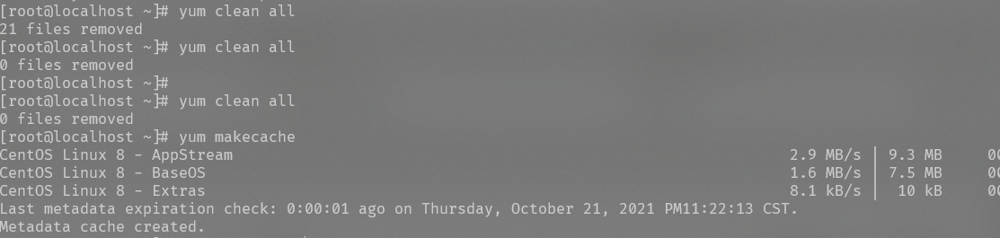
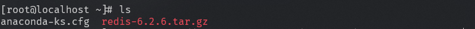
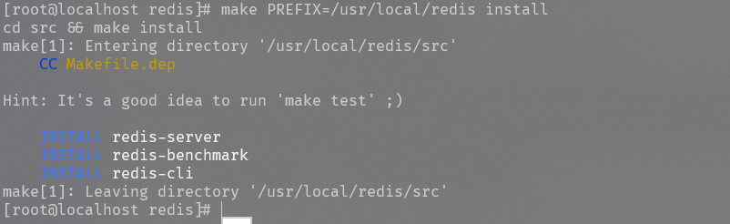
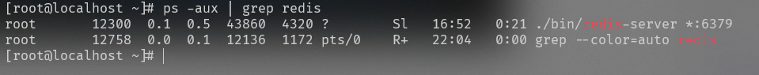
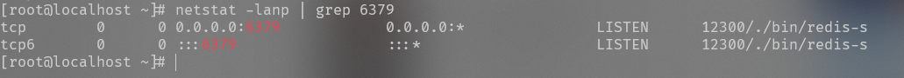

# Java Architect

1. 缓存架构
2. 高并发(缓存架构,异步队列架构,分库分表)
3. 高可用架构(hystrix分布式系统服务的高可用)
4. 微服务架构

# Linux Install

1. 使用命令

   ```
   yum clean all
   yum makecache
   ```

   

2. 在根目录使用命令

```
wget https://download.redis.io/releases/redis-6.2.6.tar.gz
```

2. 出现 wget命令找不到时则

```
yum -y install wget
```

3. ls 查看目录文件



4. 解压

```
tar -zvxf redis-5.0.7.tar.gz
```

5. 移动redis目录

```
mv /root/redis-5.0.7 /usr/local/redis
```

6. 编译 (切换到redis目录下)

```
 cd  usr/local/redis
```

执行编译

```
make
//不行时
make MALLOC=libc
```

7. 安装

```
make PREFIX=/usr/local/redis install
```



1. 如果安装时有报错 cc/bin/sh: cc: command not found 则在根目录下执行

```
yum install gcc-c++
```

9. 启动redis

```
./bin/redis-server& ./redis.conf
```

10. 上面的启动方式是采取后台进程方式,下面是采取显示启动方式(如在配置文件设置了daemonize属性为yes则跟后台进程方式启动其实一样)。

```
./bin/redis-server ./redis.conf
```

## 查看Redis是否正在运行

1. 采取查看进程方式**

```
ps -aux | grep redis
```



1. 采取端口监听查看方式

```
netstat -lanp | grep 6379
```



`redis-cli`是连接本地redis服务的一个命令，通过该命令后可以既然怒redis的脚本控制台。如下图


#  window install
