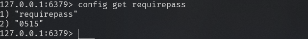
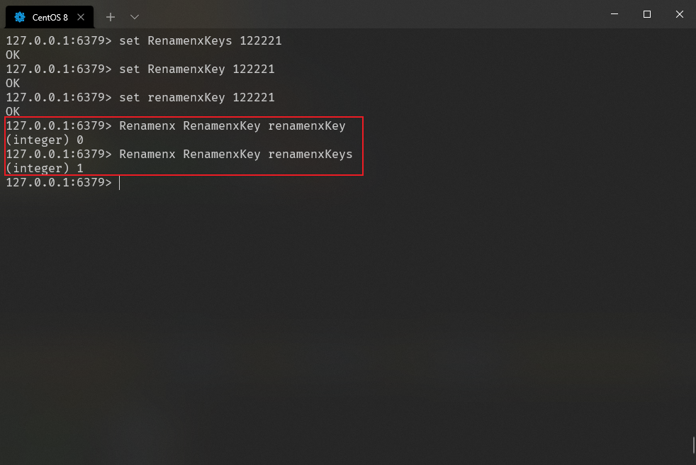
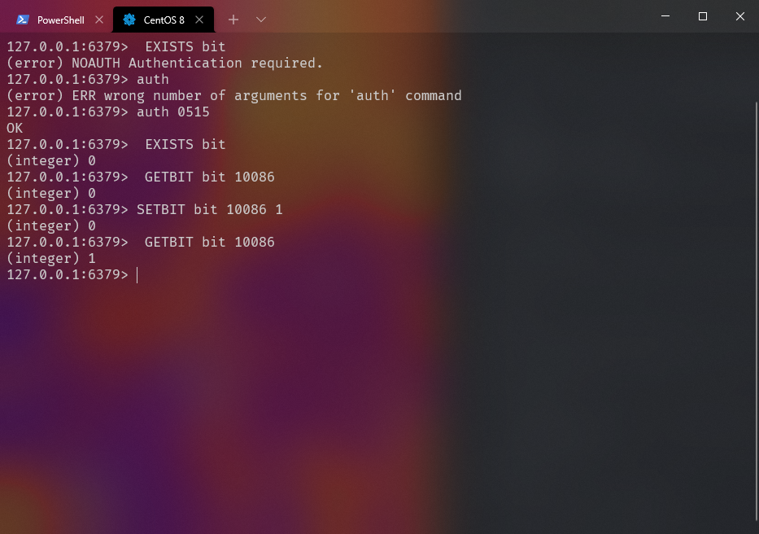
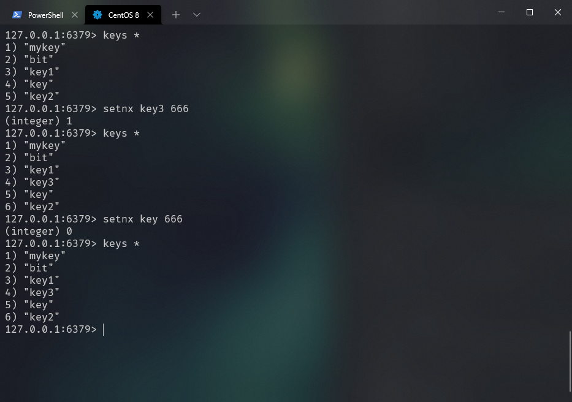

# Java Architect

1. 缓存架构
2. 高并发(缓存架构,异步队列架构,分库分表)
3. 高可用架构(hystrix分布式系统服务的高可用)
4. 微服务架构

# Linux Install

1. 使用命令

   ```
   yum clean all
   yum makecache
   ```

   

2. 在根目录使用命令

```
wget https://download.redis.io/releases/redis-6.2.6.tar.gz
```

2. 出现 wget命令找不到时则

```
yum -y install wget
```

3. ls 查看目录文件


4. 解压

```
tar -zvxf redis-5.0.7.tar.gz
```

5. 移动redis目录

```
mv /root/redis-5.0.7 /usr/local/redis
```

6. 编译 (切换到redis目录下)

```
 cd  usr/local/redis
```

执行编译

```
make
//不行时
make MALLOC=libc
```

7. 安装

```
make PREFIX=/usr/local/redis install
```


1. 如果安装时有报错 cc/bin/sh: cc: command not found 则在根目录下执行

```
yum install gcc-c++
```

9. 启动redis

```
./bin/redis-server& ./redis.conf
```

10. 上面的启动方式是采取后台进程方式,下面是采取显示启动方式(如在配置文件设置了daemonize属性为yes则跟后台进程方式启动其实一样)。

```
./bin/redis-server ./redis.conf
```

## 查看Redis是否正在运行

1. 采取查看进程方式**

```
ps -aux | grep redis
```


1. 采取端口监听查看方式

```
netstat -lanp | grep 6379
```


`redis-cli`是连接本地redis服务的一个命令，通过该命令后可以既然怒redis的脚本控制台。如下图


## 查看是否设置密码

```
config get requirepass
```


```
//设置密码
config set requirepass '密码'
config set requirepass 0515
```

设置密码成功




## 使用redis desktop managerdeng登录

要把6379.conf文件下的bind 127.0.0.1注释掉


在6379.conf文件下,将protected-mode yes修改为protected-mode no


pkill redis关闭redis服务。在redis安装目录下./bin/redis-server& ./redis.conf重新启动服务

使用ps -ef|grep redis查看服务是否运行


如果无效则关闭防火墙

```
systemctl stop firewalld
```

## 对redis进行压力测试

```
redis-benchmark 
```

```
redis-benchmark [-h <host>] [-p <port>] [-c <clients>] [-n <requests]> [-k <boolean>]
-h <hostname>      Server hostname (default 127.0.0.1)
 -p <port>          Server port (default 6379)
 -s <socket>        Server socket (overrides host and port)
 -a <password>      Password for Redis Auth
 -c <clients>       Number of parallel connections (default 50)
 -n <requests>      Total number of requests (default 100000)
 -d <size>          Data size of SET/GET value in bytes (default 2)
 -dbnum <db>        SELECT the specified db number (default 0)
 -k <boolean>       1=keep alive 0=reconnect (default 1)
 -r <keyspacelen>   Use random keys for SET/GET/INCR, random values for SADD
                    Using this option the benchmark will expand the string 
                    __rand_int__inside an argument with a 12 digits number in the 						specified range from 0 to keyspacelen-1. The substitution 
                    changes every time a command is executed. Default tests use this 
                    to hit random keys in the specified range.
 -P <numreq>        Pipeline <numreq> requests. Default 1 (no pipeline).
 -q                 Quiet. Just show query/sec values
 --csv              Output in CSV format
 -l                 Loop. Run the tests forever
 -t <tests>         Only run the comma separated list of tests. The test
                    names are the same as the ones produced as output.
 -I                 Idle mode. Just open N idle connections and wait.
```

```
redis-benchmark -p 6379 -n 1000000 -c 100 -t set,get,sadd,mset -d 1
```

| 指令 | 描述               |
| ---- | ------------------ |
| -h   | 指定服务区主机地址 |
| -c   | 指定并发连接数     |
| -p   | 指定测试端口       |
| -t   | 指定测试命令列表   |
| -n   | 指定请求数         |
| -d   | 指定测试数据大小   |
| -a   | redis的密码 '0515' |


# Redis keys 命令

## 命令 表格

| 序号             | 相关信息                                                     | 描述                                                         |
| :--------------- | :----------------------------------------------------------- | ------------------------------------------------------------ |
| [1](#del命令)    | del  [KEY](http://www.santii.com/redis/command-key_del.html) | 该命令用于在 key 存在时删除 key                              |
| [2](#DUMP)       | DUMP [KEY](http://www.santii.com/redis/command-key_dump.html) | 序列化给定 key ，并返回被序列化的值                          |
| [3](#exists)     | exists [KEY](http://www.santii.com/redis/command-key_exists.html) | 检查给定 key 是否存在                                        |
| [4](#expire)     | exprie [KEY seconds ](http://www.santii.com/redis/command-key_expire.html) | 为给定 key 设置过期时间                                      |
| [5](#expireat)   | expireat [KEY timestamp](http://www.santii.com/redis/command-key_expireat.html) | EXPIREAT 的作用和 EXPIRE 类似，都用于为 key 设置过期时间。 不同在于 EXPIREAT 命令接受的时间参数是 UNIX 时间戳(unix timestamp) |
| [6](#PEXPIRE)    | PEXPIRE [KEY milliseconds](http://www.santii.com/redis/command-key_pexpire.html) | 设置 key 的过期时间以毫秒计                                  |
| [7](#pexpireat)  | pexpireat [KEY milliseconds-timestamp ](http://www.santii.com/redis/command-key_pexpireat.html) | 设置 key 过期时间的时间戳(unix timestamp) 以毫秒计           |
| [8](#keys)       | KEYS [pattern](http://www.santii.com/redis/command-key_keys.html) | 查找所有符合给定模式( pattern)的 key                         |
| [9](#move)       | MOVE [KEY db](http://www.santii.com/redis/command-key_move.html) | 将当前数据库的 key 移动到给定的数据库 db 当中                |
| [10](#persist)   | PERSIST [key](http://www.santii.com/redis/command-key_persist.html) | 移除 key 的过期时间，key 将持久保持                          |
| [11](#Pttl)      | PTTL [key](http://www.santii.com/redis/command-key_pttl.html) | 以毫秒为单位返回 key 的剩余的过期时间                        |
| [12](#TTL)       | TTL [key](http://www.santii.com/redis/command-key_ttl.html)  | 以秒为单位，返回给定 key 的剩余生存时间(TTL, time to live)   |
| [13](#randomkey) | RANDOMKEY [-](http://www.santii.com/redis/command-key_randomkey.html) | 从当前数据库中随机返回一个 key                               |
| [14](#Rename)    | RENAME [key newkey](http://www.santii.com/redis/command-key_rename.html) | 修改 key 的名称                                              |
| [15](#Renamenx)  | RENAMENX [key newkey](http://www.santii.com/redis/command-key_renamenx.html) | 仅当 newkey 不存在时，将 key 改名为 newkey                   |
| [16](#type)      | TYPE [key](http://www.santii.com/redis/command-key_type.html) | 返回 key 所储存的值的类型                                    |
|                  |                                                              |                                                              |


## 命令

###  del命令

Redis DEL 命令用于删除已存在的键。不存在的 key 会被忽略。

返回值:

被删除 key 的数量。


###  exists

Redis EXISTS 命令用于检查给定 key 是否存在。

返回值:

若 key 存在返回 1 ，否则返回 0 。


###  DUMP

Redis DUMP 命令用于序列化给定 key ，并返回被序列化的值。

返回值

如果 key 不存在，那么返回 nil 。 否则，返回序列化之后的值。


### expire

Redis Expire 命令用于设置 key 的过期时间。key 过期后将不再可用。

返回值:

设置成功返回 1 。 当 key 不存在或者不能为 key 设置过期时间时(比如在低于 2.1.3 版本的 Redis 中你尝试更新 key 的过期时间)返回 0 。


###  expireat

Redis Expireat 命令用于以 UNIX 时间戳(unix timestamp)格式设置 key 的过期时间。key 过期后将不再可用。

返回值:

设置成功返回 1 。 当 key 不存在或者不能为 key 设置过期时间时(比如在低于 2.1.3 版本的 Redis 中你尝试更新 key 的过期时间)返回 0 。


### keys

Redis Keys 命令用于查找所有符合给定模式 pattern 的 key 。。

返回值:

符合给定模式的 key 列表 (Array)。

查找以 santii 为开头的 key：


获取 redis 中所有的 key 可用使用 *****。


### move

Redis MOVE 命令用于将当前数据库的 key 移动到给定的数据库 db 当中。

返回值:

移动成功返回 1 ，失败则返回 0 。

==SELECT index==

```
SELECT 0      # redis默认使用数据库 0，为了清晰起见，这里再显式指定一次。
```

先使用数据库0,在数据库0中创建 key-->db0 然后移动到数据库2中		


###  pexpireat

Redis PEXPIREAT 命令用于设置 key 的过期时间，以毫秒计。key 过期后将不再可用。

返回值:

设置成功返回 1 。 当 key 不存在或者不能为 key 设置过期时间时(比如在低于 2.1.3 版本的 Redis 中你尝试更新 key 的过期时间)返回 0 。


###  persist

Redis PERSIST 命令用于移除给定 key 的过期时间，使得 key 永不过期。

返回值:

当过期时间移除成功时，返回 1 。 如果 key 不存在或 key 没有设置过期时间，返回 0 。


###  Pttl

Redis Pttl 命令以毫秒为单位返回 key 的剩余过期时间。

返回值:

当 key 不存在时，返回 -2 。 当 key 存在但没有设置剩余生存时间时，返回 -1 。 否则，以毫秒为单位，返回 key 的剩余生存时间。

**注意：**在 Redis 2.8 以前，当 key 不存在，或者 key 没有设置剩余生存时间时，命令都返回 -1 。


###  TTL

Redis TTL 命令以秒为单位返回 key 的剩余过期时间。

返回值:

当 key 不存在时，返回 -2 。 当 key 存在但没有设置剩余生存时间时，返回 -1 。 否则，以秒为单位，返回 key 的剩余生存时间。

**注意：**在 Redis 2.8 以前，当 key 不存在，或者 key 没有设置剩余生存时间时，命令都返回 -1 。


###  randomkey

Redis RANDOMKEY 命令从当前数据库中随机返回一个 key 。

返回值:

当数据库不为空时，返回一个 key 。 当数据库为空时，返回 nil 。


###  Rename

Redis Rename 命令用于修改 key 的名称 。

返回值:

改名成功时提示 OK ，失败时候返回一个错误。

当 OLD_KEY_NAME 和 NEW_KEY_NAME 相同，或者 OLD_KEY_NAME 不存在时，返回一个错误。 当 NEW_KEY_NAME 已经存在时， RENAME 命令将覆盖旧值。


###  Renamenx

Redis Renamenx 命令用于在新的 key 不存在时修改 key 的名称 。

返回值:

修改成功时，返回 1 。 如果 NEW_KEY_NAME 已经存在，返回 0 。



###  Type

Redis Type 命令用于返回 key 所储存的值的类型。

返回值:

返回 key 的数据类型，数据类型有：

- none (key不存在)
- string (字符串)
- list (列表)
- set (集合)
- zset (有序集)
- hash (哈希表)


#  Redis String 命令

##  表格

| 序号               | 相关信息                                                     |                                                              |
| :----------------- | :----------------------------------------------------------- | ------------------------------------------------------------ |
| [1](#set)          | SET [key value](http://www.santii.com/redis/command-string_set.html) | 设置指定 key 的值                                            |
| 2                  | GET [key](http://www.santii.com/redis/command-string_get.html) | 获取指定 key 的值                                            |
| [3](#GETRANGE)     | GETRANGE [key start end](http://www.santii.com/redis/command-string_getrange.html) | 返回 key 中字符串值的子字符                                  |
| [4](#GETSET)       | GETSET [key value](http://www.santii.com/redis/command-string_getset.html) | 将给定 key 的值设为 value ，并返回 key 的旧值(old value)     |
| [5](#GETBIT)       | GETBIT [key offset](http://www.santii.com/redis/command-string_getbit.html) | 对 key 所储存的字符串值，获取指定偏移量上的位(bit)           |
| [6](#MGET)         | MGET [key1 [key2\]](http://www.santii.com/redis/command-string_mget.html) | 获取所有(一个或多个)给定 key 的值                            |
| [7](#SETBIT)       | SETBIT [key offset value](http://www.santii.com/redis/command-string_setbit.html) | 对 key 所储存的字符串值，设置或清除指定偏移量上的位(bit)     |
| [8](#SETEX)        | SETEX [key seconds value](http://www.santii.com/redis/command-string_setex.html) | 将值 value 关联到 key ，并将 key 的过期时间设为 seconds (以秒为单位) |
| [9](#SETNX)        | SETNX [key value](http://www.santii.com/redis/command-string_setnx.html) | 只有在 key 不存在时设置 key 的值                             |
| [10](#SETRANGE)    | SETRANGE [key offset value](http://www.santii.com/redis/command-string_setrange.html) | 用 value 参数覆写给定 key 所储存的字符串值，从偏移量 offset 开始 |
| [11](#STRLEN)      | STRLEN [key](http://www.santii.com/redis/command-string_strlen.html) | 返回 key 所储存的字符串值的长度                              |
| [12](#MSET)        | MSET [key value](http://www.santii.com/redis/command-string_mset.html) | 同时设置一个或多个 key-value 对                              |
| [13](#MSETNX)      | MSETNX [key value](http://www.santii.com/redis/command-string_msetnx.html) | 同时设置一个或多个 key-value 对，当且仅当所有给定 key 都不存在 |
| [14](#PSETEX)      | PSETEX [key milliseconds value](http://www.santii.com/redis/command-string_psetex.html) | 这个命令和 SETEX 命令相似，但它以毫秒为单位设置 key 的生存时间，而不是像 SETEX 命令那样，以秒为单位 |
| [15](#INCR)        | INCR [key](http://www.santii.com/redis/command-string_incr.html) | 将 key 中储存的数字值增一                                    |
| [16](#INCRBY)      | INCRBY [key increment](http://www.santii.com/redis/command-string_incrby.html) | 将 key 所储存的值加上给定的增量值（increment）               |
| [17](#INCRBYFLOAT) | INCRBYFLOAT [key increment](http://www.santii.com/redis/command-string_incrbyfloat.html) | 将 key 所储存的值加上给定的浮点增量值（increment）           |
| [18](#DECR)        | DECR [key](http://www.santii.com/redis/command-string_decr.html) | 将 key 中储存的数字值减一                                    |
| [19](#DECRBY)      | DECRBY [key decrement](http://www.santii.com/redis/command-string_decrby.html) | key 所储存的值减去给定的减量值（decrement）                  |
| [20](#APPEND)      | APPEND [key value](http://www.santii.com/redis/command-string_append.html) | 如果 key 已经存在并且是一个字符串， APPEND 命令将 value 追加到 key 原来的值的末尾 |

###  Getrange 

Redis Getrange 命令用于获取存储在指定 key 中字符串的子字符串。字符串的截取范围由 start 和 end 两个偏移量决定(包括 start 和 end 在内)。

返回值:

截取得到的子字符串。


###  Getbit 

Redis Getbit 命令用于对 key 所储存的字符串值，获取指定偏移量上的位(bit)。

返回值:

字符串值指定偏移量上的位(bit)。

当偏移量 OFFSET 比字符串值的长度大，或者 key 不存在时，返回 0 。



###  Getset

Redis Getset 命令用于设置指定 key 的值，并返回 key 旧的值。

返回值:

返回给定 key 的旧值。 当 key 没有旧值时，即 key 不存在时，返回 nil 。

当 key 存在但不是字符串类型时，返回一个错误。


###  Mget 

Redis Mget 命令返回所有(一个或多个)给定 key 的值。 如果给定的 key 里面，有某个 key 不存在，那么这个 key 返回特殊值 nil 。

返回值:

一个包含所有给定 key 的值的列表。


###  Setbit 

Redis Setbit 命令用于对 key 所储存的字符串值，设置或清除指定偏移量上的位(bit)。

返回值:

指定偏移量原来储存的位。


### Setex 

Redis Setex 命令为指定的 key 设置值及其过期时间。如果 key 已经存在， SETEX 命令将会替换旧的值。

返回值:

设置成功时返回 OK 


### Setnx

Redis Setnx（**SET** if **N**ot e**X**ists） 命令在指定的 key 不存在时，为 key 设置指定的值。

返回值:

设置成功，返回 1 。 设置失败，返回 0 。



### Setrange 

Redis Setrange 命令用指定的字符串覆盖给定 key 所储存的字符串值，覆盖的位置从偏移量 offset 开始。

返回值:

被修改后的字符串长度。


### Strlen 

Redis Strlen 命令用于获取指定 key 所储存的字符串值的长度。当 key 储存的不是字符串值时，返回一个错误。

返回值:

字符串值的长度。 当 key 不存在时，返回 0。


### Mset

Redis Mset 命令用于同时设置一个或多个 key-value 对。

返回值:

总是返回 OK 。


### Msetnx 

Redis Msetnx 命令用于所有给定 key 都不存在时，同时设置一个或多个 key-value 对。

返回值:

当所有 key 都成功设置，返回 1 。 如果所有给定 key 都设置失败(至少有一个 key 已经存在)，那么返回 0 。


### Psetex 

Redis Psetex 命令以毫秒为单位设置 key 的生存时间。

返回值:

设置成功时返回 OK 。


### Incr 

Redis Incr 命令将 key 中储存的数字值增一。

如果 key 不存在，那么 key 的值会先被初始化为 0 ，然后再执行 INCR 操作。

如果值包含错误的类型，或字符串类型的值不能表示为数字，那么返回一个错误。

本操作的值限制在 64 位(bit)有符号数字表示之内。

返回值:

执行 INCR 命令之后 key 的值。


### Incrby

Redis Incrby 命令将 key 中储存的数字加上指定的增量值。

如果 key 不存在，那么 key 的值会先被初始化为 0 ，然后再执行 INCRBY 命令。

如果值包含错误的类型，或字符串类型的值不能表示为数字，那么返回一个错误。

本操作的值限制在 64 位(bit)有符号数字表示之内。

返回值:

加上指定的增量值之后， key 的值。


### Incrbyfloat 

Redis Incrbyfloat 命令为 key 中所储存的值加上指定的浮点数增量值。

如果 key 不存在，那么 INCRBYFLOAT 会先将 key 的值设为 0 ，再执行加法操作。

返回值:

执行命令之后 key 的值。


### Decr 

Redis Decr 命令将 key 中储存的数字值减一。

如果 key 不存在，那么 key 的值会先被初始化为 0 ，然后再执行 DECR 操作。

如果值包含错误的类型，或字符串类型的值不能表示为数字，那么返回一个错误。

本操作的值限制在 64 位(bit)有符号数字表示之内。

返回值:

执行命令之后 key 的值。


### Decrby

Redis Decrby 命令将 key 所储存的值减去指定的减量值。

如果 key 不存在，那么 key 的值会先被初始化为 0 ，然后再执行 DECRBY 操作。

如果值包含错误的类型，或字符串类型的值不能表示为数字，那么返回一个错误。

本操作的值限制在 64 位(bit)有符号数字表示之内。

返回值:

减去指定减量值之后， key 的值。


### Append 

Redis Append 命令用于为指定的 key 追加值。

如果 key 已经存在并且是一个字符串， APPEND 命令将 value 追加到 key 原来的值的末尾。

如果 key 不存在， APPEND 就简单地将给定 key 设为 value ，就像执行 SET key value 一样。

返回值:

追加指定值之后， key 中字符串的长度。


# Redis Hash 命令

Redis hash 是一个string类型的field和value的映射表，hash特别适合用于存储对象。

Redis 中每个 hash 可以存储 232 - 1 键值对（40多亿）。

```
 HMSET santiikey name "redis tutorial" description "redis basic commands for caching" likes 20 visitors 23000
```


## 列表

| 序号               | 相关信息                                                     |                                                       |
| :----------------- | :----------------------------------------------------------- | ----------------------------------------------------- |
| [1](#HDEL)         | HDEL [key field2 [field2\]](http://www.santii.com/redis/command-hash_hdel.html) | 删除一个或多个哈希表字段                              |
| [2](#HEXISTS)      | HEXISTS [key field](http://www.santii.com/redis/command-hash_hexists.html) | 查看哈希表 key 中，指定的字段是否存在                 |
| [3](#HGET)         | HGET [key field](http://www.santii.com/redis/command-hash_hget.html) | 获取存储在哈希表中指定字段的值                        |
| [4](#HGETALL)      | HGETALL [key](http://www.santii.com/redis/command-hash_hgetall.html) | 获取在哈希表中指定 key 的所有字段和值                 |
| [5](#HINCRBY)      | HINCRBY [key field increment](http://www.santii.com/redis/command-hash_hincrby.html) | 为哈希表 key 中的指定字段的整数值加上增量 increment   |
| [6](#HINCRBYFLOAT) | HINCRBYFLOAT [key field increment](http://www.santii.com/redis/command-hash_hincrbyfloat.html) | 为哈希表 key 中的指定字段的浮点数值加上增量 increment |
| [7](#HKEYS)        | HKEYS [key](http://www.santii.com/redis/command-hash_hkeys.html) | 获取所有哈希表中的字段                                |
| [8](#HLEN)         | HLEN  [key](http://www.santii.com/redis/command-hash_hlen.html) | 获取哈希表中字段的数量                                |
| [9](#HMGET)        | HMGET [key field1 [field2\]](http://www.santii.com/redis/command-hash_hmget.html) | 获取所有给定字段的值                                  |
| [10](#HMSET)       | HMSET [key field1 value1 [field2 value2 \]](http://www.santii.com/redis/command-hash_hmset.html) | 同时将多个 field-value (域-值)对设置到哈希表 key 中   |
| [11](#HSET)        | HSET [key field value](http://www.santii.com/redis/command-hash_hset.html) | 将哈希表 key 中的字段 field 的值设为 value            |
| [12](#HSETNX )     | HSETNX [key field value](http://www.santii.com/redis/command-hash_hsetnx.html) | 只有在字段 field 不存在时，设置哈希表字段的值         |
| [13](#HVALS )      | HVALS [key](http://www.santii.com/redis/command-hash_hvals.html) | 获取哈希表中所有值                                    |

### Hget 

Redis Hget 命令用于返回哈希表中指定字段的值。

返回值

返回给定字段的值。如果给定的字段或 key 不存在时，返回 nil 。


### Hgetall 

Redis Hgetall 命令用于返回哈希表中，所有的字段和值。

在返回值里，紧跟每个字段名(field name)之后是字段的值(value)，所以返回值的长度是哈希表大小的两倍。

返回值

以列表形式返回哈希表的字段及字段值。 若 key 不存在，返回空列表。


### Hexists 

Redis Hexists 命令用于查看哈希表的指定字段是否存在。

返回值

如果哈希表含有给定字段，返回 1 。 如果哈希表不含有给定字段，或 key 不存在，返回 0 。


### Hdel 

Redis Hdel 命令用于删除哈希表 key 中的一个或多个指定字段，不存在的字段将被忽略。

返回值

被成功删除字段的数量，不包括被忽略的字段。


### Hset 

Redis Hset 命令用于为哈希表中的字段赋值 。

如果哈希表不存在，一个新的哈希表被创建并进行 HSET 操作。

如果字段已经存在于哈希表中，旧值将被覆盖。

返回值

如果字段是哈希表中的一个新建字段，并且值设置成功，返回 1 。 如果哈希表中域字段已经存在且旧值已被新值覆盖，返回 0 。


### Hincrby 

Redis Hincrby 命令用于为哈希表中的字段值加上指定增量值。

增量也可以为负数，相当于对指定字段进行减法操作。

如果哈希表的 key 不存在，一个新的哈希表被创建并执行 HINCRBY 命令。

如果指定的字段不存在，那么在执行命令前，字段的值被初始化为 0 。

对一个储存字符串值的字段执行 HINCRBY 命令将造成一个错误。

本操作的值被限制在 64 位(bit)有符号数字表示之内。

返回值

执行 HINCRBY 命令之后，哈希表中字段的值。


###  Hincrbyfloat

Redis Hincrbyfloat 命令用于为哈希表中的字段值加上指定浮点数增量值。

如果指定的字段不存在，那么在执行命令前，字段的值被初始化为 0 。

返回值

执行 Hincrbyfloat 命令之后，哈希表中字段的值。


###  Hkeys

Redis Hkeys 命令用于获取哈希表中的所有字段名。

返回值

包含哈希表中所有字段的列表。 当 key 不存在时，返回一个空列表。


###  Hlen

Redis Hlen 命令用于获取哈希表中字段的数量。

返回值

哈希表中字段的数量。 当 key 不存在时，返回 0 。


###  Hmget

Redis Hmget 命令用于返回哈希表中，一个或多个给定字段的值。

如果指定的字段不存在于哈希表，那么返回一个 nil 值。

返回值

一个包含多个给定字段关联值的表，表值的排列顺序和指定字段的请求顺序一样。


###  Hmset 

Redis Hmset 命令用于同时将多个 field-value (字段-值)对设置到哈希表中。

此命令会覆盖哈希表中已存在的字段。

如果哈希表不存在，会创建一个空哈希表，并执行 HMSET 操作。

返回值

如果命令执行成功，返回 OK 。


###  Hsetnx 

Redis Hsetnx 命令用于为哈希表中不存在的的字段赋值 。

如果哈希表不存在，一个新的哈希表被创建并进行 HSET 操作。

如果字段已经存在于哈希表中，操作无效。

如果 key 不存在，一个新哈希表被创建并执行 HSETNX 命令。

返回值

设置成功，返回 1 。 如果给定字段已经存在且没有操作被执行，返回 0 。


###  Hvals 

Redis Hvals 命令返回哈希表所有字段的值。

返回值

一个包含哈希表中所有值的表。 当 key 不存在时，返回一个空表。


#  Redis List 命令

Redis列表是简单的字符串列表，按照插入顺序排序。你可以添加一个元素导列表的头部（左边）或者尾部（右边）


一个列表最多可以包含 232 - 1 个元素 (4294967295, 每个列表超过40亿个元素)。

## 列表

| 序号             | 相关信息                                                     |                                                              |
| :--------------- | :----------------------------------------------------------- | ------------------------------------------------------------ |
| [1](#Blpop)      | Blpop [key1 key2 \] timeout](http://www.santii.com/redis/command-list_blpop.html) | 移出并获取列表的第一个元素， 如果列表没有元素会阻塞列表直到等待超时或发现可弹出元素为止 |
| [2](#Brpop)      | Brpop [key1 key2 \] timeout](http://www.santii.com/redis/command-list_brpop.html) | 移出并获取列表的最后一个元素， 如果列表没有元素会阻塞列表直到等待超时或发现可弹出元素为止 |
| [3](#Brpoplpush) | Brpoplpush [source destination timeout](http://www.santii.com/redis/command-list_brpoplpush.html) | 从列表中弹出一个值，将弹出的元素插入到另外一个列表中并返回它； 如果列表没有元素会阻塞列表直到等待超时或发现可弹出元素为止 |
| [4](#Lindex)     | Lindex [key index](http://www.santii.com/redis/command-list_lindex.html) | 通过索引获取列表中的元素                                     |
| [5](#Linsert)    | Linsert [key BEFORE\|AFTER pivot value](http://www.santii.com/redis/command-list_linsert.html) | 在列表的元素前或者后插入元素                                 |
| [6](#Llen)       | Llen [key](http://www.santii.com/redis/command-list_llen.html) | 获取列表长度                                                 |
| [7](#Lpop)       | Lpop [key](http://www.santii.com/redis/command-list_lpop.html) | 移出并获取列表的第一个元素                                   |
| [8](#Lpush)      | Lpush [key value1 [value2\]](http://www.santii.com/redis/command-list_lpush.html) | 将一个或多个值插入到列表头部                                 |
| [9](#Lpushx)     | Lpushx [key value](http://www.santii.com/redis/command-list_lpushx.html) | 将一个或多个值插入到已存在的列表头部                         |
| [10](#Lrange)    | Lrange [key start stop](http://www.santii.com/redis/command-list_lrange.html) | 获取列表指定范围内的元素                                     |
| [11](#Lrem)      | Lrem [key count value](http://www.santii.com/redis/command-list_lrem.html) | 移除列表元素                                                 |
| [12](#Lset)      | Lset [key index value](http://www.santii.com/redis/command-list_lset.html) | 通过索引设置列表元素的值                                     |
| [13](#Ltrim)     | Ltrim [key start stop](http://www.santii.com/redis/command-list_ltrim.html) | 对一个列表进行修剪(trim)，就是说，让列表只保留指定区间内的元素，不在指定区间之内的元素都将被删除 |
| [14](#Rpop)      | Rpop [key](http://www.santii.com/redis/command-list_rpop.html) | 移除并获取列表最后一个元素                                   |
| [15](#Rpoplpush) | Rpoplpush [source destination](http://www.santii.com/redis/command-list_rpoplpush.html) | 移除列表的最后一个元素，并将该元素添加到另一个列表并返回     |
| [16](#Rpush)     | Rpush [key value1 [value2\]](http://www.santii.com/redis/command-list_rpush.html) | 在列表中添加一个或多个值                                     |
| [17](#Rpushx)    | Rpushx [key value](http://www.santii.com/redis/command-list_rpushx.html) | 为已存在的列表添加值                                         |

### Blpop

Redis Blpop 命令移出并获取列表的第一个元素， 如果列表没有元素会阻塞列表直到等待超时或发现可弹出元素为止。

语法:

redis Blpop 命令基本语法如下：

```
redis 127.0.0.1:6379> BLPOP LIST1 LIST2 .. LISTN TIMEOUT
```

返回值

如果列表为空，返回一个 nil 。 否则，返回一个含有两个元素的列表，第一个元素是被弹出元素所属的 key ，第二个元素是被弹出元素的值。

```
redis 127.0.0.1:6379> BLPOP list1 100
```

在以上实例中，操作会被阻塞，如果指定的列表 key list1 存在数据则会返回第一个元素，否则在等待100秒后会返回 nil 。


### Brpop

Redis Brpop 命令移出并获取列表的最后一个元素， 如果列表没有元素会阻塞列表直到等待超时或发现可弹出元素为止。

语法

redis Blpop 命令基本语法如下：

``` 
redis 127.0.0.1:6379> BRPOP LIST1 LIST2 .. LISTN TIMEOUT
```

返回值

假如在指定时间内没有任何元素被弹出，则返回一个 nil 和等待时长。 反之，返回一个含有两个元素的列表，第一个元素是被弹出元素所属的 key ，第二个元素是被弹出元素的值。

实例

```
redis 127.0.0.1:6379> BRPOP list1 100
```

在以上实例中，操作会被阻塞，如果指定的列表 key list1 存在数据则会返回第一个元素，否则在等待100秒后会返回 nil 。


### Brpoplpush 

Redis Brpoplpush 命令从列表中弹出一个值，将弹出的元素插入到另外一个列表中并返回它； 如果列表没有元素会阻塞列表直到等待超时或发现可弹出元素为止。

语法

redis Brpoplpush 命令基本语法如下：

```
redis 127.0.0.1:6379> BRPOPLPUSH LIST1 ANOTHER_LIST TIMEOUT
```

返回值

假如在指定时间内没有任何元素被弹出，则返回一个 nil 和等待时长。 反之，返回一个含有两个元素的列表，第一个元素是被弹出元素的值，第二个元素是等待时长

```
# 非空列表

redis> BRPOPLPUSH msg reciver 500
"hello moto"                        # 弹出元素的值
(3.38s)                             # 等待时长

redis> LLEN reciver
(integer) 1

redis> LRANGE reciver 0 0
1) "hello moto"


# 空列表

redis> BRPOPLPUSH msg reciver 1
(nil)
(1.34s)
```


### Lindex 

Redis Lindex 命令用于通过索引获取列表中的元素。你也可以使用负数下标，以 -1 表示列表的最后一个元素， -2 表示列表的倒数第二个元素，以此类推。

语法

redis Lindex 命令基本语法如下：

```
redis 127.0.0.1:6379> LINDEX KEY_NAME INDEX_POSITION
```

返回值

列表中下标为指定索引值的元素。 如果指定索引值不在列表的区间范围内，返回 nil 。

实例

```
redis 127.0.0.1:6379> LPUSH mylist "World"
(integer) 1

redis 127.0.0.1:6379> LPUSH mylist "Hello"
(integer) 2

redis 127.0.0.1:6379> LINDEX mylist 0
"Hello"

redis 127.0.0.1:6379> LINDEX mylist -1
"World"

redis 127.0.0.1:6379> LINDEX mylist 3        # index不在 mylist 的区间范围内
(nil)
```


### Linsert 

Redis Linsert 命令用于在列表的元素前或者后插入元素。 当指定元素不存在于列表中时，不执行任何操作。 当列表不存在时，被视为空列表，不执行任何操作。 如果 key 不是列表类型，返回一个错误。

语法

redis Linsert 命令基本语法如下：

```
redis 127.0.0.1:6379> LINSERT KEY_NAME BEFORE EXISTING_VALUE NEW_VALUE
```

返回值

如果命令执行成功，返回插入操作完成之后，列表的长度。 如果没有找到指定元素 ，返回 -1 。 如果 key 不存在或为空列表，返回 0 。

实例

```
(integer) 1
redis> RPUSH mylist "World"
(integer) 2
redis> LINSERT mylist BEFORE "World" "There"
(integer) 3
redis> LRANGE mylist 0 -1
1) "Hello"
2) "There"
3) "World"
redis>
```


### Llen 

Redis Llen 命令用于返回列表的长度。 如果列表 key 不存在，则 key 被解释为一个空列表，返回 0 。 如果 key 不是列表类型，返回一个错误。

redis Llen 命令基本语法如下：

```
redis 127.0.0.1:6379> LLEN KEY_NAME
```

返回值

列表的长度。


### Lpop 

Redis Lpop 命令用于移除并返回列表的第一个元素。

redis Lpop 命令基本语法如下：

```
redis 127.0.0.1:6379> LLEN KEY_NAME
```

返回值

列表的第一个元素。 当列表 key 不存在时，返回 nil 。


### Lpush

Redis Lpush 命令将一个或多个值插入到列表头部。 如果 key 不存在，一个空列表会被创建并执行 LPUSH 操作。 当 key 存在但不是列表类型时，返回一个错误。

**注意：**在Redis 2.4版本以前的 LPUSH 命令，都只接受单个 value 值。

redis Lpush 命令基本语法如下：

```
redis 127.0.0.1:6379> LPUSH KEY_NAME VALUE1.. VALUEN
```

返回值

执行 LPUSH 命令后，列表的长度。


### Lpushx 

Redis Lpushx 将一个或多个值插入到已存在的列表头部，列表不存在时操作无效。

redis Lpushx 命令基本语法如下：

```
redis 127.0.0.1:6379> LPUSHX KEY_NAME VALUE1.. VALUEN
```

返回值

LPUSHX 命令执行之后，列表的长度。


### Lrange 

Redis Lrange 返回列表中指定区间内的元素，区间以偏移量 START 和 END 指定。 其中 0 表示列表的第一个元素， 1 表示列表的第二个元素，以此类推。 你也可以使用负数下标，以 -1 表示列表的最后一个元素， -2 表示列表的倒数第二个元素，以此类推。

redis Lrange 命令基本语法如下：

```
redis 127.0.0.1:6379> LRANGE KEY_NAME START END
```


### Lrem 

Redis Lrem 根据参数 COUNT 的值，移除列表中与参数 VALUE 相等的元素。

COUNT 的值可以是以下几种：

- count > 0 : 从表头开始向表尾搜索，移除与 VALUE 相等的元素，数量为 COUNT 。
- count < 0 : 从表尾开始向表头搜索，移除与 VALUE 相等的元素，数量为 COUNT 的绝对值。
- count = 0 : 移除表中所有与 VALUE 相等的值。

语法

redis Lrem 命令基本语法如下：

```
redis 127.0.0.1:6379> LREM KEY_NAME COUNT VALUE
```

返回值

被移除元素的数量。 列表不存在时返回 0 。


### Lset

Redis Lset 通过索引来设置元素的值。

当索引参数超出范围，或对一个空列表进行 LSET 时，返回一个错误。

关于列表下标的更多信息，请参考 [LINDEX 命令](http://www.santii.com/redis/command-list_lindex.html)。

语法

redis Lset 命令基本语法如下：

```
redis 127.0.0.1:6379> LSET KEY_NAME INDEX VALUE
```

返回值

操作成功返回 ok ，否则返回错误信息。


### Ltrim 

Redis Ltrim 对一个列表进行修剪(trim)，就是说，让列表只保留指定区间内的元素，不在指定区间之内的元素都将被删除。

下标 0 表示列表的第一个元素，以 1 表示列表的第二个元素，以此类推。 你也可以使用负数下标，以 -1 表示列表的最后一个元素， -2 表示列表的倒数第二个元素，以此类推。

语法

redis Ltrim 命令基本语法如下：

```
redis 127.0.0.1:6379> LTRIM KEY_NAME START STOP
```

返回值

命令执行成功时，返回 ok 。


### Rpop 

Redis Rpop 命令用于移除并返回列表的最后一个元素。

语法

redis Rpop 命令基本语法如下：

```
redis 127.0.0.1:6379> RPOP KEY_NAME
```

返回值

列表的最后一个元素。 当列表不存在时，返回 nil 。


### Rpoplpush 

Redis Rpoplpush 命令用于移除列表的最后一个元素，并将该元素添加到另一个列表并返回。

语法

redis Rpoplpush 命令基本语法如下：

```
redis 127.0.0.1:6379> RPOPLPUSH SOURCE_KEY_NAME DESTINATION_KEY_NAME
```

返回值

被弹出的元素。


### Rpush

Redis Rpush 命令用于将一个或多个值插入到列表的尾部(最右边)。

如果列表不存在，一个空列表会被创建并执行 RPUSH 操作。 当列表存在但不是列表类型时，返回一个错误。

**注意：**在 Redis 2.4 版本以前的 RPUSH 命令，都只接受单个 value 值。

语法

redis Rpush 命令基本语法如下：

```
redis 127.0.0.1:6379> RPUSH KEY_NAME VALUE1..VALUEN
```

返回值

执行 RPUSH 操作后，列表的长度。


### Rpushx

Redis Rpushx 命令用于将一个或多个值插入到已存在的列表尾部(最右边)。如果列表不存在，操作无效。

语法

redis Rpushx 命令基本语法如下：

```
redis 127.0.0.1:6379> RPUSHX KEY_NAME VALUE1..VALUEN
```

返回值

执行 Rpushx 操作后，列表的长度。


# Redis Set 

Redis的Set是string类型的无序集合。集合成员是唯一的，这就意味着集合中不能出现重复的数据。

Redis 中 集合是通过哈希表实现的，所以添加，删除，查找的复杂度都是O(1)。

集合中最大的成员数为 232 - 1 (4294967295, 每个集合可存储40多亿个成员)。

实例

```
redis 127.0.0.1:6379> SADD santiikey redis
(integer) 1
redis 127.0.0.1:6379> SADD santiikey mongodb
(integer) 1
redis 127.0.0.1:6379> SADD santiikey mysql
(integer) 1
redis 127.0.0.1:6379> SADD santiikey mysql
(integer) 0
redis 127.0.0.1:6379> SMEMBERS santiikey

\1) "mysql"
\2) "mongodb"
\3) "redis"
```

在以上实例中我们通过 **SADD** 命令向名为 **santiikey** 的集合插入的三个元素。


## 列表

| 序号               | 相关信息                                                     |                                                     |
| ------------------ | ------------------------------------------------------------ | --------------------------------------------------- |
| [1](#Sadd)         | Sadd [SADD key member1 [member2\]](http://www.santii.com/redis/command-set_sadd.html) | 向集合添加一个或多个成员                            |
| [2](#Scard)        | Scard [SCARD key](http://www.santii.com/redis/command-set_scard.html) | 获取集合的成员数                                    |
| [3](#Sdiff)        | Sdiff [SDIFF key1 [key2\]](http://www.santii.com/redis/command-set_sdiff.html) | 返回给定所有集合的差集                              |
| [4](#Sdiffstore)   | Sdiffstore [SDIFFSTORE destination key1 [key2\] ](http://www.santii.com/redis/command-set_sdiffstore.html) | 返回给定所有集合的差集并存储在 destination 中       |
| [5](#Sinter)       | Sinter [SINTER key1 [key2\]](http://www.santii.com/redis/command-set_sinter.html) | 返回给定所有集合的交集                              |
| [6](#Sinterstore)  | Sinterstore [SINTERSTORE destination key1 [key2\]](http://www.santii.com/redis/command-set_sinterstore.html) | 返回给定所有集合的交集并存储在 destination 中       |
| [7](#Sismember)    | Sismember [SISMEMBER key member](http://www.santii.com/redis/command-set_sismember.html) | 判断 member 元素是否是集合 key 的成员               |
| [8](#Smembers)     | Smembers [SMEMBERS key](http://www.santii.com/redis/command-set_smembers.html) | 返回集合中的所有成员                                |
| [9](#Smove)        | Smove  [SMOVE source destination member ](http://www.santii.com/redis/command-set_smove.html) | 将 member 元素从 source 集合移动到 destination 集合 |
| [10](#Spop)        | Spop  [SPOP key](http://www.santii.com/redis/command-set_spop.html) | 移除并返回集合中的一个随机元素                      |
| [11](#Srandmember) | Srandmember  [SRANDMEMBER key count](http://www.santii.com/redis/command-set_srandmember.html) | 返回集合中一个或多个随机数                          |
| [12](#Srem)        | Srem [SREM key member1 member2](http://www.santii.com/redis/command-set_srem.html) | 移除集合中一个或多个成员                            |
| [13](#Sunion)      | Sunion [SUNION key1 key2](http://www.santii.com/redis/command-set_sunion.html) | 返回所有给定集合的并集                              |
| [14](#Sunionstore) | Sunionstore  [SUNIONSTORE destination key1 key2](http://www.santii.com/redis/command-set_sunionstore.html) | 所有给定集合的并集存储在 destination 集合中         |
| [15](#Sscan)       | Sscan key cursor MATCH pattern [COUNT count](http://www.santii.com/redis/command-set_sscan.html) | 迭代集合中的元素                                    |

### Sadd

Redis Sadd 命令将一个或多个成员元素加入到集合中，已经存在于集合的成员元素将被忽略。

假如集合 key 不存在，则创建一个只包含添加的元素作成员的集合。

当集合 key 不是集合类型时，返回一个错误。

**注意：**在Redis2.4版本以前， SADD 只接受单个成员值。

语法

redis Sadd 命令基本语法如下：

```
redis 127.0.0.1:6379> SADD KEY_NAME VALUE1..VALUEN
```

返回值

被添加到集合中的新元素的数量，不包括被忽略的元素。


### Scard

Redis Scard 命令返回集合中元素的数量。

语法

redis Scard 命令基本语法如下：

```
redis 127.0.0.1:6379> SCARD KEY_NAME
```

返回值

集合的数量。 当集合 key 不存在时，返回 0 。


### Sdiff

Redis Sdiff 命令返回给定集合之间的差集。不存在的集合 key 将视为空集。

语法

redis Sdiff 命令基本语法如下：

```
redis 127.0.0.1:6379> SDIFF FIRST_KEY OTHER_KEY1..OTHER_KEYN
```

返回值

包含差集成员的列表。


### Sdiffstore

Redis Sdiffstore 命令将给定集合之间的差集存储在指定的集合中。如果指定的集合 key 已存在，则会被覆盖。

语法

redis Sdiffstore 命令基本语法如下：

```
redis 127.0.0.1:6379> SDIFFSTORE DESTINATION_KEY KEY1..KEYN
```

返回值

结果集中的元素数量。


### Sinter

Redis Sinter 命令返回给定所有给定集合的交集。 不存在的集合 key 被视为空集。 当给定集合当中有一个空集时，结果也为空集(根据集合运算定律)。

语法

redis Sinter 命令基本语法如下：

```
redis 127.0.0.1:6379> SINTER KEY KEY1..KEYN
```

返回值

交集成员的列表。


### Sinterstore

Redis Sinterstore 命令将给定集合之间的交集存储在指定的集合中。如果指定的集合已经存在，则将其覆盖。

语法

redis Sinterstore 命令基本语法如下：

```
redis 127.0.0.1:6379> SINTERSTORE DESTINATION_KEY KEY KEY1..KEYN
```

返回值

交集成员的列表。


### Sismember

Redis Sismember 命令判断成员元素是否是集合的成员。

语法

redis Sismember 命令基本语法如下：

```
redis 127.0.0.1:6379> SISMEMBER KEY VALUE
```

返回值

如果成员元素是集合的成员，返回 1 。 如果成员元素不是集合的成员，或 key 不存在，返回 0 。


### Smembers

Redis Smembers 命令返回集合中的所有的成员。 不存在的集合 key 被视为空集合。

语法

redis Smembers 命令基本语法如下：

```
redis 127.0.0.1:6379> SMEMBERS KEY VALUE
```

返回值

集合中的所有成员。

实例

```
redis 127.0.0.1:6379> SADD myset1 "hello"
(integer) 1
redis 127.0.0.1:6379> SADD myset1 "world"
(integer) 1
redis 127.0.0.1:6379> SMEMBERS myset1
\1) "World"
\2) "Hello"
```


### Smove

Redis Smove 命令将指定成员 member 元素从 source 集合移动到 destination 集合。

SMOVE 是原子性操作。

如果 source 集合不存在或不包含指定的 member 元素，则 SMOVE 命令不执行任何操作，仅返回 0 。否则， member 元素从 source 集合中被移除，并添加到 destination 集合中去。

当 destination 集合已经包含 member 元素时， SMOVE 命令只是简单地将 source 集合中的 member 元素删除。

当 source 或 destination 不是集合类型时，返回一个错误。

语法

redis Smove 命令基本语法如下：

```
redis 127.0.0.1:6379> SMOVE SOURCE DESTINATION MEMBER
```

返回值

如果成员元素被成功移除，返回 1 。 如果成员元素不是 source 集合的成员，并且没有任何操作对 destination 集合执行，那么返回 0 。


不是set类型时


### Spop

Redis Spop 命令用于移除并返回集合中的一个随机元素。

语法

redis Spop 命令基本语法如下：

```
redis 127.0.0.1:6379> SPOP KEY
```

返回值

被移除的随机元素。 当集合不存在或是空集时，返回 nil 。

     

### Srandmember

Redis Srandmember 命令用于返回集合中的一个随机元素。

从 Redis 2.6 版本开始， Srandmember 命令接受可选的 count 参数：

- 如果 count 为正数，且小于集合基数，那么命令返回一个包含 count 个元素的数组，数组中的元素各不相同。如果 count 大于等于集合基数，那么返回整个集合。
- 如果 count 为负数，那么命令返回一个数组，数组中的元素可能会重复出现多次，而数组的长度为 count 的绝对值。

该操作和 SPOP 相似，但 SPOP 将随机元素从集合中移除并返回，而 Srandmember 则仅仅返回随机元素，而不对集合进行任何改动。

语法

redis Srandmember 命令基本语法如下：

```
redis 127.0.0.1:6379> SRANDMEMBER KEY [count]
```

返回值

只提供集合 key 参数时，返回一个元素；如果集合为空，返回 nil 。 如果提供了 count 参数，那么返回一个数组；如果集合为空，返回空数组。


### Srem

Redis Srem 命令用于移除集合中的一个或多个成员元素，不存在的成员元素会被忽略。

当 key 不是集合类型，返回一个错误。

在 Redis 2.4 版本以前， SREM 只接受单个成员值。

语法

redis Srem 命令基本语法如下：

```
redis 127.0.0.1:6379> SREM KEY MEMBER1..MEMBERN
```

返回值

被成功移除的元素的数量，不包括被忽略的元素。


### Sunion

Redis Sunion 命令返回给定集合的并集。不存在的集合 key 被视为空集。

语法

redis Sunion 命令基本语法如下：

```
redis 127.0.0.1:6379> SUNION KEY KEY1..KEYN
```

返回值

并集成员的列表。


### Sunionstore

Redis Sunionstore 命令将给定集合的并集存储在指定的集合 destination 中。如果 destination 已经存在，则将其覆盖。

语法

redis Sunionstore 命令基本语法如下：

```
redis 127.0.0.1:6379> SUNIONSTORE DESTINATION KEY KEY1..KEYN
```

返回值

结果集中的元素数量。


### Sscan

Redis Sscan 命令用于迭代集合键中的元素。

语法

redis Sscan 命令基本语法如下：

```
SSCAN key cursor [MATCH pattern] [COUNT count]
```

返回值

数组列表。

实例

```
redis 127.0.0.1:6379> SADD myset1 "hello"
(integer) 1
redis 127.0.0.1:6379> SADD myset1 "hi"
(integer) 1
redis 127.0.0.1:6379> SADD myset1 "bar"
(integer) 1
redis 127.0.0.1:6379> sscan myset1 0 match h*
\1) "0"
\2) 1) "hello"
  \2) "h1"
```


# Redis SortedSet

Redis 有序集合和集合一样也是string类型元素的集合,且不允许重复的成员。

不同的是每个元素都会关联一个double类型的分数。redis正是通过分数来为集合中的成员进行从小到大的排序。

有序集合的成员是唯一的,但分数(score)却可以重复。

集合是通过哈希表实现的，所以添加，删除，查找的复杂度都是O(1)。 集合中最大的成员数为 232 - 1 (4294967295, 每个集合可存储40多亿个成员)。

实例

```
redis 127.0.0.1:6379> ZADD santiikey 1 redis
(integer) 1
redis 127.0.0.1:6379> ZADD santiikey 2 mongodb
(integer) 1
redis 127.0.0.1:6379> ZADD santiikey 3 mysql
(integer) 1
redis 127.0.0.1:6379> ZADD santiikey 3 mysql
(integer) 0
redis 127.0.0.1:6379> ZADD santiikey 4 mysql
(integer) 0
redis 127.0.0.1:6379> ZRANGE santiikey 0 10 WITHSCORES

\1) "redis"
\2) "1"
\3) "mongodb"
\4) "2"
\5) "mysql"
\6) "4"
```

在以上实例中我们通过命令 **ZADD** 向 redis 的有序集合中添加了三个值并关联上分数。

## ## 

| 序号相关信息            | 相关信息                                                     |                                                              |
| ----------------------- | ------------------------------------------------------------ | ------------------------------------------------------------ |
| [1](#Zadd)              | Zadd [key score1 member1 [score2 member2\]](http://www.santii.com/redis/command-sorted-set_zadd.html) | 向有序集合添加一个或多个成员，或者更新已存在成员的分数       |
| [2](#Zcard)             | Zcard [key](http://www.santii.com/redis/command-sorted-set_zcard.html) | 获取有序集合的成员数                                         |
| [3](#Zcount)            | Zcount [key min max](http://www.santii.com/redis/command-sorted-set_zcount.html) | 计算在有序集合中指定区间分数的成员数                         |
| [4](#Zincrby)           | Zincrby [key increment member](http://www.santii.com/redis/command-sorted-set_zincrby.html) | 有序集合中对指定成员的分数加上增量 increment                 |
| [5](#Zinterstore)       | Zinterstore [numkeys key key ...](http://www.santii.com/redis/command-sorted-set_zinterstore.html) | 计算给定的一个或多个有序集的交集并将结果集存储在新的有序集合 key 中 |
| [6](#Zlexcount)         | Zlexcount [key min max](http://www.santii.com/redis/command-sorted-set_zlexcount.html) | 在有序集合中计算指定字典区间内成员数量                       |
| [7](#Zrange)            | Zrange [key start stop WITHSCORES](http://www.santii.com/redis/command-sorted-set_zrange.html) | 通过索引区间返回有序集合成指定区间内的成员                   |
| [8](#Zrangebylex)       | Zrangebylex  [key min max LIMIT offset count](http://www.santii.com/redis/command-sorted-set_zrangebylex.html) | 通过字典区间返回有序集合的成员                               |
| [9](#Zrangebyscore)     | Zrangebyscore [key min max WITHSCORES LIMIT](http://www.santii.com/redis/command-sorted-set_zrangebyscore.html) | 通过分数返回有序集合指定区间内的成员                         |
| [10](#Zrank)            | Zrank [key member](http://www.santii.com/redis/command-sorted-set_zrank.html) | 返回有序集合中指定成员的索引                                 |
| [11](#Zrem)             | Zrem [key member member ...](http://www.santii.com/redis/command-sorted-set_zrem.html) | 移除有序集合中的一个或多个成员                               |
| [12](#Zremrangebylex)   | Zremrangebylex [key min max](http://www.santii.com/redis/command-sorted-set_zremrangebylex.html) | 移除有序集合中给定的字典区间的所有成员                       |
| [13](#Zremrangebyrank)  | Zremrangebyrank [key start stop](http://www.santii.com/redis/command-sorted-set_zremrangebyrank.html) | 移除有序集合中给定的排名区间的所有成员                       |
| [14](#Zremrangebyscore) | Zremrangebyscore [key min max](http://www.santii.com/redis/command-sorted-set_zremrangebyscore.html) | 移除有序集合中给定的分数区间的所有成员                       |
| [15](#Zrevrange)        | Zrevrange  [key start stop WITHSCORES](http://www.santii.com/redis/command-sorted-set_zrevrange.html) | 返回有序集中指定区间内的成员，通过索引，分数从高到底         |
| [16](#Zrevrangebyscore) | Zrevrangebyscore [key max min WITHSCORES](http://www.santii.com/redis/command-sorted-set_zrevrangebyscore.html) | 返回有序集中指定分数区间内的成员，分数从高到低排序           |
| [17](#Zrevrank)         | Zrevrank [key member](http://www.santii.com/redis/command-sorted-set_zrevrank.html) | 返回有序集合中指定成员的排名，有序集成员按分数值递减(从大到小)排序 |
| [18](#Zscore)           | Zscore [key member](http://www.santii.com/redis/command-sorted-set_zscore.html) | 返回有序集中，成员的分数值                                   |
| [19](#Zunionstore)      | Zunionstore [destination numkeys key key ...](http://www.santii.com/redis/command-sorted-set_zunionstore.html) | 计算给定的一个或多个有序集的并集，并存储在新的 key 中        |
| [20](#Zscan)            | Zscan [key cursor MATCH pattern COUNT count](http://www.santii.com/redis/command-sorted-set_zscan.html) | 迭代有序集合中的元素（包括元素成员和元素分值）               |


### Zadd

Redis Zadd 命令用于将一个或多个成员元素及其分数值加入到有序集当中。

如果某个成员已经是有序集的成员，那么更新这个成员的分数值，并通过重新插入这个成员元素，来保证该成员在正确的位置上。

分数值可以是整数值或双精度浮点数。

如果有序集合 key 不存在，则创建一个空的有序集并执行 ZADD 操作。

当 key 存在但不是有序集类型时，返回一个错误。

**注意：** 在 Redis 2.4 版本以前， ZADD 每次只能添加一个元素。

语法

redis Zadd 命令基本语法如下：

```
redis 127.0.0.1:6379> ZADD KEY_NAME SCORE1 VALUE1.... SCOREN VALUEN
```

返回值

被成功添加的新成员的数量，不包括那些被更新的、已经存在的成员。


### Zcard

Redis Zcard 命令用于计算集合中元素的数量。

语法

redis Zcard 命令基本语法如下：

```
redis 127.0.0.1:6379> ZCARD KEY_NAME
```

返回值

当 key 存在且是有序集类型时，返回有序集的基数。 当 key 不存在时，返回 0 。


### Zcount

Redis Zcount 命令用于计算有序集合中指定分数区间的成员数量。

语法

redis Zcount 命令基本语法如下：

```
redis 127.0.0.1:6379> ZCOUNT key min max
```

返回值

分数值在 min 和 max 之间的成员的数量。

实例

```
redis 127.0.0.1:6379> ZADD myzset 1 "hello"
(integer) 1
redis 127.0.0.1:6379> ZADD myzset 1 "foo"
(integer) 1
redis 127.0.0.1:6379> ZADD myzset 2 "world" 3 "bar"
(integer) 2
redis 127.0.0.1:6379> ZCOUNT myzset 1 3
(integer) 4
```


### Zincrby

Redis Zincrby 命令对有序集合中指定成员的分数加上增量 increment

可以通过传递一个负数值 increment ，让分数减去相应的值，比如 ZINCRBY key -5 member ，就是让 member 的 score 值减去 5 。

当 key 不存在，或分数不是 key 的成员时， ZINCRBY key increment member 等同于 ZADD key increment member 。

当 key 不是有序集类型时，返回一个错误。

分数值可以是整数值或双精度浮点数。

语法

redis Zincrby 命令基本语法如下：

```
redis 127.0.0.1:6379> ZINCRBY key increment member
```

返回值

member 成员的新分数值，以字符串形式表示。


### Zinterstore

Redis Zinterstore 命令计算给定的一个或多个有序集的交集，其中给定 key 的数量必须以 numkeys 参数指定，并将该交集(结果集)储存到 destination 。

默认情况下，结果集中某个成员的分数值是所有给定集下该成员分数值之和。

语法

redis Zinterstore 命令基本语法如下：

```
redis 127.0.0.1:6379> ZINTERSTORE destination numkeys key [key ...] [WEIGHTS weight [weight ...]] [AGGREGATE SUM|MIN|MAX]
```

返回值

保存到目标结果集的的成员数量。

实例

```
# 有序集 mid_test
redis 127.0.0.1:6379> ZADD mid_test 70 "Li Lei"
(integer) 1
redis 127.0.0.1:6379> ZADD mid_test 70 "Han Meimei"
(integer) 1
redis 127.0.0.1:6379> ZADD mid_test 99.5 "Tom"
(integer) 1

\# 另一个有序集 fin_test
redis 127.0.0.1:6379> ZADD fin_test 88 "Li Lei"
(integer) 1
redis 127.0.0.1:6379> ZADD fin_test 75 "Han Meimei"
(integer) 1
redis 127.0.0.1:6379> ZADD fin_test 99.5 "Tom"
(integer) 1

\# 交集
redis 127.0.0.1:6379> ZINTERSTORE sum_point 2 mid_test fin_test
(integer) 3

\# 显示有序集内所有成员及其分数值
redis 127.0.0.1:6379> ZRANGE sum_point 0 -1 WITHSCORES   
\1) "Han Meimei"
\2) "145"
\3) "Li Lei"
\4) "158"
\5) "Tom"
\6) "199"
```


### Zlexcount

Redis Zlexcount 命令在计算有序集合中指定字典区间内成员数量。

语法

redis Zlexcount 命令基本语法如下：

```
redis 127.0.0.1:6379> ZLEXCOUNT KEY MIN MAX
```

返回值

指定区间内的成员数量。

实例

```
redis 127.0.0.1:6379> ZADD myzset 0 a 0 b 0 c 0 d 0 e
(integer) 5
redis 127.0.0.1:6379> ZADD myzset 0 f 0 g
(integer) 2
redis 127.0.0.1:6379> ZLEXCOUNT myzset - +
(integer) 7
redis 127.0.0.1:6379> ZLEXCOUNT myzset [b [f
(integer) 5
```


### Zrange

Redis Zrange 返回有序集中，指定区间内的成员。

其中成员的位置按分数值递增(从小到大)来排序。

具有相同分数值的成员按字典序(lexicographical order )来排列。

如果你需要成员按

值递减(从大到小)来排列，请使用 [ZREVRANGE](http://www.santii.com/redis/command-sorted-set_zrevrange.html) 命令。

下标参数 start 和 stop 都以 0 为底，也就是说，以 0 表示有序集第一个成员，以 1 表示有序集第二个成员，以此类推。

你也可以使用负数下标，以 -1 表示最后一个成员， -2 表示倒数第二个成员，以此类推。

语法

redis Zrange 命令基本语法如下：

```
redis 127.0.0.1:6379> ZRANGE key start stop [WITHSCORES]
```

返回值

指定区间内，带有分数值(可选)的有序集成员的列表。


### Zrangebylex

Redis Zrangebylex 通过字典区间返回有序集合的成员。

语法

redis Zrange 命令基本语法如下：

```
redis 127.0.0.1:6379> ZRANGEBYLEX key min max [LIMIT offset count]
```

返回值

指定区间内的元素列表。

实例

```
redis 127.0.0.1:6379> ZADD myzset 0 a 0 b 0 c 0 d 0 e 0 f 0 g
(integer) 7
redis 127.0.0.1:6379> ZRANGEBYLEX myzset - [c
\1) "a"
\2) "b"
\3) "c"
redis 127.0.0.1:6379> ZRANGEBYLEX myzset - (c
\1) "a"
\2) "b"
redis 127.0.0.1:6379> ZRANGEBYLEX myzset [aaa (g
\1) "b"
\2) "c"
\3) "d"
\4) "e"
\5) "f"
redis>
```


### Zrangebyscore

Redis Zrangebyscore 返回有序集合中指定分数区间的成员列表。有序集成员按分数值递增(从小到大)次序排列。

具有相同分数值的成员按字典序来排列(该属性是有序集提供的，不需要额外的计算)。

默认情况下，区间的取值使用闭区间 (小于等于或大于等于)，你也可以通过给参数前增加 ( 符号来使用可选的开区间 (小于或大于)。

举个例子：

ZRANGEBYSCORE zset (1 5


返回所有符合条件 1 < score <= 5 的成员，而

ZRANGEBYSCORE zset (5 (10


则返回所有符合条件 5 < score < 10 的成员。

语法

redis Zrangebyscore 命令基本语法如下：

```
redis 127.0.0.1:6379> ZRANGEBYSCORE key min max [WITHSCORES] [LIMIT offset count]
```

返回值

指定区间内，带有分数值(可选)的有序集成员的列表。


### Zrank

Redis Zrank 返回有序集中指定成员的排名。其中有序集成员按分数值递增(从小到大)顺序排列。

语法

redis Zrank 命令基本语法如下：

```
redis 127.0.0.1:6379> ZRANK key member
```

返回值

如果成员是有序集 key 的成员，返回 member 的排名。 如果成员不是有序集 key 的成员，返回 nil 。


### Zrem

Redis Zrem 命令用于移除有序集中的一个或多个成员，不存在的成员将被忽略。

当 key 存在但不是有序集类型时，返回一个错误。

**注意：** 在 Redis 2.4 版本以前， ZREM 每次只能删除一个元素。

语法

redis Zrem 命令基本语法如下：

```
redis 127.0.0.1:6379> ZREM key member [member ...]
```

返回值

被成功移除的成员的数量，不包括被忽略的成员。


### Zremrangebylex

Redis Zremrangebylex 命令用于移除有序集合中给定的字典区间的所有成员。

语法

redis Zremrangebylex命令基本语法如下：

```
redis 127.0.0.1:6379> ZREMRANGEBYLEX key min max
```

返回值

被成功移除的成员的数量，不包括被忽略的成员

实例

```
redis 127.0.0.1:6379> ZADD myzset 0 aaaa 0 b 0 c 0 d 0 e
(integer) 5
redis 127.0.0.1:6379> ZADD myzset 0 foo 0 zap 0 zip 0 ALPHA 0 alpha
(integer) 5
redis 127.0.0.1:6379> ZRANGE myzset 0 -1
\1) "ALPHA"
 \2) "aaaa"
 \3) "alpha"
 \4) "b"
 \5) "c"
 \6) "d"
 \7) "e"
 \8) "foo"
 \9) "zap"
\10) "zip"
redis 127.0.0.1:6379> ZREMRANGEBYLEX myzset [alpha [omega
(integer) 6
redis 127.0.0.1:6379> ZRANGE myzset 0 -1
\1) "ALPHA"
\2) "aaaa"
\3) "zap"
\4) "zip"
redis>
```


### Zremrangebyrank

Redis Zremrangebyrank 命令用于移除有序集中，指定排名(rank)区间内的所有成员。

语法

redis Zremrangebyrank 命令基本语法如下：

```
redis 127.0.0.1:6379> ZREMRANGEBYRANK key start stop
```

可用版本

\>= 2.0.0

返回值

被移除成员的数量。

实例

```
redis 127.0.0.1:6379> ZADD salary 2000 jack
(integer) 1
redis 127.0.0.1:6379> ZADD salary 5000 tom
(integer) 1
redis 127.0.0.1:6379> ZADD salary 3500 peter
(integer) 1

redis 127.0.0.1:6379> ZREMRANGEBYRANK salary 0 1    # 移除下标 0 至 1 区间内的成员
(integer) 2

redis 127.0.0.1:6379> ZRANGE salary 0 -1 WITHSCORES  # 有序集只剩下一个成员
\1) "tom"
\2) "5000"
```


### Zremrangebyscore

Redis Zremrangebyscore 命令用于移除有序集中，指定分数（score）区间内的所有成员。

语法

redis Zremrangebyscore 命令基本语法如下：

```
redis 127.0.0.1:6379> ZREMRANGEBYSCORE key min max
```

返回值

被移除成员的数量。

实例

```
redis 127.0.0.1:6379> ZRANGE salary 0 -1 WITHSCORES     # 显示有序集内所有成员及其 score 值
\1) "tom"
\2) "2000"
\3) "peter"
\4) "3500"
\5) "jack"
\6) "5000"

redis 127.0.0.1:6379> ZREMRANGEBYSCORE salary 1500 3500   # 移除所有薪水在 1500 到 3500 内的员工
(integer) 2

redis> ZRANGE salary 0 -1 WITHSCORES     # 剩下的有序集成员
\1) "jack"
\2) "5000"
```


### Zrevrange

Redis Zrevrange 命令返回有序集中，指定区间内的成员。

其中成员的位置按分数值递减(从大到小)来排列。

具有相同分数值的成员按字典序的逆序(reverse lexicographical order)排列。

除了成员按分数值递减的次序排列这一点外， ZREVRANGE 命令的其他方面和 [ZRANGE](http://www.santii.com/redis/command-sorted-set_zrange.html) 命令一样。

语法

redis Zrevrange 命令基本语法如下：

```
redis 127.0.0.1:6379> ZREVRANGE key start stop [WITHSCORES]
```

可用版本

\>= 1.2.0

返回值

指定区间内，带有分数值(可选)的有序集成员的列表。

实例

```
redis 127.0.0.1:6379> ZRANGE salary 0 -1 WITHSCORES    # 递增排列
\1) "peter"
\2) "3500"
\3) "tom"
\4) "4000"
\5) "jack"
\6) "5000"

redis 127.0.0.1:6379> ZREVRANGE salary 0 -1 WITHSCORES   # 递减排列
\1) "jack"
\2) "5000"
\3) "tom"
\4) "4000"
\5) "peter"
\6) "3500"
```

### Zrevrangebyscore

Redis Zrevrangebyscore 返回有序集中指定分数区间内的所有的成员。有序集成员按分数值递减(从大到小)的次序排列。

具有相同分数值的成员按字典序的逆序(reverse lexicographical order )排列。

除了成员按分数值递减的次序排列这一点外， ZREVRANGEBYSCORE 命令的其他方面和 [ZRANGEBYSCORE](http://www.santii.com/redis/command-sorted-set_zrangebyscore.html) 命令一样。

语法

redis Zrevrangebyscore 命令基本语法如下：

```
redis 127.0.0.1:6379> ZREVRANGEBYSCORE key max min [WITHSCORES] [LIMIT offset count]
```

可用版本

\>= 2.2.0

返回值

指定区间内，带有分数值(可选)的有序集成员的列表。

实例

```
redis 127.0.0.1:6379> ZADD salary 10086 jack
(integer) 1
redis > ZADD salary 5000 tom
(integer) 1
redis 127.0.0.1:6379> ZADD salary 7500 peter
(integer) 1
redis 127.0.0.1:6379> ZADD salary 3500 joe
(integer) 1

redis 127.0.0.1:6379> ZREVRANGEBYSCORE salary +inf -inf  # 逆序排列所有成员
\1) "jack"
\2) "peter"
\3) "tom"
\4) "joe"

redis 127.0.0.1:6379> ZREVRANGEBYSCORE salary 10000 2000 # 逆序排列薪水介于 10000 和 2000 之间的成员
\1) "peter"
\2) "tom"
\3) "joe"
```


### Zrevrank

Redis Zrevrank 命令返回有序集中成员的排名。其中有序集成员按分数值递减(从大到小)排序。

排名以 0 为底，也就是说， 分数值最大的成员排名为 0 。

使用 ZRANK 命令可以获得成员按分数值递增(从小到大)排列的排名。

语法

redis Zrevrank 命令基本语法如下：

```
redis 127.0.0.1:6379> ZREVRANK key member
```

可用版本

\>= 2.2.0

返回值

如果成员是有序集 key 的成员，返回成员的排名。 如果成员不是有序集 key 的成员，返回 nil 。

实例

```
redis 127.0.0.1:6379> ZRANGE salary 0 -1 WITHSCORES   # 测试数据
\1) "jack"
\2) "2000"
\3) "peter"
\4) "3500"
\5) "tom"
\6) "5000"

redis 127.0.0.1:6379> ZREVRANK salary peter   # peter 的工资排第二
(integer) 1

redis 127.0.0.1:6379> ZREVRANK salary tom    # tom 的工资最高
(integer) 0
```


### Zscore

Redis Zscore 命令返回有序集中，成员的分数值。 如果成员元素不是有序集 key 的成员，或 key 不存在，返回 nil 。

语法

redis Zscore 命令基本语法如下：

```
redis 127.0.0.1:6379> ZSCORE key member
```

可用版本

\>= 1.2.0

返回值

成员的分数值，以字符串形式表示。

实例

```
redis 127.0.0.1:6379> ZRANGE programmer 0 -1 WITHSCORES
\1) "peter"
\2) "2000"
\3) "jack"
\4) "3500"
\5) "tom"
\6) "5000"

redis 127.0.0.1:6379> ZRANGE manager 0 -1 WITHSCORES
\1) "herry"
\2) "2000"
\3) "mary"
\4) "3500"
\5) "bob"
\6) "4000"

redis 127.0.0.1:6379> ZUNIONSTORE salary 2 programmer manager WEIGHTS 1 3  # 公司决定加薪。。。除了程序员。。。
(integer) 6

redis 127.0.0.1:6379> ZRANGE salary 0 -1 WITHSCORES
\1) "peter"
\2) "2000"
\3) "jack"
\4) "3500"
\5) "tom"
\6) "5000"
\7) "herry"
\8) "6000"
\9) "mary"
\10) "10500"
\11) "bob"
\12) "12000"
```


### Zunionstore

Redis Zunionstore 命令计算给定的一个或多个有序集的并集，其中给定 key 的数量必须以 numkeys 参数指定，并将该并集(结果集)储存到 destination 。

默认情况下，结果集中某个成员的分数值是所有给定集下该成员分数值之和 。

语法

redis Zunionstore 命令基本语法如下：

```
redis 127.0.0.1:6379> ZUNIONSTORE destination numkeys key [key ...] [WEIGHTS weight [weight ...]] [AGGREGATE SUM|MIN|MAX]
```

可用版本

\>= 2.0.0

返回值

保存到 destination 的结果集的成员数量。

实例

```
redis 127.0.0.1:6379> ZRANGE programmer 0 -1 WITHSCORES
\1) "peter"
\2) "2000"
\3) "jack"
\4) "3500"
\5) "tom"
\6) "5000"

redis 127.0.0.1:6379> ZRANGE manager 0 -1 WITHSCORES
\1) "herry"
\2) "2000"
\3) "mary"
\4) "3500"
\5) "bob"
\6) "4000"

redis 127.0.0.1:6379> ZUNIONSTORE salary 2 programmer manager WEIGHTS 1 3  # 公司决定加薪。。。除了程序员。。。
(integer) 6

redis 127.0.0.1:6379> ZRANGE salary 0 -1 WITHSCORES
\1) "peter"
\2) "2000"
\3) "jack"
\4) "3500"
\5) "tom"
\6) "5000"
\7) "herry"
\8) "6000"
\9) "mary"
\10) "10500"
\11) "bob"
\12) "12000"
```


### Zscan

Redis Scan 命令用于迭代数据库中的数据库键。

SCAN 命令是一个基于游标的迭代器，每次被调用之后， 都会向用户返回一个新的游标， 用户在下次迭代时需要使用这个新游标作为 SCAN 命令的游标参数， 以此来延续之前的迭代过程。

SCAN 返回一个包含两个元素的数组， 第一个元素是用于进行下一次迭代的新游标， 而第二个元素则是一个数组， 这个数组中包含了所有被迭代的元素。如果新游标返回 0 表示迭代已结束。

相关命令：

- [SSCAN](https://www.runoob.com/redis/sets-sscan.html) 命令用于迭代集合键中的元素。
- [HSCAN](https://www.runoob.com/redis/hashes-hscan.html) 命令用于迭代哈希键中的键值对。
- [ZSCAN](https://www.runoob.com/redis/sorted-sets-zscan.html) 命令用于迭代有序集合中的元素（包括元素成员和元素分值）。

redis Zscan 命令基本语法如下：

```
redis 127.0.0.1:6379> redis 127.0.0.1:6379> ZSCAN key cursor [MATCH pattern] [COUNT count]
```

- cursor - 游标。
- pattern - 匹配的模式。
- count - 指定从数据集里返回多少元素，默认值为 10 。

可用版本

\>= 2.8.0

返回值

返回的每个元素都是一个有序集合元素，一个有序集合元素由一个成员（member）和一个分值（score）组成。

