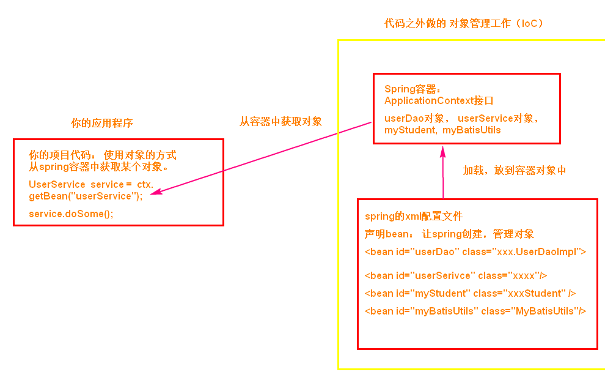

# spring

## spring是什么

spring核心: aop(面向切面), ioc(控制反转)

spring:叫做容器,装Java对象

spring作用: 实现解耦合， 解决java对象之间的耦合， 解决模块之间的耦合。


tomcat也是容器：管理的是servlet，  listener， filter等对象。

创建HelloServlet 类， 写web.xml

spring：创建SomeServiceImpl,  写spring的配置文件



## spring优缺点

Spring是一个框架,是一个半成品的软件.有20个模块组成它是一个容器管理对象容器是装东西的,Spring容器不装文本,数字. 装的是对象。Spring是存储对象的容器。
（1） 轻量
Spring框架使用的jar都比较小,一般在1M以下或者几百kb.Spring核心功能的所需的jar总共在3M左右。
Spring框架运行占用的资源少,运行效率高.不依赖其他jar

（2） 针对接口编程,解耦合
Spring提供了Ioc控制反转,由容器管理对象,对象的依赖关系.原来在程序代码中的对象创建方式,现在由容器完成.对象之间的依赖解耦合。

（3） AOP编程的支持
通过Spring提供的AOP功能,方便进行面向切面的编程,许多不容易用传统OOP实现的功能可以通过AOP轻松应付在Spring中,开发人员可以从繁杂的事务管理代码中解脱出来，通过声明式方式灵活地进行事务的管理，提高开发效率和质量。

（4） 方便集成各种优秀框架
Spring 不排斥各种优秀的开源框架，相反 Spring 可以降低各种框架的使用难度，Spring 提供了对各种优秀框架（如 Struts,Hibernate、MyBatis）等的直接支持。简化框架的使用。Spring 像插线板一样，其他框架是插头，可以容易的组合到一起。需要使用哪个框架，就把这个插头放入插线板。不需要可以轻易的移除。

# Ioc控制反转

## IoC 概念

Ioc(Inversion of Control): 控制反转,主要是一个思想.指导怎样使用对象,管理对象。把对象的创建，对象的属性赋值，对象的生命周期都交给容器进行管理。

1. IOC分为： 控制与反转

   控制： 可以理解为对对象的管理，（对象的创建，对象属性的赋值，对象生命周期的管理）

​	反转：把开发中管理对象的权限移交给容器进行管理。

​	正转：开发中需要主动的进行管理对象（使用new构造方法进行创建对象）。 开发人员掌握了对象的创建，属性赋值，对象从开始到销毁的全部过程。 开发人员有对对象全部控制。

2. Ioc的实现方式

   DI(Dependency Injection->依赖注入): 程序只需要提供要使用的对象的名称就可以了， 对象如何创建， 如何从容器中查找，获取都由容器内部自己实现。

​	依赖名词： 比如说ClassA类使用了ClassB的属性或者方法，叫做ClassA依赖ClassB.

```Java
public class ClassB{
    
    public void createOrder(){}
}

public class ClassA{
    //属性
    private ClassB  b = new ClassB();
    
    public void buy(){
        b.createOrder();
    }
}

执行ClassA的buy()
ClassA a  = new ClassA();
a.buy();
```

3. Spring框架使用的DI实现IoC

​	通过spring框架， 只需要提供要使用的对象名词就可以了。 从容器中获取名称对应的对象。

​	spring底层使用的 反射机制， 通过反射创建对象，给属性。

## Spring的配置文件

```xml
<?xml version="1.0" encoding="UTF-8"?>
<beans xmlns="http://www.springframework.org/schema/beans"
       xmlns:xsi="http://www.w3.org/2001/XMLSchema-instance"
       xsi:schemaLocation="http://www.springframework.org/schema/beans               http://www.springframework.org/schema/beans/spring-beans.xsd">

</beans>

spring标准的配置文件：
1）根标签是 beans
2) beans 后面的是约束文件说明
3）beans里面是bean声明。
4）什么是bean： bean就是java对象， spring容器管理的java对象，叫做bean
```

## spring容器创建对象的特点

1. 容器对象ApplicationContext：接口 

   通过ApplicationContext对象，获取要使用的 其他java对象， 执行getBean(“<bean>的id”)

2. spring默认是调用类的无参数构造方法，创建对象

3. spring读取配置文件， 一次创建好所有的java对象， 都放到map中。

## DI：给属性赋值。

spring调用类的无参数构造方法，创建对象。 对象创建后给属性赋值。

给属性赋值可以使用 1）xml配置文件中的标签和属性 ； 2）使用注解。

DI分类： 1 set注入，也叫做设值注入 ； 2 构造注入。

### 基于xml的DI

在xml配置文件中使用标签和属性，完成对象创建，属性赋值。

1） set注入，也叫做设值注入。

概念： spring调用类中的set方法，在set方法中可以完成属性赋值。 推荐使用。


```xml
简单类型的设值注入，使用value
<bean id="mySchool" class="com.bjpowernode.ba02.School">
    <property name="name" value="北京大学"/>
    <property name="address" value="北京的海淀区"/>
</bean>
```


```xml
<!--引用类型set注入-->
<bean id="myStudent" class="com.bjpowernode.ba02.Student">
    <property name="name" value="李四"/>
    <property name="age" value="22" />
    <!--引用类型的赋值-->
    <property name="school" ref="mySchool" /><!--setSchool(mySchool)-->
</bean>
```


2） 构造注入

构造注入：spring调用类中的有参数构造方法， 在创建对象的同时，给属性赋值

```xml
<!--构造注入，使用name属性-->
<bean id="myStudent" class="com.bjpowernode.ba03.Student">
    <constructor-arg name="myage" value="22" />
    <constructor-arg name="myname" value="李四"/>
    <constructor-arg name="mySchool" ref="mySchool"/>
</bean>

<!--构造注入，使用index，参数的位置，构造方法参数从左往右位置是0,1,2-->
<bean id="myStudent2" class="com.bjpowernode.ba03.Student">
    <constructor-arg index="1" value="28"/>
    <constructor-arg index="0" value="张三"/>
    <constructor-arg index="2" ref="mySchool" />
</bean>


<!--构造注入，省略index属性-->
<bean id="myStudent3" class="com.bjpowernode.ba03.Student">
    <constructor-arg  value="张峰"/>
    <constructor-arg  value="28"/>
    <constructor-arg  ref="mySchool" />
</bean>
```


3）引用类型的自动注入

概念： spring可以根据某些规则给引用类型完成赋值。 只对引用类型有效。 规则byName, byType.

①：byName（按名称注入）： java类中引用类型属性名称和spring容器中bean的id名称一样的，且数据类型也是一样的，这些bean能够赋值给引用类型。

```xml
<!-- byName 自动注入 -->
<bean id="myStudent" class="com.bjpowernode.ba04.Student" autowire="byName">
    <property name="name" value="李四"/>
    <property name="age" value="22" />
    <!-- ==引用类型的赋值==-->
    <!--<property name="school" ref="mySchool" />-->
</bean>
```


②：byType（按类型注入）：java类中引用类型的数据类型和spring容器中bean的class值是同源关系的，这样的bean赋值给引用类型。

```xml
注意： 在xml配置文件中， 符合条件的对象，只能有一个。 多余一个是报错的。
```

```xml
<!-- byType 自动注入 -->
<bean id="myStudent" class="com.bjpowernode.ba05.Student" autowire="byType">
    <property name="name" value="张三"/>
    <property name="age" value="26" />
    <!--引用类型的赋值-->
    <!--<property name="school" ref="mySchool" />-->
</bean>
```

###  项目中使用多个spring配置文件

分多个配置文件的方式： 1）按功能模块分，一个模块一个配置文件。  2） 按类的功能分，数据库操作相关的类在一个文件， service类在一个配置文件，  配置redis，事务等等的一个配置文件。


spring管理多个配置文件： 常用的是包含关系的配置文件。 项目中有一个总的文件， 里面是有impor标签包含其他的多个配置文件。

语法：

```xml
总的文件（xml）
<import resource="其他的文件的路径1"/>
<import resource="其他的文件的路径2"/>

关键字“classpath:”：表示类路径， 也就是类文件(class文件)所在的目录。 spring到类路径中加载文件
                   什么时候使用classpath： 在一个文件中要使用其他的文件， 需要使用classpath
```

### 基于注解的DI

基于注解的DI：使用spring提供的注解，完成java对象创建，属性赋值。

注解使用的核心步骤：

1.在源代码加入注解，例如@Component

2.在spring的配置文件，加入组件扫描器的标签

```xml
<context:component-scan base-package="注解所在的包名"/>
```


1.创建对象的注解

@Component  普通java对象

@Respository  dao对象，持久层对象， 表示对象能访问数据库。

@Service           service对象， 业务层对象， 处理业务逻辑，具有事务能力

@Controller      控制器对象， 接收请求，显示请求的处理结果。 视图层对象


2.简单类型属性赋值

@Value


3.引用类型赋值

@Autowired:   spring提供的注解 . 支持byName， byType

​      @Autowired: 默认就是byType

​      @Autowired @Qualifier : 使用byName


@Resource ： 来自jdk中的注解，给引用类型赋值的，默认是byName

​     @Resource: 先使用byName, 在byType

​     @Resource(name="bean的名称") ：只使用byName注入

### Ioc总结

IoC:管理对象的，把对象放在容器中，创建，赋值，管理依赖关系。

IoC:通过管理对象，实现解耦合。 IoC解决处理业务逻辑对象之间的耦合关系， 也就是service和dao之间的解耦合。


spring作为容器适合管理什么对象 ？ 

1）service对象 ，dao对象。

2）工具类对象。


不适合交给spring的对象 ？ 

1）实体类。

2）servlet ， listener ，filter等web中的对象。他们是tomcat创建和管理的。

