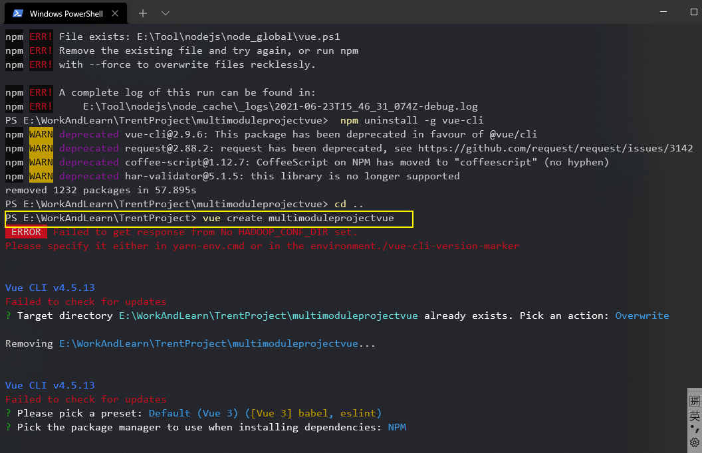

# 创建Vue

vue create xxx(name)



# 使用 UUID

## 安装

```vue
npm install uuid
```

## 用法

```vue
import { v4 as uuidv4 } from 'uuid';
uuidv4(); // ⇨ '9b1deb4d-3b7d-4bad-9bdd-2b0d7b3dcb6d'
```

## 使用 CommonJS 语法：

```vue
const { v4: uuidv4 } = require('uuid');
uuidv4(); // ⇨ '1b9d6bcd-bbfd-4b2d-9b5d-ab8dfbbd4bed'
```

## 表

| uuid.NIL         | nil UUID字符串（全零）             | 新进 [email protected] |
| :--------------- | :--------------------------------- | :--------------------- |
| uuid.parse()     | 将UUID字符串转换为字节数组         | 新进 [email protected] |
| uuid.stringify() | 将字节数组转换为UUID字符串         | 新进 [email protected] |
| uuid.v1()        | 创建版本1（时间戳）UUID            |                        |
| uuid.v3()        | 创建版本3（带MD5的命名空间）UUID   |                        |
| uuid.v4()        | 创建版本4（随机）UUID              |                        |
| uuid.v5()        | 创建版本5（带SHA-1的命名空间）UUID |                        |
| uuid.validate()  | 测试字符串以查看它是否为有效的UUID | 新进 [email protected] |
| uuid.version()   | 检测UUID的RFC版本                  | 新进 [email protected] |

