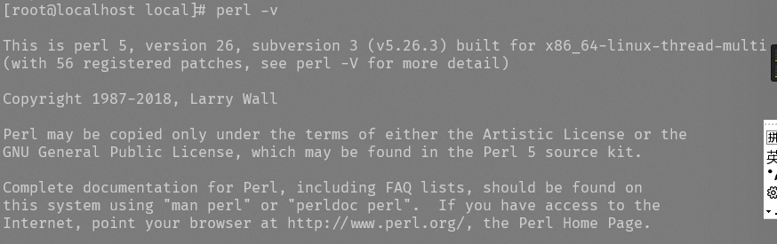

# Linux install

```
1.  yum install -y gcc
2.  wget http://www.cpan.org/src/5.0/perl-5.16.1.tar.gz
3.  tar -xzf perl-5.16.1.tar.gz
4.  cd perl-5.16.1
5.  ./Configure -des -Dprefix=/usr/local/per
6.  make && make test && make install
7.  perl -v
```

中奖使用perl时没有这个命令则执行

```
yum -y install perl perl-devel
```

