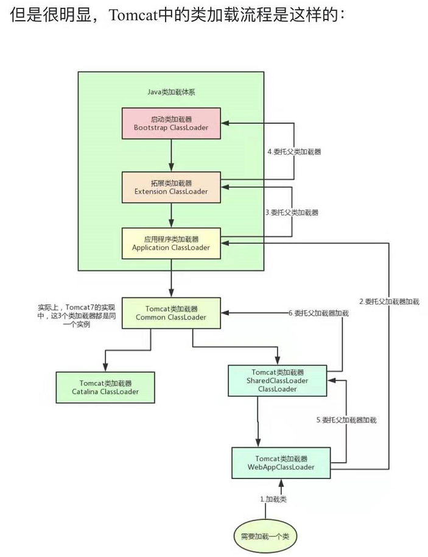
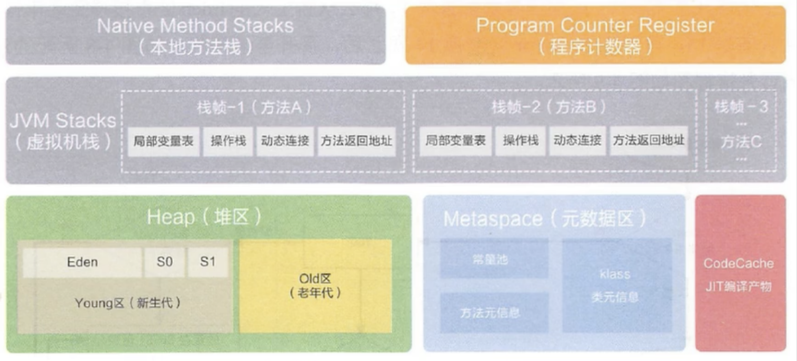
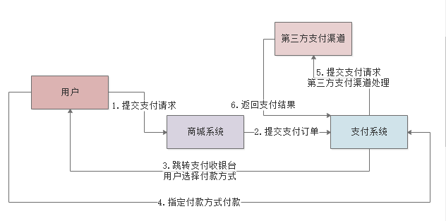
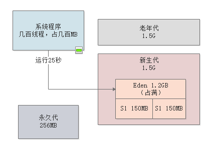
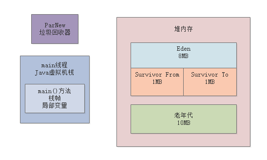
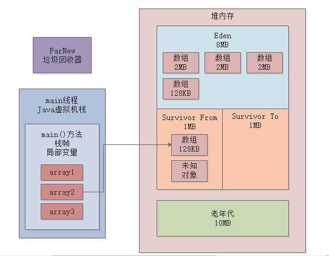
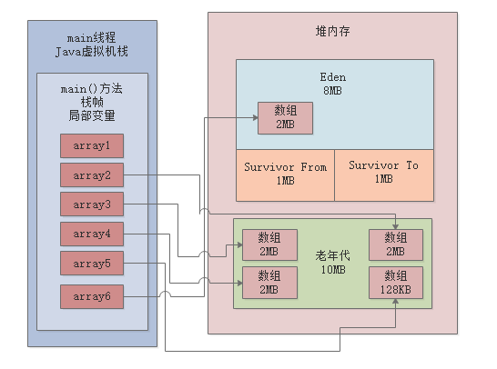

# 总结

## java程序如何运行的

编译：.java源文件编译成.class字节码文件

打包：.class字节码文件打包成一个jar包或者一个war包

运行：使用java -jar等命令运行程序，启动一个jvm进程

类加载：使用类加载器把.class字节码文件加载到jvm中

执行：jvm字节码执行引擎开始执行main方法

## 什么情况下触发类加载

代码中使用到这个类的时候。

jvm启动，首先会找到main方法的类，会加载到jvm内存，然后执行main方法。

main方法执行的过程中，使用到了哪些类，就加载这个类。

## 类加载过程

**加载阶段：**

1.  通过类的全限定名获取定义此类的二进制字节流

2.  将这个字节流所代表的静态存储结构转化为元数据区的运行时数据结构

3.  在内存中生成一个代表这个类的java.lang.Class对象，作为元数据区这个类的各种数据的访问入口。

加载子类前，要加载和初始化父类

只负责加载，运行由执行引擎执行

**链接阶段：**

验证：根据jvm规范，校验加载进来的.class文件是否符合规范，防止jvm文件被篡改了

准备：给类的非final修饰的static变量分配内存空间，进行默认初始化。

解析：将常量池内的符号引用替换成直接引用

直接引用就是直接指向目标的指针，比如System.out.println(“haha”)

**初始化阶段：**

执行clinit构造方法，javac编译器，会将static变量和static构造器代码按顺序合并。

如果这个类具有父类，jvm会先执行父类的clinit方法。

Jvm会保证clinit方法的加载，同步加锁，保证类只加载一次。

## 对象的创建过程

根据new的参数在常量池中定位一个类的符号引用

如果没有找到这个符号引用，说明类还没有被加在，则进行类的加在、解析、初始化

jvm虚拟机为对象在堆中分配内存

将分配的内存，初始化为0值，默认初始化

调用对象的构造方法

将局部变量表中的变量指向这个对象

## 对象在内存中的内存布局

### 对象头

**markwork部分**

锁状态标志：对象的加锁状态分为无锁、偏向锁、轻量级锁、重量级锁几种标记。

持有锁的线程： 持有当前对象锁定的线程ID。

对象HashCode

GC分代年龄： 对象每经过一次GC还存活下来了，GC年龄就加1。

类指针： 可通过对象找到类元信息，用于定位对象类型。

数组长度： 当对象是数组类型的时候会记录数组的长度。

### 实例数据

对象实例数据才是对象的自身真正的数据

主要包括自身的成员变量信息，同时还包括实现的接口、父类的成员变量信息。

### 对齐填充

内存大小是8字节的倍数

如果对象自身的信息大小没有达到申请的内存大小，那么这部分是对剩余部分进行填充。

## Object o=new Object()占了多少内存

如果jvm默认开启了UseCompressedClassPointers类型指针压缩

那么首先new Object（）占用16个字节

markword占8字节 + classpointer占4字节 + 实例数据占0字节 + 补齐4字节

然后Object
o有一个引用，这个引用默认开启了压缩，所以是4个字节（每个引用占用4个字节）

所以一共占用20个字节（byte）

如果jvm没开启CompressedClassPointers类型指针压缩

那么首先new Object（）占用8(markword) + 8(class pointer)+ 0(instance
data)+0(补齐为8的倍数)16个字节，然后加引用（因为jvm默认开启UseCompressedClassPointers类型指针压缩，所以默认引用是占4字节，但这里没启用压缩，所以为8字节）占的8个字节=24个字节

## 类加载器

启动类加载器

Bootstrap ClassLoader，c++编写，负责加载我们机器上安装的java
lib目录下的核心类（rt.jar、resources.jar），用于提供jvm自身需要的类

扩展类加载器

ExtClassLoader，java编写，继承自ClassLoader，加载lib\\ext目录下的类，允许开发者通过引用来操作加载器。

应用程序类加载器

AppClassLoader，java编写，继承自ClassLoader，加载classpath环境变量指定的路径中的类。该类是程序中默认的类加载器。通过ClassLoader.getSystemClassLoader()方法可以获取到该加载器。

自定义类加载器

根据个人需求定制类加载器，可以加载指定路径的class文件

为什么要自定义类加载器？隔离加载类、修改类的加载的方式、扩展加载源、防止源码泄漏

### 获取类的加载器

clazz.getClassLoader() 获取当前类的ClassLoader

Thread.currentThread().getContextClassLoader() 获取当前线程上下文的ClassLoader

ClassLoader.getSystemClassLoader() 获取AppClassLoader

ClassLoader.getSystemClassLoader().getParent() 获取ExtClassLoader

### 双亲委派机制

#### 为什么要用双亲委派机制

避免类的重复加载

保护核心api，防止被篡改

比如自己程序中写一个java.lang.String，类加载器应该加载谁呢？

通过双亲委派模式，就会委派到BootStrapClassLoader，先加载java内置的java.lang.String

#### 什么是双亲委派机制

如果一个类加载器收到了类加载请求，它不会自己先去加载，而是把这个请求委托给父类加载器去执行

如果父类加载器还存在其父类记载器，则递归向上委托，直到请求最终到达顶层的BootstrapClassLoader。

如果父类加载器可以完成类加载，就成功返回；如果父类记载器加载失败，则下推递归交给子类加载器去加载。

**特别：**Tomcat打破了双亲委派机制，每个webapp类加载器，只加载当前应用的类，不会上朔到父类加载器。

### Tomcat类加载器

Tomcat自定义了Common、Catalina、Shared等类加载器，其实就是用来加载Tomcat自己的一些核心基础类库的。

然后Tomcat为每个部署在里面的Web应用都有一个对应的WebApp类加载器，负责加载我们部署的这个Web应用的类

至于Jsp类加载器，则是给每个JSP都准备了一个Jsp类加载器。

而且大家一定要记得，Tomcat是打破了双亲委派机制的

每个WebApp负责加载自己对应的那个Web应用的class文件，也就是我们写好的某个系统打包好的war包中的所有class文件，不会传导给上层类加载器去加载。

## jvm内存区域

### 为什么需要划分内存区域

类加载后放到内存哪里？

方法运行局部变量放哪里？

代码里面创建的对象放到哪里？

所以必须要划分不同的区域，存取这些数据。

### 存放类的方法区

jdk1.8之前叫方法区，之后叫元数据区

jvm加载.class类文件，会加载到这里

### 程序计数器(PC寄存器)

Pc寄存器用来存储指向下一条指令的地址，也即将要执行的指令代码。由执行引擎读取下一条指令。

字节码执行引擎执行.class文件的时候，会记录字节码指令的执行位置，每个线程都有一个程序计数器，代表当前线程执行到的代码位置。

**为什么需要pc寄存器？**

因为cpu需要不停的切换各个线程，这时候，切换回来以后，就得知道接着从哪开始继续执行。

Jvm的字节码解释器就需要通过改变pc寄存器的值来明确下一条应该执行什么样的字节码指令。

线程切换上下文需要保存字节码指令的位置，恢复线程执行，又从哪个字节码指令的位置继续执行代码。

比如main线程执行main方法，main线程的程序计数器就是指向当前字节码指令执行到的位置信息。

### 虚拟机栈

每执行一个方法就形成一个栈帧，最后执行的方法执行完就释放栈帧。

每个栈帧里，有局部变量表、操作数栈、动态链接、方法出口

每个线程有自己的独立使用的虚拟机栈

#### 出现的背景

由于跨平台性的设计，Java的指令都是根据栈来设计的。不同平台CPU架构不同，所以不能设计为基于寄存器的。

优点是跨平台，指令集小，编译器容易实现，缺点是性能下降，实现同样的功能需要更多的指令。

#### 栈和堆

栈是运行时的单位，堆是存储的单元。

栈解决程序的运行问题，即程序如何执行，或者说如何处理数据。堆解决的是数据存储的问题，即数据怎么放、放在哪儿。

#### Java虚批机桟是什么?

Java虚似机栈(Java Virtual Machine Stack) ，早期也叫Java栈。

毎个线程在创建吋都会创建一个虚拟机栈，其内部保存一个个的栈帧(stack Frame)
，对应着一次次的Java方法凋用。

#### 生命周期

生命周期和线程一致。

#### 栈的特点(优点)

栈是一种快速有效的分配存储方式，访问速度仅次于程序计数器。

JVM直接对Java栈的操作只有两个:

每个方法执行，伴随着进栈(入栈、压栈)

执行结束后的出栈工作

对于栈来说不存在垃圾回收问题，栈存在OOM，不存在GC （因为只有进栈出栈的操作）

#### 栈中可能出现的异常

Java虚拟机规范允许Java栈的大小是动态的或者是固定不变的。

如果采用固定大小的Java虚拟机栈，那每一个线程的Java虛拟机栈容量可以在线程创建的时候独立选定。如果线程请求分配的栈容量超过Java虚拟机栈允许的最大容量，Java
虚拟机将会抛出一个StackOverflowError异常。

如果Java虚拟机栈可以动态扩展，并且在尝试扩展的时候无法申请到足够的存，或者在创建新的线程时没有足够的内存去创建对应的虚拟机栈,那Java虚拟机将会抛出一个OutofMemoryError异常。

#### 栈帧的内部结构

毎个栈帧中存储着:

局部变量表(Local variables)

操作数栈(operand stack) (或表达式栈)

动态链接(Dynamic Linking) ( 或指向运行吋常量池的方法引用)

方法返回地址(Return Address) (或方法正常退出或者异常退出的定义)

一些附加信息

#### 局部变量表(Local variables)

局部变量表也被称之为局部变量数组或本地变量表

定义为一个数字数组，主要用于存储方法参数和定义在方法体内的局部变量，这些数据类型包括各类基本数据类型、对象引用(reference)
，以returnAddress类型。

由于局部变量表是建立在线程的栈上，是线程的私有数据，因此不存在数据安全问题

局部变量表所需的容量大小是在编译期确定下来的，并保存在方法的Code属性的maximum
local variables数据项中。在方法运行期间是不会改变局部变量表的大小的。

#### 关于Slot的理解

参数值的存放总是在局部变量数组的index0开始，到数组长度-1的索引结束。局部变量表，最基本的存储单元是Slot
(变量槽)

局部变量表中存放编译期可知的各种基本数据类型(8种)，引用类型(reference)，returnAddress类型的变量。

在局部变量表里，32位以内的类型只占用一个slot
(包括returnAddress类型)，64位的类型(long和double)占用两个slot。

byte、short 、char在存储前被转换为int，boolean 也被转换为int，0表示false
，非0表示true。

long 和double 则占据两个Slot。

Jvm会为局部变量表中的每一个slot分配一个访问索引，通过这个索引即可成功访问到局部变量表中指定的局部变量值

当一个示例方法被调用的时候，它的方法参数和方法体内部定义的变量将会按照顺序被复制到局部变量表中的每一个slot上。

如果需要访问局部变量表中一个64bit的局部变量值时，只需要使用前一个索引即可。（long、double）

如果当前帧是由构造方法或者实例方法创建的，那么该对象引用this将会存放在index为0的slot处，其余的参数按照参数表顺序继续排列。

#### Slot的重复利用

栈帧中的局部变量表中的槽位是可以重用的，如果一个局部变量过了其作用域，那么在其作用域之后申明的新的局部变量就很有可能会复用过期的局部变量的槽位，从而达到节省资源的目的。

#### 变量的说明

**变量的分类：**基本数据类型、引用数据类型

**按照在类中声明的位置分：**

**成员变量**

类的静态成员变量：linking阶段的准备阶段默认初始化，初始化阶段显示初始化赋值

类的实例成员变量：随着对象的创建，会在空间中分配空间，默认初始化。

**局部变量**

在使用前，必须要进行显示赋值，否则编译不通过。

#### 局部变量表的补充说明

在栈帧中，与性能调优关系最为密切的部分就是前面提到的局部变量表。

在方法执行时，虚拟机使用局部变量表完成方法的传递。

局部变量表中的变量也是重要的垃圾回收根节点，只要被局部变量表中直接或间接引用的对象都不会被回收。

#### 操作数栈

操作数栈，在方法执行过程中，根据字节码指令，往栈中写入数据或提取数据，即入栈和出栈。它的底层数据结构是数组。比如执行复制、交换、求和等操作。

操作数栈，主要用于保存计算过程的中间结果，同时作为计算过程中变量临时的存储空间。

操作数栈并非采用访问索引的方式来进行数据访问的，而是只能通过标准的入栈(push)
和出栈(pop)操作来完成一次数据访问。

如果被调用的方法带有返回值的话，其返回值将会被压入当前栈帧的操作数栈中，并更新PC寄存器中下一条需要执行的字节码指令。

操作数栈中元素的数据类型必须与字节码指令的序列严格匹配，这由编译器在编译器期间进行验证，同时在类加载过程中的类检验阶段的数据流分析阶段要再次验证。

我们说Java虚拟机的解释引擎是基于栈的执行引擎，其中的栈指的就是操作数栈。

#### 动态链接

指向运行时常量池的方法引用

每一个栈帧内部都包含一个指向运行时常量池中该栈帧所属方法的引用。包含这个引用的目的就是为了支持当前方法的代码能够实现动态链接(Dynamic
Linking) 。比如: invokedynamic指令。

在Java源文件被编译到字节码文件中时，所有的变量和方法引用都作为符号引用(symbolic
Reference)
保存在class文件的常量池里。比如:描述一个方法调用了另外的其他方法时，就是通过常量池中指向方法的符号引用来表示的，那么动态链接的作用就是为了将这些符号引用转换为调用方法的直接引用。

大部分字节码指令在执行时都会进行常量池的访问

Constant pool常量池在运行时期存到方法区（运行时常量池）

通过引用去调用，几份一起调用对应地址都一样，不然浪费

比如多态，编写的父类，运行的子类

**为什么需要常量池呢?**

常量池的作用，就是为了提供一些符号和常量，便于指令的识别。

#### 方法的调用

在JVM中，将符号引用转换为调用方法的直接引用与方法的绑定机制相关（在编译期间确定还是运行期间确定）。

**静态链接:**

当一个字节码文件被装载进JVM内部时，如果被调用的目标方法在编译期可知，且运行期保持不变时。这种情况下将调用方法的符号引用转换为直接引用的过程称之为静态链接。

**动态链接:**

如果被调用的方法在编译期无法被确定下来，也就是说，只能够在程序运行期将调用方法的符号引用转换为直接引用，由于这种引用转换过程具备动态性，因此也就被称之为动态链接。

对应的方法的**绑定机制**为:早期绑定(Early Binding) 和晚期绑定(Late Binding)
。绑定是一个字段、方法或者类在符号引用被替换为直接引用的过程，这仅仅发生一次。

**早期绑定:**

早期绑定就是指被调用的目标方法如果在编译期可知，且运行期保持不变时，即可将这个方法与所属的类型进行绑定，这样一来，由于明确了被调用的目。标方法究竟是哪–个，因此也就可以使用静态链接的方式将符号引用转换为直接引用。

**晚期绑定:**

如果被调用的方法在编译期无法被确定下来，只能够在程序运行期根据实际的类型绑定相关的方法，这种绑定方式也就被称之为晚期绑定。

**早期晚期绑定**

随着高级语言的横空出世，类似于Java-样的基于面向对象的编程语言如今越来越多，尽管这类编程语言在语法风格.上存在一定的差别，但是它们彼此之间始终保持着一个共性，那就是都支持封装、继承和多态等面向对象特性

既然这一类的编程语言具备多态特性，那么自然也就具备早期绑定和晚期绑定两种绑定方式。

Java中任何一个普通的方法其实都具备虚函数的特征，它们相当于C++语言中的虛函数(C+
\+中则需要使用关键字virtual来显式定义)。如果在Java程序中不希望某个方法拥有虛函数的特征时，则可以使用关键字final来标记这个方法。

final就是不能被重写了，在编译期就确定了。

**非虚方法**

如果方法在编译期就确定了具体的调用版本，这个版本在运行时是不可变的。这样的方法称为非虚方法。

静态方法、私有方法、final方法、实例构造器
、父类方法都是非虚方法，其他方法称为虚方法。

子类对象的多态性的使用前提：1.类的继承关系。2.方法的重写

**虚拟机中提供了以下几条方法调用指令**

普通调用指令:（1、2非虚方法）

invokestatic: 调用静态方法，解析阶段确定唯一方法版本

invokespecial: 调用方法、私有及父类方法，解析阶段确定唯一方法版本

invokevirtual: 调用所有虚方法

invokeinterface: 调用接口方法

动态调用指令:

invokedynamic: 动态解析出需要调用的方法，然后执行（JDK7新增）

前四条指令固化在虚拟机内部，方法的调用执行不可人为干预，而invokedynamic指令则支持由用户确定方法版本。其中invokestatic指令和invokespecial指令调用的方法称为非虚方法，其余的(final修饰的除外)称为虚方法。

**关于invokedynamic指令**

JVM字节码指令集一直比较稳定，一直到Java7中才增加了一个invokedynamic指令，这是Java为了实现「动态类型语言」支持而做的一种改进。

但是在Java7中并没有提供直接生成invokedynamic指令的方法，需要借助ASM这种底层字节码工具来产生invokedynamic指令。直到Java8的Lambda表达式的出现，invokedynamic指
令的生成，在Java中才有 了直接的生成方式。

Java7中增加的动态语言类型支持的本质是对Java虚拟机规范的修改，而不是对Java语言规则的修改，这一块相对来讲比较复杂，增加了虚拟机中的方法调用，最直接的受益者就是运行在Java平台的动态语言的编译器。

**动态类型语言和静态类型语言**

动态类型语言和静态类型语言两者的区别就在于对类型的检查是在编译期还是在运行期，满足前者就是静态类型语言，反之是动态类型语言。

说的再直白一点就是，静态类型语言是判断变量自身的类型信息;动态类型语言是判断变量值的类型信息，变量没有类型信息，变量值才有类型信息，这是动态语言的一个重要特征。

**方法重写的本质**

Java语言中方法重写的本质:

1.找到操作数栈顶的第一个元素所执行的对象的实际类型，记作C。

2.如果在类型C中找到与常量中的描述符合简单名称都相符的方法，则进行访问权限校验，如果通过则返回这个方法的直接引用，查找过程结束;如果不通过，则返回java.lang.IllegalAccessError异常。

3.否则，按照继承关系从下往上依次对C的各个父类进行第2步的搜索和验证过程。

4.如果始终没有找到合适的方法，则抛出java.lang.AbstractMethodError异常。

IllegalAccessError介绍:

程序试图访问或修改一个属性或调用一个方法，这个属性或方法，你没有权限访问。一般的，这个会引起编译器异常。这个错误如果发生在运行时，就说明一个类发生了不兼容的改变。

**虚方法表**

在面向对象的编程中，会很频繁的使用到动态分派，如果在每次动态分派的过程中都要重新在类的方法元数据中搜索合适的目标的话就可能影响到执行效率。因此，为了提高性能，JVM采用在类的方法区建立一个虚方法表(virtual
method table) (非虛方法不会出现在表中)来实现。使用索引表来代替查找。

每个类中都有一一个虚方法表，表中存放着各个方法的实际入口。

那么虚方法表什么时候被创建?

虚方法表会在类加载的链接阶段被创建并开始初始化，类的变量初始值准备完成之后，JVM会把该类的方法表也初始化完毕。

#### 方法返回地址

主要针对于正常退出的情况

存放调用该方法的pc寄存器的值。

一个方法的结束，有两种方式:

正常执行完成

出现未处理的异常，非正常退出

无论通过哪种方式退出，在方法退出后都返回到该方法被调用的位置。方法正常退出时，调用者的pc计数器的值作为返回地址，即调用该方法的指令的下一条指令的地址。而通过异常退出的，返回地址是要通过异常表来确定，栈帧中一般不会保存这部分信息。交给执行引擎，去执行后续的操作

本质上，方法的退出就是当前栈帧出栈的过程。此时，需要恢复上层方法的局部变量表、操作数栈、将返回值压入调用者栈帧的操作数栈、设置PC寄存器值等，让调用者方法继续执行下去。

**正常完成出口和异常完成出口的区别在于**

通过异常完成出口退出的不会给他的上层调用者产生任何的返回值。

**当一个方法开始执行后，只有两种方式可以退出这个方法:**

1、执行引擎遇到任意-一个方法返回的字节码指令(return)，会有返回值传递给上层的方法调用者，简称正常完成出口;

一个方法在正常调用完成之后究竟需要使用哪一个返回指令还需要根据方法返回值的实际数据类型而定。

在字节码指令中，返回指令包含ireturn (当返回值是boolean、byte、
char、short和int类型时使用)、lreturn、 freturn、
dreturn以及areturn，另外还有一个return指令供声明为void的方法、实例初始化方法、类和接口的初始化方法使用。

2、在方法执行的过程中遇到了异常(Exception)
，并且这个异常没有在方法内进行处理，也就是只要在本方法的异常表中没有搜索到匹配的异常处理器，就会导致方法退出。简称异常完成出口。

方法执行过程中抛出异常时的异常处理，存储在一个异常处理表，方便在发生异常的时候找到处理异常的代码。

#### 一些附加信息

栈帧中还允许\|携带与Java虚拟机实现相关的一些附加信息。例如,对程序调试提供支持的信息。

#### 栈的相关面试题

**举例栈溢出的情况?（StackOverflowError）**

通过-Xss设置栈的大小，超过了，就栈溢出

**调整栈大小，就能保证不出现溢出吗?**

不能，理论上只能保证出现的时间更晚一点，栈的深度更深一点

**分配的栈内存越大越好吗?**

挤占栈空间，能运行的线程数变少

**垃圾回收是否会涉及到虚拟机栈?**

不会，虚拟机栈直接出栈

### 本地方法栈

native方法的执行，也需要存放栈帧信息。比如hashcode()、Thread.start0()

### 堆区

方法里面new一个对象，这个对象就会存放在堆，方法对应的栈帧，局部变量表有一个引用会指向这个对象。

#### 核心概念

一个JVM实例只存在一个堆内存，堆也是Java内存管理的核心区域。

Java
堆区在JVM启动的时候即被创建，其空间大小也就确定了。是JVM管理的最大一块内存空间。

堆内存的大小是可以调节的。

《Java虚拟机规范》规定，堆可以处于物理上不连续的内存空间中，但在逻辑上它应该被视为连续的。（涉及到物理内存和虚拟内存）

所有的线程共享Java堆，在这里还可以划分线程私有的缓冲区(ThreadLocal Allocation
Buffer， TLAB) 。

#### 设置堆空间大小

\-Xms600m -Xmx600m

Java堆区用于存储Java对象实例，那么堆的大小在JVM启动时就已经设定好了，大家可以通过选项"-XmX"和"-Xms"来进行设置。

“-Xms"用于表示堆区的起始内存，等价于-XX: InitialHeapSize

“-Xmx"则用于表示堆区的最大内存，等价于-XX : MaxHeapSize

一旦堆区中的内存大小超过“-Xmx"所指定的最大内存时，将会抛出OutOfMemoryError异常。

通常会将-Xms
和-Xmx两个参数配置相同的值，其目的是为了能够在java垃圾回收机制清理完堆区后不需要重新分隔计算堆区的大小，从而提高性能。

默认情况下，初始内存大小:物理电脑内存大小/64

最大内存大小:物理电脑内存大小/4

#### 如何查看参数

设置 -Xms600m -Xmx600m

**方式一：**

jps查看进程

jstat -gc 6700 查看进程的内存使用情况

S0C S1C S0U S1U EC EU OC OU MC MU CCSC CCSU YGC YGCT FGC FGCT GCT

25600.0 25600.0 0.0 0.0 153600.0 12288.1 409600.0 0.0 4480.0 770.3 384.0 75.9 0
0.000 0 0.000 0.000

**方式二：**

设置jvm参数：-Xms600m -Xmx600m -XX:+PrintGCDetails

\-Xms : 575M

\-Xmx : 575M

Heap

PSYoungGen total 179200K, used 12288K [0x00000000f3800000, 0x0000000100000000,
0x0000000100000000)

eden space 153600K, 8% used
[0x00000000f3800000,0x00000000f44001b8,0x00000000fce00000)

from space 25600K, 0% used
[0x00000000fe700000,0x00000000fe700000,0x0000000100000000)

to space 25600K, 0% used
[0x00000000fce00000,0x00000000fce00000,0x00000000fe700000)

ParOldGen total 409600K, used 0K [0x00000000da800000, 0x00000000f3800000,
0x00000000f3800000)

object space 409600K, 0% used
[0x00000000da800000,0x00000000da800000,0x00000000f3800000)

Metaspace used 3446K, capacity 4496K, committed 4864K, reserved 1056768K

class space used 381K, capacity 388K, committed 512K, reserved 1048576K

**示例：**

//返回Java虚拟机中的堆内存总量

long initialMemory = Runtime.getRuntime().totalMemory() / 1024 / 1024;

//返回Java虚拟机试图使用的最大堆内存量

long maxMemory = Runtime.getRuntime().maxMemory() / 1024 / 1024;

System.out.println("-Xms : " + initialMemory + "M");

System.out.println("-Xmx : " + maxMemory + "M");

**结果：**

\-Xms : 575M

\-Xmx : 575M

**比600M少,为什么？**

S0和S1只能使用一个，另外一个是空的

#### 使用jvisualvm工具查看

Jvisualvm官网：https://visualvm.github.io

Cmd输入jvisualvm并打开工具

安装插件，先设置插件地址
[https://visualvm.github.io/uc/8u131/updates.xml.gz](https://visualvm.github.io/uc/8u131/updates.html)

#### 堆内存细分

Jdk8：新生代（eden、s0、s1）new generation + 老年代（old generation）

\-Xms10m -Xmx10m -XX:+PrintGCDetails

Heap

PSYoungGen total 6144K, used 2251K [0x00000000ff980000, 0x0000000100000000,
0x0000000100000000)

eden space 5632K, 39% used
[0x00000000ff980000,0x00000000ffbb2d60,0x00000000fff00000)

from space 512K, 0% used
[0x00000000fff80000,0x00000000fff80000,0x0000000100000000)

to space 512K, 0% used
[0x00000000fff00000,0x00000000fff00000,0x00000000fff80000)

ParOldGen total 13824K, used 0K [0x00000000fec00000, 0x00000000ff980000,
0x00000000ff980000)

object space 13824K, 0% used
[0x00000000fec00000,0x00000000fec00000,0x00000000ff980000)

Metaspace used 3486K, capacity 4498K, committed 4864K, reserved 1056768K

class space used 387K, capacity 390K, committed 512K, reserved 1048576K

#### Java堆内存的对象占用多少内存空间呢？

一个是对象自己本身的一些信息

一个是对象的实例变量作为数据占用的空间

比如对象头，在64位的linux操作系统上，会占用16个字节。

内部有个int类型的实例变量，会占用4个字节；long占用8个字节；

### 堆外内存

nio里面可以使用DirectBuffer来引用和操作堆外内存

## Jvm垃圾回收机制

### 方法执行完会怎样？

方法执行完，方法对应的栈帧会出栈，栈帧里面的数据都会释放，局部变量表里面的引用指向的对象，将会断开引用。

### 为什么要垃圾回收

Java堆内存里面创建的对象是占用内存的，而且内存资源

### 不需要的对象怎么处理？

不需要的对象即将被垃圾回收掉。

jvm的垃圾回收机制，jvm启动的时候，会启动一个后台运行的线程，专门进行垃圾回收。

如果某个实例对象没有任何一个方法的局部变量指向它，也没有一个类的静态变量，常量等指向它。那么它就会被清除掉。

### 元数据区会不会进行垃圾回收

同时满足以下3个条件，class对象可以被回收

1.  类的所有实例对象都已经从java堆内存回收了

2.  加载这个类的ClassLoader已经被回收了

3.  该类的Class对象没有任何引用

## jvm分代模型

### 年轻代和老年代

JVM将Java堆内存划分为了两个区域，一个是年轻代，一个是老年代。

年轻代，用完就不要了

老年代，创建之后需要长期存在和使用

### 为什么需要区分年轻代和老年代

年轻代的对象 很快就要被回收，老年代的对象，长期存在。

所以 他们的垃圾回收算法就不一样，对象需要区分开存放。

### 永久代

元数据区，存放类信息

### 对象的内存分配和流转

对象优先分配在新生代

新生代如果对象满了，会触发Minor GC回收掉没有人引用的垃圾对象

如果有对象躲过了十多次垃圾回收，就会放入老年代里

如果老年代也满了，那么也会触发垃圾回收，把老年代里没人引用的垃圾对象清理掉

## JVM核心参数

### 核心参数

\-Xss：每个线程的栈内存大小

\-Xms：Java堆内存的大小 small

\-Xmx：Java堆内存的最大大小 max

\-Xmn：Java堆内存中的新生代大小，扣除新生代剩下的就是老年代的内存大小了 new

\-XX:MetaspaceSize：元数据区大小

\-XX:MaxMetaspaceSize：元数据区最大大小

\-XX:SurvivorRatio=5 eden和s1 s2的比例 代表5:1:1 换算的时候eden=xxx \*
5/7，s1=xxx \*1/7

### IDE 通过VM arguments设置jvm参数

\-Xss1M -Xms512M -Xmx512M -Xmn256M -XX:MetaspaceSize=128M
\-XX:MaxMetaspaceSize=128M

### java -jar启动设置jvm参数

java -Xss1M -Xms512M -Xmx512M -Xmn256M -XX:MetaspaceSize=128M
\-XX:MaxMetaspaceSize=128M -jar a.jar

### Tomcat怎么配置jvm参数

Tomcat就是在bin目录下的catalina.sh中可以加入JVM参数

## 案例实战 - 百万交易支付系统jvm参数设置

### 支付系统的背景

### 考虑的核心问题

我们的支付系统需要部署多少台机器？

每台机器需要多大的内存空间？

每台机器上启动的JVM需要分配多大的堆内存空间？

给JVM多大的内存空间才能保证可以支撑这么多的支付订单在内存里的创建，而不会导致内存不够直接崩溃？

### 每秒钟处理多少笔订单

每天100个订单，分配到几个小时，大约每秒100笔订单。

部署了3台机器，每台机器每秒处理30笔订单。

### 每个支付订单处理耗时

假设1s，也就是一台机器1s有30个支付订单的对象

### 每个支付订单需要的内存空间

一个int 4byte，long 8byte，20个字段，几百个字节，算大一点，500kb

### 每秒发起的支付请求对内存的占用

30个支付订单 \* 500 字节=15000字节，大约15kb

### 支付系统运行起来

支付订单不断的创建，累计几十万个了，占据了几百兆的空间，新生代要满了。

此时就会触发minor gc，回收新生代的垃圾，腾出空间。

### 对完整支付系统内存占用 预估

支付系统还有别的请求要处理，可以把之前的每秒15kb扩大10-20倍，也就每秒几百kb-1MB之间。

### jvm堆内存如何设置

线上业务系统，常见的配置是2核4g或者4核8g。

如果2核4g内存，每秒1mb，不一会就几百mb，新生代就满了，触发minor gc，频繁minor
gc，影响系统的稳定性，因此我们选择4核8g。

jvm进程至少分配4g以上内存，新生代在里面可以分配2g内存。

这样1s 1mb，差不多35分钟，需要一次minor gc，降低了gc的频率。

因此机器采用4核8g，jvm 堆给3g，新生代2g，老年代1g

如果横向扩展5台，10台机器，每台机器处理的请求更少，对jvm的压力更小。

### 元数据区的设置

刚上线，没有太多参考规范，一般几百mb就够用了。

## 大厂面试题

### 什么情况下一个对象会被回收

新生代内存满了会触发YoungGC，老年代内存满了会触发FullGC，这个时候会回收对象

GCRoots不可达的对象会被回收

FullGC的时候软引用对象会被回收

只要GC，弱引用就会被回收

### 被哪些变量引用的对象是不能回收的

被GCRoots引用的对象不会回收，GC Roots 指的是局部变量，或者类的静态变量

### 什么是复制算法

复制算法适合新生代，大量对象需要被回收

两块内存，对象从一块内存移动到另外一块内存

优点是，避免了内存碎片

缺点是，造成了内存的浪费

### 复制算法的改良

因为最终存活的对象可能会比较小，只占1%这样，因此两块来回复制的区域内存降低，弄一个更大的区域eden区。

eden区位占90%空间，两个survivor区各占10%，总使用率90%，只留10%用来存放最终的存活对象。

每次回收，eden区和其中一个survivor区的所有存活对象，复制到另外一个survivor区。

回收完了，90%的空间就腾出来了，可以继续使用。

### 新生代什么时候触发minor gc

新生代的eden区空间不足

### 新生代的对象什么时候进老年代

#### 躲过15次minor gc后，进入老年代

通过JVM参数“-XX:MaxTenuringThreshold”来设置，默认是15岁，最大值也是15，对象头4bit

#### 动态对象年龄判断

年龄1 - 年龄n的总大小超过了survivor区的50%，那么n以上年龄的对象都要进老年代

#### 大对象直接进老年代

通过jvm参数"-XX:PretenureSizeThreshold"来设置，默认值=0，以为着对象，必须先进新生代

#### minor gc后存活对象survivor区放不下

#### 老年代空间分配担保

新生代平均存活 小于老年代连续剩余 就MinorGC，否则FullGC

### FullGC后还不够放新进来的对象怎么办

触发OOM 内存溢出

### 老年代什么时候触发FullGC

minor gc前

开启空间担保的情况下，老年代连续剩余 小于 新生代平均存活 就触发fullgc

未开启空间担保的情况下，老年代连续剩余 小于 新生代对象总量 就触发fullgc

minor gc后

老年代连续剩余 小于 新生代存活 就触发fullgc

cms模式下old区使用率超过配置的比例，默认92%，触发fullgc

### 老年代用什么垃圾回收算法

标记-整理，先把存活的对象标记一下，然后移动到内存的一边，最后清理垃圾，比minor
gc慢10倍以上

### jvm优化的目标

尽可能让对象都在新生代里分配和回收，尽量别让太多对象频繁进入老年代

避免频繁对老年代进行垃圾回收

同时给系统充足的内存大小，避免新生代频繁的进行垃圾回收。

### 为什么老年代不适合复制算法

老年代都是长期存活的对象，每次移动90%的存活对象，不合适

### 为什么老年代垃圾回收慢

新生代存活的少，直接扔到s区，老年代存活对象多，要标记清除

## 新生代ParNew垃圾回收器

多个垃圾回收线程同时运行，运行期间stop the world，采用复制算法

jvm参数设置：

启用： “-XX:+UseParNewGC”

设置线程：“-XX:ParallelGCThreads”，一般情况下不设置，默认和系统核数保持一致

## 老年代CMS垃圾回收器

多个垃圾回收线程同时运行，运行期间stop the world，采用标记-清理算法

通过GCRoots来判断对象是否存活，未存活标记为垃圾，最后统一回收

### 默认线程数量

等于（CPU核数 + 3）/ 4

如果2核，就是1个线程

### 初始标记

进入stw状态，根据GCRoots标记是否是垃圾，速度很快

### 并发标记

停止stw状态，系统可能创建对象或者对象成为垃圾，尽可能的去追踪

### 重新标记

进入stw状态，对并发标记阶段 系统动过的对象重新标记，速度很快

### 并发清理

停止stw状态，多线程并发清理垃圾对象

### 优点

1和3阶段，都是简单标记，速度很快

2和4阶段，系统都是可以执行的，耗时对系统影响不大

### 缺点

#### 消耗cpu资源

2和4阶段，虽然系统可以执行，但是cpu被垃圾回收线程占用了一部分，比较耗费cpu资源。

2阶段并发标记，要追踪大量对象，耗时较高。

4阶段并发清理，要清理大量垃圾，耗时较高。

#### 并发垃圾回收失败

cms是老年代使用率达到多少才开启垃圾回收的，那么必然只预留一部分内存给并发回收的时候使用。

\-XX:CMSInitiatingOccupancyFraction
老年代达到多少，开启cms垃圾回收，jdk1.6默认92%，只有8%给系统使用

并发清理阶段，预留了一定的空间给系统使用，放入新进老年代的对象，万一这块空间不够用了怎么办。

降级为Serial Old替代cms，stw，重新追踪所有对象，再标记，再清理，再放开stw。

#### 内存碎片

清理之后有大量的内存碎片，为了解决内存碎片问题，就需要进行内存整理，就需要stw。

\-XX:+UseCMSCompactAtFullCollection 默认打开，把对象挪到一起

\-XX:CMSFullGCsBeforeCompaction 默认为0 每次FullGC后，内存整理

## 案例实战-电商系统

### 背景

平时：500w日活、50w订单，集中在4小时，平均每秒钟几十个订单。

大促：每秒1000个订单

3台机器、4核8g、每台机器300个下单请求

### 内存使用模型估算

1个订单按照1kb计算，300个订单300kb

订单附带其他信息（订单条目对象、库存、促销、优惠券）扩大10-20倍

其他订单查询之类 扩大10倍量

每秒内存开销 300kb \* 20 \* 10 = 60000kb = 60mb

### 内存分配

4核8g，给4g给jvm

堆3g、新生代1.5g、老年代1.5g

每个线程的栈1mb，几百个线程 对应的虚拟机栈 几百mb

元数据区 几百mb

### jvm参数配置

\-Xms3072M -Xmx3072M -Xmn1536M -Xss1M -XX:PermSize=256M -XX:MaxPermSize=256M
\-XX:SurvivorRatio=8

### 程序执行

每秒60mb，25s新生代的1.5g就满了，此时执行minor
gc，还剩100mb，也就是1s左右正在执行的对象。

此时100mb放入s1

接下来再运行20s，很可能存活对象150mb了，同时100mb也超过50%了，这块对象很可能就要放入老年代。

### 新生代垃圾回收优化之一：Survivor空间够不够

两个问题导致Survivor区域是明显不足的

100mb超过50%，需要进老年代

150mb超过s区，需要进老年代

接下来需要做的是：调整新生代和老年代的大小

因为这种普通业务系统，明显大部分对象都是短生存周期的，根本不应该频繁进入老年代，也没必要给老年代维持过大的内存空间，首先得先让对象尽量留在新生代里。

所以此时可以考虑把新生代调整为2G，老年代为1G，那么此时Eden为1.6G，每个Survivor为200MB

这个时候，Survivor区域变大，就大大降低了新生代GC过后存活对象在Survivor里放不下的问题，或者是同龄对象超过Survivor
50%的问题。

这样就大大降低了新生代对象进入老年代的概率。

此时JVM的参数如下：

“-Xms3072M -Xmx3072M -Xmn2048M -Xss1M -XX:PermSize=256M -XX:MaxPermSize=256M
\-XX:SurvivorRatio=8”

其实对任何系统，首先类似上文的内存使用模型预估以及合理的分配内存，尽量让每次Minor
GC后的对象都留在Survivor里，不要进入老年代，这是你首先要进行优化的一个地方。

### 新生代对象躲过多少次垃圾回收后进入老年代？

\-XX:MaxTenuringThreshold必须结合系统模型来说，一般情况，需要进老年代的都是需要长期存在的对象

比如@Service这些对象，一个系统累计起来几十mb，给它降低到5次，待到5次后，就尽快让它走人，去老年代。

此时JVM参数如下：

“-Xms3072M -Xmx3072M -Xmn2048M -Xss1M -XX:PermSize=256M -XX:MaxPermSize=256M
\-XX:SurvivorRatio=8 -XX:MaxTenuringThreshold=5”

### 多大的对象直接进入老年代？

大对象可以直接进入老年代 ，因为大对象说明是要长期存活和使用的

比如在JVM里可能会缓存一些数据，这个一般可以结合自己系统中到底有没有创建大对象来决定。

但是一般来说，给他设置个1MB足以，因为一般很少有超过1MB的大对象。如果有，可能是你提前分配了一个大数组、大List之类的东西用来放缓存的数据。

此时JVM参数如下：

“-Xms3072M -Xmx3072M -Xmn2048M -Xss1M -XX:PermSize=256M -XX:MaxPermSize=256M
\-XX:SurvivorRatio=8 -XX:MaxTenuringThreshold=5 -XX:PretenureSizeThreshold=1M”

### 指定垃圾回收器

别忘了要指定垃圾回收器，新生代使用ParNew，老年代使用CMS，如下JVM参数 ：

“-Xms3072M -Xmx3072M -Xmn2048M -Xss1M -XX:PermSize=256M -XX:MaxPermSize=256M
\-XX:SurvivorRatio=8 -XX:MaxTenuringThreshold=5 -XX:PretenureSizeThreshold=1M
\-XX:+UseParNewGC -XX:+UseConcMarkSweepGC”

### 系统运行模型的估算步骤

每秒占用多少内存？

多长时间触发一次Minor GC？

一般Minor GC后有多少存活对象？

Survivor能放的下吗？

会不会频繁因为Survivor放不下导致对象进入老年代？

会不会因动态年龄判断规则进入老年代？

### 老年代的优化

每次fullgc都内存整理，其他都采用默认的，并发清理失败Concurrent Mode
Failure是小概率事件，不用管

“-Xms3072M -Xmx3072M -Xmn2048M -Xss1M -XX:PermSize=256M -XX:MaxPermSize=256M
\-XX:SurvivorRatio=8 -XX:MaxTenuringThreshold=5 -XX:PretenureSizeThreshold=1M
\-XX:+UseParNewGC -XX:+UseConcMarkSweepGC -XX:CMSInitiatingOccupancyFaction=92
\-XX:+UseCMSCompactAtFullCollection -XX:CMSFullGCsBeforeCompaction=0”

## G1垃圾回收器

### parnew+cms的痛点

无论是新生代还是老年代的回收都要stw，系统暂停

### G1设计思路

不分代，一个垃圾回收器既可以回收新生代又可以回收老年代

堆内存拆分为多个大小相同的region，n个新生代，m个老年代

可以设置一个垃圾回收的预期停顿时间（比如希望它1小时stw时间不要超过1分钟）

### 如何做到垃圾回收时间可控

对每一个region进行追踪 回收价值，有多少垃圾，回收这些垃圾需要多少时间

再回收的时候，能够按照预期目标走，在可控范围内，回收更多的垃圾。

### region既可以分配新生代又可以分配老年代

free 的region分配给新生代和老年代使用都可以，按需分配

### 如何设定G1的内存大小

面临的问题，划分多少region、大小设置为多少？

\-XX:+UseG1GC
确定使用G1，只要给G1设置好堆内存（“-Xms”、“-Xmx”），其他由G1自己自主控制。

默认region数量2048个

region的大小=堆内存/2048

参数：

\-XX:G1HeapRegionSize 指定region大小

\-XX:G1NewSizePercent 新生代初始占比，默认5%

\-XX:G1MaxNewSizePercent 新生代最大占比，默认60%

### Eden和Survivor还存在吗？

新生代的region里面依然存在eden、survivor区

不同的region可以放eden、s1、s2，进一步拆分

比如1000个region属于eden、100个s1,100个s2，此时

### 控制GC停顿时长

\-XX:MaxGCPauseMills，默认值是200ms

### 对象什么时间进老年代呢？

达到15岁 -XX:MaxTenuringThreshold

动态年龄判断，年龄n之前的超过50%容量了，n之后的进老年代

### 大对象怎么办？

如果对象大小超过region的一半，就要进大对象region。

空的region不属于新生代，也不属于老年代，大对象就可以使用。

对象太大的话，可以横跨多个region

新生代、老年代回收的时候，会顺带着回收大对象

### 什么时候触发新生代和老年代混合垃圾回收

\-XX:InitiatingHeapOccupancyPercent，默认值是45%

老年代占据了总region的45%，就触发混合垃圾回收

### G1垃圾回收过程

初始标记：根据GCRoots是否可达，标记对象是否是垃圾，stw，速度很快

并发标记：放开stw，系统可以执行，追踪全部对象，比较耗时。

最终标记：stw，对并发标记阶段追踪的对象 确定是否是垃圾，进行标记。

混合回收：stw，在控制范围内回收部分region

混合回收阶段可以分批回收，分批的次数通过-XX:G1MixedGCCountTarget控制，默认8次

### 为什么要多次分批回收？

一次回收，时间较长

不让系统stw时间过长，多次回收完成目标。

### 复制算法回收

混合回收的时候是基于复制算法来回收的，不论是新生代还是老年代，将最后存活的对象复制到新的一个region上，老的region再清空掉。复制算法的好处是不会出现内存碎片。

### 哪些region不能回收？

存活对象必须超过85%的region不可以回收，不然来回复制成本很高。

“-XX:G1MixedGCLiveThresholdPercent” 默认85%

### 什么时候停止回收

空闲region数量达到默认5%，就停止混合回收。

\-XX:G1HeapWastePercent，默认值是5%

### 回收失败时的Full GC

回收垃圾，复制存活对象的过程中发现没有空闲Region可以承载自己的存活对象了，就会触发
一次失败。

一旦失败，立马就会切换为停止系统程序，然后采用单线程进行标记、清理和压缩整理，空闲出来一批Region，这个过程是极慢极慢的。

## 案例实战-百万用户教育系统

### 背景

日活百万，晚上2-3个小时，学生要上课学习，周末学习。

高频的游戏互动

### 系统的运行压力

每小时20w用户，每分钟1次，1小时60次

总共1小时20w用户1200w次操作，每秒3000次操作，也就是每秒3000个请求

那么分配5台4核8g的机器，每台抗600个请求，总共3000个请求。

一次请求创建几个对象，几kb内存，认为5kb，600个请求，3mb左右。

### G1内存布局

分配4G给堆内存，其中新生代默认初始占比为5%，最大占比为60%

每个Java线程的栈内存为1MB

元数据区域（永久代）的内存为256M

此时JVM参数如下：

“-Xms4096M -Xmx4096M -Xss1M -XX:PermSize=256M -XX:MaxPermSize=256M -XX:+UseG1GC“

“-XX:G1NewSizePercent”参数是用来设置新生代初始占比的，不用设置，维持默认值为5%即可。

“-XX:G1MaxNewSizePercent”参数是用来设置新生代最大占比的，也不用设置，维持默认值为60%即可。

4个G的堆，2048个region，每个region 大小2mb

### GC停顿时间如何设置？

\-XX:MaxGCPauseMills，默认值是200毫秒，也就是stw时间200ms

### 到底多长时间会触发新生代GC

在eden区分配对象，每秒 3MB

G1到底会分配多少个Region给新生代，多久触发一次新生代gc，每次耗费多长时间，这些都是不确定的，必须通过一些工具去查看系统实际情况才知道，这个提前是无法预知的。

会根据你预设的gc停顿时间，给新生代分配一些Region，然后到一定程度就触发gc，并且把gc时间控制在预设范围内，尽量避免一次性回收过多的Region导致gc停顿时间超出预期。

### 新生代gc如何优化？

垃圾回收器越来越智能，我们能做的就比较少

\-XX:MaxGCPauseMills
停顿时间参数设置小了，gc就比较频繁，设置大了，gc频率就低了，时间就长了

这个参数到底如何设置，需要结合后续给大家讲解的系统压测工具、gc日志、内存分析工具结合起来进行考虑，尽量让系统的gc频率别太高，同时每次gc停顿时间也别太长，达到一个理想的合理值。

### mixed gc如何优化？

老年代在堆内存里占比超过45%就会触发。

年轻代进老年代的条件就是s区放不下，或者对象年龄大了，或者动态年龄判定。

mixed gc核心优化思路还是和之前一样，避免对象尽快进老年代

优化核心点还是-XX:MaxGCPauseMills 停顿时间

调节这个时间，避免频繁新生代gc，计算新生代gc后存活对象有多少，避免尽快进老年代频繁触发mixed
gc。

如何优化这个参数，一切都要结合后续大量工具的讲解和实操演练了

## 大厂面试题2

### Minor GC / Young GC

一个意思，都是新生代的gc

### Old GC

老年代的gc

### Full GC

针对新生代、老年代、元数据区的全体内存空间的垃圾回收

### Major GC

Major GC，这个其实一般用的比较少，他也是一个非常容易混淆的概念

有人人为是old gc 有人认为是Full gc，那么还是跟他确认一下到底是哪个

### Mixed GC

g1 特有，老年代达到45%，触发

对新生代，老年代都会回收

### Young GC和Full GC分别在什么情况下会发生

#### Young GC的触发时机

eden区满了，触发ygc

#### Old GC和Full GC的触发时机

ygc前，老年代空间担保失败，没有连续内存放下历次存活平均值，触发old gc

ygc后，没有连续内存放下存活总理，触发old gc

cms模式下，老年代内存使用率超过92%，触发old gc

总结一句话，就是老年代空间不够了，需要触发old gc

#### 为什么经常看到Old GC都带着一个Young GC

一般ygc之前可能会触发一次old gc，ygc之后可能会触发一次old gc。

因此 说old gc 都关联着一个ygc

#### jvm实现的Full GC

很多不同jvm版本的实现里面，一般达到old gc 的条件，会触发成full
gc，除了老年代，新生代，元数据区一并回收了

#### 元数据区满了会怎么样？

元数据区存放的都是常量和类信息，一般都不需要回收，真满了不够放，就报错，oom，内存溢出。

## 案例实战-10w并发bi系统

### 业务背景

把商户的经营数据收集起来，分析，做成报表给他们看，指导商户的经营

采集数据，通过spark、flink、hadoop来分析，通过mysql、es、hbase来存储

bi系统 java做的，来读存储数据，展示报表

4核8g机器，刚上线部署，eden 区1g、s1 s2各100mb

### 技术痛点

商户每隔几秒要调bi系统，获取实时数据，刷新报表

几万个商户，实时在线的几千个商户，预估每秒500个请求。

每个请求要加载大量数据，内存里面计算好，返回给前端。

预估每个请求100kb的内存使用量，500个请求就是50mb的数据量

### 前期频繁ygc

每秒50mb，200s的时间，eden区就满了，频繁ygc

ygc大概几十ms，存活对象大概几十mb甚至几mb

看到的场景是200s一次ygc，停顿几十ms，对用户影响很小。

### 业务增长到10w并发

bi系统比较吃内存，采用16核32g的机器，每台机器可以抗几千并发，弄个二三十台机器就可以了。

32g内存，新生代至少分配20g内存，eden区16g，s1、s2 各1g

此时几千个请求的话，每秒几百兆数据，几十秒eden区就满了，触发ygc

但是ygc要回收大量的内存，系统停顿可能就几百ms、1s，系统停顿时间变长。

系统stw时间长，前端很容易就超时了。

### 使用G1来优化大内存

g1设置好停顿时间，比如100ms，它自己会控制好时间，自动控制ygc去回收region，这样就减少了对系统的影响，虽然ygc频率高了，但是对系统的影响小了

## 案例实战-百亿数据量的实时分析引擎频繁fullgc

### 业务背景

每次会提取大概1万条左右的数据到内存里来计算，平均每次计算大概需要耗费10秒左右的时间，然后每台机器是4核8G的配置，JVM内存给了4G，其中新生代和老年代分别是1.5G的内存空间，大家看下图。

每条数据1kb，1w跳数据10mb

新生代是按照8:1:1的比例来分配Eden和两块Survivor的区域，那么大体上来说，Eden区就是1.2GB，每块Survivor区域在100MB左右，如下图。

每次执行一个计算任务，就会在Eden区里分配10MB左右的对象，那么一分钟大概对应100次计算任务，其实基本上一分钟过后，Eden区里就全是对象，基本就全满了

### 触发Minor GC的时候会有多少对象进入老年代

ygc的时候80个任务执行完毕，20个正在执行，还有200mb无法回收，s区放不下，直接进老年代。

### 系统运行多久，老年代大概就会填满？

1分钟200mb进老年代，老年代总共1.5g，7分钟老年代就快要满了，下一次ygc，前担保，100mb不够放200mb，触犯full
gc

这个系统的频率就是7,8分钟触发一次full gc

### 该案例的优化

首先要保证s区能放下存活对象

3gb堆内存，1g给eden ，s区分别给200mb，每次ygc，刚好能放下存活对象。

这样full gc的频率就从几分钟降低到几小时

### 负载再次扩大到10倍

每秒100mb使用量，1.6g新生代，10s多就ygc，一批数据需要处理10s，可能1g对象都无法回收

这样每隔10多s就有1g数据进老年代，一分钟可能要触发好几次full gc

### 使用大内存机器来优化

4核8g升级为16核32g

10倍升级，eden区给16g，s区各2g，每秒100mb，2分钟左右一次ygc

每次ygc剩余对象小于1g，也降低了fullgc的频率

因为不是面对用户使用的系统，因此也不需要使用g1，每次停顿1s，对系统也没啥影响。

## 动手实战-模拟ygc

### 参数配置

jdk1.8

\-XX:NewSize=5M -XX:MaxNewSize=5M -XX:InitialHeapSize=10M -XX:MaxHeapSize=10M
\-XX:SurvivorRatio=8 -XX:PretenureSizeThreshold=1M -XX:+UseParNewGC
\-XX:+UseConcMarkSweepGC

上面“-XX:InitialHeapSize”和“-XX:MaxHeapSize”就是初始堆大小和最大堆大小，“-XX:NewSize”和“-XX:MaxNewSize”是初始新生代大小和最大新生代大小，“-XX:PretenureSizeThreshold=10485760”指定了大对象阈值是10MB。

给堆内存分配10MB内存空间，其中新生代是5MB内存空间，其中Eden区占4MB，每个Survivor区占0.5MB，大对象必须超过10MB才会直接进入老年代，年轻代使用ParNew垃圾回收器，老年代使用CMS垃圾回收器

打印jvm的gc日志

\-XX:+PrintGCDetils：打印详细的gc日志

\-XX:+PrintGCTimeStamps：这个参数可以打印出来每次GC发生的时间

\-Xloggc:gc.log：这个参数可以设置将gc日志写入一个磁盘文件

jvm参数变更

\-XX:NewSize=5242880 -XX:MaxNewSize=5242880 -XX:InitialHeapSize=10485760
\-XX:MaxHeapSize=10485760 -XX:SurvivorRatio=8 -XX:PretenureSizeThreshold=10485760
\-XX:+UseParNewGC -XX:+UseConcMarkSweepGC -XX:+PrintGCDetails
\-XX:+PrintGCTimeStamps -Xloggc:gc.log

### 代码实战

public class YGCDemo {

public static void main(String[] args) {

byte[] arr = new byte[1024 \* 1024];

arr = new byte[1024 \* 1024];

arr = new byte[1024 \* 1024];

arr = null;

byte[] arr2 = new byte[2\*1024 \* 1024];

}

}

### 对象分配分析

eden区4mb、s1 0.5mb、s2 0.5mb、老年代5mb

byte[] arr = new byte[1024 \* 1024]; 分配了1mb到eden

arr = new byte[1024 \* 1024]; 分配了1mb到eden

arr = new byte[1024 \* 1024]; 分配了1mb到eden

arr = null; 三个对象都成了垃圾

byte[] arr2 = new byte[2 \* 1024 \* 1024];
此时eden区还剩1mb，2mb是放不下的，触发ygc

### gc日志分析

javac YGCDemo

java -XX:NewSize=5242880 -XX:MaxNewSize=5242880 -XX:InitialHeapSize=10485760
\-XX:MaxHeapSize=10485760 -XX:SurvivorRatio=8 -XX:PretenureSizeThreshold=10485760
\-XX:+UseParNewGC -XX:+UseConcMarkSweepGC -XX:+PrintGCDetails
\-XX:+PrintGCTimeStamps -Xloggc:gc.log YGCDemo

日志原文：

0.100: [GC (Allocation Failure)

0.101: [ParNew: 4087K-\>512K(4608K), 0.0012076 secs]

4087K-\>665K(9728K), 0.0013630 secs]

[Times: user=0.00 sys=0.00, real=0.00 secs]

Heap

par new generation total 4608K, used 1577K [0x00000000ff600000,
0x00000000ffb00000, 0x00000000ffb00000)

eden space 4096K, 26% used [0x00000000ff600000, 0x00000000ff70a558,
0x00000000ffa00000)

from space 512K, 100% used [0x00000000ffa80000, 0x00000000ffb00000,
0x00000000ffb00000)

to space 512K, 0% used [0x00000000ffa00000, 0x00000000ffa00000,
0x00000000ffa80000)

concurrent mark-sweep generation total 5120K, used 153K [0x00000000ffb00000,
0x0000000100000000, 0x0000000100000000)

Metaspace used 2696K, capacity 4486K, committed 4864K, reserved 1056768K

class space used 297K, capacity 386K, committed 512K, reserved 1048576K

日志分析：

CommandLine flags

代表了jvm参数

0.100: [GC (Allocation Failure)

系统运行到0.134s的时候，发生了gc，分配内存失败

0.101: [ParNew: 4087K-\>512K(4608K), 0.0012076 secs]

parnew新生代gc，使用了0.0012076
s时间，4608k是4.5mb，新生代总可用空间（只有一个s区）,已使用4087k，回收后，存活512Kkb

4087K-\>665K(9728K), 0.0013630 secs]

整个堆的情况，4087k已使用，665k回收后的，9728k总堆大小，1.3ms gc时间

[Times: user=0.00 sys=0.00, real=0.00 secs]

本次gc的时间，因为都是ms，从秒为单位来看，几乎是0

### GC执行过程

**step 1**

按道理说3m是3072k，怎么变成了4059k？

存储数组，jvm还附带了其他信息，每个数组实际存储是超过1mb的

还有一些不是自己创建的，看不到的对象在eden区

GC之前，三个数组和其他一些未知对象加起来，就是占据了4059KB的内存

**step2**

接着去分配2mb数组，eden没空间了触发gc，Allocation Failure

出现gc日志

0.101: [ParNew: 4087K-\>512K(4608K), 0.0012076 secs]

gc回收后，还剩512k存活对象，从eden区转移到了survivor from区

### GC后的内存情况

Heap

par new generation total 4608K, used 1577K [0x00000000ff600000,
0x00000000ffb00000, 0x00000000ffb00000)

eden space 4096K, 26% used [0x00000000ff600000, 0x00000000ff70a558,
0x00000000ffa00000)

from space 512K, 100% used [0x00000000ffa80000, 0x00000000ffb00000,
0x00000000ffb00000)

to space 512K, 0% used [0x00000000ffa00000, 0x00000000ffa00000,
0x00000000ffa80000)

concurrent mark-sweep generation total 5120K, used 153K [0x00000000ffb00000,
0x0000000100000000, 0x0000000100000000)

Metaspace used 2696K, capacity 4486K, committed 4864K, reserved 1056768K

class space used 297K, capacity 386K, committed 512K, reserved 1048576K

这段日志是在JVM退出的时候打印出来的当前堆内存的使用情况

**par new generation total 4608K, used** 1577K

parnew回收器，负责的新生代，总内存4608k(4.5m)，已使用1577k

为什么已使用1577k？

因为ygc后，s区510k，加上重新分配的1m的数据，总共1.5m

同时还有一些额外的对象，占了几十kb

eden space 4096K, 26% used

eden区 4m内存使用了26%

from space 512K, 100%

from区使用了100%

concurrent mark-sweep generation total 5120K, used 153K

cms管理了5m，使用了153k

Metaspace used 2696K, capacity 4486K, committed 4864K, reserved 1056768K

class space used 297K, capacity 386K, committed 512K, reserved 1048576K

元数据和class空间，存放一些类信息、常量池之类的东西，此时他们的总容量，使用内存

## 动手实战-模拟对象进老年代(动态年龄规则)

### 进老年代的时机

躲过15次gc，达到15岁高龄之后进入老年代；

动态年龄判定规则，如果Survivor区域内年龄1+年龄2+年龄3+年龄n的对象总和大于Survivor区的50%，此时年龄n以上的对象会进入老年代，不一定要达到15岁

如果一次Young GC后存活对象太多无法放入Survivor区，此时直接计入老年代

大对象直接进入老年代

### 示例JVM参数

\-XX:NewSize=10485760 -XX:MaxNewSize=10485760 -XX:InitialHeapSize=20971520
\-XX:MaxHeapSize=20971520 -XX:SurvivorRatio=8 -XX:MaxTenuringThreshold=15
\-XX:PretenureSizeThreshold=10485760 -XX:+UseParNewGC -XX:+UseConcMarkSweepGC
\-XX:+PrintGCDetails -XX:+PrintGCTimeStamps -Xloggc:gc.log

eden区8m、s1 1m、s2 1m、老年代10m，堆总大小20m，大对象10m进老年代

\-XX:MaxTenuringThreshold=15 对象15岁进老年代

### 动态年龄判定规则的部分示例代码

public class DynamicAgeToOldRegion {

public static void main(String[] args) {

byte[] arr = new byte[2 \* 1024 \* 1024];

arr = new byte[2 \* 1024 \* 1024];

arr = new byte[2 \* 1024 \* 1024];

arr = null;

byte[] arr2 = new byte[128 \* 1024];

byte[] arr3 = new byte[2 \* 1024 \* 1024];

}

}

### gc日志分析

CommandLine flags: -XX:InitialHeapSize=20971520 -XX:MaxHeapSize=20971520
\-XX:MaxNewSize=10485760 -XX:MaxTenuringThreshold=15 -XX:NewSize=10485760
\-XX:OldPLABSize=16 -XX:PretenureSizeThreshold=10485760 -XX:+PrintGC
\-XX:+PrintGCDetails -XX:+PrintGCTimeStamps -XX:SurvivorRatio=8
\-XX:+UseCompressedClassPointers -XX:+UseCompressedOops -XX:+UseConcMarkSweepGC
\-XX:-UseLargePagesIndividualAllocation -XX:+UseParNewGC

0.136: [GC (Allocation Failure)

0.136: [ParNew: 6257K-\>709K(9216K), 0.0014081 secs] 6257K-\>2759K(19456K),
0.0017086 secs] [Times: user=0.00 sys=0.00, real=0.00 secs]

Heap

par new generation total 9216K, used 5170K [0x00000000fec00000,
0x00000000ff600000, 0x00000000ff600000)

eden space 8192K, 54% used [0x00000000fec00000, 0x00000000ff05b5c8,
0x00000000ff400000)

from space 1024K, 69% used [0x00000000ff500000, 0x00000000ff5b14f0,
0x00000000ff600000)

to space 1024K, 0% used [0x00000000ff400000, 0x00000000ff400000,
0x00000000ff500000)

concurrent mark-sweep generation total 10240K, used 2050K [0x00000000ff600000,
0x0000000100000000, 0x0000000100000000)

Metaspace used 3484K, capacity 4498K, committed 4864K, reserved 1056768K

class space used 387K, capacity 390K, committed 512K, reserved 1048576K

**eden区8m、s1 1m、s2 1m、老年代10m，堆总大小20m，大对象10m进老年代**

byte[] arr = new byte[2 \* 1024 \* 1024]; 分配2m

arr = new byte[2 \* 1024 \* 1024]; 分配2m

arr = new byte[2 \* 1024 \* 1024]; 分配2m

arr = null; 6m成为垃圾

byte[] arr2 = new byte[128 \* 1024]; 分配128kb

byte[] arr3 = new byte[2 \* 1024 \* 1024];

此时再分配2m，总空间是8m，已经使用了6m+128kb，剩下的空间是不够的，必然发生一次gc

0.136: [GC (Allocation Failure)

**parnew
gc信息如下，新生代总共9216k，使用了6257k，垃圾回收后还剩709k(未知对象+128k)**

**堆使用了6257k，回收后还剩2758k**

0.136: [ParNew: 6257K-\>709K(9216K), 0.0014081 secs] 6257K-\>2759K(19456K),
0.0017086 secs] [Times: user=0.00 sys=0.00, real=0.00 secs]

**from区使用了69%，一次存活后的对象都进来了**

from space 1024K, 69% used [0x00000000ff500000, 0x00000000ff5b14f0,
0x00000000ff600000)

**eden区使用了54%，arr3重新分配了2m +未知对象**

eden space 8192K, 54% used [0x00000000fec00000, 0x00000000ff05b5c8,
0x00000000ff400000)

**现在Survivor From区里的那700kb的对象，是几岁呢？1岁**

他熬过一次gc，年龄就会增长1岁。而且此时Survivor区域总大小是1MB，此时Survivor区域中的存活对象已经有700KB了，绝对超过了50%。

### 代码升级 模拟对象进old区

byte[] arr = new byte[2 \* 1024 \* 1024];

arr = new byte[2 \* 1024 \* 1024];

arr = new byte[2 \* 1024 \* 1024];

arr = null;

byte[] arr2 = new byte[128 \* 1024];

byte[] arr3 = new byte[2 \* 1024 \* 1024]; //触发ygc

arr3 = new byte[2 \* 1024 \* 1024];

arr3 = new byte[2 \* 1024 \* 1024];

arr3 = new byte[128 \* 1024];

arr3 = null;

byte[] arr4 = new byte[2 \* 1024 \* 1024];

我们要触发出来第二次Young GC，然后看看Survivor区域内的动态年龄判定规则能否生效。

byte[] arr3 = new byte[2 \* 1024 \* 1024]; //触发ygc 2mb

arr3 = new byte[2 \* 1024 \* 1024]; //2mb

arr3 = new byte[2 \* 1024 \* 1024]; //2mb

arr3 = new byte[128 \* 1024]; //128kb

arr3 = null; //arr3变成垃圾

byte[] arr4 = new byte[2 \* 1024 \* 1024]; //触发第二次ygc

此时没有空间放2mb了，触发ygc

### 第二次代码gc日志分析

使用javac编译执行

java -XX:NewSize=10485760 -XX:MaxNewSize=10485760 -XX:InitialHeapSize=20971520
\-XX:MaxHeapSize=20971520 -XX:SurvivorRatio=8 -XX:MaxTenuringThreshold=15
\-XX:PretenureSizeThreshold=10485760 -XX:+UseParNewGC -XX:+UseConcMarkSweepGC
\-XX:+PrintGCDetails -XX:+PrintGCTimeStamps -Xloggc:gc.log DynamicAgeToOldRegion

0.098: [GC (Allocation Failure) 0.098: [ParNew: 7419K-\>812K(9216K), 0.0013814
secs] 7419K-\>812K(19456K), 0.0018869 secs] [Times: user=0.00 sys=0.00,
real=0.00 secs]

0.100: [GC (Allocation Failure) 0.100: [ParNew: 7116K-\>0K(9216K), 0.0021751
secs] 7116K-\>790K(19456K), 0.0022129 secs] [Times: user=0.00 sys=0.00,
real=0.00 secs]

Heap

par new generation total 9216K, used 2212K [0x00000000fec00000,
0x00000000ff600000, 0x00000000ff600000)

eden space 8192K, 27% used [0x00000000fec00000, 0x00000000fee290e0,
0x00000000ff400000)

from space 1024K, 0% used [0x00000000ff400000, 0x00000000ff400000,
0x00000000ff500000)

to space 1024K, 0% used [0x00000000ff500000, 0x00000000ff500000,
0x00000000ff600000)

concurrent mark-sweep generation total 10240K, used 790K [0x00000000ff600000,
0x0000000100000000, 0x0000000100000000)

Metaspace used 2696K, capacity 4486K, committed 4864K, reserved 1056768K

class space used 297K, capacity 386K, committed 512K, reserved 1048576K

第二次gc，满足动态年龄判断规则，全部进老年代，总共790k

## 动手实战-模拟对象进老年代(s区放不下)

### 代码

byte[] arr = new byte[2 \* 1024 \* 1024];

arr = new byte[2 \* 1024 \* 1024];

arr = new byte[2 \* 1024 \* 1024];

byte[] arr2 = new byte[128 \* 1024];

arr2=null;

byte[] arr3 = new byte[2 \* 1024 \* 1024];

使用javac编译执行

java -XX:NewSize=10485760 -XX:MaxNewSize=10485760 -XX:InitialHeapSize=20971520
\-XX:MaxHeapSize=20971520 -XX:SurvivorRatio=8 -XX:MaxTenuringThreshold=15
\-XX:PretenureSizeThreshold=10485760 -XX:+UseParNewGC -XX:+UseConcMarkSweepGC
\-XX:+PrintGCDetails -XX:+PrintGCTimeStamps -Xloggc:gc.log DynamicAgeToOldRegion

### gc日志

0.095: [GC (Allocation Failure) 0.095: [ParNew: 7419K-\>688K(9216K), 0.0011852
secs] 7419K-\>2738K(19456K), 0.0014580 secs] [Times: user=0.00 sys=0.00,
real=0.00 secs]

Heap

par new generation total 9216K, used 2819K [0x00000000fec00000,
0x00000000ff600000, 0x00000000ff600000)

eden space 8192K, 26% used [0x00000000fec00000, 0x00000000fee14930,
0x00000000ff400000)

from space 1024K, 67% used [0x00000000ff500000, 0x00000000ff5ac2e0,
0x00000000ff600000)

to space 1024K, 0% used [0x00000000ff400000, 0x00000000ff400000,
0x00000000ff500000)

concurrent mark-sweep generation total 10240K, used 2050K [0x00000000ff600000,
0x0000000100000000, 0x0000000100000000)

Metaspace used 2696K, capacity 4486K, committed 4864K, reserved 1056768K

class space used 297K, capacity 386K, committed 512K, reserved 1048576K

### 代码和日志分析

byte[] arr = new byte[2 \* 1024 \* 1024]; //分配了2m 到eden，此时垃圾0m

arr = new byte[2 \* 1024 \* 1024]; //分配了2m 到eden，此时垃圾2m

arr = new byte[2 \* 1024 \* 1024]; //分配了2m 到eden，此时垃圾4m

byte[] arr2 = new byte[128 \* 1024]; //分配了128k 到eden，此时垃圾4m

arr2=null; //此时垃圾4m+128k，非垃圾2m，未知对象500kb，总共eden 8m

此时再分配2m，空间是不够的，触发gc

byte[] arr3 = new byte[2 \* 1024 \* 1024];

gc之后存活对象2m+500kb未知对象，s区放不下

2m进eden区，2m进old区，500kb进s区

par new generation total 9216K, used 2819K

concurrent mark-sweep generation total 10240K, used 2050K

from space 1024K, 67% used

因此s区放不下，并不是所有对象都进old区，未知对象可以看到都在s区，我们程序存活对象进了old区

## 动手实战-JVM的Full GC日志

### 代码

public class FullGCDemo {

public static void main(String[] args) {

byte[] arr1 = new byte[4 \* 1024 \* 1024];

arr1 = null;

byte[] arr2 = new byte[2 \* 1024 \* 1024];

byte[] arr3 = new byte[2 \* 1024 \* 1024];

byte[] arr4 = new byte[2 \* 1024 \* 1024];

byte[] arr5 = new byte[128 \* 1024];

byte[] arr6 = new byte[2 \* 1024 \* 1024];

}

}

### 采用jvm参数

java -XX:NewSize=10485760 -XX:MaxNewSize=10485760 -XX:InitialHeapSize=20971520
\-XX:MaxHeapSize=20971520 -XX:SurvivorRatio=8 -XX:MaxTenuringThreshold=15
\-XX:PretenureSizeThreshold=3145728 -XX:+UseParNewGC -XX:+UseConcMarkSweepGC
\-XX:+PrintGCDetails -XX:+PrintGCTimeStamps -Xloggc:gc.log FullGCDemo

“-XX:PretenureSizeThreshold=3145728” 核心参数，最大对象阈值，超过3m进老年代

### gc日志

0.099: [GC (Allocation Failure)

0.099: [ParNew (promotion failed): 7419K-\>8240K(9216K), 0.0024836 secs]

0.101: [CMS: 8194K-\>6915K(10240K), 0.0025028 secs] 11515K-\>6915K(19456K),

[Metaspace: 2689K-\>2689K(1056768K)], 0.0054504 secs] [Times: user=0.14
sys=0.02, real=0.01 secs]

Heap

par new generation total 9216K, used 2130K [0x00000000fec00000,
0x00000000ff600000, 0x00000000ff600000)

eden space 8192K, 26% used [0x00000000fec00000, 0x00000000fee14930,
0x00000000ff400000)

from space 1024K, 0% used [0x00000000ff500000, 0x00000000ff500000,
0x00000000ff600000)

to space 1024K, 0% used [0x00000000ff400000, 0x00000000ff400000,
0x00000000ff500000)

concurrent mark-sweep generation total 10240K, used 6915K [0x00000000ff600000,
0x0000000100000000, 0x0000000100000000)

Metaspace used 2696K, capacity 4486K, committed 4864K, reserved 1056768K

class space used 297K, capacity 386K, committed 512K, reserved 1048576K

### gc日志分析

目前eden 8m、s 1m、old 10m

byte[] arr1 = new byte[4 \* 1024 \* 1024]; //超过3m 进老年代

arr1 = null; //老年代存在4m的垃圾了

byte[] arr2 = new byte[2 \* 1024 \* 1024]; //2m进eden

byte[] arr3 = new byte[2 \* 1024 \* 1024]; //2m 进eden

byte[] arr4 = new byte[2 \* 1024 \* 1024]; //2m进eden

byte[] arr5 = new byte[128 \* 1024]; //128k进eden

byte[] arr6 = new byte[2 \* 1024 \* 1024]; //2m进eden放不下，触发ygc

然后看老年代担保，此时老年代剩余是6m，历次平均量=0，不触发old gc

然后开始ygc，ygc后，发现存活对象8240k，s区放不下，就去放old区，old区还剩6m也放不下

0.099: [ParNew (promotion failed): 7419K-\>8240K(9216K), 0.0024836 secs]

因此触发old gc，8m使用，回收后变成7m不到

0.101: [CMS: 8194K-\>6915K(10240K), 0.0025028 secs] 11515K-\>6915K(19456K),

然后把eden区6m+128k，s区放不下，复制到old区，清除eden区，再把最新的2m放eden区

### 另外两种fullgc场景

其中一个就是在触发Young GC之前，可能老年代可用空间小于了历次Young
GC后升入老年代的对象的平均大小，就会在Young GC之前，提前触发Full GC。

还有一个，就是老年代被使用率达到了92%的阈值，也会触发Full GC

## jstat工具使用

jstat可以用来检查jvm的整体运行情况

#### 命令

**jstat -gc PID -h5 多少毫秒执行一次 总执行次数**

pid是进程id

jps查看进程id

比如：jstat -gc 21664 10000，表示10s钟输出一下数据

5行显示一下header

#### 指标描述

S0C：这是From Survivor区的大小

S1C：这是To Survivor区的大小

S0U：这是From Survivor区当前使用的内存大小

S1U：这是To Survivor区当前使用的内存大小

EC：这是Eden区的大小

EU：这是Eden区当前使用的内存大小

OC：这是老年代的大小

OU：这是老年代当前使用的内存大小

MC：这是方法区（永久代、元数据区）的大小

MU：这是方法区（永久代、元数据区）的当前使用的内存大小

YGC：这是系统运行迄今为止的Young GC次数

YGCT：这是Young GC的耗时

FGC：这是系统运行迄今为止的Full GC次数

FGCT：这是Full GC的耗时

GCT：这是所有GC的总耗时

#### 案例

**如下jvm参数**

\-Xmx1024m -Xms1024m -Xmn512m -XX:SurvivorRatio=8 -XX:MaxTenuringThreshold=15
\-XX:+UseParNewGC -XX:+UseConcMarkSweepGC -XX:+PrintGCDetails
\-XX:+PrintGCTimeStamps -Xloggc:gc.log

**内存分配情况如下**

堆1024m

young 512m

eden 410m

s0 51.2m

s1 51.2m

old 512m

S0C S1C S0U S1U EC EU OC OU MC MU CCSC

52416 52416 0.0 34068.4 419456.0 59943 524288 45651 82316 80714 9972

CCSU YGC YGCT FGC FGCT GCT

9644.4 17 0.298 4 0.080 0.378

**参数解释**

C代表当前容量，U代表已使用，单位是kb

S0C S0区52m

S1C S1区52m

S0U S0当前使用了0

S1U S1使用了34m

EC eden区总大小419m

EU eden区总使用59m

OC old区总大小524m

OU old区使用45m

MC 方法区82m

MU 方法区使用80m

CCSC 压缩类总空间大小9.9m

CCSU 压缩类使用空间大小9.6m

YGC 系统运行以来发生17次

YGCT 系统运行以来YGC总耗时0.298s

FGC 系统运行以来FGC次数4次

FGCT 系统运行以来FGC总耗时0.08s

GCT 所有GC总耗时0.378s

#### 其他的jstat命令

jstat -gccapacity PID：堆内存分析

jstat -gcnew
PID：年轻代GC分析，这里的TT和MTT可以看到对象在年轻代存活的年龄和存活的最大年龄

jstat -gcnewcapacity PID：年轻代内存分析

jstat -gcold PID：老年代GC分析

jstat -gcoldcapacity PID：老年代内存分析

jstat -gcmetacapacity PID：元数据区内存分析

#### 新生代对象增长的速率

jstat之后可以看EU

去推断

每秒

每分钟

每小时

的统计数据，就知道增长率了

并且可以在高峰区和低峰区 进行不同的监测

比如你Eden区有800MB内存，那么发现高峰期每秒新增5MB对象

大概高峰期就是3分钟会触发一次Young GC

日常期每秒新增0.5MB对象

那么日常期大概需要半个小时才会触发一次Young GC。

#### 每次Young GC的平均耗时

已经知道了

系统已经发生了多少次Young GC以及这些Young GC的总耗时

比如系统运行24小时后共发生了260次Young GC

总耗时为20s

那么平均下来每次Young GC大概就耗时几十毫秒的时间。

#### 每次Young GC后有多少对象是存活和进入老年代

如果我们推断出来是3分钟一次ygc

可以观察一下，每隔三分钟之后发生了一次Young
GC，此时Eden、Survivor、老年代的对象变化

**Eden区**

肯定会在几乎放满之后重新变得里面对象很少，比如800MB的空间就使用了几十MB

**S区**

每次YGC之后，S区的数据会移动一下，就知道存活多少

**老年代对象的增长速率**

比如每隔3分钟一次Young
GC，每次会有50MB对象进入老年代，这就是年代对象的增长速率，每隔3分钟增长50MB

从一个正常的角度来看，老年代的对象是不太可能不停的快速增长的，因为普通的系统其实没那么多长期存活的对象。

如果你发现比如每次Young
GC过后，老年代对象都要增长几十MB，那很有可能就是你一次Young
GC过后存活对象太多了。

存活对象太多，可能导致放入Survivor区域之后触发了动态年龄判定规则进入老年代，也可能是Survivor区域放不下了，所以大部分存活对象进入老年代。

最常见的就是这种情况。如果你的老年代每次在Young
GC过后就新增几百KB，或者几MB的对象，这个还算情有可缘，但是如果老年代对象快速增长，那一定是不正常的。

#### Full GC的触发时机和耗时

只要知道了老年代对象的增长速率，那么Full
GC的触发时机就很清晰了，比如老年代总共有800MB的内存，每隔3分钟新增50MB对象，那么大概每小时就会触发一次Full
GC。

然后可以看到jstat打印出来的系统运行起劲为止的Full
GC次数以及总耗时，比如一共执行了10次Full GC，共耗时30s，每次Full
GC大概就是需要耗费3s左右。

#### jstat -gcutil 13614 2000 10

查看使用百分比

S0 S1 E O P YGC YGCT FGC FGCT GCT

0.68 0.00 98.02 14.48 70.23 804 6.117 0 0.000 6.117

0.00 0.83 34.27 14.48 70.23 805 6.124 0 0.000 6.124

0.00 0.83 34.27 14.48 70.23 805 6.124 0 0.000 6.124

Column Description

S1 S1使用百分比

E eden使用百分比

O old使用百分比

P perm使用百分比

YGC 年轻代gc次数

YGCT 年轻代gc时间

FGC full gc次数

FGCT full gc时间

GCT 垃圾收集总时间

## 需要掌握的系统GC情况

新生代对象增长的速率

Young GC的触发频率

Young GC的耗时

每次Young GC后有多少对象是存活下来的

每次Young GC过后有多少对象进入了老年代

老年代对象增长的速率

Full GC的触发频率

Full GC的耗时

## 动手实验：使用jmap和jhat摸清线上系统的对象分布

### 使用jmap了解系统运行时的内存区域

需求：到底哪些对象占据了那么多的内存

jmap -heap PID

**比如使用如下参数**

\-Xmx1024m

\-Xms1024m

\-Xmn512m

\-XX:MetaspaceSize=256m

\-XX:MaxMetaspaceSize=256m

\-XX:SurvivorRatio=8

\-XX:MaxTenuringThreshold=15

\-XX:+UseParNewGC

\-XX:+UseConcMarkSweepGC

\-XX:+PrintGCDetails

\-XX:+PrintGCTimeStamps

\-Xloggc:gc.log

**打印出来的信息如下**

Heap Configuration:

MinHeapFreeRatio = 40

MaxHeapFreeRatio = 70

MaxHeapSize = 1073741824 (1024.0MB)

NewSize = 536870912 (512.0MB)

MaxNewSize = 536870912 (512.0MB)

OldSize = 536870912 (512.0MB)

NewRatio = 2

SurvivorRatio = 8

MetaspaceSize = 268435456 (256.0MB)

CompressedClassSpaceSize = 1073741824 (1024.0MB)

MaxMetaspaceSize = 268435456 (256.0MB)

G1HeapRegionSize = 0 (0.0MB)

Heap Usage:

New Generation (Eden + 1 Survivor Space):

capacity = 483196928 (460.8125MB)

used = 384191992 (366.39403533935547MB)

free = 99004936 (94.41846466064453MB)

79.51043761602723% used

Eden Space:

capacity = 429522944 (409.625MB)

used = 358805512 (342.18360137939453MB)

free = 70717432 (67.44139862060547MB)

83.53581968370938% used

From Space:

capacity = 53673984 (51.1875MB)

used = 25386480 (24.210433959960938MB)

free = 28287504 (26.977066040039062MB)

47.29755108173077% used

To Space:

capacity = 53673984 (51.1875MB)

used = 0 (0.0MB)

free = 53673984 (51.1875MB)

0.0% used

concurrent mark-sweep generation:

capacity = 536870912 (512.0MB)

used = 60859816 (58.040443420410156MB)

free = 476011096 (453.95955657958984MB)

11.336024105548859% used

34803 interned Strings occupying 3962392 bytes.

### 使用jmap了解系统运行时的对象分布

其实jmap命令比较有用的一个使用方式，是如下的：

jmap -histo PID

**打印出来的信息如下**

num \#instances \#bytes class name

\----------------------------------------------

1: 329688 38130208 [C

2: 58167 35292392 [B

3: 11450 31126360 [I

4: 260352 6248448 java.lang.String

5: 25155 3273232 [Ljava.lang.Object;

6: 26177 2303576 java.lang.reflect.Method

7: 69254 2216128 java.util.HashMap\$Node

8: 62254 1992128 java.util.concurrent.ConcurrentHashMap\$Node

9: 15449 1721448 java.lang.Class

10: 7493 1095728 [Ljava.util.HashMap\$Node;

11: 37330 895920 org.apache.catalina.startup.ContextConfig\$JavaClassCacheEntry

12: 820 838912 [Ljava.util.concurrent.ConcurrentHashMap\$Node;

### 使用jmap生成堆内存转储快照

jmap -dump:live,format=b,file=dump PID

这个命令会在当前目录下生成一个dump文件，这里是二进制的格式，你不能直接打开看的，他把这一时刻JVM堆内存里所有对象的快照放到文件里去了，供你后续去分析。

### 使用jhat在浏览器中分析堆转出快照

jhat去分析堆快照了，jhat内置了web服务器，他会支持你通过浏览器来以图形化的方式分析堆转储快照

**jhat dump**

默认端口是7000 ，也可以指定端口 -port 8000

拉动底部 去找histo信息，点过去

## 从测试到上线：如何分析JVM运行状况及合理优化？

### 预估性的优化

估算系统每秒大概多少请求，每个请求会创建多少对象，占用多少内存，机器应该选用什么样的配置，年轻代应该给多少内存，Young
GC触发的频率，对象进入老年代的速率，老年代应该给多少内存，Full GC触发的频率。

这些东西其实是可以根据你自己写的代码，大致合理的预估一下的。

优化思路其实简单来说就一句话：

尽量让每次Young GC后的存活对象小于Survivor区域的50%

都留存在年轻代里

尽量别让对象进入老年代

尽量减少Full GC的频率

### 系统压测时的JVM优化

工具模拟1000个用户，每秒500个请求

通过jstat分析如下数据：

新生代对象的增长速率

ygc的触发频率

ygc的耗时

ygc有多少对象存活下来

ygc后有多少对象进入老年代

老年代对象增长速率

fullgc的触发频率

fullgc的耗时

真正的优化，必须是你根据自己的系统，实际观察之后，然后合理调整内存分布，根本没什么固定的JVM优化模板

### 对线上系统进行JVM监控

#### low的方法

jstat jmap jhat定时去看数据

#### Zabbix、OpenFalcon、Ganglia

在线监控，可视化，显示各个内存区域的占用变化曲线，eden区的增速、ygc、fullgc的次数和耗时

还可以做监控，比如10分钟5次以上fullgc，发邮件短信通知

## 案例实战-每秒10w并发的BI系统，定位和解决ygc问题

### 业务背景

把商户的经营数据收集起来，分析，做成报表给他们看，指导商户的经营

采集数据，通过spark、flink、hadoop来分析，通过mysql、es、hbase来存储

bi系统 java做的，来读存储数据，展示报表

4核8g机器，刚上线部署，eden 区1g、s1 s2各100mb

### 技术痛点

商户每隔几秒要调bi系统，获取实时数据，刷新报表

几万个商户，实时在线的几千个商户，预估每秒500个请求。

每个请求要加载大量数据，内存里面计算好，返回给前端。

预估每个请求100kb的内存使用量，500个请求就是50mb的数据量

### 前期频繁ygc

每秒50mb，200s的时间，eden区就满了，频繁ygc

ygc大概几十ms，存活对象大概几十mb甚至几mb

看到的场景是200s一次ygc，停顿几十ms，对用户影响很小。

### 模拟场景的JVM参数

堆区200m，新生代100m，老年代100m，eden区80m，s区10m

\-Xmx200m -Xms200m -Xmn100m -XX:SurvivorRatio=8 -XX:MaxTenuringThreshold=15
\-XX:+UseParNewGC -XX:+UseConcMarkSweepGC -XX:+PrintGCDetails
\-XX:+PrintGCTimeStamps -Xloggc:gc.log

### 模拟代码

public class BIDemo {

public static void main(String[] args) throws InterruptedException {

Thread.sleep(30000);

while (true) {

loadData();

}

}

private static void loadData() throws InterruptedException {

byte[] data = null;

for (int i = 0; i \< 50; i++) {

data = new byte[100 \* 1024];

}

data = null;

Thread.sleep(1000);

}

}

### 模拟代码解释

先sleep30s，是为了jps jvm进程pid，然后jstat监控，留够时间准备

然后每次请求分配一个100kb的数组，请求50次，相当于5m数据，然后全部断开引用，接着休眠1s

模拟出，每秒5m的内存使用量

byte[] data = null;

for (int i = 0; i \< 50; i++) {

data = new byte[100 \* 1024];

}

data = null;

### 使用jstat监控

编译运行程序

javac BIDemo.java

java -Xmx200m -Xms200m -Xmn100m -XX:SurvivorRatio=8 -XX:MaxTenuringThreshold=15
\-XX:+UseParNewGC -XX:+UseConcMarkSweepGC -XX:+PrintGCDetails
\-XX:+PrintGCTimeStamps -Xloggc:gc.log BIDemo

每秒打印一次，总共打印1000次

jstat -gc 51464 1000 1000

**初始值**

S0C S1C S0U S1U EC EU OC OU MC MU CCSC CCSU YGC YGCT FGC FGCT GCT

10240.0 10240.0 0.0 0.0 81920.0 3276.8 102400.0 0.0 4480.0 770.3 384.0 75.9 0
0.000 0 0.000 0.000

初始eden用了3m，接着是7m、27、32、37、42、47、52、57

每秒钟增加5m对象

eden区到达80m左右的时候，就触发一次ygc，接着eden区降低为1m多，可以观测到17s左右就发生一次ygc，耗时0.001秒

也就是1ms可以回收80m的eden区对象，10ms可以回收800m，17s左右发生一次ygc

ygc之后存活对象675k，可以轻松放入10ms区

这就说明这个系统运行良好，ygc都不会导致对象进入老年代，不需要做优化了，几乎可以默认老年代对象的增速为0，full
gc的频率几乎为0，对系统无影响

通过jstat 回顾一下，可以分析出如下信息：

eden区对象增长的速率

ygc多少秒发生一次，耗时多少

ygc后存活对象多少

ygc后存活对象是否能放入s区

ygc后有多少对象进了老年代

老年代增长速率

fullgc的触发频率

fullgc的耗时

## 案例实战-每日百亿数据量的实时分析引擎，定位和解决fullgc问题

### 业务背景

每次会提取大概1万条左右的数据到内存里来计算，平均每次计算大概需要耗费10秒左右的时间，然后每台机器是4核8G的配置，JVM内存给了4G，其中新生代和老年代分别是1.5G的内存空间，大家看下图。

每条数据1kb，1w跳数据10mb

新生代是按照8:1:1的比例来分配Eden和两块Survivor的区域，那么大体上来说，Eden区就是1.2GB，每块Survivor区域在100MB左右，如下图。

每次执行一个计算任务，就会在Eden区里分配10MB左右的对象，那么一分钟大概对应100次计算任务，其实基本上一分钟过后，Eden区里就全是对象，基本就全满了

### 触发Minor GC的时候会有多少对象进入老年代

ygc的时候80个任务执行完毕，20个正在执行，还有200mb无法回收，s区放不下，直接进老年代。

### 系统运行多久，老年代大概就会填满？

1分钟200mb进老年代，老年代总共1.5g，7分钟老年代就快要满了，下一次ygc，前担保，100mb不够放200mb，触犯full
gc

这个系统的频率就是7,8分钟触发一次full gc

### 该案例的优化

首先要保证s区能放下存活对象

3gb堆内存，1g给eden ，s区分别给200mb，每次ygc，刚好能放下存活对象。

这样full gc的频率就从几分钟降低到几小时

### 负载再次扩大到10倍

每秒100mb使用量，1.6g新生代，10s多就ygc，一批数据需要处理10s，可能1g对象都无法回收

这样每隔10多s就有1g数据进老年代，一分钟可能要触发好几次full gc

### 使用大内存机器来优化

4核8g升级为16核32g

10倍升级，eden区给16g，s区各2g，每秒100mb，2分钟左右一次ygc

每次ygc剩余对象小于1g，也降低了fullgc的频率

因为不是面对用户使用的系统，因此也不需要使用g1，每次停顿1s，对系统也没啥影响。

### 模拟场景的JVM参数

堆区200m，新生代100m，老年代100m，eden区80m，s区10m

\-Xmx200m -Xms200m -Xmn100m -XX:SurvivorRatio=8 -XX:MaxTenuringThreshold=15
\-XX:PretenureSizeThreshold=20m -XX:+UseParNewGC -XX:+UseConcMarkSweepGC
\-XX:+PrintGCDetails -XX:+PrintGCTimeStamps -Xloggc:gc.log

### 模拟代码

public class BigDataDemo {  
public static void main(String[] args) throws InterruptedException {  
Thread.sleep(30000);  

while (true) {  
loadData();  
}  
}  

private static void loadData() throws InterruptedException {  
byte[] data = null;  
for (int i = 0; i \< 4; i++) {  
data = new byte[10 \* 1024 \* 1024];  
}  
data = null;  

byte[] data1 = new byte[10 \* 1024 \* 1024];  
byte[] data2 = new byte[10 \* 1024 \* 1024];  
byte[] data3 = new byte[10 \* 1024 \* 1024];  
data3 = new byte[10 \* 1024 \* 1024];  

Thread.sleep(1000);  
}  
}

### 模拟代码解释

byte[] data = null;

for (int i = 0; i \< 4; i++) {

data = new byte[10 \* 1024 \* 1024];

}

data = null;

byte[] data1 = new byte[10 \* 1024 \* 1024];

byte[] data2 = new byte[10 \* 1024 \* 1024];

byte[] data3 = new byte[10 \* 1024 \* 1024];

data3 = new byte[10 \* 1024 \* 1024];

Thread.sleep(1000);

分配4个10m的对象，立马成为垃圾，再分配30m对象，使10m对象成为垃圾，此时不够使用了，触发ygc。

ygc后剩余20m存活，10m待分配内存

这是1s触发一次ygc

### 使用jstat监控

编译运行程序

javac BigDataDemo.java

java -Xmx200m -Xms200m -Xmn100m -XX:SurvivorRatio=8 -XX:MaxTenuringThreshold=15
\-XX:PretenureSizeThreshold=20m -XX:+UseParNewGC -XX:+UseConcMarkSweepGC
\-XX:+PrintGCDetails -XX:+PrintGCTimeStamps -Xloggc:gc.log BigDataDemo

每秒打印一次，总共打印1000次

jstat -gc 51464 1000 1000

S0C S1C S0U S1U EC EU OC OU MC MU CCSC CCSU YGC YGCT FGC FGCT GCT

10240.0 10240.0 0.0 0.0 81920.0 3276.8 102400.0 0.0 4480.0 770.3 384.0 75.9 0
0.000 0 0.000 0.000

初始eden用了3m

接着eden区每s一次ygc

ygc后s区有600kb未知对象

ygc old区看到有30m对象进入，明显是s区放不下

能看到每秒有20-30m对象进old区，

再60m的时候发生了一次fullgc，老年代又变成30m

也就是每秒新增80m对象，每秒1次gc，每次gc后存活对象20-30m，s区无法放下

老年代每秒新增20-30m对象，fullgc 3秒1次。

ygc 14ms

fullgc 1ms

每次ygc后对象太多，频繁进入old区，导致fullgc频繁产生

### 对jvm进行优化

编译运行程序

javac BigDataDemo.java

java -Xmx300m -Xms300m -Xmn200m -XX:SurvivorRatio=2 -XX:MaxTenuringThreshold=15
\-XX:PretenureSizeThreshold=20m -XX:+UseParNewGC -XX:+UseConcMarkSweepGC
\-XX:+PrintGCDetails -XX:+PrintGCTimeStamps -Xloggc:gc.log BigDataDemo

堆总大小300m，old区100m，young区200m，eden100m，s区50m

这样ygc后，20m存活，进s区，一般不会超过50%的动态年龄判断阈值

每次ygc后，几乎没有对象进老年代，最终就600k的对象进老年代，再没有对象进老年代了

ygc耗时12ms

## 案例实战：每秒十万QPS的社交APP 如何优化GC性能提升3倍？

### 业务背景

高峰期10w qps 社交app

访问个人主页 5m数据

### 优化方案

首先是增加机器，减少单台机器的qps压力

CMS垃圾回收器默认是采用标记-清理算法，所以是会造成大量的内存碎片的。

因此需要使用标记整理算法，增加如下参数

含义是 启用内存整理，5次fullgc 整理一次内存

\-XX:+UseCMSCompactAtFullCollection -XX:CMSFullGCsBeforeCompaction=5

那么5次fullgc后再整理内存，导致期间连续内存可能越来越少。

那么直接修改成fullgc后直接整理内存，这样每次整理后，剩下的空间都是连续空间

\-XX:+UseCMSCompactAtFullCollection -XX:CMSFullGCsBeforeCompaction=0

## 案例实战：垂直电商APP后台系统，对Full GC进行深度优化

### 业务背景

中小型垂直电商app，日活几十万，高峰期qps几百/s

使用了默认jvm参数，1小时 好几次fullgc

### 优化方案

定制一套基本的jvm参数模板，保证大部分系统使用，jvm性能都不会太差。避免使用了默认的jvm参数或者不懂乱设置jvm参数。

\-Xms4096M -Xmx4096M -Xmn3072M -Xss1M -XX:PermSize=256M -XX:MaxPermSize=256M
\-XX:+UseParNewGC -XX:+UseConcMarkSweepGC -XX:CMSInitiatingOccupancyFraction=92
\-XX:+UseCMSCompactAtFullCollection -XX:CMSFullGCsBeforeCompaction=0

4核8g的机器

总堆4g

新生代3g eden区2.4g s区300m

老年代1g

元数据区256m

### 如何优化每次Full GC的性能？

\-XX:+CMSParallelInitialMarkEnabled

这个参数会在CMS垃圾回收器的“初始标记”阶段开启多线程并发执行，减少stw的时间

\-XX:+CMSScavengeBeforeRemark，这个参数会在CMS的重新标记阶段之前，先尽量执行一次Young
GC，这样能降低cms 重新标记阶段的耗时，少扫描一些对象。

### jvm最终模板

\-Xms4096M -Xmx4096M -Xmn3072M -Xss1M -XX:MetaspaceSize=256M
\-XX:MaxMetaspaceSize=256M -XX:+UseParNewGC -XX:+UseConcMarkSweepGC
\-XX:CMSInitiatingOccupancyFaction=92 -XX:+UseCMSCompactAtFullCollection
\-XX:CMSFullGCsBeforeCompaction=0 -XX:+CMSParallelInitialMarkEnabled
\-XX:+CMSScavengeBeforeRemark

## 案例实战-新手工程师不合理设置JVM参数，导致频繁FullGC

### 抄袭的参数

新手工程师 网上抄袭了-XX:SoftRefLRUPolicyMSPerMB=0参数

代码里面有大量反射

Method method = XXX.class.getDeclaredMethod(xx,xx);

method.invoke(target,params);

反射的时候需要生成一些类，这些类是软引用的，会动态的创建加载到元数据区

软引用的回收有个公式

clock - timestamp \<= freespace \* SoftRefLRUPolicyMSPerMB

clock - timestamp”代表了一个软引用对象他有多久没被访问过了

freespace代表JVM中的空闲内存空间，SoftRefLRUPolicyMSPerMB代表每一MB空闲内存空间可以允许SoftReference对象存活多久，默认1mb空闲可以存活1s。

假设jvm有3g空闲内存，3000m\*默认1s就是3000s，50分钟。也就是1个对象50分钟没有被访问了，可以被回收。

一般jvm内存都是有空闲的，只有oom的时候内存不够，这个时候才去回收软引用。

### 定位问题

\-XX:TraceClassLoading -XX:TraceClassUnloading

通过这个参数在

Tomcat的catalina.out日志文件中，输出了一堆日志，里面显示类似如下的内容：

【Loaded sun.reflect.GeneratedSerializationConstructorAccessor from
\__JVM_Defined_Class】

### 导致的问题

\-XX:SoftRefLRUPolicyMSPerMB=0

代表的含义是发生gc，就回收掉这些软引用对象，释放内存。

jvm内部机制，会导致这种奇怪的类越来越多，最终元数据区不够放，触发full
gc，内部实现比较复杂，这里不用关心细节，只要知道这个结论就好了。

### 解决方式

这个参数设置大一些即可，千万别让一些新手同学设置为0，可以设置个1000，2000，3000，或者5000毫秒，都可以。

## 案例实战：线上系统每天数十次Full GC导致频繁卡死

### 背景

机器配置：2核4G

JVM堆内存大小：2G

系统运行时间：6天

系统运行6天内发生的Full GC次数和耗时：250次，70多秒

系统运行6天内发生的Young GC次数和耗时：2.6万次，1400秒

综合分析一下，大致每天会发生40多次Full GC，平均每小时2次，每次Full
GC在300毫秒左右；

### 未优化的jvm

\-Xms1536M -Xmx1536M -Xmn512M -Xss256K -XX:SurvivorRatio=5 -XX:+UseParNewGC
\-XX:+UseConcMarkSweepGC -XX:CMSInitiatingOccupancyFraction=68
\-XX:+CMSParallelRemarkEnabled -XX:+UseCMSInitiatingOccupancyOnly
\-XX:+PrintGCDetails -XX:+PrintGCTimeStamps -XX:+PrintHeapAtGC

堆大小 1.5g

新生代 512m，eden 365m，s 73m

老年代 1g

\-XX:CMSInitiatingOccupancyFraction 参数设置为了68

代表old区满了68%就触发full gc，也就是680m对象就fullgc

### 根据线上系统的GC情况倒推运行内存模型

根据线上的数据倒推，每分钟3次ygc，说明20s，eden区就满了，产生一次ygc，产生了365m左右的对象。

算下来 每秒15-20m对象。

同时每小时2次fgc，30分钟一次fgc，应该是满了68%，产生了680m对象触发了fgc。

所以系统运行30分钟产生了600多m的对象，1次fgc 300ms

但也有可能是s区放不下导致fgc，也有可能对象存活时间长了，也有可能动态年龄规则触发。

导致类积累在old区，触发fgc

### 老年代里到底为什么会有那么多的对象

通过可视化监控和推论是绝对没法往下分析了，我们不知道老年代里为什么会有那么多对象

jstat生产走一波

观察到

每次ygc后，进入老年代的对象很少

每次ygc后存活15-20m，s区70多m，所以经常触发动态年龄判断规则

但是，jsta数据显示只是偶尔一次ygc后有几十m对象进入old区

所以正常来说，应该不至于30分钟就导致老年代占用空间达到68%。

通过jstat观测到，老年代的内存占用在系统运行的时候，不知道为什么，突然就有几百m对象上来了，大概有五六百m一直占据在老年代

正是因为存在着五六百m的使用，每次ygc，放一点对象进来就导致fgc了

### 定位系统的大对象

通过分析，我们知道很可能是大对象导致，直接进入old区，我们使用jmap导出一份dump内存快照。

接着用jhat或者visuavm来分析

通过分析，直接定位出来那个几百mb的大对象，就是几个map之类的数据结构。

分析一下，是从数据查出来的数据，加载进来了

正式因为这几百个大对象，直接进入了老年代，导致偶尔几次fgc有几十mb对象进来，触发gfc

### 解决方案

堆大小 1.5g

新生代 1g，eden 700mm，s 150m

老年代 1g

这样调整下来s区够用了，轻易也不会进老年代

old区92%才old gc，也不至于频繁fgc

主动设置了元数据区256m，不设置默认几十m，万一采用了反射，动态加载的类过多，导致fgc

优化之后每分钟1次gc，几十ms，10天发生一次fgc，几百ms，频率就降低了

\-Xms1536M -Xmx1536M -Xmn1024M -Xss256K -XX:SurvivorRatio=5 -XX:PermSize=256M
\-XX:MaxPermSize=256M -XX:+UseParNewGC -XX:+UseConcMarkSweepGC
\-XX:CMSInitiatingOccupancyFraction=92 -XX:+CMSParallelRemarkEnabled
\-XX:+UseCMSInitiatingOccupancyOnly -XX:+PrintGCDetails -XX:+PrintGCTimeStamps
\-XX:+PrintHeapAtGC

对比以前未优化的

\-Xms1536M -Xmx1536M -Xmn512M -Xss256K -XX:SurvivorRatio=5 -XX:+UseParNewGC
\-XX:+UseConcMarkSweepGC -XX:CMSInitiatingOccupancyFraction=68
\-XX:+CMSParallelRemarkEnabled -XX:+UseCMSInitiatingOccupancyOnly
\-XX:+PrintGCDetails -XX:+PrintGCTimeStamps -XX:+PrintHeapAtGC

堆大小 1.5g

新生代 512m，eden 365m，s 73m

老年代 1g

## 案例实战：电商大促活动下，严重Full GC导致系统直接卡死

### 背景

大促活动，系统就直接卡死了，所有请求都无法处理，无论重启这个系统都没有任何效果。

分析是不是jvm gc的问题，jstat看了一下，每秒执行fgc一次，耗时几百毫秒

奇怪的是：各个内存区域都没什么问题

那为什么会频发fgc呢？

立马可以推断代码里面可能写了System.gc()，导致每次执行都产生一次fgc

这个同学想着触发一次gc，回收内存。平时低流量都没问题，大促期间，访问量上来了，gc频繁触发，导致系统直接卡死。

所以可以加入如下参数，禁止显示执行gc，-XX:+DisableExplicitGC

## 案例实战：线上大促营销活动导致的内存泄漏和Full GC优化

### 背景

给用户法短信，邮件，app push消息，引导用户参加营销活动。

从整体设计上，db、cache、机器资源给的都比较足，通常没问题

但是，这次大促活动，直接导致生产cpu使用率飙升，导致系统卡死，无法处理任何请求

重启系统之后，好了，但是一会就发现这样。

### 问题排查

cpu负载过高有两种场景

系统里面创建了大量的线程，线程同时运行，工作负载高，导致cpu负载升高

jvm频繁的gc，gc非常消耗cpu资源

通过监控平台看一下，没有频繁gc，就是多线程导致的。

观测到 jvm fgc，每分钟一次，每次耗时几百毫秒。

### 初步排查频繁Full GC的问题

**fgc有三种可能性：**

内存分配不合理，对象频繁进老年代，进而引发fgc

内存泄漏，内存里驻留了大量的对象塞满了老年代，导致稍微导入一些对象就是引发fgc

元数据区类太多，触发fgc

使用jstat分析了一下，不存在内存分配不合理的问题，元数据区也正常，那只能是内存泄漏了

除了jmap和jhat之外，有个更强的工具，mat，非常强大的内存分析工具

**jmap到处dump**

先用jmap命令导出一份线上系统的内存快照即可

jmap -dump:format=b,file=文件名 [服务进程ID]

### MAT分析

mat分析前需要给mat的jvm参数设置好，比如给1g的堆

下载地址：https://www.eclipse.org/mat/

Leak Suspects，就是内存泄漏的分析

接着MAT会分析你的内存快照，尝试找出来导致内存泄漏的一批对象。

通过分析，发现系统自己创建的对象占用过大，这种对象的实例多达十万个，占用了老年代一大半的空间。

这就是典型的内存泄漏，系统创建了大量的对象占用了内存，其实很多对象是不需要使用的，而且还无法回收

后来找到了原因，系统里做了一个jvm本地的缓存，很多数据都加载到内存里去缓存起来，但是没有限制内存的大小和时间，没有LRU之类的算法定期去淘汰一些缓存的数据。

解决方法很简单：使用EHCache之类的缓存框架就可以了，它户固定最多缓存多少个对象

## 案例实战：百万级数据误处理导致的频繁Full GC问题优化

### 事务场景

有一次一个线上系统进行了一次版本升级，结果升级过后才半小时，突然之间收到运营和客服雪花般的反馈，说这个系统对应的前端页面无法访问了，所有用户全部看到的是一片空白和错误信息。

这个时候通过监控报警平台也收到雪花般的报警，发现线上系统所在机器的CPU负载非常高，持续走高，甚至直接导致机器都宕机了。所以系统对应的前端页面当然是什么都看不到了。

### CPU负载高原因分析

上篇文章已经给大家总结过CPU负载高的原因了，这里我们直接说结论，看了一下监控和jstat，发现Full
GC非常频繁，基本上两分钟就会执行一次Full GC，而且每次Full
GC耗时非常长，在10秒左右！

所以直接入手尝试进行Full GC的原因定位。

### Full GC频繁的原因分析

jstat线上观测

JVM的堆分配了20G的内存，其中10G给了年轻代，10G给了老年代

Eden区大概1分钟左右就会塞满

触发一次Young GC

Young GC过后有几个GB的对象都是存活的会进入老年代

说明系统运行的时候产生了大量的对象，处理及其的慢，1分钟ygc以后还有很多对象存活，导致大量对象进了old区。

进而导致
平均两分钟就触发一次fgc，因为老年代的内存非常大，因此导致一次fgc就要10s的时间

每2分钟就要stw
10s，对用户来说，不可接受，导致cpu频繁打满，负载过高，导致用户经常无法访问系统，页面空白

### 以前那套GC优化策略还能奏效吗？

使用之前学的年轻代调大一点，给s区调大，避免对象进入老年代，这种方法明显不行。

因为即使你给年轻代更大的空间，甚至s区给到了2g，3g。

但是一次ygc后，会因为系统处理过慢，导致几个g的对象存活下来，你的s区放不下。

所以简单的jvm优化已经不行了。需要从代码层面进行改动和升级。1是加载数据太多，2是数据处理还特别慢，在内存里面几个gb的数据，甚至要1分钟才能处理完。

核心一点就是要避免加载过多的数据

### 使用mat分析案例

准备一段代码

public class MatDemo {

public static void main(String[] args) throws InterruptedException {

List\<Data\> list = new ArrayList\<Data\>();

for (int i = 0; i \< 10000; i++) {

list.add(new Data());

}

Thread.sleep(1 \* 60 \* 60 \* 1000);

}

static class Data {

}

}

导出dump文件

jmap -dump:live,format=b,file=dump.hprof 1177

使用mat分析，要注意，mat的配置文件MemoryAnalyzer.ini修改它的启动堆大小为8g

然后选择其中的“Open a Heap Dump”打开自己的那个dump快照即可

接着会看到下图的样子，大家如果跟我一样用的是最新版本的MAT，那么打开dump快照的时候就会提示你，要不要进行内存泄漏的分析，就是Leak
Suspects Report，你一般勾选是即可。

### 分析数据

problem suspect1 就是首先要关注的问题

里面显示了

java.lang.Thread main，就是说main线程，通过局部变量引用了占据24.97%内存的对象

而且他告诉你那是一个java.lang.Object[]数组，这个数组占据了大量的内存。

到底这个数组里是什么东西呢？

“Problem Suspect
1”框框的里面最后一行是一个超链接的“Details”，大家点击进去就可以看到详细的说明了。

通过这个详细的说明，尤其是那个“Accumulated Objects in Dominator
Tree”，在里面我们可以看到，java.lang.Thread
main线程中引用了一个java.util.ArrayList，这里面是一个java.lang.Object[]数组，数组里的每个元素都是Demo1\$Data对象实例。

到此为止，就很清楚了，到底是什么对象在内存里占用了过大的内存。所以大家通过这个小小的范例就可以知道，你的系统中那些超大对象到底是什么，用MAT分析内存是非常方便的。

### 追踪线程执行堆栈，找到问题代码

一旦发现某个线程在执行过程中创建了大量的对象之后，就可以尝试找找这个线程到底执行了哪些代码才创建了这些对象

先点击页面中的一个“See stacktrace”，可然后就会进入一个线程执行代码堆栈的调用链：

按照这个方法追踪到了线上系统某个线程的执行堆栈，最终发现的是这个线程执行“String.split()”方法导致产生了大量的对象

### 为什么“String.split()”会造成内存泄漏？

当时这个线上系统用的是JDK 1.7

是给每个切分出来的字符串都创建一个新的数组，比如“Hello”字符串就对应一个全新的数组，[H,e,l,l,o]。

所以当时那个线上系统的处理逻辑，就是加载大量的数据出来，可能有的时候一次性加载几十万条数据，数据主要是字符串

然后对这些字符串进行切割，每个字符串都会切割为N个小字符串。

这就瞬间导致字符串数量暴增几倍甚至几十倍，这就是系统为什么会频繁产生大量对象的根本原因！

因为在本次系统升级之前，是没有String.split()这行代码的，所以当时系统基本运行还算正常，其实一次加载几十万条数据量也很大，当时基本上每小时都会有几次Full
GC，不过基本都还算正常。

只不过系统升级之后代码加入了String.split()操作，瞬间导致内存使用量暴增N倍，引发了上面说的每分钟一次Young
GC，两分钟一次Full GC，根本原因就在于这行代码的引入。

### 解决方案

String.split() 这个代码当时可用可不用的，直接去除。

同时这种大数据处理的系统，一次加载数据过多到内存来，代码还要优化。

开启线程池并发处理大量的数据，尽量提升数据处理完毕的速度，这样ygc的时候才能避免过多的对象存活下来

## 频繁Full GC的几种常见原因

通过那些案例的总结和归纳，可以得出下面几个常见的频繁Full GC的原因：

1.系统承载高并发请求，或者处理数据量过大，导致Young GC很频繁，而且每次Young
GC过后存活对象太多，内存分配不合理，Survivor区域过小，导致对象频繁进入老年代，频繁触发Full
GC。

2.系统一次性加载过多数据进内存，搞出来很多大对象，导致频繁有大对象进入老年代，必然频繁触发Full
GC

3.系统发生了内存泄漏，莫名其妙创建大量的对象，始终无法回收，一直占用在老年代里，必然频繁触发Full
GC

4.Metaspace（永久代）因为加载类过多触发Full GC

5.误调用System.gc()触发Full GC

其实常见的频繁Full GC原因无非就上述那几种，所以大家在线上处理Full
GC的时候，就从这几个角度入手去分析即可，核心利器就是jstat。

如果jstat分析发现Full GC原因是第一种，那么就合理分配内存，调大Survivor区域即可。

如果jstat分析发现是第二种或第三种原因，也就是老年代一直有大量对象无法回收掉，年轻代升入老年代的对象病不多，那么就dump出来内存快照，然后用MAT工具进行分析即可

通过分析，找出来什么对象占用内存过多，然后通过一些对象的引用和线程执行堆栈的分析，找到哪块代码弄出来那么多的对象的。接着优化代码即可。

如果jstat分析发现内存使用不多，还频繁触发Full
GC，必然是第四种和第五种，此时对应的进行优化即

## OOM内存溢出

### 产生原因

OOM就是OutOfMemory内存溢出，内存是有限的，不断的塞东西进去，结果内存塞不下了，就溢出了

### 产生的地方

元数据区，大量的类加载进去

栈，方法调用层级太多，形成大量的栈帧

堆，大量创建的对象

### Metaspace触发OOM

参数设置

\-XX:MetaspaceSize=512m -XX:MaxMetaspaceSize=512m

Metaspace 的大小本身是动态扩展的，-XX:MetaspaceSize -XX:MaxMetaspaceSize
指定的是当 Metaspace 扩容到多少时会触发 Full GC

如果Metaspace区满了就会fgc，顺带着oldgc、ygc

一旦你的类没有回收太多，还在拼命的往里面加载类，就是OOM，系统直接崩溃

产生原因：

1.  MetaspaceSize参数没有设置，是默认的，只有几十m，对于一个稍微大型一点的系统个，有很多类，还依赖了外部jar包的很多类，几十m，不够用

2.  使用cglib之类的技术动态生产一些类，一旦代码没有控制好，导致生成的类过于多，把Metaspace塞满

解决方案：

1.  设置512m，一般都够用了，-XX:MetaspaceSize=512m -XX:MaxMetaspaceSize=512m

案例：

Enhancer enhancer=new Enhancer();

enhancer.setSuperclass(Car.class);

enhancer.setUseCache(false);

methodProxy.invokeSuper(o, objects);”调用父类Car的run()方法

methodProxy.invokeSuper(o, objects); 调用父类Car的run()方法

\-XX:MetaspaceSize=10m -XX:MaxMetaspaceSize=10m

循环创建这个动态的Car的子类

创建了200多个对象后报错

Exception in thread "main" java.lang.IllegalStateException: Unable to load cache
item

at net.sf.cglib.core.internal.LoadingCache.createEntry(LoadingCache.java:79)

at
com.limao.demo.jvm.Demo1\$Car\$\$EnhancerByCGLIB\$\$7e5aa3a5_264.run(\<generated\>)

at com.limao.demo.jvm.Demo1.main(Demo1.java:30)

Caused by: java.lang.OutOfMemoryError: Metaspace

at java.lang.Class.forName0(Native Method)

这个OutOfMemoryError就是经典的内存溢出的问题，而且他明确告诉你，是Metaspace这块区域内存溢出了

一旦OOM，jvm进程直接crash，程序退出

**如何定位：**

dump文件mat分析

### 栈溢出

方法的栈桢、方法的局部变量都会占用内存

大量的栈桢占用内存，导致栈溢出

栈的内存大小，决定了方法调用的层数，递归的深度

**产生原因：**

一般栈溢出都是代码有bug，比如无线的方法递归

一般Metaspace给512m

栈设置每个线程1m，tomcat几百个线程+自己创建的线程，差不多1000个线程不到，1g内存

堆给个系统内存的一半

**案例模拟：**

\-XX:ThreadStackSize=1m，通过这个参数设置JVM的栈内存为1MB

来个方法递归，报错java.lang.StackOverflowError

**如何定位：**

将异常写入日志，日志里面能看到，栈溢出，方法会被大量调用

### 堆溢出

fullgc后，old区还不够放存活对象，就OOM了

**产生原因：**

1.  高并发，导致大量对象存活，进old区，塞满，引发oom

2.  内存泄漏，对象都是存活的，没有取消引用，触发了gc还无法回收，导致内存不够用

**案例模拟：**

\-Xms10m -Xmx10m

弄一个数组，不断的往里面添加对象

Exception in thread "main" java.lang.OutOfMemoryError: Java heap space

**如何定位：**

dump文件mat分析

## OOM后进程会退出吗

jvm退出的条件是没有了前台线程

oom本身也是一种异常，发生oom的时候，该oom的产生的线程资源会被回收

一个线程回收了，不影响其他线程的执行

## 案例实战-超大数据量处理系统的OOM

### 业务背景

超大数据量的计算引擎系统，pb级的数据处理

将计算好的数据要推送给其他系统，基于kafka来解耦

当时的技术方案，kafka 挂了，不停的重试。

这里有一个隐患，kafka真的故障了，那一次计算的数据全部驻留内存，无法释放，一直等待kafa恢复。

然后不停的计算，不停的有数据出来要推送kafka，全部驻留内存

如此循环，使用内存越来越多，无法释放的内存，最终导致oom

### 解决方案

短期，取消了kafka的故障重试，一旦kafka故障，直接丢弃本地计算结果，允许释放内存

后续，将这个机制优化为一旦kafka故障，将计算结果写入本地磁盘，允许内存数据被回收

## 案例实战：两个新手工程师误写代码是如何导致OOM的

在某个节点写日志时发生了某些异常，此时也必须将这个链路节点的异常写入ES集群里去

try{

//一大堆的业务逻辑

log();

}catch(Exception e){

log();

}

public void log(){

try{

>   //将日志写入es集群

}catch(Exception e){

>   log();

}

}

ES故障，递归调用，导致栈溢出

## 对生产系统的OOM异常监控和报警

最佳的OOM监控方案

Zabbix、Open-Falcon之类的监控平台

可以设置一旦系统出现了OOM异常，就发送报警给对应的开发人员，通过邮件、短信或者钉钉之类的IM工具。

一般来说我们都对线上系统有以下几个层面的监控：

机器（CPU、磁盘、内存、网络）资源的负载情况，

JVM的GC频率和内存使用率

系统自身的业务指标

系统的异常报错。

## 在JVM内存溢出的时候自动dump内存快照

只要有了那个dump内存快照，你就可以用之前介绍过的MAT之类的工具瞬间分析得到什么对象太多了

\-XX:+HeapDumpOnOutOfMemoryError -XX:HeapDumpPath=/usr/local/app/oom

**优化后的jvm模板**

\-Xms4096M -Xmx4096M -Xmn3072M -Xss1M -XX:MetaspaceSize=256M
\-XX:MaxMetaspaceSize=256M -XX:+UseParNewGC -XX:+UseConcMarkSweepGC
\-XX:CMSInitiatingOccupancyFaction=92 -XX:+UseCMSCompactAtFullCollection
\-XX:CMSFullGCsBeforeCompaction=0 -XX:+CMSParallelInitialMarkEnabled
\-XX:+CMSScavengeBeforeRemark -XX:+DisableExplicitGC -XX:+PrintGCDetails
\-Xloggc:gc.log -XX:+HeapDumpOnOutOfMemoryError
\-XX:HeapDumpPath=/usr/local/app/oom

## 案例实战-每秒仅仅上百请求的系统为什么会因为OOM而崩溃

### 案例背景

第一件事情：一定是登录到线上机器去看日志，而不是做别的事情

当时在机器的日志文件中看到类似下面的一句话：

Exception in thread "http-nio-8080-exec-1089" java.lang.OutOfMemoryError: Java
heap space

但凡对Tomcat的底层工作原理有一定了解的朋友，应该立马就会反映过来了，这里的“http-nio-8080-exec-1089”说的其实就是Tomcat的工作线程。

而后面的“java.lang.OutOfMemoryError: Java heap
space”大家如果认真学习了之前的内容，都很清楚，指的是堆内存溢出的问题。

这段日志的意思，就是Tomcat的工作线程在处理请求的时候需要在堆内存里分配对象，但是发现堆内存塞满了，而且根本没办法回收任何一点多余的对象，此时实在没办法在堆内存里放下更多对象了，报了这个异常。

### tomcat原理

Tomcat自己就是一个JVM进程，我们写好的系统只不过是一些代码而已

这些代码就是一个一个的类，这些类被Tomcat加载到内存里去，然后由Tomcat来执行我们写的类。

Tomcat工作线程，因为是他负责调用Spring
MVC以及我们写的Controller、Service、DAO等一大堆的代码的，所以他发现运行的时候堆内存不够了，就会抛出来堆内存溢出的异常了。

### 发现线上系统发生了内存溢出的异常，怎么办？

第一步一定是看日志

具体是看什么？主要有两点：

1、看看到底是堆内存溢出？还是栈内存溢出？或者是Metaspace内存溢出？首先得确定一下具体的溢出类型

2、看看是哪个线程运行代码的时候内存溢出了。因为Tomcat运行的时候不光有自己的工作线程，我们写的代码也可能会创建一些线程出来

万一是我们自己启动的线程遇到了内存溢出呢？所以这两个要点是首先要关注的。

接着看完了这两个东西之后，就得记得每个系统上线，务必得设置一个参数：

\-XX:+HeapDumpOnOutOfMemoryError

这个参数会在系统内存溢出的时候导出来一份内存快照到我们指定的位置。

接着排查和定位内存溢出问题，主要就得依托这个自动导出来的内存快照了。

### 对内存快照进行分析

mat分析 找到那些占据内存最大的对象

**开始分析：**

首先我们会发现占据内存最大的是大量的“byte[]”数组，一大堆的byte[]数组就占据了大约8G左右的内存空间。而我们当时线上机器给Tomcat的JVM堆内存分配的也就是8G左右的内存而已。

因此我们直接可以得出第一个结论：

Tomcat工作线程在处理请求的时候会创建大量的byte[]数组，大概有8G左右，直接把JVM堆内存占满了。此时导致继续处理新请求的时候，没办法继续在堆中分配新对象了，所以就内存溢出了。

**继续分析：**

发现大概是类似下面的一大堆byte[]数组：

byte[10008192] @ 0x7aa800000 GET /order/v2 HTTP/1.0-forward...

byte[10008192] @ 0x7aa800000 GET /order/v2 HTTP/1.0-forward...

类似上面那样的数组，大概有800个左右，也就对应了8G的空间

**开发沟通：**

负责写代码的工程师一口咬定，绝对不是自己写出来的，那么在MAT上可以继续查看一下这个数组是被谁引用的，大致可以发现是Tomcat的类引用的，具体来说是类似下面的这个类：
org.apache.tomcat.util.threads.TaskThread

这个类一看就是Tomcat自己的线程类，因此可以认为是Tomcat的线程创建了大量的byte[]数组，占据了8G的内存空间。

**再次分析：**

此时我们发现Tomcat的工作线程大致有400个左右，也就是说每个Tomcat的工作线程会创建2个byte[]数组，每个byte[]数组是10MB左右

最终就是400个Tomcat工作线程同时在处理请求，结果创建出来了8G内存的byte[]数组，进而导致了内存溢出。

**系统每秒QPS才只有100**

此时可以知道tomcat
400个工作线程都在工作，但此时请求也就100个，可以推断每个请求4s的处理时间

**为什么Tomcat工作线程在处理一个请求的时候会创建2个10MB的数组**

Tomcat的配置文件里搜索一下，发现了如下的一个配置： max-http-header-size:
10000000

导致Tomcat工作线程在处理请求的时候会创建2个数组，每个数组的大小如上面配置就是10MB

**整体分析：**

每秒100个请求，每个请求处理需要4秒，导致4秒内有400个请求同时被400个线程在处理，每个线程会根据配置创建2个数组，每个数组是10MB，占满了8G的内存。

**为什么处理一个请求需要4秒钟？**

这个系统的工程师说了，平时处理一个请求也就几百毫秒的时间而已。

既然如此，唯一的办法只能是在日志里去找问题了，继续翻看事故发生时的日志，发现日志中除了OOM以外，其实有大量的服务请求调用超时的异常，类似下面那样子：

Timeout Exception....

我们的这个系统在通过RPC调用其他系统的时候突然出现了大量的请求超时，立马翻看一下系统的RPC调用超时的配置，惊讶的发现，负责这个系统的工程师居然将服务RPC调用超时时间设置为了刚好是4秒！

也就是说，一定是在这个时间里，远程服务自己故障了，导致我们的系统RPC调用他的时候是访问不通的，然后就会在配置好的4秒超时时间之后抛出异常，在这4秒内，工作线程会直接卡死在无效的网络访问上。

**这就是一个请求处理需要4秒钟的根本原因，进而导致每秒100个请求的压力下，4秒内积压400个请求同时在处理，导致400个工作线程创建了800个数组，每个数组10MB内存，耗尽了8G的内存，最终导致内存溢出！**

### 优化方案

将rpc超时时长改为1s

tomcat为请求创建的数组 max-http-header-size 参数调小，不会占据太大的内存空间

## 案例实战-Jetty 服务器的 NIO 机制是如何导致堆外内存溢出的

### 背景

使用Jetty作为Web服务器的时候在某个非常罕见的场景下发生的一次堆外内存溢出的场景

有一天突然收到线上的一个报警：某台机器部署的一个服务突然之间就不可以访问了。

此时第一反应当然是立马登录上机器去看一下日志，因为服务挂掉，很可能是OOM导致的崩溃，当然也可能是其他原因导致的问题。

这个时候在机器的日志中发现了如下的一些信息：

nio handle failed java.lang.OutOfMemoryError: Direct buffer memory

at org.eclipse.jetty.io.nio.xxxx

at org.eclipse.jetty.io.nio.xxxx

at org.eclipse.jetty.io.nio.xxxx

上述日志中，最主要的就是告诉我们有OOM异常

居然是我们没见过的一块区域：Direct buffer
memory，而且在下面我们还看到一大堆的jetty相关的方法调用栈

### 堆外内存是如何申请的，又是如何释放的

#### 申请

如果在Java代码里要申请使用一块堆外内存空间，是使用DirectByteBuffer这个类，你可以通过这个类构建一个DirectByteBuffer的对象，这个对象本身是在JVM堆内存里的。

但是你在构建这个对象的同时，就会在堆外内存中划出来一块内存空间跟这个对象关联起来

#### 释放

DirectByteBuffer对象没人引用了，成了垃圾对象之后，自然会在某一次young
gc或者是full gc的时候把DirectByteBuffer对象回收掉。

只要回收一个DirectByteBuffer对象，就会自然释放掉他关联的那块堆外内存

### 为什么会出现堆外内存溢出的情况

如果你创建了很多的DirectByteBuffer对象，占用了大量的堆外内存，然后这些DirectByteBuffer对象还没有GC线程来回收掉，那么就不会释放堆外内存！

当堆外内存都被大量的DirectByteBuffer对象关联使用了，如果你再要使用更多的堆外内存，那么就会报内存溢出了

**什么情况下会出现大量的DirectByteBuffer对象一直存活着，导致大量的堆外内存无法释放呢？**

有一种可能，就是系统承载的是超高并发，复杂压力很高，瞬时大量请求过来，创建了过多的DirectByteBuffer占用了大量的堆外内存，此时再继续想要使用堆外内存，就会内存溢出了！

但是这个系统是这种情况吗？

明显不是！因为这个系统的负载其实没有想象中的那么高，不会有瞬时大量的请求过来。

### 真正的堆外内存溢出原因分析

jvm参数不合理eden区100m ，s区10m，old区1g

导致DirectByteBuffer对象无法回收，不断流转到old区，还没有出发fgc

最后要使用堆外内存，因为内存不够了，导致oom上，实际上进old区的DirectByteBuffer早都可以回收了

### Java NIO就没考虑过这个问题吗

有考虑，它在分配堆外内存的时候，会执行System.gc()，去回收堆外内存，释放空间。

但是我们jvm参数设置了-XX:+DisableExplicitGC，导致gc失效

### 最终优化

开放-XX:+DisableExplicitGC

让DirectByteBuffer停留在老年代

只要放开-XX:+DisableExplicitGC的限制，Java
NIO发现堆外内存不足了，自然会通过System.gc()提醒JVM去主动垃圾回收，可以回收掉一些DirectByteBuffer释放一些堆外内存。

## 案例实战：一次微服务架构下的RPC调用引发的OOM故障排查

### 背景

系统使用的rpc框架是thrift，服务A调用服务B，导致服务B宕机

服务B机器日志显示：

java.lang.OutOfMemoryError Java heap space

### 排查

java.lang.OutOfMemoryError: Java heap space

xx.xx.xx.rpc.xx.XXXClass.read()

xx.xx.xx.rpc.xx.XXXClass.xxMethod()

xx.xx.xx.rpc.xx.XXXClass.xxMethod()

初步可以确定，就是自研的RPC框架在接收请求的时候引发了OOM

### 分析

mat分析了内存快照

发现占用内存最大的是一个超大的byte[]数组

机器堆内存给的才4g，byte[]就占据了4g的空间

那么rpc运行的时候，发送过来的数据，会用byte[]缓存，然后反序列化成对象，给业务层代码，处理完毕清理byte[]缓存

服务A里面修改了请求对象，比如增加了5个字段，服务B请求对象类只有10个字段，反序列化失败。

当时代码逻辑是反序列化失败就开辟4g，byte[]，放原始信息，就这样直接导致oom

当时写这个代码的工程师，想着万一反序列化失败了，也不知道数据大小，直接给弄了一个特别大的数组。

解决方案：

将4g，调整为4m，一般请求不会超过4m，不需要开辟那么大的数组

另外让服务A和服务B 请求对象的定义保持一致

## 案例实战：一次没有WHERE条件的SQL语句引发的OOM问题排查

### 背景

写sql的没有带上where条件，直接导致数百万数据，加载到内存，导致oom

### 排查

日志中发现了OOM的异常：java.lang.OutOfMemoryError，java heap space。

### 分析

#### 用MAT工具迅速定位问题代码

用MAT中的一个Histogram功能，去检查一下占用内存最多的对象有哪些

在这个界面中，其实就可以瞬间看到是谁占用内存过多了，比如这里明显是Demo1\$Data这个内部类占用了过多的内存

#### 继续分析 - 深入看看占用内存过多的对象

进入一个dominator_tree的界面，展示出来当前你JVM中所有的线程

可以清晰的看到哪些线程创建了过多的对象

main线程排名第一

展开main Thread之后，发现里面有一个java.util.ArrayList @ 0x5c00206a8

说明线程创建了一个巨大的ArrayList，我们继续展开这个ArrayList，里面是一个java.lang.Object[]数组，继续展开，就会看到大量的Demo1\$Data对象了。

发现某个Tomcat的工作线程创建了一大堆的java.lang.HashMap

#### 再次分析 - 到底是哪一行代码创建了这么多的对象

thread_overview

会展示出来JVM中所有的线程以及每个线程当时的方法方法调用栈，以及每个方法中创建了哪些对象

## 案例实战：每天10亿数据的日志分析系统的OOM问题

### 背景

每天10亿数据量的日志清洗系统，从kafka消费日志数据，对日志格式清洗，对敏感信息脱敏

清洗后的数据，交付给其他系统使用，比如推荐系统，广告系统，分析系统

### 事故现场

突然收到线上的报警，发现日志清洗系统发生了OOM的异常

登陆到线上机器查看日志之后，发现还是那么经典的java.lang.OutOfMemoryError: java
heap space

首先先看看异常日志，去定位一下到底是谁导致的这个问题，当时我们在日志里大致看到了类似如下的一些信息：

java.lang.OutOfMemoryError: java heap space

xx.xx.xx.log.clean.XXClass.process()

xx.xx.xx.log.clean.XXClass.xx()

xx.xx.xx.log.clean.XXClass.xx()

可以很明显的发现，似乎同样的一个方法（XXClass.process()）反复出现了多次，最终导致了堆内存溢出的问题

有经验的朋友可能已经可以发现一个问题了，那就是在某一处代码出现了大量的递归操作。正是大量的递归操作之后，也就是反复调用一个方法之后，导致了堆内存溢出的问题。

### Mat分析

发现有大量的XXClass.process()方法的递归执行，每个XXClass.process()中都创建了大量的char数组！

最后因为XXClass.process()方法又多次递归调用，也就导致了大量的char[]数组耗尽了内存

递归调用加起来创建的char[]数组对象总和其实也就最多1G而已

从GC日志中，我们是可以看到JVM启动时的完整参数设置的，核心的内容如下所示：

\-Xmx1024m -Xms1024m -XX:+PrintGCDetails -XX:+PrintGC()
\-XX:+HeapDumpOnOutOfMemoryError -Xloggc:/opt/logs/gc.log
\-XX:HeapDumpPath=/opt/logs/dump

这台机器是4核8G的

接着我们看一下当时记录下来的gc.log日志。

[Full GC (Allocation Failure) 866M-\>654M(1024M)]

[Full GC (Allocation Failure) 843M-\>633M(1024M)]

[Full GC (Allocation Failure) 855M-\>621M(1024M)]

[Full GC (Allocation Failure) 878M-\>612M(1024M)]

因为Allocation Failure触发的Full
GC很多，也就是堆内存无法分配新的对象了，然后触发GC

发现每次Full GC都只能回收掉一点点对象，发现堆内存几乎都是占满了

日志里显示的是每秒钟都会执行一次Full GC

基本上我们可以明确一点，应该是在系统运行的时候，因为XXClass.process()方法不停递归创建了大量的char[]数组，导致堆内存几乎是塞满的。

这就导致了连续一段时间，每秒触发一次Full
GC，因为内存都满了，特别是老年代可能几乎都满了，所以可能是每秒钟执行young
gc之前，发现老年代可用空间不足，就会提前触发full gc

也可能是young
gc过后存活对象太多无法放入Survivor中，都要进入老年代，放不下了，只能进行full
gc。

但是每次full gc只能回收少量对象，直到最后可能某一次full
gc回收不掉任何对象了，然后新的对象无法放入堆内存了，此时就会触发OOM内存溢出的异常。

### 分析一下JVM运行时内存使用模型

重启系统 和应用，jstat每秒分析

S0 S1 E O YGC FGC

0 100 57 69 36 0

0 100 57 69 36 0

0 100 65 69 37 0

0 100 0 99 37 0

0 100 0 87 37 1

刚开始都是年轻代的Eden区在涨，接着YGC从36到37，就是发生了一次YGC，接着Old区直接从占比69%到99%

说明YGC后存活对象太多，Survivor放不下，直接进老年代了

接着老年代都占了99%了，直接就触发了一次Full
GC，但是也仅仅让老年代从占比99%到87%而已，回收了少量的对象

上面的那个过程反复循环几次，大家思考一下，年轻代的对象反复进入老年代，不停的触发Full
GC，但是还回收不了多少对象，几次循环过后，老年代满了，可能Full
GC没回收多少对象，新的对象一大批放不下了，就触发OOM了。

### 优化

#### 增加堆内存大小

直接在4核8G的机器上，给堆内存加大空间，直接给了堆内存5G的内存

接着运行系统，通过jstat观察，就可以发现，每次Young
GC过后存活对象都落入Survivor区域了，不会随便进入老年代，而且因为堆内存很大，基本上运行一段时间不会发生OOM问题了。

#### 改写代码

让他不要占用过多的内存。当时代码之所以递归，就是因为在一条日志中，可能会出现很多用户的信息，一条日志也许会合并包含了十几个到几十个用户的信息。

这个时候代码中就是会递归十几次到几十次去处理这个日志，每次递归都会产生大量的char[]数组，是切割了日志用来处理的。

其实这个代码写的完全没有必要，因为对每一条日志，如果发现包含了多个用户的信息，其实就对这一条日志切割出来进行处理就可以了，完全没有必要递归调用，每次调用都切割一次日志，生成大量的char[]数组。

所以把这一步代码优化了之后，一下子发现线上系统的内存使用情况降低了10倍以上。

## 案例实战：一次服务类加载器过多引发的OOM问题

### 背景

web系统，tomcat启动，有一段时间，收到反馈，服务不稳定，经常出现假死，收到上游服务的反馈。

同时一段时间不能访问，一段时间又好了，这就是现象

### 排查

假死一般考虑两个情况，一是机器负载高，二是频繁的gc

top命令 看机器情况

4核8G的标准线上虚拟机

消耗cpu1%的资源，内存消耗50%以上

针对这种机器通常我们会给部署的服务的JVM总内存在5G\~6G，刨除掉Metaspace区域之类的，堆内存大概会给到4G\~5G的样子，毕竟还得给创建大量的线程留下一部分的内存。

JVM使用的内存主要是三类，栈内存、堆内存和Metaspace区域，现在一般会给Metaspace区域512MB以上的空间，堆内存假设有4G，然后栈内存呢？每个线程一般给1MB的内存，那么如果你JVM进程中有几百上千个线程，也会有将近1G的内存消耗。

因此整个jvm的内存大概6g，堆的内存4g

此时看到jvm进程的内存消耗尽然快超过50%，说明几乎把分配给它的内存快要消耗完了

而且最关键的是，他长期保持对内存资源的消耗在50%以上，甚至达到更高，说明他GC的时候并没有把内存回收掉！

### 在内存使用这么高的情况下会发生什么？

既然这个服务的进程对内存使用率这么高，可能发生的问题也就三种。

第一种是内存使用率居高不下，导致频繁的进行full gc，gc带来的stop the
world问题影响了服务。

第二种是内存使用率过多，导致JVM自己发生OOM。

第三种是内存使用率过高，也许有的时候会导致这个进程因为申请内存不足，直接被操作系统把这个进程给杀掉了！

通过jstat观测，确实内存使用率很高，确实经常发生gc，但是gc耗时才几百毫秒

另外如果oom，必然导致服务无法访问，上游服务肯定会反馈服务死掉

日志也没有任何oom异常

推测是第三种，进程被linux干掉，然后监控脚本监测，一旦有进程被杀掉，脚本就会自动把进程重新启动，所以一会服务又可以访问

### 到底是谁占用了过多的内存

按照我们的思路继续分析下去，如果要解决这个问题，就必须要找出来，到底是什么对象占用我们的内存过多，进而申请过多的内存，最后导致进程被杀掉了？

很简单，直接从线上导出一份内存快照即可。

我们在线上系统运行一段时间过后，用top命令和jstat命令观察了一段时间，发现jvm已经耗费了超过50%的内存了，此时迅速导出了一份内存快照进行分析。

此时用MAT进行内存快照分析的时候，我们发现，居然是一大堆的ClassLoader也就是类加载器，有几千个，而且这些类加载器加载了的东西，都是大量的byte[]数组，所有这些一共占用了超过50%的内存。
看起来元凶就是他了！

那这些ClassLoader是哪儿来的？为什么会加载那么多的byte[]数组？

当时写这个系统代码的工程师做了自定义类加载器，而且在代码里没有限制的创建了大量的自定义类加载器，去重复加载了大量的数据，结果经常一下子就把内存耗尽了，进程就被杀掉了！

### 解决

因此解决这个问题非常的简单，直接就是修改代码，避免重复创建几千个自定义类加载器，避免重复加载大量的数据到内存里来，就可以了。

## 案例实战：一个数据同步系统频繁OOM内存溢出

### 背景

数据同步系统，从mq拉取数据，存储

每次重启过后，一段时间都会oom

oom一般就是高并发，对象创建的太多，放不下，要么就是内存泄漏，无法回收

### 排查

jstat分析，ygc后，老年代都会增长不少，老年代使用率达到100%后，触发fgc，fgc并不能回收掉老年代的对象，老年代的使用率降不下来，然后后面就oom

mat分析，发现一个队列数据结构，直接引用了大量的数据，就是这个队列占满了内存。

从kafka消费的数据都会先写入这个队列，接着从这个队列里面慢慢拉出处理，写入数据

当时这个代码是，从kafka拉出一批数据，把这批数据做成一个list，丢入这个队列。

最后就形成了这种情况：一个队列有1000个元素，每个元素都是list，每个list都有几百条数据。

这样做，导致了内存的队列里面挤压了几十万条数据，甚至几百万条数据，最终导致内存溢出.

从Kafka里消费出来数据放入队列的速度很快，但是从队列里消费数据进行处理，然后写入存储的速度较慢，最终会导致内存队列快速积压数据，导致内存溢出。

而且这种队列每个元素都是一个List的做法，会导致内存队列能容纳的数据量大幅度膨胀。

### 解决

最终解决这个问题也很简单，把上述内存队列的使用修改了一下，做成了定长的阻塞队列。

比如最多1024个元素，然后每次从Kafka消费出来数据，一条一条数据写入队列，而不是做成一个List放入队列作为一个元素。
因此这样内存中最多就是1024个数据，一旦内存队列满了，此时Kafka消费线程就会停止工作，因为被队列给阻塞住了。不会让内存队列中的数据过多。

## 总复习-线上系统JVM参数优化、GC问题定位排查、OOM分析解决

### JVM运行我们写好的系统最根本的工作原理

内存各个部分的划分

代码在执行的过程中，各个内存区域是如何配合协调工作的

对象是如何分配的

GC如何触发

GC执行的原理是什么

常见的用于控制JVM工作行为的一些核心参数都有哪些

### JVM参数优化

对于一个写好的系统，我们应该如何通过预估的方法给他设置一些相对合理的JVM参数

然后在测试的时候如何合理的优化调整JVM的参数

另外在线上部署的系统如何对JVM进行监控，如何对线上出现GC性能问题的JVM进行合理的优化。

除此以外，我们提供了大量的来自生产一线的实战案例，向大家展示了各种奇怪场景下的JVM
GC问题，通过案例来给大家展示解决这类问题的思路和方法。

### OOM的分析、定位解决

对于一个生产运行的系统，如果出现了OOM内存溢出问题，我们应该采用一种什么样的方式来进行分析、定位和解决？

同样我们也提供了大量的一线生产案例，给大家展示了各种千奇百怪的OOM问题的场景，同时展示了对这类问题的分析、定位和解决的思路。

## 个人总结

### 什么时候ygc

eden区满了，ygc

### 什么时候对象进old区

1.  对象年龄满15岁

2.  动态年龄规则判定，年龄1-年龄超过容量50%，就把n以上的对象移动到old区

3.  ygc后，存活对象s区放不下

4.  大对象

### 什么时候fullgc

**堆区：**

1.  放不进old区

ygc前，历次存活对象平均值

ygc后，存活对象 放不进old区 触发fullgc

1.  old区使用超标

cms模式下，old区使用率超过92%，触发fullgc

表现场景有

1.  高并发，短时间创建大量对象，s区放不下，进old区；

2.  2.一次性加载过多数据进内存,导致大量数据进old区

3.  内存泄漏，对象长期无法被回收

**元数据区：**

元数据区加载大量类信息，方法信息

**手工触发:**

显示指定system.gc(),触发fullgc

### 系统运行模型jvm观测指标

1.  eden区增长频率

2.  ygc频率、耗时

3.  ygc后存活对象大小，s区是否能放下，最好不要超过s区一半容量

4.  old区对象增长频率

5.  fullgc频率、耗时

### OOM产生的原因

元数据区，大量的类加载进去

栈，方法调用层级太多，形成大量的栈帧，栈溢出

堆，大量创建的对象，old区放不下

### CMS

GC过程

初始标记:进入stw状态，根据GCRoots标记是否是垃圾，速度很快

并发标记:停止stw状态，系统可能创建对象或者对象成为垃圾，尽可能的去追踪

重新标记:进入stw状态，对并发标记阶段 系统动过的对象重新标记，速度很快

并发清理:停止stw状态，多线程并发清理垃圾对象

oldgc过程中，如果剩余8%连续空间，不够存活对象放进来，降级为serial
old，单线程，stw，重新标记，清理

采用标记-清除算法，清除后，可以开启压缩整理内存

\-XX:+UseCMSCompactAtFullCollection

\-XX:CMSFullGCsBeforeCompaction=0

### G1

优点：智能化gc，期望时间可控，低延时，适合大内存

region默认2048个，指定堆内存即可，g1自动管理堆区，默认新生代最小占比5%，最大占比60%

gc采用复制算法，复制数据到新的region上，再清理老的region

堆占比达到45%触发混合gc，对象存活高于85%的region不回收，默认分8次回收一批垃圾，降低单次stw时间

free region达到5%时停止gc

混合gc失败，升级为fullgc，单线程重新标记、清理、整理

混合gc的过程

初始标记：根据GCRoots是否可达，标记对象是否是垃圾，stw，速度很快

并发标记：放开stw，系统可以执行，追踪全部对象，比较耗时。

最终标记：stw，对并发标记阶段追踪的对象 确定是否是垃圾，进行标记。

混合回收：stw，在控制范围内回收部分region

# 运维配置

## jvm模板参考

4核8g

\-Xms4096M -Xmx4096M -Xmn3072M -Xss256K -XX:MetaspaceSize=256M
\-XX:MaxMetaspaceSize=256M -XX:+UseParNewGC -XX:+UseConcMarkSweepGC
\-XX:+UseCMSInitiatingOccupancyOnly -XX:CMSInitiatingOccupancyFraction=92
\-XX:+UseCMSCompactAtFullCollection -XX:CMSFullGCsBeforeCompaction=0
\-XX:+CMSParallelInitialMarkEnabled -XX:+CMSScavengeBeforeRemark
\-XX:+PrintGCDetails -verbose:gc -Xloggc:/opt/xx/gc.log
\-XX:+HeapDumpOnOutOfMemoryError -XX:HeapDumpPath=/opt/oom/xxx
\-XX:+UseGCLogFileRotation -XX:NumberOfGCLogFiles=5 -XX:GCLogFileSize=30m

\-XX:SoftRefLRUPolicyMSPerMB=1000 -XX:-OmitStackTraceInFastThrow

\-XX:+DisableExplicitGC 看情况加入

堆 4g

新生代 3g eden 2457m s区307.2

老年代 1g

元数据区 256m

栈 1个线程1m，1000个线程1g

使用parnew + cms

old区 使用率达到92%，产生old gc CMSInitiatingOccupancyFaction=92

old区 启用内存整理 UseCMSCompactAtFullCollection

old区 gc后直接内存整理一次CMSFullGCsBeforeCompaction=0

old区 gc的时候，初始标记 多线程并发执行CMSParallelInitialMarkEnabled

old区 gc的时候，再次标记
先触发一次ygc，提高再次标记的性能CMSScavengeBeforeRemark

显示禁用代码gc DisableExplicitGC

记录gc日志 PrintGCDetails

gc日志的位置 loggc:gc.log

oom的时候dump日志 HeapDumpOnOutOfMemoryError

dump日志路径 HeapDumpPath=/usr/local/app/oom

## 4核8g配置案例

\-Xmx6144m

\-Xms3686m

\-Xss256k

\-XX:MetaspaceSize=128m

\-XX:MaxMetaspaceSize=256m

\-XX:MaxGCPauseMillis=200

\-XX:+UseG1GC

\-XX:ParallelGCThreads=4

\-XX:ConcGCThreads=4

\-XX:-OmitStackTraceInFastThrow

\-XX:MinHeapFreeRatio=30

\-XX:MaxHeapFreeRatio=50

\-XX:CICompilerCount=3

\-XX:+PreserveFramePointer

\-XX:+PrintGC

\-XX:+PrintGCDetails

\-XX:+PrintGCDateStamps

\-XX:+UseGCLogFileRotation

\-XX:NumberOfGCLogFiles=5

\-XX:GCLogFileSize=32M

\-XX:+HeapDumpOnOutOfMemoryError

\-XX:HeapDumpPath=/opt/logs/1000

\-Dport.http.server=8080 -Dlog.server=/opt/logs/1000

\-Dport.shutdown.server=8081

\-Ddocbase.server=/opt/app

\-Dvdir.server=/order

\-Djava.security.egd=file:/dev/./urandom

\-Dcom.sun.management.jmxremote.authenticate=false

\-Dcom.sun.management.jmxremote.ssl=false

\-Djava.rmi.server.hostname=10.10.10.1

\-Dcom.sun.management.jmxremote

\-Dcom.sun.management.jmxremote.port=8780

\-Dcom.sun.management.jmxremote.rmi.port=8780

\-Dcom.sun.management.jmxremote.local.only=false -Xloggc:/opt/logs/1000/gc.log

\-DAPPLOGDIR=/opt/logs/100019393/applog

\-Djava.util.concurrent.ForkJoinPool.common.parallelism=4

\-Djava.util.concurrent.ForkJoinPool.common.threadFactory=com.mycomplny.forkjoinworkerthreadfactory.XXXForkJoinWorkerThreadFactory

\-Djdk.tls.ephemeralDHKeySize=2048

\-Djava.protocol.handler.pkgs=org.apache.catalina.webresources

\-Dorg.apache.catalina.security.SecurityListener.UMASK=0027

\-Dignore.endorsed.dirs=

\-Djava.util.logging.config.file=/opt/tomcat/conf/logging.properties

\-Djava.util.logging.manager=org.apache.juli.ClassLoaderLogManager

\-Dcatalina.base=/opt/tomcat

\-Dcatalina.home=/opt/tomcat

\-Djava.io.tmpdir=/opt/tomcat/temp

## Docker(内存大于6G):

1.8 G1

(系统保留内存：25%系统可用内存)

(JVM堆大小：系统可用内存 - 系统保留内存)

(ParallelGCThreads,

ConcGCThreads,

\-Djava.util.concurrent.ForkJoinPool.common.parallelism

\-XX:CICompilerCount

根据容器中的 flavor 的 CPU 个数自动设置）

(Xms, XX:MinHeapFreeRatio, XX:MaxHeapFreeRatio 根据历史资源使用率动态调整)

Note：不用设定Xmn

\-Xms{动态调整}

\-Xmx{JVM堆大小}

\-Xss256k

\-XX:MetaspaceSize=128m

\-XX:MaxMetaspaceSize=256M

\-XX:CICompilerCount={动态调整}

\-XX:+PrintGC

\-XX:+PrintGCDateStamps

\-XX:+PrintGCDetails

\-XX:+HeapDumpOnOutOfMemoryError

\-XX:+UseG1GC

\-XX:ParallelGCThreads={动态调整}

\-XX:ConcGCThreads={动态调整}

\-XX:MaxGCPauseMillis=200

\-XX:ParallelGCThreads=1

\-XX:-OmitStackTraceInFastThrow

\-XX:HeapDumpPath={PATH}

\-XX:+UseGCLogFileRotation

\-XX:NumberOfGCLogFiles=5

\-XX:GCLogFileSize=32M

\-XX:MinHeapFreeRatio={动态调整}

\-XX:MaxHeapFreeRatio={动态调整}

\-Djava.util.concurrent.ForkJoinPool.common.parallelism={动态调整}

\-Dport.http.server=\${SERVER_HTTP_PORT}

\-Dlog.server=\${SERVER_LOG}

\-Dport.shutdown.server=\${SERVER_SHUTDOWN_PORT}

\-Ddocbase.server=\${DOC_BASE}

\-Dvdir.server=\${SERVER_VDIR}

\-Djava.security.egd=file:/dev/./urandom

\-Djava.rmi.server.hostname=\${SERVER_IP}

\-Dcom.sun.management.jmxremote

\-Dcom.sun.management.jmxremote.port=\${SERVER_JMX_PORT}

\-Dcom.sun.management.jmxremote.rmi.port=\${SERVER_JMX_PORT}

\-Dcom.sun.management.jmxremote.authenticate=false

\-Dcom.sun.management.jmxremote.ssl=false

\-DAPPLOGDIR=\${APPLOGDIR}

## Docker(内存大于等于2G小于等于4G):

1.8 G1

(系统保留内存：800M)

(JVM堆大小：系统可用内存 - 系统保留内存)

(ParallelGCThreads,

ConcGCThreads,

\-Djava.util.concurrent.ForkJoinPool.common.parallelism

\-XX:CICompilerCount

根据容器中的 flavor 的 CPU 个数自动设置）

(Xms, XX:MinHeapFreeRatio, XX:MaxHeapFreeRatio 根据历史资源使用率动态调整)

Note：不用设定Xmn

\-Xms{动态调整}

\-Xmx{JVM堆大小}

\-Xss256k

\-XX:MetaspaceSize=128m

\-XX:MaxMetaspaceSize=256M

\-XX:CICompilerCount={动态调整}

\-XX:+PrintGC

\-XX:+PrintGCDateStamps

\-XX:+PrintGCDetails

\-XX:+HeapDumpOnOutOfMemoryError

\-XX:+UseG1GC

\-XX:ParallelGCThreads={动态调整}

\-XX:ConcGCThreads={动态调整}

\-XX:MaxGCPauseMillis=200

\-XX:ParallelGCThreads=1

\-XX:-OmitStackTraceInFastThrow

\-XX:HeapDumpPath={PATH}

\-XX:+UseGCLogFileRotation

\-XX:NumberOfGCLogFiles=5

\-XX:GCLogFileSize=32M

\-XX:MinHeapFreeRatio={动态调整}

\-XX:MaxHeapFreeRatio={动态调整}

\-Djava.util.concurrent.ForkJoinPool.common.parallelism={动态调整}

\-Dport.http.server=\${SERVER_HTTP_PORT}

\-Dlog.server=\${SERVER_LOG}

\-Dport.shutdown.server=\${SERVER_SHUTDOWN_PORT}

\-Ddocbase.server=\${DOC_BASE}

\-Dvdir.server=\${SERVER_VDIR}

\-Djava.security.egd=file:/dev/./urandom

\-Djava.rmi.server.hostname=\${SERVER_IP}

\-Dcom.sun.management.jmxremote

\-Dcom.sun.management.jmxremote.port=\${SERVER_JMX_PORT}

\-Dcom.sun.management.jmxremote.rmi.port=\${SERVER_JMX_PORT}

\-Dcom.sun.management.jmxremote.authenticate=false

\-Dcom.sun.management.jmxremote.ssl=false

\-DAPPLOGDIR=\${APPLOGDIR}

## Docker(内存1G):

1.8 G1

(ParallelGCThreads,

ConcGCThreads,

\-Djava.util.concurrent.ForkJoinPool.common.parallelism

\-XX:CICompilerCount

根据容器中的 flavor 的 CPU 个数自动设置）

(Xms, XX:MinHeapFreeRatio, XX:MaxHeapFreeRatio 根据历史资源使用率动态调整)

Note：不用设定Xmn

\-Xms{动态调整}

\-Xmx650m

\-Xss256k

\-XX:MetaspaceSize=128m

\-XX:MaxMetaspaceSize=128m

\-XX:CICompilerCount={动态调整}

\-XX:+PrintGC

\-XX:+PrintGCDateStamps

\-XX:+PrintGCDetails

\-XX:+HeapDumpOnOutOfMemoryError

\-XX:+UseG1GC

\-XX:ParallelGCThreads={动态调整}

\-XX:ConcGCThreads={动态调整}

\-XX:MaxGCPauseMillis=200

\-XX:-OmitStackTraceInFastThrow

\-XX:HeapDumpPath={PATH}

\-XX:+UseGCLogFileRotation

\-XX:NumberOfGCLogFiles=5

\-XX:GCLogFileSize=32M

\-XX:MinHeapFreeRatio={动态调整}

\-XX:MaxHeapFreeRatio={动态调整}

\-Djava.util.concurrent.ForkJoinPool.common.parallelism={动态调整}

\-Dport.http.server=\${SERVER_HTTP_PORT}

\-Dlog.server=\${SERVER_LOG}

\-Dport.shutdown.server=\${SERVER_SHUTDOWN_PORT}

\-Ddocbase.server=\${DOC_BASE}

\-Dvdir.server=\${SERVER_VDIR}

\-Djava.security.egd=file:/dev/./urandom

\-Djava.rmi.server.hostname=\${SERVER_IP}

\-Dcom.sun.management.jmxremote

\-Dcom.sun.management.jmxremote.port=\${SERVER_JMX_PORT}

\-Dcom.sun.management.jmxremote.rmi.port=\${SERVER_JMX_PORT}

\-Dcom.sun.management.jmxremote.authenticate=false

\-Dcom.sun.management.jmxremote.ssl=false

\-DAPPLOGDIR=\${APPLOGDIR}

## 静态heap模式

假定用户申请的容器配置的内存大小为M，则xmx、xms大小为

if M == 1GB:

xmx = (1GB - 374MB)

xms = 0.6 \* xmx

elif M \<= 4GB && M \>= 2GB:

xmx = (M - 800MB)

xms = 0.6 \* xmx

else:

xmx = M \* 0.75

xms = 0.6 \* xmx
