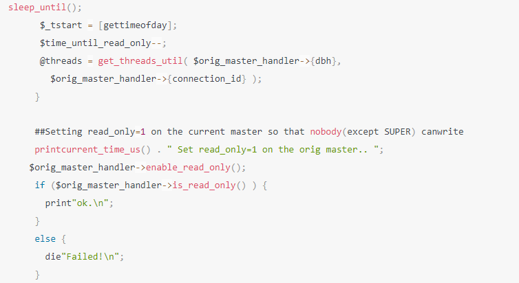
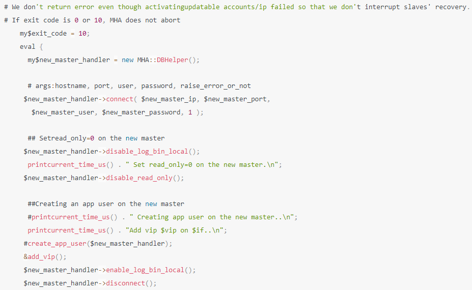

# mysql基本知识

## mysql是如何和数据库打交道的

### 程序员对mysql认知的现状

普通程序员对mysql的掌握：建库建表建索引，增删改查

### 工作中会遇到的问题

死锁、sql性能太差、异常报错

### 为啥要mysql驱动

我们不可能自己去写代码和mysql服务器建立tcp、socket连接，因此mysql给各个语言都提供了mysql驱动，封装了最底层的网络通信，提供Connection连接对象。基于这个Connection连接就可以和mysql服务器通信了，比如增删改查。

### 为啥要数据库连接池

tomcat容器是多线程的，他们去抢夺一个connection去访问数据库的话，性能肯定低。

每个线程都去创建使用和销毁connection的话，建立网络连接是耗时的。

那么池子的好处是：

一批建立好连接的connection扔到池子里面去，用的时候去池子里面拿，不用的时候还到池子里面，也不去销毁，后续可以继续使用。

解决了并发建立connection和connection销毁的问题。

### server端为什么要连接池

很多客户端系统需要和mysql服务端建立连接，因此服务端要需要一个连接池，来维持和客户端的连接

还需要进行账号密码的认证

## mysql架构设计

### 服务端怎么处理connection发来的sql语句？

服务端肯定需要一个线程来监听connection，有数据来了，就从connection读取数据并解析数据，生成sql、参数之类。

### sql语句交给谁来处理?

sql语句从connection读取出来了之后，就会交给SQL接口来处理，可以理解为一个门面。

### 为什么需要查询解析器

一条sql语句，是人使用的语法，mysql没办法理解的，mysql需要转化成自己能理解的语法。

那么mysql就提供了一个查询解析器去解析sql语句，对sql进行拆解

比如：select id,name,age from user where id=1

mysql就拆解成

从user表查询数据

查询id=1那一行的数据

查出来的数据，提取出id、name、age三个字段

sql解析，就是对符合sql语言的sql语句进行分析和拆解

### 为什么需要查询优化器

sql的执行，可能会有多种路径，比如遍历表，一条一条对比，比如直接根据id定位到那一条数据。查询优化器，要优化出一条最优的查询路径，提高查询的效率。

他会生成一个查询路径树，然后从里面选择一条最优查询路径，你就按照这个查询的步骤和顺序来执行操作就好了。

### 为什么需要执行器

查询优化器给出来一条sql执行计划，就需要有人来执行 这个执行计划。

执行器接下来就会根据这个执行计划，去多次调度 存储引擎的接口

执行器是非常核心的一个组件，负责跟存储引擎配合完成一个SQL语句在磁盘与内存层面的全部数据更新操作。

### 为什么需要存储引擎接口

存储引擎是真正的存储和处理数据的地方，数据主要是存储在内存和磁盘。

存储引擎接口，是一个Facade，对执行器提供简单的调用方法，屏蔽掉了内部复杂的处理逻辑。

### 为什么要有不同的存储引擎

满足不同的场景需求，比如性能、事务、存储限制、索引的支持等等

三种模型：

完全基于内存存储的，要求速度快，性能高，但是存储的容量小，数据会丢失；

完全基于磁盘的，存储容量大，数据不丢失，但是速度慢，性能低；

基于内存+磁盘，兼顾上面两种的优缺点。

## InnoDB存储引擎的架构设计

### 为什么需要缓冲池buffer pool

直接去增删改查磁盘，性能上肯定会比在内存里操作慢的

因此弄了一个内存里面的缓冲池，把一些操作扔到内存里面去操作来提高性能

如果查询和更新都在内存里面完成就能提高性能

### 怎么使用缓冲池

比如更新一条数据的时候，先把数据加载到缓冲池，然后对这条数据加独占锁，然后操作更新，在内存中修改这条数据。

### 事务没提交，更新的数据要回滚怎么办

在内存修改了数据，但是后面需要回滚怎么办？

在更新数据之前，把这条记录需要改修的字段的信息记录到磁盘上的undo日志里面，后面回滚的时候在提取出来还原。

### 事务没提交，为什么会出现脏数据？

事务没有提交，在缓冲池修改了数据，此时内存数据和磁盘上存储的数据不一样，这条数据就成了脏数据。

### 事务没有提交，系统宕机了怎么办？

事务还没有提交，磁盘上的数据还没有修改，系统宕机了，客户端会收到一个数据库异常，此时对系统没有任何影响，等mysql恢复了，磁盘上的数据还是原来的数据。

此时恢复了对事务进行回滚

### 事务提交过程中，系统宕机了怎么办？

redo log prepare阶段：

已经flush redo log了，没有flush binlog，此时，crash，系统恢复后，事务回滚

已经flush redo log了，也flush binlog了，此时，crash，系统恢复后，会继续提交

### 事务提交之后，系统宕机了怎么办？

redo log
commit了，commit字段更新了，此时crash，可能缓冲池里面的数据还没有刷盘，缓冲池里面的数据就没了。为了能够还原缓冲池的状态就引入了redo日志。

redo log，是一种偏向物理性质的重做日志，因为他里面记录的是类似这样的东西，

“对哪个数据页中的什么记录，做了个什么修改”。

### redo日志如何保证数据能还原？

有三种模式

#### redolog实时刷盘强制更新到磁盘

事务里面更新数据的同时，把这条数据更新后的字段，记录到redo日志内存缓冲池里面。

事务提交的时候，策略innodb_flush_log_at_trx_commit=1，redo必须刷盘并强制更新到磁盘，然后事务才能成功。

系统再次恢复的时候，就能根据redo日志来重做缓冲区脏数据

但是，在这种策略下，事务的写入速度就会大大下降。

#### 其他2个策略：

如果innodb_flush_log_at_trx_commit=0，就代表mysql定时器每秒去刷盘并强制更新到磁盘

如果innodb_flush_log_at_trx_commit=2，就代表事务提交的时候先刷盘，由os自己去更新到磁盘。

0和2的模式下，很可能宕机会丢失redo日志数据。

#### flush和fsync理解如下：

innodb_flush_log_at_trx_commit = 0 就是 定时器自己维护，每秒调用 flush + fsync。

innodb_flush_log_at_trx_commit = 1 就是实时调用 flush + fsync
没法批处理，性能很低。

innodb_flush_log_at_trx_commit = 2 就是实时flush ,定时 fsync 交给OS维护定时器。

如果要保证缓冲池的数据0丢失，则值为1；

如果高效的写入操作，不考虑数据的一致性，则值为0；

如果即想高速写入又保证数据丢失少，则值为2；

### 什么是binlog？

binlog是属于mysql
server自己的日志文件，叫做归档日志，不是InnoDB存储引擎特有的日志文件。

是一种逻辑性的日志，比如一条update 语句 wherer id=1

而redo日志记录的是对哪个数据页中的什么记录，做了个什么修改

### binlog什么时候写入磁盘？

提交事务阶段：redo log flush，mysql执行器会将binlog flush到磁盘。

### binlog刷盘策略

sync_binlog参数可以控制binlog的刷盘策略，他的默认值是0

把binlog写入磁盘的时候，其实不是直接进入磁盘文件，而是进入os cache内存缓存。

也就是实时flush ,定时 fsync 交给OS维护定时器，因此会丢数据

sync_binlog=1,就是flush+fsync，必须实时刷盘强制更新磁盘。

### 如何才算事务提交成功？

redolog flush + binlog flush
之后，还需要把写入binlog的文件名和写入位置，以及commit标记更新到redolog。才算事务提交成功。

### 为什么事务提交成功要在redo日志写commit标记？

保证redolog和binlog的一致性，只有redolog和binlog都写入成功了，才能判定事务提交成功。

否则只有redolog成功，binlog没有成功，或者binlog日志位置信息没有写入redolog，都判定事务不成功。

事务判定成功的三个步骤：redolog刷盘+binlog刷盘+commit标记写入redo日志

### io线程刷盘内存缓冲区的脏数据

事务已经提交成功了，但是内存缓冲区里面的数据可能还没有刷新到磁盘。有一个io线程会在某个时间，把脏数据刷新到磁盘。

如果系统宕机了，系统恢复之后，可以根据redo日志重做缓冲区的脏数据。之后io线程又可以继续刷盘了。

### 基于更新一条数据，总结下innodb架构原理

InnoDB存储引擎 内存里面 有 buffer pool、redo log buffer

磁盘上有undo日志文件，redo日志文件

同时mysql server自己还有binlog日志磁盘文件。

事务commit前：flush fsync undo log、write buffer pool、write redo log buffer

事务commit中：flush fsync redo log、flush fsync binlog，update commit

事务commit后：io flush fsync buffer pool脏数据

## 数据库规划

### 数据库的机器配置

一台机器能抗下每秒多少请求，往往是跟你每个请求处理耗费多长时间是关联的

根据经验值而言，Java应用系统部署的时候常选用的机器配置大致是2核4G和4核8G的较多一些

4核8g，按500个请求来配置，根据任务时长，从一两百到七八百都有可能

java应用的内存运算性能是很高的，压力都在和外部通信上。

数据库部署的时候常选用的机器配置最低在8核16G以上，正常在16核32G，推荐16核以及以上的配置。

8核16G，按一两千的请求来配置，再高可能有危险，因为数据库的cpu、磁盘、io、内存负载都会很高，数据库压力过大就会宕机。

16核32G，按两三千的请求来配置，甚至三四千也是有可能，再高的话，cpu、磁盘、io、内存、网络负载都会很高，数据库也有可能会扛不住宕机。

如果是ssd磁盘，能抗的并发可能会更高一点，数据库最大的复杂就在于磁盘的io，需要大量的读写磁盘文件。

### 数据库的压测

数据库的压测和java系统的压测是两码事，首先得知道数据库能最大抗多大压力，才能去看java能抗多大压力。

有一种可能，比如你数据库可以抗下2000个请求，java才能抗下500个请求，所以不能只针对java系统，还必须对数据库进行压测，心里有个数。

### QPS、TPS区分

QPS：每秒可以处理的请求数

TPS：每秒可以处理的事务数

TPS在事务中用的会比较多一些，他是说数据库每秒能处理多少次事务的commit和rollback。

QPS可以理解为每秒的请求数量，TPS可以理解为每秒完成的业务量，比如交易这个整体的业务行为。

### IO压测指标

#### IOPS

机器随机IO并发处理的能力，比如说200IOPS，意思是每秒可以执行200个随机io读写请求。

这个是关键指标，因为后台IO线程去刷盘缓冲区的脏数据，是在不确定的时间里面刷回去的，是一个随机IO的过程。

如果说IOPS指标太低，说明刷回效率就比较低。

#### 吞吐量

机器每秒可以读写多少字节的数据量

这个也是关键指标,提交事务的时候，会大量的写redo
log之类的日志，这些日志都要写磁盘。

一台机器它的存储可以每秒读写多少字节的数据量，就决定了可以把多少redo
log之类的日志写到磁盘。一般来说我们写redolog、binlog都是顺序写，那么一般磁盘的顺序写入，每秒的吞吐量可以达到200MB左右

通常 机器的磁盘吞吐量都是足够承载高并发请求的

#### latency延迟

往磁盘写入一条数据的延迟。

这个也是关键指标，执行sql的时候，写redo日志到磁盘，到底延迟到1ms还是多少，会影响到sql语句的执行性能。

磁盘写入延迟越低，数据库性能越好，sql的性能就越高。

### CPU负载

### 网络负载

看每秒网卡的输入输出多少MB的数据，一般1000MB的网卡，最大传输100MB的数据。

### 内存负载

## 数据库压测

### 安装sysbench

curl -s
https://packagecloud.io/install/repositories/akopytov/sysbench/script.rpm.sh \|
sudo bash

sudo yum -y install sysbench

sysbench --version

### 构造测试表测试数据

sysbench --db-driver=mysql --time=300 --threads=10 --report-interval=1
\--mysql-host=127.0.0.1 --mysql-port=3306 --mysql-user=test_user
\--mysql-password=test_user --mysql-db=test_db --tables=20 --table_size=1000000
oltp_read_write --db-ps-mode=disable prepare

\--db-driver=mysql：基于mysql的驱动去连接mysql数据库，你要是oracle，或者sqlserver，那自然就是其他的数据库的驱动了

\--time=300：这个就是说连续访问300秒

\--threads=10：这个就是说用10个线程模拟并发访问

\--report-interval=1：这个就是说每隔1秒输出一下压测情况

\--mysql-host=127.0.0.1 --mysql-port=3306 --mysql-user=test_user
\--mysql-password=test_user：这一大串，就是说连接到哪台机器的哪个端口上的MySQL库，他的用户名和密码是什么

\--mysql-db=test_db --tables=20
\--table_size=1000000：这一串的意思，就是说在test_db这个库里，构造20个测试表，每个测试表里构造100万条测试数据，测试表的名字会是类似于sbtest1，sbtest2这个样子的

oltp_read_write：这个就是说，执行oltp数据库的读写测试

\--db-ps-mode=disable：这个就是禁止ps模式

最后有一个prepare，意思是参照这个命令的设置去构造出来我们需要的数据库里的数据，他会自动创建20个测试表，每个表里创建100万条测试数据

### 压测结果分析

按照我们上面的命令，我们是让他每隔1秒都会输出一次压测报告的，此时他每隔一秒会输出类似下面的一段东西：

[ 22s ] thds: 10 tps: 380.99 qps: 7312.66 (r/w/o: 5132.99/1155.86/1321.35) lat
(ms, 95%): 21.33 err/s: 0.00 reconn/s: 0.00

第22s输出的一段压测统计报告，然后是其他的一些统计字段：

thds: 10，这个意思就是有10个线程在压测

tps: 380.99，这个意思就是每秒执行了380.99个事务

qps: 7610.20，这个意思就是每秒可以执行7610.20个请求

(r/w/o:
5132.99/1155.86/1321.35)，这个意思就是说，在每秒7610.20个请求中，有5132.99个请求是读请求，1155.86个请求是写请求，1321.35个请求是其他的请求，就是对QPS进行了拆解

lat (ms, 95%): 21.33，这个意思就是说，95%的请求的延迟都在21.33毫秒以下

err/s: 0.00 reconn/s:
0.00，这两个的意思就是说，每秒有0个请求是失败的，发生了0次网络重连

### 总的压测报告

SQL statistics:

queries performed:

read: 1480084 // 这就是说在300s的压测期间执行了148万多次的读请求

write: 298457 // 这是说在压测期间执行了29万多次的写请求

other: 325436 // 这是说在压测期间执行了30万多次的其他请求

total: 2103977 // 这是说一共执行了210万多次的请求

// 这是说一共执行了10万多个事务，每秒执行350多个事务

transactions: 105180( 350.6 per sec. )

// 这是说一共执行了210万多次的请求，每秒执行7000+请求

queries: 2103977 ( 7013.26 per sec. )

ignored errors: 0 (0.00 per sec.)

reconnects: 0 (0.00 per sec.)

// 下面就是说，一共执行了300s的压测，执行了10万+的事务

General staticstics:

total time: 300.0052s

total number of events: 105180

Latency (ms):

min: 4.32 // 请求中延迟最小的是4.32ms

avg: 13.42 // 所有请求平均延迟是13.42ms

max: 45.56 // 延迟最大的请求是45.56ms

95th percentile: 21.33 // 95%的请求延迟都在21.33ms以内

### 总结

在硬件的一定合理的负载范围内，把数据库的QPS提高到最大，这就是数据库压测的时候最合理的一个极限QPS值

## 机器的性能

压测的时候，需要机器的负载在比较合理的范围，28原则，不能超过80%。

### CPU负载

按下 1，即可显示使用 CPU 核心数

top - 15:52:00 up 42:35, 1 user, load average: 0.15, 0.05, 0.01

时间 运行时长 用户数量 负载 1分钟 5分钟 15分钟

CPU负载是0.15，这就说明，4核CPU中连一个核都没用满，4核CPU基本都很空闲，没啥人在用。

如果你的CPU负载是1，那说明4核CPU中有一个核已经被使用的比较繁忙了，另外3个核还是比较空闲一些。

如果你的CPU负载是1.5，说明有一个核被使用繁忙，另外一个核也在使用，但是没那么繁忙，还有2个核可能还是空闲的。

### 内存负载

Mem: 33554432k total, 20971520k used, 12268339 free, 307200k buffers

去掉末尾6个数字就是多少GB

去掉末尾3个数字就是多少MB

总内存大概有32GB，已经使用了20GB左右的内存，还有10多G的内存是空闲的，有大概300MB左右的内存用作OS内核的缓冲区了。

### 磁盘IO负载

#### 随机读写IOPS

一般来说，随机磁盘读写每秒在两三百次都是可以承受的。

dstat -r

\--io/total-

read writ

0.25 31.9

0 253

0 39.0

#### 吞吐量

dstat -d

\-dsk/total-

read writ

639k 62k

32k 761k

0 0

16k 16k

每秒读取963kb，写入62kb的含义

像这个存储IO吞吐量基本上都不算多的，因为普通的机械硬盘都可以做到每秒钟上百MB的读写数据量。

### 网卡负载

dstat -n

\-net/total-

recv send

16k 17k

每秒钟网卡接收到流量有多少kb，每秒钟通过网卡发送出去的流量有多少kb

通常来说，如果你的机器使用的是千兆网卡，那么每秒钟网卡的总流量也就在100MB左右，甚至更低一些。

## 数据库监控

### 监控哪些指标

拿到一台机器，即使QA、DBA团队都没有提供专业的压测支持，也要自己测一下，做到心里有数。大概能承担多少QPS和TPS。

除此之外还要做好运维监控的工作，包括对CPU、内存、网络、磁盘IO、慢查询、QPS、TPS

### node_exporter

node_exporter，启动之后是个linux进程，他会自动采集这台linux机器上的CPU、磁盘、内存、网络之类的各种监控数据

本质你可以理解为通过我们之前讲解的那些linux命令，就可以采集到一切你想要的linux机器的监控数据。

#### 安装

下载地址：http://cactifans.hi-www.com/prometheus/

node_exporter-0.15.2.linux-amd64.tar.gz

打开securityCRT

alt + p 使用sftp上传

cd /opt

回到shell

cd /opt/node_exporter

tar -zxvf node_exporter-0.18.0.linux-amd64.tar.gz

mv node_exporter-0.18.0.linux-amd64 node_exporter

cd node_exporter

#### 启动

nohup /opt/node_exporter/node_exporter &

**启动之后，通过9100端口暴露出去它的数据**

### mysqld_exporter

采集MySQL数据库自己的一些监控数据的，比如SQL性能、连接数量等

#### 安装

https://github.com/prometheus/mysqld_exporter/releases/download/v0.10.0/mysqld_exporter-0.10.0.linux-amd64.tar.gz

mysqld_exporter-0.10.0.linux-amd64.tar.gz

cd /opt/

tar -zxvf mysqld_exporter-0.10.0.linux-amd64.tar.gz

mv mysqld_exporter-0.10.0.linux-amd64 mysqld_exporter

#### 配置环境变量

export DATA_SOURCE_NAME='root:root@(10.10.10.1:3306)/'

echo "export DATA_SOURCE_NAME='root:root@(10.10.10.1:3306)/'" \>\> /etc/profile

source /etc/profile

#### 启动

nohup /opt/mysqld_exporter/mysqld_exporter --collect.info\_schema.processlist
\--collect.info_schema.innodb_tablespaces --collect.info_schema.innodb_metrics
\--collect.perf_schema.tableiowaits --collect.perf_schema.indexiowaits
\--collect.perf_schema.tablelocks --collect.engine_innodb_status
\--collect.perf_schema.file_events --collect.binlog_size
\--collect.info_schema.clientstats --collect.perf_schema.eventswaits &

**启动之后，通过9104端口暴露出去它的数据**

### Prometheus

监控和采集数据，放到他自己的时序数据库中去。

比如它可以监控和采集node_exporter的数据到自己的库

#### 安装

下载地址：<http://cactifans.hi-www.com/prometheus/>

prometheus-2.1.0.linux-amd64.tar.gz

打开securityCRT

alt + p 使用sftp上传

tar -zxvf /opt/prometheus-2.14.0.linux-amd64.tar.gz

rm -rf /opt/prometheus-2.14.0.linux-amd64.tar.gz

mv /opt/prometheus-2.14.0.linux-amd64 /opt/prometheus

#### 配置prometheus.yml

cd /opt/prometheus

vi prometheus.yml

在scrape_configs下面加入一大段自定义的配置，因为他需要去采集mysql的数据和机器的数据

完整文件如下：

\# my global config

global:

scrape_interval: 15s \# Set the scrape interval to every 15 seconds. Default is
every 1 minute.

evaluation_interval: 15s \# Evaluate rules every 15 seconds. The default is
every 1 minute.

\# scrape_timeout is set to the global default (10s).

\# Alertmanager configuration

alerting:

alertmanagers:

\- static_configs:

\- targets:

\# - alertmanager:9093

\# Load rules once and periodically evaluate them according to the global
'evaluation_interval'.

rule_files:

\# - "first_rules.yml"

\# - "second_rules.yml"

\# A scrape configuration containing exactly one endpoint to scrape:

\# Here it's Prometheus itself.

scrape_configs:

\- job_name: 'Host'

file_sd_configs:

\- files:

\- 'host.yml'

metrics_path: /metrics

relabel_configs:

\- source_labels: [__address__]

regex: (.\*)

target_label: instance

replacement: \$1

\- source_labels: [__address__]

regex: (.\*)

target_label: \__address_\_

replacement: \$1:9100

\- job_name: 'MySQL'

file_sd_configs:

\- files:

\- 'mysql.yml'

metrics_path: /metrics

relabel_configs:

\- source_labels: [__address__]

regex: (.\*)

target_label: instance

replacement: \$1

\- source_labels: [__address__]

regex: (.\*)

target_label: \__address_\_

replacement: \$1:9104

\- job_name: 'prometheus'

static_configs:

\- targets: ['10.10.10.1:9090']

#### 配置node_exporte的host.yml

这里配置node_exporter的访问地址

cd /opt/prometheus

vi host.yml

\- labels:  
service: test  
targets:  
\- 127.0.0.1:9100

#### 配置mysql的mysql.yml

vi /data/prometheus/mysql.yml

\- labels:  
service: mysql  
targets:  
\- 127.0.0.1:9104

#### 启动prometheus

/opt/prometheus/prometheus --storage.tsdb.retention=30d &

#### 打开界面

http://10.10.10.1:9090/graph

至此，prometheus已经可以采集机器和mysql的数据了，并通过9090端口开放数据出去

### Grafana是什么

可视化的数据展示系统，可以把Prometheus采集的数据，展示成精美的报表，直观的看到机器和mysql的监控情况。

#### 安装

下载地址：https://s3-us-west-2.amazonaws.com/grafana-releases/release/grafana-4.6.3.linux-x64.tar.gz

打开securityCRT

alt + p 使用sftp上传

cd /opt/prometheus

回到shell

mkdir -p /opt/prometheus/grafana

tar -zxvf grafana-4.6.3.linux-x64.tar.gz -C /opt/prometheus

rm -rf /opt/prometheus/grafana-4.6.3.linux-x64.tar.gz

#### 启动

/opt/prometheus/grafana/bin/grafana-server &

#### 打开界面

<http://10.10.10.1:3000>

账户秘密：admin admin

#### 配置数据源

接着在Grafana左侧菜单栏里有一个Data Sources，点击里面的一个按钮是Add data
source，就是**添加一个数据源**

然后在界面里输入你的数据源的名字是Prometheus，类型是Prometheus，HTTP
URL地址是http://10.10.10.1:9090，其他的都用默认的配置就行了，接下来Grafana就会自动从Prometheus里获取监控数据和展示了。

#### 安装grafana-dashboards模板

下载地址：<https://github.com/percona/grafana-dashboards/archive/v1.6.1.tar.gz>

**解压**

dashboards文件夹有一堆json文件，接着在grafana页面中，可以看到最上面有一个Home按钮，点击一下进入一个界面，你会看到一个Import
Dashboard的按钮，就是说可以导入一些仪表盘，这个时候就是要导入刚才看到的一大堆的json文件。

点击Upload json
file按钮，就会出现一个界面让你上传一个一个的json文件，然后你就依次上传，接着grafana中就会出现一大堆的仪表盘了，比如机器的CPU使用率的仪表盘，磁盘性能仪表盘，磁盘空间仪表盘，MySQL监控仪表盘，等等。

## **Buffer Pool**

### 为什么要有buffer pool

内存和磁盘结合，提高数据库的性能

### 为什么需要配置buffer pool容量？

因为内存大小不是无限的，所以需要对buffer pool进行容量的配置

my.cnf配置文件里面可以配置大小，如下是配置了20GB，默认值是128MB

[server]

innodb_buffer_pool_size = 2147483648

### 数据在磁盘是如何存放的？

逻辑上，我们有库、表、行的概念，在实际物理存储的时候，每个表里面的行的数据都是按照一页一页来存储的，一页的大小是16kb。

### 数据如何存放在buffer pool？

有了buffer
pool这样一个内存的容器，磁盘的数据必定需要按照一定的约定和格式存放进去。

mysql的数据在磁盘上是16kb的大小存放在一页上，定位一行数据，需要先找到这一页，那么对应的读取一页的数据，也是按照一页的形式存放在buffer
pool里面的，物理和内存结构映射，就是一个一个的缓存页和物理页对应。

### 数据放到buffer pool怎么和物理数据对应？

这就有了一个描述数据，里面存放这页数据，在buffer
pool的地址，以及对应的物理表空间，页编号等信息。

### 描述数据放哪里？怎么放，大小是多少？

放到bufferpool的最前面，大小是一页的5%，800个字节。

多出来的一个一个描述数据的大小，会导致buffer pool的总容量撑出来变大。

比如128MB的buffer pool可能最终大小就是130MB

### bufferpool的初始化

mysql启动的时候，会安装buffer
pool设置的大小，加上描述数据的大小，去申请一块内存作为bufferpool的内存区域。

接下来，会把一堆800字节的描述数据和16kb的缓存页在内存里面初始化，并且一字按顺序排好。

### bufferpool会有内存碎片吗？

会有，因为buffer
pool的大小是人设定的，很可能划分完所有的缓存页和描述数据块之后，还剩一点点的内存，这一点点内存放不下任何一个缓存页了，就没办法使用了。就变成了内存碎片。

同时，再划分缓存页和描述数据块的时候，会让它们紧密的挨在一起，这样能尽可能的减少内存浪费，就尽可能的减少内存碎片的产生了。

如果缓存页东一块西一块，必然有很多间隙，就形成了内存碎片。

## Free链表

### 读取一页的数据选择哪个缓存页存放？

这个就涉及到了一个问题，哪个缓存页是空闲的。为了解决这个问题，就设计了一个free链表，所有空闲的缓存页对应的描述数据，做成一个双向链表串在一起。

当数据库启动的时候，缓存页都是没有使用的，因此，所有的描述数据，都串在了一起，组成了一个free链表。

### 如何找到free链表

要去使用free链表，就要有一块数据来描述它，就弄了一个基础节点，存储了free链表的数量、free链表的头节点，尾节点等信息。

对于free链表来说，这个基础node节点40字节，是不属于bufferpool的。相当于free链表的facade外观。

### 数据从物理页到内存页放入的全部过程？

首先读取了一页数据之后，先去free链表的外观基础节点里面去找到一个空闲的描述数据。

然后把这页数据，写入描述数据对应的内存页地址，把数据灌装进去。

然后把数据的物理表空间、页编号，更新到描述数据，完成映射。

最后把这个描述数据从free链表中摘除。

### 如何知道一页数据有没有缓存?

既然bufferpool的设计是为了提高性能，尽量在内存里面操作数据，那操作一条记录，得先去检查在bufferpool里面是否存在。

那如何快速的知道一条记录是否命中缓存呢？

mysql又设计了一个哈希表，写入kv对，key=表空间号+页编号，value=缓存页地址。

每次取数据，先从哈希表看一下，有没有对应的kv，有就直接取出来使用。

## Flush链表

### 为什么会有脏页、脏数据的产生

对数据修改都是基于bufferpool的缓存页来操作的，那么修改的时候，必然会存在脏数据，和数据库的数据不一致，也就是产生了脏页。

### 怎么统计哪些缓存页产生了脏页？

修过缓存页的数据被修改了，那么它就是一个脏页，io线程去刷盘的时候，不可能所有缓存页都刷盘，而是只刷新脏页。

如果一个缓存页成为了脏页，它会把它的描述数据块加入到flush链表里面，flush链表也是一个双向链表，所有的脏页通过flush链表串起来。这样所有的脏页就能被统计到了。

### 从哪个源头去处理脏页

flush链表和free链表一样，也有一个不属于bufferpool的外置node节点来提供facade外观，里面提供有多少size的脏页，第一个脏页和最后一个脏页。

## LRU链表

### free缓存页不够使用了怎么办？

缓存页不够使用了，接下来必须要淘汰掉一个缓存页，需要刷盘并清空，成为一个新的缓存页

### 淘汰哪个缓存页呢？

原则上肯定是最少使用的先淘汰掉，因此引入LRU链表，最近最少使用算法。

有了LRU链表就知道哪些是不常用的缓存页了，需要淘汰缓存页的时候，从链表按顺序淘汰就可以了。

### LRU工作机制

加载新缓存页和修改一个缓存页，都给它调到LRU的链表头部，让不经常修改的往后排。

### 从哪个源头去操作LRU链表呢

同样的道理，一个外置Node节点，持有LRU链表的size，第一个LRU链表和最后一个LRU链表。

### 单纯的LRU链表带来的问题

可能是不用的页被提前加载进来了，导致经常使用的缓存页排到最后面去了

1\. 一种是预读机制，触发预读机制就会加载相邻的页数据，主要是为了提升性能。

比如：

a.
顺序的访问了一个区里的多个数据页，访问的数据页的数量超过了这个阈值，此时就会触发预读机制，把下一个相邻区中的所有数据页都加载到缓存里去

innodb_read_ahead_threshold，他的默认值是56

b.
一个区里的13个连续的数据页，而且这些数据页都是比较频繁会被访问的，此时就会直接触发预读机制，把这个区里的其他的数据页都加载到缓存里去

1.  另外一种是全表扫描，把整个表的页数据，全部加载进来了

这个所谓的全表扫描，意思就是类似如下的SQL语句：SELECT \* FROM
USERS，没有where条件

### 如何解决简单LRU链表淘汰掉热点数据到问题

为了解决简单LRU链表的问题，引入优化版的LRU链表，采用的思想是冷热数据分离。链表的头部区域是热数据区域，尾部区域是冷数据区域。innodb_old_blocks_pct=37，默认冷数据占37%

第一次加载数据的时候，加载到冷区域头部。如果这个缓存页1s后，还有被使用，说明它可能经常被使用，那么就移动到热数据区域头部。

通过冷热数据分离，每次淘汰，淘汰冷数据区域就可以了。放进来1s后都没有的数据，就会变成冷数据。

### 热数据区域的链表频繁节点移动怎么优化?

热数据区域的数据本来就是热数据，访问一次就提到头部，肯定效率不是最高的。

因此
如果是热数据区域前1/4数据的访问，不再移动，只有后3/4的数据被访问了，才往前提。

### 冷数据什么时候刷盘淘汰

定时io线程，刷盘冷数据区域链表尾部的几个数据，从lru链表和flush链表移除，还到free链表中。

几个链表都没有数据了，就从冷数据末端去flush一个缓存页，从lur链表和flush链表移除，还到free链表中。

### 热点数据啥时候刷盘淘汰

冷数据知道如何淘汰了，热数据怎么处理呢，热数据必然是在flush链表里面的，是脏数据，flush链表有一个后台任务，在合适的时候，去刷盘脏页数据。从lur链表和flush链表移除，还到free链表中。

### 如何避免crud的时候，缓存页用完了，频繁倒腾冷数据刷盘

给buffer pool的内存设置大一点，即使高峰期
free消耗的速率比flush、lru刷盘的数据快，但是还是有很多内存可以使用，等高峰期过了，free又慢慢被还原了。

## 三个链表动态的运行过程

Buffer
Pool在运行中被使用的时候，实际上会频繁的从磁盘上加载数据页到他的缓存页里去，然后free链表、flush链表、lru链表都会在使用的时候同时被使用。

比如数据加载到一个缓存页，free链表里会移除这个缓存页，然后lru链表的冷数据区域的头部会放入这个缓存页。

然后如果你要是修改了一个缓存页，那么flush链表中会记录这个脏页，lru链表中还可能会把你从冷数据区域移动到热数据区域的头部去。

如果你是查询了一个缓存页，那么此时就会把这个缓存页在lru链表中移动到热数据区域去，或者在热数据区域中也有可能会移动到头部去。

你一边不停的加载数据到缓存页里去，不停的查询和修改缓存数据，然后free链表中的缓存页不停的在减少，flush链表中的缓存页不停的在增加，lru链表中的缓存页不停的在增加和移动。

另外一边，你的后台线程不停的在把lru链表的冷数据区域的缓存页以及flush链表的缓存页，刷入磁盘中来清空缓存页，然后flush链表和lru链表中的缓存页在减少，free链表中的缓存页在增加。

## 多Buffer Pool来优化数据库的并发性能

### buffer pool并发访问的时候需要加锁吗

多线程访问一个BufferPool，必然是要加锁的

比如，先加锁，然后加载数据页到缓存页，更新free链表，更新lru链表，再释放锁，接着下一个线程再执行一系列的操作。

### buffer pool并发访问加锁影响性能吗？

大部分情况下，线程都是查询或者更新缓存里的数据，操作都是发生在内存的，微秒级，包括更新free、flush、lru链表都是内存操作，速度极快。

但是有些情况下，需要读取从磁盘读取数据到缓存页，发生了一次磁盘IO，耗时就长一些，后面排队的线程自然就多等一会。

### 多个buffer pool优化并发能力

多个buffer pool类似于分段加锁，降低了锁的冲突，多核多线程访问就成倍的提高了性能

每一个缓存页，只会放在其中一个buffer pool里面

my.cnf配置如下

[server]

innodb_buffer_pool_instances = 8

innodb_buffer_pool_size = 8589934592

innodb_buffer_pool_instances代表了有几个buffer pool

innodb_buffer_pool_size代表了buffer pool总共占用多少字节

## Buffer Pool动态调整

### bufferpool能在运行期间调整吗

可以调整，但不这么做，因为性能太低下了，极为耗时。

主要是因为bufferpool需要连续的内存，比如你8g调整到16g，就需要把8g的数据拷贝到16gb去。因此最好不要这么做

### 如何更高效的给bufferpool动态调整大小

将每个bufferpool分为n个chuck，这n个chuck共享free、flush、lru链表。需要扩容的时候，生成一个连续内存的chuck，然后交给bufferpool就可以了

每个buffer pool里多个chunk但是共用一套链表数据结构

### buffer pool容量生成推荐配置成多少

推荐配置成总内存的50%-60%，系统和其他软件也要使用内存。

32GB，配置60%就是20GB。

buffer pool总大小 = chunk个数 \* chunk容量 \* buffer pool个数

比如20GB buffer pool，16个buffer pool，128MBchunk容量，10个chunk数量

比如20GB buffer pool，32个buffer pool，128MBchunk容量，5个chunk数量

## innodb状态参数查询

SHOW ENGINE INNODB STATUS

Total memory allocated xxxx;

Dictionary memory allocated xxx

Buffer pool size xxxx

Free buffers xxx

Database pages xxx

Old database pages xxxx

Modified db pages xx

Pending reads 0

Pending writes: LRU 0, flush list 0, single page 0

Pages made young xxxx, not young xxx

xx youngs/s, xx non-youngs/s

Pages read xxxx, created xxx, written xxx

xx reads/s, xx creates/s, 1xx writes/s

Buffer pool hit rate xxx / 1000, young-making rate xxx / 1000 not xx / 1000

Pages read ahead 0.00/s, evicted without access 0.00/s, Random read ahead 0.00/s

LRU len: xxxx, unzip_LRU len: xxx

I/O sum[xxx]:cur[xx], unzip sum[16xx:cur[0]

主要讲解这里跟buffer pool相关的一些东西。

（1）Total memory allocated，这就是说buffer pool最终的总大小是多少

（2）Buffer pool size，这就是说buffer pool一共能容纳多少个缓存页

（3）Free buffers，这就是说free链表中一共有多少个空闲的缓存页是可用的

（4）Database pages和Old database
pages，就是说lru链表中一共有多少个缓存页，以及冷数据区域里的缓存页数量

（5）Modified db pages，这就是flush链表中的缓存页数量

（6）Pending reads和Pending
writes，等待从磁盘上加载进缓存页的数量，还有就是即将从lru链表中刷入磁盘的数量、即将从flush链表中刷入磁盘的数量

（7）Pages made young和not
young，这就是说已经lru冷数据区域里访问之后转移到热数据区域的缓存页的数量，以及在lru冷数据区域里1s内被访问了没进入热数据区域的缓存页的数量

（8）youngs/s和not
youngs/s，这就是说每秒从冷数据区域进入热数据区域的缓存页的数量，以及每秒在冷数据区域里被访问了但是不能进入热数据区域的缓存页的数量

（9）Pages read xxxx, created xxx, written xxx，xx reads/s, xx creates/s, 1xx
writes/s，这里就是说已经读取、创建和写入了多少个缓存页，以及每秒钟读取、创建和写入的缓存页数量

（10）Buffer pool hit rate xxx /
1000，这就是说每1000次访问，有多少次是直接命中了buffer pool里的缓存的

（11）young-making rate xxx / 1000 not xx /
1000，每1000次访问，有多少次访问让缓存页从冷数据区域移动到了热数据区域，以及没移动的缓存页数量

（12）LRU len：这就是lru链表里的缓存页的数量

（13）I/O sum：最近50s读取磁盘页的总数

（14）I/O cur：现在正在读取磁盘页的数量

buffer
pool的千次访问缓存命中率，这个命中率越高，说明你大量的操作都是直接基于缓存来执行的，性能越高。

第二个是你的磁盘IO的情况，这个磁盘IO越多，说明你数据库性能越差。

## 一行数据在磁盘上的物理结构

### 为什么不能直接更新磁盘

磁盘io随机读写，性能必然很差

读写内存速度快，磁盘顺序写很快，通过操作内存和顺序写才能极大的提升mysql的性能。

### 为什么要有数据页？

一条一条数据加载和写入性能低

如果操作到一页数据里面的其他数据，就可以不用再次去读取磁盘了，提高了性能

一页数据读取和后台线程flush数据页，相对单行读取和写入来说，降低了读取和写入的频率

### 一行数据在磁盘上如何存储

#### 存储格式

涉及到一个概念，行格式，意思是一行存储的格式，这个格式有多个。

COMPACT格式 紧凑型

CREATE TABLE table_name (columns) ROW_FORMAT=COMPACT

ALTER TABLE table_name ROW_FORMAT=COMPACT

它的存储格式如下：

变长字段的长度列表，null值列表，数据头，column01的值，column02的值，column0n的值......

#### 变长字段列表

逆序 存储的是 非null值的字段长度

变长字段大小 最大不超过65535

#### NULL值列表

逆序 存储的是 每个字段是否为null，用bit来表示

#### 数据头

40个bit位

第1、2个bit位预留的没有含义

第3个bit位delete_mask，标记是否删除

接下来4个bit位是n_owned记录数

接下来是13个bit位是heap_no堆位置

接下来是3个bit的record_type行记录类型，0代表的是普通类型，1代表的是B+树非叶子节点，2代表的是最小值数据，3代表的是最大值数据

最后是16个bit的next_record，这个是指向他下一条数据的指针。

“0x09 0x04 00000101 0000000000000000000010000000000000011001
00000000094C（DB_ROW_ID）00000000032D（DB_TRX_ID） EA000010078E（DB_ROL_PTR）
616161 636320 6262626262”

#### 真实字段值

隐藏字段

每行字段的开头还有三个隐藏字段

DB_ROW_I D 行id

DB_TRX_ID 事务id

DB_ROL_PTR 回滚指针

真实字段

用户自己的字段

#### 如何读取一条数据

一行记录的指针指向这行数据的真实地址，往前读，是40个bit的数据头+null值列表+可变字段长度，往右读是三个隐藏字段+真实字段数据。

那么解析一个一个字段的内容，首先需要确认字段是否固定长度？

如果是固定长度，从真实地址直接往后读

如果是可变长度字段，那么存在null和非null两种情况，那么就从null值列表bit位中解析出当前是否为null，为null就不再处理。

如果这个字段不为null，就去逆序的从右往左读取该字段的长度。

知道长度了，再从真实数据，读取这个长度的数据。

#### 变长字段列表和null值列表 逆序的好处

从数据的指针开始，从左往右读，是真实字段一个一个顺序，从右往左读，也刚好是和真实字段的顺序一一对应

#### 行溢出

如果一页存不下，怎么办？这种情况，存不下的数据要往下一页放，下一页也放不下，就再往下一页放，指针指向过去。指针占用20字节大小。

### 数据页的格式

数据页就跟每一行数据一样，都是由MySQL开发人员设计出来的一个特殊的存储格式。

数据页和缓存页是一一对应的。内存里面写数据就写到空闲区域，flush链表、lru链表刷盘的时候，整个缓存页，刷如磁盘。

数据页包含如下几个部分：

文件头 38个字节

数据页头 56个字节

最大记录、最小记录 26个字节

多个数据行 不固定

空闲区域 不固定

数据页目录 不固定

文件尾部 8个字节

### 什么是表空间？

我们每创建一个表，对应磁盘上就有一个 表名.ibd 的磁盘数据文件

表空间里面存储了这个表的数据，里面存放着所有的页数据

通过表空间来管理不同的表。

### 什么是数据区？

但是一个表空间管理所有的页数据，太庞大了，不便于管理，因此有了数据区和数据组的概念。

一个区里面存放64个页，是1MB

一个组里面放256个区，是256MB

表空间里面

第1组第1区里面的前3个页是存放特殊信息的。

其他组第1区里面的前2个页是存放特殊信息的。

查询数据的时候，就是从表组区里面找到页，把页信息加载到缓存页里面去。

## 随机读写和顺序读写的是什么

mysql读取一页数据，可能在磁盘上的任何一个位置，所以读取磁盘的数据只能是随机读这种方式。

随机读关注两个指标，IOPS、响应延迟

IOPS是并发随机读写的能力，一般核心数据库我们会使用ssd，来提高这种能力。

响应延迟是一次操作花费多长时间。

顺序写是追加的方式，往文件末尾追加数据。redo
log就是这种方式，顺序写的性能是很高的，几乎和内存随机读写的性能差不多。

顺序读写关注吞吐量的指标。

一笔更新操作，会涉及到至少一次的随机读和一次顺序写，所以IOPS并发能力和写入吞吐量就决定了整体数据库的性能。

## mysql读写数据在linux操作系统上是什么流程

liunx存储系统分为VFS层，文件系统层，pagecache层，通用block层，io调度层，block设备驱动层，block设备层。

通过VFS区分需要经过哪个文件系统（NFS、Ext3），如果缓冲区有则直接基于内存读写，没有则通往block层，把对文件的io请求转化为block
io请求，把blockio请求转发给io调度层，有公平调度与最后期限调度，通过block驱动，对block设备进行读写

## 什么是RAID磁盘冗余阵列

很多数据库在部署的时候，存储都是搭建的RAID存储架构，叫磁盘冗余阵列。

为什么会出现这个技术呢？

1）很多情况下，我们服务器上一块磁盘是不够使用的，为了扩大我们的存储空间，我们可能需要多块磁盘来存放数据。

那么就引入了RAID技术，可以管理多块磁盘的一种磁盘阵列技术。

1.  RAID还可以实现数据冗余，比如写入数据的时候，可以写入到两块磁盘上去，第二块磁盘用来冗余，如果第一块磁盘坏掉了，还可以从第二块磁盘上读取出冗余的数据。这块都是RAID自动管理的，不需要人来操心。

1.  RAID技术实际上就是管理多块磁盘的一种磁盘阵列技术，他有软件层面的东西，也有硬件层买的东西，比如有RAID卡这种硬件设备。

1.  RAID还可以分成不同的技术方案，比如RAID 0、RAID 1、RAID
    0+1、RAID2，等等，一直到RAID 10，很多种不同的多磁盘管理技术方案。

## RAID存储定期性能抖动

### 为了提高磁盘读写的写入性能，RAID卡提供了一个缓存

磁盘组成RAID阵列的时候，一般会有一个RAID卡，RAID卡是带有一个缓存的，它是类似于内存的SDRAM，大致就认为基于内存来存储吧。

RAID的缓存模式设置为write
back的时候，所有写入磁盘的数据都是先写入到RAID卡的缓存里面，然后再慢慢的写入到磁盘里，这个写缓冲机制可以大幅度的提高磁盘的写入性能。

### RAID卡缓存的问题

RAID卡好是非常好，但是有一个问题，服务器关闭或者服务器掉电了，缓存数据就会丢失，为了解决这个问题，就要单独给RAID卡提供独立的电池，一旦服务器关闭或者掉电，它就要基于自己的电池，把缓存数据写入到磁盘，保证数据不丢失。

### 引入电池带来的问题

电池存在性能衰减，需要定时充电放电，大概每隔30-90天，不同厂商的不一样，就需要自动的充放电一次，来延长电池的寿命和校准电池的容量。

如果不这么做的话，一旦服务器掉电，电池启用，可能电池容量不够，没办法把缓存数据一次性写入磁盘，就会导致数据丢失。

### 电池充放电会有什么问题？

电池充放电，RAID缓存的级别就从write back变成write
through，这样就不会写缓存了，就变成了写磁盘，如果是写缓存的话，性能是0.1ms，写磁盘可能就变成了1ms，性能可能会出现10倍衰减。

那么这样就导致了，RAID存储性能存在定期的性能抖动，间接导致数据库定期的性能抖动。

### RAID锂电池充放电导致性能抖动的优化

raid0，就是多块磁盘组成一个磁盘阵列，数据是分散写入到不同的磁盘的，磁盘的整体容量很大，同时可以写入多块磁盘，磁盘读写的并发能力很强。

但是raid0的问题是磁盘一旦坏了一块，数据就丢失了一部分。

raid1，两块磁盘互为镜像关系，数据会冗余一份，一块磁盘坏了，另外一块磁盘还有数据。一块磁盘压力太大，还可以让读请求路由到另外一块磁盘上去分担压力。

raid10，就是raid0+raid1组合起来，两块硬盘组成raid1，多个raid1再组成raid0，每一组两块硬盘互为冗余。

解决方案：

#### 给raid卡的锂电池换成电容

电容不用频繁重放电，支持透明充放电，自动检查电量，自动进行充电，缓存可以一直使用，io不用直接走磁盘。但是电容更换非常麻烦，而且容易老化，所以一般不常用。

#### 手动充放电

比较常用，关闭raid自动重放电，写一个脚本，每隔一段时间自动在晚上凌晨的业务低峰期，脚本触发充放电，这样避免在业务高峰期raid自动充放电，引起性能抖动。

充放电的时候不关闭write back缓存级别（写缓冲），做好UPS电源的支持

## Too many connections故障

linux的文件句柄限制，导致了MySQL的最大连接数被限制。

linux为什么要有文件句柄的限制，主要是防止单进程消耗过多的机器上的资源。如果被限制了，就没办法创建大量的网络连接。

一般，在生产环境部署的系统，比如数据库、mq、存储系统、缓存系统，都需要调整linux系统的一些内核参数，这个文件句柄的数量一定要调整的，通常调整为65535。

linux文件句柄是1024的时候，mysql的最大连接数是214，mysql的最大连接数有个公式，源码里面写死了。

其实核心就是一行命令：

ulimit -HSn 65535

然后就可以用如下命令检查最大文件句柄数是否被修改了

设置之后，我们要确保变更落地到/etc/security/limits.conf文件里，永久性的设置进程的资源限制

cat /etc/security/limits.conf

cat /etc/rc.local

同时，修改mysql的my.cnf里面的max_connections参数，然后重启服务器，重启mysql

这样mysql最大连接数和linux最大文件句柄数就会生效。

## redo log

### redo log机制出现的原因

mysql buffer
pool内存修改的脏数据，如果要同步刷盘的话，这个是随机写，而且是16kb的页大小，性能非常低。

redolog的好处，一是尺寸小，只记录表空间号，数据页号，磁盘文件偏移量，更新值这些信息，写入快；而是redolog是顺序写，一条一条记录往一个日志文件里面追加，速度快。

这样事务提交之后，即使内存脏数据丢失了，redolog里面还保存了这个数据更新后的信息，恢复也很方便。

### redo log的存储格式

日志类型（就是类似MLOG_1BYTE之类的），表空间ID，数据页号，数据页中的偏移量，具体修改的数据

类型就告诉了你他这次增删改操作修改了多少字节的数据；MLOG_1BYTE、2、4、8

哪个表空间；

哪个数据页号；

在数据页的哪个偏移量开始执行，具体修改的数据是什么

有了上述信息，就可以还原一次数据增删改操作的遍历。

如果是MLOG_WRITE_STRING类型的日志，因为不知道具体修改了多少字节的数据，会多一个修改数据长度，就告诉你他这次修改了多少字节的数据，如下所示他的格式：

日志类型（就是类似MLOG_1BYTE之类的），表空间ID，数据页号，数据页中的偏移量，修改数据长度，具体修改的数据

### 为什么需要redo log buffer

大量的事务执行的时候，都去写磁盘，性能肯定是比较低了，因此需要一个redo log
buffer在内存里面存储先存储redo log日志。

redo log buffer 默认innodb_log_buffer_size=16MB

redo log buffer里面分成了一个一个小的redo log
block，每个512kb，以块为单位向磁盘写入。

块里面，同一个事务的多条redo log先暂存起来，然后一组数据写入redo log block里面。

### redo log buffer什么时间刷盘

写入的日志达到总量的一半，也就是超过了8MB（高并发场景）

事务提交的时候，必须把它所在的redo log block刷盘

后台线程每秒刷盘一次

mysql关闭的时候，刷盘

### redo log 参数设置

通过show variables like 'datadir'来查看

通过innodb_log_group_home_dir参数来设置日志存储的目录

通过innodb_log_file_size可以指定每个redo log文件的大小，默认是48MB

通过innodb_log_files_in_group可以指定日志文件的数量，默认就2个。

默认情况下，目录里就两个日志文件，分别为ib_logfile0和ib_logfile1，每个48MB，最多就这2个日志文件，就是先写第一个，写满了写第二个。那么如果第二个也写满了呢？继续写第一个，覆盖第一个日志文件里原来的redo
log就可以了。循环使用。

## undo log的格式

undo log主要是用来做事务回滚的。

比如你执行了INSERT语句，那么你的undo
log必须告诉你插入数据的主键ID，让你在回滚的时候可以从缓存页里把这条数据给删除了；

如果你执行了DELETE语句，那么你的undo
log必须记录下来被删除的数据，回滚的时候就得重新插入一条数据；

如果你执行了UPDATE语句，那么你必须记录下来修改之前的数据，回滚的时候就得把数据给更新回去

### insert语句的undo log

这条日志的开始位置

主键的各列长度和值：单一主键或联合主键的id

表id：undo log属于哪个表

undo log日志编号：事务里面多个undo log，id从0递增

undo log日志类型：增删改

这条日志的结束位置

### undo log内容

里面的内容有 事务id，以及该事务id下，被修改字段的原始值

恢复到该事务id的时候，就把这些字段的原始值，覆盖回去就行了

## 事务

### 事务并发执行会产生什么问题？

业务系统是很可能多并发去执行事务的，会产生一些问题

事务并发执行对同一行数据更新，冲突怎么处理？

事务在更新一条数据，别的事务要查询这条数据，冲突怎么处理？

事务并执行的时候是通过 MySQL事务的隔离级别、MVCC多版本隔离、锁机制

### 脏写、脏读、不可重复读、幻读

#### 脏写

事务A对一条数据更新，事务B也对这条数据更新，事务A回滚，导致事务B的数据丢失

脏写就是两个事务没提交的状况下，都修改同一条数据，结果一个事务回滚了，把另外一个事务修改的值也给撤销了，所谓脏写就是两个事务没提交状态下修改同一个值。

#### 脏读

事务A对一条数据更新，还没有提交，事务B也查询了这条数据，读到了事务A还没提交的数据，这就是脏读。

无论是脏写还是脏读，都是因为一个事务去更新或者查询了另外一个还没提交的事务更新过的数据。

因为另外一个事务还没提交，所以他随时可能会反悔会回滚，那么必然导致你更新的数据就没了，或者你之前查询到的数据就没了，这就是脏写和脏读两种坑爹场景。

#### 不可重复读

一个事务多次查询一条数据读到的都是不同的值

一条数据，其他事务在一直修改，都提交了，事务A，在事务里面多次读取这条数据，每次读取的数据都是不一样的。

不可重复读，就是一条数据的值没法满足多次重复读值都一样，别的事务修改了值提交之后，就不可重复读了

#### 幻读

一个事务用一样的SQL多次查询，结果每次查询都会发现查到了一些之前没看到过的数据，出现了幻觉

#### 本质

都是数据库的多事务并发问题，那么为了解决多事务并发问题，数据库才设计了事务隔离机制、MVCC多版本隔离机制、锁机制，用一整套机制来解决多事务并发问题

### SQL标准中的四个隔离级别

这4种级别包括了：read uncommitted（读未提交），read
committed（读已提交），repeatable read（可重复读），serializable（串行化）

#### RU

解决脏写，不允许脏写，也就是不允许两个事务同事更新一条数据。

但是还存在脏读、不可重复读、幻读的问题。

#### RC

解决脏写和脏读，其他事务未提交的数据，看不到，提交了可以看到。

但是还存在 不可重复读、幻读的问题。

#### RR

解决脏写、脏读、不可重复读

每次读 读到的数据都是一样的，但是还可能是幻读的。

#### serializable

事务串行起来一个一个排队执行，一旦串行，数据库的并发可能就只有几十了，一般不会设置。

### MySQL对四个隔离级别的支持

#### mysql对隔离级别的支持

mysql四种隔离级别都支持

默认事务隔离级别，RR

同时RR级别是可以避免幻读发生的

也就是说，MySQL里执行的事务，默认情况下不会发生脏写、脏读、不可重复读和幻读的问题，事务的执行都是并行的，大家互相不会影响，我不会读到你没提交事务修改的值，即使你修改了值还提交了，我也不会读到的，即使你插入了一行值还提交了，我也不会读到的，总之，事务之间互相都完全不影响！

实现如此多的效果，主要靠mvcc多版本并发控制隔离机制

mysql里面设置隔离级别

REPEATABLE READ，READ COMMITTED，READ UNCOMMITTED，SERIALIZABLE

SET [GLOBAL\|SESSION] TRANSACTION ISOLATION LEVEL level;

#### spring事务对隔离级别的支持

@Transactional(isolation=Isolation.DEFAULT)，然后默认的就是DEFAULT值，这个就是MySQL默认支持什么隔离级别就是什么隔离级别。

那MySQL默认是RR级别，自然你开发的业务系统的事务也都是RR级别的了。

### mvcc多版本并发控制隔离机制

#### undo log版本链

每条数据都有两个隐藏字段

一个是trx_id事务id，操作这条数据的事务id

一个是roll_pointer 指向上一个版本数据的undo log

事务操作数据之前，会创建undolog

里面的内容有事务id，以及该事务id下，被修改字段的原始值

然后操作数据，然后更新回滚指针

undo log还指向了上一个undo log

所有的undolog就形成了一个undo log版本链。

#### ReadView

事务在开始执行的时候，会生成一个 ReadView

里面比较关键的东西有4个

一个是m_ids，未提交的事务id

一个是min_trx_id，最小事务id

一个是max_trx_id，最大事务id，还没有生成（\<的关系）

一个是creator_trx_id，当前事务id

#### ReadView+UndoLog实现MVCC

**举个例子：**

假设数据库有一行记录，事务id=32，原始值=1

接着有两个事务来并发操作这条记录。

事务A(id=45)，事务A来读取数据

事务B(id=59)，事务B来修改数据

事务A开启ReadView，里面有两个活跃事务id(45、59)，最小事务id(45)，最大事务id(60)，当前事务id(45)

此时事务A，查询到的数据是 事务id=32,原始值=1的那条记录

事务B接着开启ReadView，把值修改为2，数据行的事务id设置成自己，回滚指针指向了对应的undo
log，之后提交数据。

此时事务A继续查询，此时数据行的事务id=59，小于最大事务id60，大于最小事务id45，同时活跃列表里面有45和59这两个事务id，

因此确认是并发执行的，事务A只能查询比自己视图最小事务id之前的事务，因此顺着undolog版本链继续去查询，找到事务id=32的数据，查询出来。

如果此时事务A修改数据，数据行的事务id=45，之后再来查询数据，发现这个数据行的数据是自己修改的，那么可以查出来。

如果此时事务C(事务id=70)，也来修改数据，数据行的事务id=70，此时事务A再来查询，发现事务id比自己的最大事务id=60还大，因此判定是自己事务

之后的数据，不能读取，按照undo log向上追溯，找到了undo log
事务id=45，自己修改的数据。

#### mvcc实现原理总结

**undo log版本链**

数据行记录了事务id和它对应的上一版本数据的undolog的指针

事务的每次修改都拷贝 上一个数据版本的事务id，本次修改字段的原始值 到undolog里面

undo log日志有指针指向上一个版本undo log日志，形成了一个undo log版本链。

读取数据的时候，如果一个undolog对应的事务id的数据需要还原。

还原的过程是 最新数据行+
包括这个undolog以及到这个数据行中间的所有undolog，从数据行链条过来，一个一个还原，直至还原到自己这条数据，才会形成那个事务id对应的原始快照数据。

版本 tid v1 v2 v3 v4

now 100 2 3 4 4

11 99 6 1

10 98 3 2

事务id为10的原始数据就是这样的

10 3 2 1 4

**ReadView**

以RR模式为例

事务开启的时候会开启ReadView，记录当前活跃的事务id列表、最小事务id、最大事务id、当前事务id。

之后本事务查询，只能查看到最小事务id之前的数据（绝对执行完了）和当前事务id修改的数据。

最大事务id之后的数据，绝对是当前事务之后的事务，不可以查询出来。

最小事务id和最大事务id之间的数据，说明是并发执行的，如果这个数据的事务id，还在活跃事务id列表是不可以查询出来的，不再则可以查询出来。

#### RR模式的原理

RR模式一开启事务就只创建一次ReadView，后面再读数据，不会再生成ReadView，

因此 活跃的事务id列表始终是不变的，这些事务id数据是不可以查询出来的。

解决了不可重复读。

同时，新插入的数据，事务id\>最大事务id，因此也不能查询出来，解决了幻读的问题。

#### RC模式的原理

RC模式下，每次读取数据都要重新创建一次ReadView，那么数据的事务id虽然落到最大最小事务id范围内，但是不在活跃事务id列表中，就可以判定事务已经提交了。

因此可以读取到已经提交的数据。同时修改提交的数据和新增的数据已经提交了，就可以读取到。

## 锁机制

### 多个事务更新同一行数据时，是如何加锁避免脏写的

一个事务来更新数据，会给缓存页创建一个锁结构，都是在内存里面的。

锁里面包含了事务id和等待状态。

数据更新的时候都要先去拿一下锁，锁里面记录了事务id和等待状态，拿到了等待状态就是false。拿不到就要排队，等待状态为true。

拿到锁的事务执行完了，就会去唤醒后面排队的事务，并把它的等待状态设置是false，后续拿到锁的事务就可以执行了。

独占锁

当事务拿到了独占锁，其实是X锁，也就是Exclude独占锁，其他锁就不能读写了

在多个事务并发更新数据的时候，都是要在行级别加独占锁的，这就是行锁，独占锁都是互斥的，所以不可能发生脏写问题，一个事务提交了才会释放自己的独占锁，唤醒下一个事务执行。

### mysql 事务独占锁 更新的时候，其他事务读这个数据需要加锁吗？

默认情况是不用加锁的，因为mysql是基于mvcc快照读，对一行数据的读和写操作是不会加锁互斥的，mvcc避免了读写加锁的互斥，提高了性能

### msyql手动加锁怎么操作

共享锁，就是S锁，这个共享锁的语法如下：select \* from table lock in share
mode，你在一个查询语句后面加上lock in share
mode，意思就是查询的时候对一行数据加共享锁。

如果别的事务加了独占锁，此时加不了共享锁，互斥的，只能等待

如果你加了共享锁，别的事务就不能加独占锁了，但是别的事务可以加共享锁

for update 加写锁

**规律：**

更新数据的时候必然加独占锁，独占锁和独占锁是互斥的，此时别人不能更新；

但是此时你要查询，默认是不加锁的，走mvcc机制读快照版本

但是你查询是可以手动加共享锁的，共享锁和独占锁是互斥的

但是共享锁和共享锁是不互斥的

业务开发中，一般不手动使用数据库的锁，一般会基于redis/zookeeper的分布式锁来控制业务系统的锁逻辑。在sql里面加锁会导致加锁逻辑隐藏在sql语句里面，业务系统层面是不好维护的，一般不建议这么做。

比较正常的情况而言，其实还是多个事务并发运行更新一条数据，默认加独占锁互斥，同时其他事务读取基于mvcc机制进行快照版本读，实现事务隔离。

### Metadata Locks

ddl语句操作的时候，会加元数据锁，这个时候，会阻塞所有增删改操作。

执行增删改的时候，会阻塞ddl操作。

二者是互斥的

这是通过元数据所来实现的，和表锁不是一个概念，表锁是InnoDb存储引擎提供的表级锁。

### 哪些操作会导致表级别加锁

表锁是非常鸡肋的一个东西，很少会使用，表现为两种，一种就是表锁，一种是表级意向锁。

#### 手动加表锁

LOCK TABLES xxx READ：这是加表级共享锁

LOCK TABLES xxx WRITE：这是加表级独占锁

#### 事务自动加表级意向锁

事务在表里执行增删改操作，会在行级加独占锁，会在表级加一个意向独占锁

事务在表里执行查询操作，会在表级加一个意向共享锁

意向锁之间是不会互斥的，比如你两个事务，分别更新id=1和id=10两条数据，互斥没有任何意义。你查询一个数据和更新一个数据，互斥也没有任何意义。

关系表如下；

| 锁类型      |  独占锁 |  意向独占锁 |  共享锁 |  意向共享锁 |
|-------------|---------|-------------|---------|-------------|
|  独占锁     |  互斥   |  互斥       |  互斥   |  互斥       |
|  意向独占锁 |  互斥   |  不互斥     |  互斥   |  不互斥     |
|  共享锁     |  互斥   |  互斥       |  不互斥 |  不互斥     |
|  意向共享锁 |  互斥   |  不互斥     |  不互斥 |  不互斥     |

其实更新数据自动加的表级意向独占锁，会跟你用 LOCK TABLES xxx WRITE
手动加的表级独占锁是互斥的，所以说，假设你手动加了表级独占锁，此时任何人都不能执行更新操作了！

或者你用LOCK TABLES xxx
READ手动加了表级共享锁，此时任何人也不能执行更新操作了，因为更新就要加意向独占锁，此时是跟你手动加的表级共享锁，是互斥的！

如果手动加了表锁和自动加的表锁是互斥的，会阻塞掉其他事务的一些正常的读写操作。

一般来说，根本就不会手动加表级锁，所以一般来说读写操作自动加的表级意向锁，互相之间绝对不会互斥。

基本上都是对同一行数据的更新操作加的行级独占锁是互斥，跟读操作都是不互斥的，读操作默认都是走mvcc机制读快照版本的！

### mysql是如何解决实时读的幻读问题

行锁+间隙锁=next key lock，只在rr隔离级别下生效。

实时读的时候
手动加锁，会对索引的左右间隙加gap间隙锁，这样锁定期间，该间隙就无法插入新值，能够保证筛选的字段，再次筛选的时候，结果还是一致的。

比如age=20，前后分别有值10
30，那么锁定范围就是10-30，这个范围内就不能插入数据，或者修改数据更新到这里。再次查询的时候，还是原来的数据。

**间隙锁的目的是为了防止幻读，其主要通过两个方面实现这个目的：**

（1）防止间隙内有新数据被插入

（2）防止已存在的数据，更新成间隙内的数据（例如防止numer=3的记录通过update变成number=5）

### 行锁、gap锁、表锁

mysql加锁，是在索引上加锁的，RR隔离级别下的加锁行为如下

主键加锁，加的是行锁

唯一键加锁，加的是行锁

非唯一键加锁，加的是行锁+gap锁（行两边的gap）

没有索引是加锁，锁的是全表

rc模式下没有gap锁

## 大量脏页刷盘带来的性能抖动

### 查询语句查出来的数据量巨大

查询语句查出来的数量量比较大，需要大量淘汰脏页刷盘，flush脏页到磁盘上去耗时较长。原来20ms可能变成几秒。

### redo日志文件写满，换文件复写

redo日志文件写满的情况下，会触发刷盘，redo日志文件有两个，一个写满了就要写另外一个，另外一个，如果没有刷盘，数据就会丢失，因此需要强制把马上要覆盖的redo
log对应的脏页全部刷盘。导致数据库直接hang死，无法处理任何请求。

### 解决方案

**提升flush的速度**

flush缓存页到磁盘是随机io的行为，需要在磁盘上找到各个缓存页所在的位置，写入数据。

采用ssd固态硬盘，随机io并发能力强。

配置innodb_io_capacity=2000，刷盘是刷新多少脏页。

把innodb_io_capacity调整为ssd固态硬盘的iops

单盘 sas/sata：200左右（10000rpm转速）

sas\*12/raid10 ：2000

ssd 硬盘：8000

fusion-io（闪存卡）：25000\~50000

配置innodb_flush_neighbors=0

禁止刷盘临近的缓存页，降低了刷盘缓存页的数量

## 索引

### 磁盘数据页的存储结构

数据页组成双向链表，一页里面的数据行组成单向链表，根据主键id从小到大排序

每个数据页都对应一个页目录，页目录里面存储的主键id和槽位的关系。

### 没有索引如何查询数据

根据双向链表依次把磁盘上的数据页加载到缓存页里去，然后在一个缓存页内部来查找那条数据，也就是全表扫描

### 页分裂

一页数据写满了，就要换下一页去写，下一页要求主键值是比上一页大的。

自增id是很容易做到这一点的，但是有些情况下，不是自增id，比如uuid，那么下一页写数据的时候，就很可能产生页分裂，把值小的数据行移动到前面的页去，把前面页较大的数据行，移动到后面页去。这就是页分裂的现象。

页分裂 核心是要保证下一页的数据主键值要比上一页的要大。

### 主键索引的设计

每个数据页的最小主键和页号做成一个kv，就是主键目录

比如有如下目录

最小主键=2 页号=2

最小主键=5 页号=5

去找id=4，结合最小主键id，通过二分法去找属于哪个页，然后去这一页去找这个数据

### 索引的页存储结构，b+树

#### 为什么要做索引页？

表里面存在大量的数据，几百万，几千万，几亿，就会出现大量的数据页，主键目录里面就会存储大量的最小主键值和数据页号的kv对。

因此需要给主键目录，做索引页，分开存储数据。

#### 去哪个索引页找数据？

因此增加一个更高的层级，里面存储了每个索引页编号和索引页最小主键值。

那么现在先通过最小主键值二分法找到对应的索引页，再去索引页二分法找到对应的主键值对应的数据页，再进入数据页找数据行。

此时可以再次分裂，再加一层索引页，这就是一颗b+树。查找的时候从顶层二分查找，一层一层往下定位索引页，最终定位到一个数据页里面，再二分查找找到对应的那条记录。

### 聚簇索引是什么

如果一颗大的B+树索引数据结构里，叶子节点就是数据页自己本身，那么此时我们就可以称这颗B+树索引为聚簇索引！

所有的索引页+数据页组成的B+树就是聚簇索引

### 聚簇索引为什么自动维护

在InnoDB里面，聚簇索引包含了数据，增删改的时候就是操作这个聚簇索引的数据页。

如果数据页分裂了，它会调整数据页内部的数据行，保证主键值都是顺序的，下一个数据页的所有主键值要比上一个要大。

同时页分裂的时候，会维护上层索引数据结构，不同的数据页和最小主键id。

同时索引页分裂的时候，会维护上层的索引页，数据量越大，索引页的层级就越多。但是一般索引页可以放很多索引条目，一般亿级大表，索引的层级也就3-4层。

这个聚簇索引默认是按照主键来组织的，所以你在增删改数据的时候，一方面会更新数据页，一方面其实会给你自动维护B+树结构的聚簇索引，新增和更新索引页。

有主键的情况下，聚簇索引是默认给建立的

### 主键字段之外建立的二级索引

#### 单字段二级索引

给主键字段之外的字段建立索引，称之为二级索引。

二级索引和聚簇索引的原理是一样的，也是一颗b+树，区别是叶子节点虽然是数据页，但存放的是主键id+索引字段值

同时，叶子节点的上一层节点存的是最低层索引页，存放索引字段最小值和数据页编号

再上一层节点页是索引页，存放的是索引字段最小值和索引页编号，索引页还可以再次增加层级。

查询数据的时候
先根据索引字段二分法往下找，从数据页，找到了主键id，再回表，根据主键id从主键的聚簇索引里面去找到这条数据

#### 多字段二级索引

索引字段是两个或者多个也是一样的道理，数据页存储的是主键id+索引1+索引2

最低层索引页存的是 索引1+索引2 最小值和数据页

再向上是索引1+索引2 最小值和索引页

联合索引的运行原理也是一样的，只不过是建立一颗独立的B+树，叶子节点的数据页里放了id+name+age，然后默认按照name排序，name一样就按照age排序，不同数据页之间的name+age值的排序也如此。

#### 总结

innodb存储引擎的索引的完整实现原理了，也没那么难，不过就是建立B+树，根据B+树一层一层二分查找罢了，然后不同的索引就是建立不同的B+树，然后你增删改的时候，一方面在数据页里更新数据，一方面就是维护你所有的索引。

### 插入数据索引字段最小值一样怎么处理？

插入一条数据，从根节点二分法一个一个往下找，如果下一个节点的索引字段最小值都相同，怎么比较？

为了解决这个问题，索引页里面放的 是索引字段最小值 + 主键id

插入数据的时候，索引字段最小值相同的情况下，就是找主键id大的那个。

### 索引的好处

你可以直接根据某个字段的索引B+树来查找数据，不需要全表搜索，性能提升是很高的。

### 索引的坏处

空间：

每个索引都是一棵b+树，每一棵b+树都要占用磁盘空间，索引太多，耗费磁盘空间。

时间：

需要维护各个索引的有序性，数据页内的有序性，索引页的有序性，不停的增删改，必然导致数据在页之间的移动，不停的增加索引页。如果索引太多，必然导致增删改的速度就下降了。查询速度是提高了，但是增删改的速度下降了，因此，不建议一个表里搞太多的索引。

### 设计联合索引的原因

设计系统的时候一般都是设计联合索引，很少用单个字段做索引，原因之前讲过，我们还是要尽可能的让索引数量少一些，避免磁盘占用太多，增删改性能太差。

### 联合索引全值匹配的原理

涉及到了一个索引使用的规则，那就是你发起的SQL语句里，where条件里的几个字段都是基于等值来查询，都是用的等于号！

而且where条件里的几个字段的名称和顺序也跟你的联合索引一模一样！此时就是等值匹配规则，上面的SQL语句是百分百可以用联合索引来查询的。

那么查询的过程也很简单了，首先到索引页里去找，索引页里有多个数据页的最小值记录，此时直接在索引页里基于二分查找法来找就可以了，直接可以定位到他所在的数据页

然后在数据页内部本身也是一个单向链表，你也是直接就做二分查找就可以了，先按第一个字段的值来找，你会发现几条数据都是一样的，此时就可以按照第二个字段来二分查找，此时会发现多条数据都是一样的，接着就按照第三个字段来二分查找。

对于联合索引而言，在数据页里面就是依次按照各个字段来进行二分查找，先定位到第一个字段对应的值在哪个页里，然后如果第一个字段有多条数据值都一样，就根据第二个字段来找，以此类推，一定可以定位到某条或者某几条数据！

### 常见和最基本的索引使用规则

#### 等值匹配规则

就是你where语句中的几个字段名称和联合索引的字段完全一样，而且都是基于等号的等值匹配，那百分百会用上我们的索引，这个大家是没有问题的，即使你where语句里写的字段的顺序和联合索引里的字段顺序不一致，也没关系，MySQL会自动优化为按联合索引的字段顺序去找。

#### 最左侧列匹配

假设我们联合索引是KEY(class_name, student_name,
subject_name)，那么不一定必须要在where语句里根据三个字段来查，其实只要根据最左侧的部分字段来查，也是可以的。

比如你可以写select \* from student_score where class_name='' and
student_name=''，就查某个学生所有科目的成绩，这都是没有问题的。

但是假设你写一个select \* from student_score where
subject_name=''，那就不行了，因为联合索引的B+树里，是必须先按class_name查，再按student_name查，不能跳过前面两个字段，直接按最后一个subject_name查的。

另外，假设你写一个select \* from student_score where class_name='' and
subject_name=''，那么只有class_name的值可以在索引里搜索，剩下的subject_name是没法在索引里找的，道理同上。

所以在建立索引的过程中，你必须考虑好联合索引字段的顺序，以及你平时写SQL的时候要按哪几个字段来查。

#### 最左前缀匹配原则

如果你要用like语法来查，比如select \* from student_score where class_name like
'1%'，查找所有1打头的班级的分数，那么也是可以用到索引的。

因为你的联合索引的B+树里，都是按照class_name排序的，所以你要是给出class_name的确定的最左前缀就是1，然后后面的给一个模糊匹配符号，那也是可以基于索引来查找的，这是没问题的。

但是你如果写class_name like
'%班'，在左侧用一个模糊匹配符，那他就没法用索引了，因为不知道你最左前缀是什么，怎么去索引里找啊？

#### 范围查找规则

我们可以用select \* from student_score where class_name\>'1班' and
class_name\<'5班'这样的语句来范围查找某几个班级的分数。

这个时候也是会用到索引的，因为我们的索引的最下层的数据页都是按顺序组成双向链表的，所以完全可以先找到'1班'对应的数据页，再找到'5班'对应的数据页，两个数据页中间的那些数据页，就全都是在你范围内的数据了！

但是如果你要是写select \* from student_score where class_name\>'1班' and
class_name\<'5班' and
student_name\>''，这里只有class_name是可以基于索引来找的，student\_name的范围查询是没法用到索引的！

这也是一条规则，就是你的where语句里如果有范围查询，那只有对联合索引里最左侧的列进行范围查询才能用到索引！

#### 等值匹配+范围匹配的规则

如果你要是用select \* from student_score where class_name='1班' and
student_name\>'' and
subject_name\<''，那么此时你首先可以用class_name在索引里精准定位到一波数据，接着这波数据里的student_name都是按照顺序排列的，所以student_name\>''也会基于索引来查找，但是接下来的subject_name\<''是不能用索引的。

所以综上所述，一般我们如果写SQL语句，都是用联合索引的最左侧的多个字段来进行等值匹配+范围搜索，或者是基于最左侧的部分字段来进行最左前缀模糊匹配，或者基于最左侧字段来进行范围搜索，这就要写符合规则的SQL语句，才能用上我们建立好的联合索引！

### 排序的时候怎么样才能使用上索引

#### 为什么排序要使用索引

排序不用索引的话，把一堆数据放到一个临时磁盘文件里，然后直接硬上各种排序算法在磁盘文件里搞一通排序，接着按照你指定的要求走limit语句拿到指定分页的数据，速度会非常的慢。

#### 怎么使用索引

SQL语句里，应该尽量最好是按照联合索引的字段顺序去进行order
by排序，这样就可以直接利用联合索引树里的数据有序性，到索引树里直接按照字段值的顺序去获取你需要的数据了。

举例：

按照xx1,xx2,xx3三个字段来进行排序罢了，在联合索引的索引树里都排序好了，直接就按照索引树里的顺序，把xx1,xx2,xx3三个字段按照从小到大的值获取前面100条就可以了。

然后拿到100条数据的主键再去聚簇索引里回表查询剩余所有的字段。

所以说，在你的SQL语句里，应该尽量最好是按照联合索引的字段顺序去进行order
by排序，这样就可以直接利用联合索引树里的数据有序性，到索引树里直接按照字段值的顺序去获取你需要的数据了。

#### 限定规则

1）多字段的排序方向一致

因为联合索引里的字段值在索引树里都是从小到大依次排列的 ，所以你在order
by里要不然就是每个字段后面什么都不加，直接就是order by
xx1,xx2,xx3，要不然就都加DESC降序排列，就是order by xx1 DESC,xx2 DESC,xx3 DESC。

如果都是升序排列，直接就从索引树里最小的开始读取一定条数就可以了，要是都是降序排列，就是从索引树里最大的数据开始读取一定的条数就可以了，但是你不能order
by语句里有的字段升序有的字段降序，那是不能用索引的

2）orderby字段需要在索引

要是你order by语句里有的字段不在联合索引里，不能使用索引

3）不能使用复杂函数

order by语句里的字段用了复杂的函数，也不能使用索引

#### 使用索引的排序

ORDER BY 子句索引列组合满足索引最左前列

explain select id from user order by id; //对应(id)、(id,name)索引有效

WHERE子句+ORDER BY子句索引列组合满足索引最左前列

explain select id from user where age=18 order by name; //对应(age,name)索引

#### 使用filesort方式的排序

对索引列同时使用了ASC和DESC

explain select id from user order by age asc,name desc; //对应(age,name)索引

WHERE子句和ORDER
BY子句满足最左前缀，但where子句使用了范围查询（例如\>、\<、in等）

explain select id from user where age\>10 order by name; //对应(age,name)索引

ORDER BY或者WHERE+ORDER BY索引列没有满足索引最左前列

explain select id from user order by name; //对应(age,name)索引

使用了不同的索引，MySQL每次只采用一个索引，ORDER BY涉及了两个索引

explain select id from user order by name,age; //对应(name)、(age)两个索引

WHERE子句与ORDER BY子句，使用了不同的索引

explain select id from user where name='tom' order by age;
//对应(name)、(age)索引

WHERE子句或者ORDER BY子句中索引列使用了表达式，包括函数表达式

explain select id from user order by abs(age); //对应(age)索引

### 分组使用索引

对于group
by后的字段，最好也是按照联合索引里的最左侧的字段开始，按顺序排列开来，这样的话，其实就可以完美的运用上索引来直接提取一组一组的数据，然后针对每一组的数据执行聚合函数就可以了。

这个group by和order by用上索引的原理和条件都是差不多的，本质都是在group
by和order
by之后的字段顺序和联合索引中的从最左侧开始的字段顺序一致，然后就可以充分利用索引树里已经完成排序的特性，快速的根据排序好的数据执行后续操作了。

### 回表查询对性能的损害

#### 大批量回表查询，性能也会降低

不管是单列索引还是联合索引，其实一个索引就对应着一颗独立的索引B+树，索引B+树的节点仅仅包含了索引里的几个字段的值以及主键值。

即使我们根据索引树按照条件找到了需要的数据，那也仅仅是索引里的几个字段的值和主键值，万一你搞了一个select
\*还需要很多其他的字段，那还得走一个回表操作，根据主键跑到主键的聚簇索引里去找，聚簇索引的叶子节点是数据页，找到数据页里才能把一行数据的所有字段值提取出来。

类似select \* from table order by
xx1,xx2,xx3的语句，可能你就是得从联合索引的索引树里按照顺序取出来所有数据，接着对每一条数据都走一个主键的聚簇索引的查找，其实性能也是不高的。

有的时候MySQL的执行引擎甚至可能会认为，你要是类似select \* from table order by
xx1,xx2,xx3的语句，相当于是得把联合索引和聚簇索引，两个索引的所有数据都扫描一遍了，那还不如就不走联合索引了，直接全表扫描得了，这样还就扫描一个索引而已。

#### 小量数据回表查询，性能高

但是你如果要是select \* from table order by xx1,xx2,xx3 limit
10这样的语句，那执行引擎就知道了，你先扫描联合索引的索引树拿到10条数据，接着对10条数据在聚簇索引里查找10次就可以了，那么就还是会走联合索引的。

#### 覆盖索引

类似select xx1,xx2,xx3 from table order by xx1,xx2,xx3这样的
语句，这种情况下，你仅仅需要联合索引里的几个字段的值，那么其实就只要扫描联合索引的索引树就可以了，不需要回表去聚簇索引里找其他字段了。

所以这个时候，需要的字段值直接在索引树里就能提取出来，不需要回表到聚簇索引，这种查询方式就是覆盖索引。

#### 联合索引使用建议

在写SQL语句的时候，一方面是你要注意一下也许你会用到联合索引，但是是否可能会导致大量的回表到聚簇索引，如果需要回表到聚簇索引的次数太多了，可能就直接给你做成全表扫描不走联合索引了；

一方面是尽可能还是在SQL里指定你仅仅需要的几个字段，不要搞一个select
\*把所有字段都拿出来，甚至最好是直接走覆盖索引的方式，不要去回表到聚簇索引。

即使真的要回表到聚簇索引，那你也尽可能用limit、where之类的语句限定一下回表到聚簇索引的次数，就从联合索引里筛选少数数据，然后再回表到聚簇索引里去，这样性能也会好一些。

### 设计索引考虑的因素

#### 表结构设计完毕，不要着急设计索引

等待开发完毕，sql语句都写出来了，再设计索引

#### 第一个索引设计原则 where order by group by最左匹配联合索引

针对你的SQL语句里的where条件、order by条件以及group by条件去设计索引

你的where条件里要根据哪些字段来筛选数据？order by要根据哪些字段来排序？group
by要根据哪些字段来分组聚合？

设计一个或者两三个联合索引，每一个联合索引都尽量去包含上你的where、order
by、group by里的字段，接着你就要仔细审查每个SQL语句，是不是每个where、order
by、group by后面跟的字段顺序，都是某个联合索引的最左侧字段开始的部分字段？

比如你有一个联合索引是INDEX(a,b,c)，此时你一看发现有三个SQL，包含了where a=? and
b=?，order by a,b，group by a这些部分，那么此时where、order by、group
by后续跟的字段都是联合索引的最左侧开始的部分字段，这就可以了，说明你的每个SQL语句都会用上你的索引了。

所以在设计索引的时候，首先第一条，就是要按照这个原则，去保证你的每个SQL语句的where、order
by和group by都可以用上索引。

如果有范围字段的查询，范围字段要放在最后

#### 第二索引设计原则 使用那些基数比较大、类型较小的字段、**前缀索引**

基数大 值较多，才能发挥B+树快速查找的优势

类型小，比如tinyint，占用磁盘小，搜索的时候性能也会好一点

varchar(256)太大，可以KEY my_index(name(20),age,course)，对字段的前缀建立索引

此时你在where条件里搜索的时候，如果是根据name字段来搜索，那么此时就会先到索引树里根据name字段的前20个字符去搜索，定位到之后前20个字符的前缀匹配的部分数据之后，再回到聚簇索引提取出来完整的name字段值进行比对就可以了。

同时，order by，group by是无法使用上前缀索引的，要注意。

#### 第三设计原则，where条件里面不要函数和计算

#### 建议

设计索引别太多，建议两三个联合索引就应该覆盖掉你这个表的全部查询了

否则索引太多必然导致你增删改数据的时候性能很差，因为要更新多个索引树。

### 社交app实战案例

#### 场景

有一个user表

大致会包含你的地区（你在哪个省份、哪个城市，这个很关键，否则不在一个城市，可能线上聊的好，线下见面的机会都没有），性别，年龄，身高，体重，兴趣爱好，性格特点，还有照片，当然肯定还有最近一次在线时间（否则半年都不上线APP了，你把他搜出来干什么呢？）

需要筛选，排序，分页

最终SQL语句可能是类似于：select xx from user_info where xx=xx order by xx limit
xx,xx。

这里首先就给我们出了一个难题，之前学习索引使用规则的时候，我们都知道，你在where条件里必须是使用联合索引里最左侧开始的连续多个字段进行筛选，然后排序的时候也必须是用联合索引里的最左侧开始的多个连续字段进行排序。

那问题来了，假设你的SQL需要按照年龄进行范围筛选，同时需要按照用户的评分进行排序，类似下面的SQL：select
xx from user_info where age between 20 and 25 order by score，那就有问题了。

假设你就一个联合索引，age在最左侧，那你的where是可以用上索引来筛选的，但是排序是基于score字段，那就不可以用索引了。那假设你针对age和score分别设计了两个索引，但是在你的SQL里假设基于age索引进行了筛选，是没法利用另外一个score索引进行排序的。

针对这个实际场景，你要明白的第一个难题就是，往往在类似这种SQL里，你的where筛选和order
by排序实际上大部分情况下是没法都用到索引的！

#### where和order by冲突怎么建立索引

让where条件去使用索引来快速筛选出来一部分指定的数据，接着再进行排序，最后针对排序后的数据拿出来一页数据。

因为基于索引进行where筛选往往可以最快速度筛选出你要的少部分数据，如果筛选出来的数据量不是太大的话，那么后续排序和分页的成本往往不会太大！

#### 索引字段如何选择

用户在搜索潜在好友的时候，一般会用上哪些条件呢？我们到底要把哪些字段包含到索引里去？到底在联合索引里，字段的顺序要如何排列呢？

我们首先应该在联合索引里包含省份、城市、性别，这三个字段！

因为这三个字段都是在搜索里几乎必定包含的三个字段，假设你要搜索潜在好友，那么必定是会搜索跟你同一个地方的，然后搜索某个性别的的其他用户，这几个条件在APP里完全可以做成必选项，用户也几乎必定会指定。

但是此时有人就会说了，之前不是说过么，基数太低的字段最好别放到索引里去，那省份、城市和性别，都是基数非常小的几个字段，可选的值就那么几个，为什么要放到索引里去？

这是个好问题，但是规则是死的，人是活的。

假设你就因为省份、城市和性别几个字段的基数太小了，此时就不把他们几个包含到联合索引里去，那么你实际查询的时候都要基于这几个字段去搜索，此时你就只能把这几个字段放在where条件的最后，那么最后每次查询都必须要先用联合索引查询出来一部分数据，接着数据加载到内存里去，再根据where条件最后的省份、城市和性别几个字段进行过滤筛选，每次查询都得多这么一个步骤。

所以与其如此，还不如就把省份、城市和性别三个字段，放在联合索引的最左侧，这样跟其他字段组合联合索引后，让大部分的查询都可以直接通过索引树就可以把where条件指定的数据筛选出来了。

可以把基数较低但是频繁查询（几乎每次查询都会指定）的省份、城市和性别几个字段放到联合索引的最左侧去，此时就可以让每次查询时指定的省份、城市和性别，都直接从索引树里进行筛选。

#### 联合索引带范围查询

针对频繁使用的包含枚举值范围的一些字段，也完全可以加入到联合索引里去，可以设计成（province,
city, sex, hobby, character,
age）这样的一个联合索引，此时假设出现了这样一个查询，按照省份、城市、性格和年龄进行搜索，此时SQL怎么写？

还是用之前的那个策略和思路，就是写成where province=xx and city=xx and sex in(xx,
xx) and hobby in (xx, xx, xx, xx) and character=xx and age\>=xx and age\<=xx

也就是说，即使你不需要按性别和爱好进行筛选，但是在SQL里你可以对这两个字段用in语句，把他们所有的枚举值都放进去。这样的话，就可以顺利的让province，city，character和age四个真正要筛选的字段用上索引，直接在索引里进行筛选都是没有问题的。

假设你where语句里有等值匹配，还有范围匹配，此时必须是先让联合索引最左侧开始的多个字段使用等值匹配，接着最后一个字段是范围匹配。

就比如上面的语句where province=xx and city=xx and sex in(xx, xx) and hobby in
(xx, xx, xx, xx) and character=xx and age\>=xx and
age\<=xx，他们完全是按照联合索引最左侧开始的，province、city、sex、hobby、character都是联合索引最左侧开始的多个字段，他们都是等值匹配，然后最后一个age字段使用的是范围匹配，这种就是可以完全用上索引的。

但是如果age放到了中间，就无法使用索引了，一旦你的一个字段做范围查询用到了索引，那么这个字段接下来的条件都不能用索引了，这是规则

所以说，实际设计索引的时候，必须把经常用做范围查询的字段放在联合索引的最后一个，才能保证你SQL里每个字段都能基于索引去查询。

#### 增加其他字段 7天内是否登录

可以设计一个联合索引为：（province, city, sex, hobby, character,
does_login_in_latest_7_days, age）

一般来说，假设你要是where语句里通过上述联合索引就可以过滤掉大部分的数据，就保留小部分数据下来基于磁盘文件进行order
by语句的排序，最后基于limit进行分页，那么一般性能还是比较高的。

#### 低基数字段筛选+其他字段排序

设计辅助的（sex, score）索引

针对一些低基数字段筛选+评分排序的查询场景，可以设计类似（sex,
score）的辅助索引来应对，让他快速定位到一大片低基数字段对应的数据，然后按照索引顺序去走limit语句获取指定分页的数据，速度同样会很快。

此时因为where条件里的字段是等值匹配，而且还是等于某个常量值，所以虽然order
by后跟的score字段是（sex, score）索引里的第二个字段，order
by没有从索引最左侧字段开始排列，但是他也可以使用到索引来排序。

因为具体到使用索引的层面，他会先对where条件里的sex='female'在索引树里筛选到这部分数据，接着在sex='female'的数据里，这些数据实际上都是排列在一起的，因为在索引里，会按照sex和score两个字段去进行排序，所以sex='female'的数据都是在一块儿的。

然后找到这部分数据之后，接着就可以确定，这部分数据肯定是按照score字段进行排序的，此时就可以按照score字段值的顺序，去读取你的limit语句指定的数据分页出来就可以了

所以此时你这种针对sex低基数的字段的筛选和基于评分排序的语句，整体运行的效率是非常高的，完全可以基于辅助索引来实现。

#### 总结

核心重点就是，尽量利用一两个复杂的多字段联合索引，抗下你80%以上的
查询，然后用一两个辅助索引抗下剩余20%的非典型查询，保证你99%以上的查询都能充分利用索引，就能保证你的查询速度和性能！

## SQL执行计划

### const

通过聚簇索引 或者 唯一索引来查询 (唯一索引是：二级索引+聚簇索引回源)

性能非常高

等值查询

### ref

普通二级索引，列等值才是ref，无论是单列还是多列

查询速度也较快，先根据索引去筛选，再回源。

等值查询

### ref or null

如果查询的时候，还带上了 or name is null，is not
null，这种，则还要把null的值查出来，再回源

等值查询 加上null数据

### range

利用索引作了范围查询，一般性能都ok，除非数据量超级大。

范围匹配

### index

遍历二级索引，就可以拿到数据，不需要回源。

假设我们有一个表，里面完整的字段联合索引是KEY(x1,x2,x3)，好，现在我们写一个SQL语句是select
x1,x2,x3 from table where
x2=xxx，相信大多数同学看到这里，都会觉得，完蛋了，x2不是联合索引的最左侧的那个字段啊！

对的，这个SQL是没办法直接从联合索引的索引树的根节点开始二分查找，快速一层一层跳转的，那么他会怎么执行呢？不知道大家是否发现这个SQL里要查的几个字段，就是联合索引里的几个字段，巧了！

所以针对这种SQL，在实际查询的时候，就会直接遍历KEY(x1,x2,x3)这个联合索引的索引树的叶子节点，大家还记得聚簇索引和普通索引的叶子节点分别存放了什么吗？

聚簇索引的叶子节点放的是完整的数据页，里面包含完整的一行一行的数据，联合索引的叶子节点放的也是页，但是页里每一行就x1、x2、x3和主键的值！

所以此时针对这个SQL，会直接遍历KEY(x1,x2,x3)索引树的叶子节点的那些页，一个接一个的遍历，然后找到
x2=xxx
的那个数据，就把里面的x1，x2，x3三个字段的值直接提取出来就可以了！这个遍历二级索引的过程，要比遍历聚簇索引快多了，毕竟二级索引叶子节点就包含几个字段的值，比聚簇索引叶子节点小多了，所以速度也快！

也就是说，此时只要遍历一个KEY(x1,x2,x3)索引就可以了，不需要回源到聚簇索引去！针对这种只要遍历二级索引就可以拿到你想要的数据，而不需要回源到聚簇索引的访问方式，就叫做index访问方式！

### all

all意思就是直接全表扫描，扫描你的聚簇索引的所有叶子节点，也就是一个表里一行一行数据去扫描，如果一个表就几百条数据那还好，如果是有几万条，或者几十万，几百万数据，全表扫描性能非常差。

### 查询的类型总结

const、ref和range，本质都是基于索引树的二分查找和多层跳转来查询，所以性能一般都是很高的，然后接下来到index这块，速度就比上面三种要差一些了，因为他是走遍历二级索引树的叶子节点的方式来执行了，那肯定比基于索引树的二分查找要慢多了，但是还是比全表扫描好一些的。

### 索引的交集 index_merge

select \* from table where x1=xx and
x2=xx，然后x1和x2两个字段分别都有一个索引，那么执行计划很可能对两个索引取交集，再回表，提升了性能

类似x1=xx or
x2=xx的语句，也可能会用多个索引，只不过查多个大索引树之后，会取一个并集，而不是交集罢了。

在执行SQL语句的时候，有可能是会同时查多个索引树取个交集，再回表到聚簇索引的，这个可能性是有的

### 多表关联查询

先从一个表里查一波数据，这个表叫做驱动表，再根据这波数据去另外一个表里去查一波数据进行关联，另外一个表叫做被驱动表

### 多表关联查询 - 嵌套循环关联

多个表join，第一个驱动表，查出一波数据后，循环遍历，带着数据去第二个表再查一波数据。

第二个表的数据出来了和第一个表关联后，再循环遍历去下一个表

### 执行计划的成本计算

成本分为2块

#### 数据页IO成本

数据从磁盘读取到内存，读一页的成本约定为1.0

#### 数据监测的CPU成本

验证是否符合搜索条件，排序分组等，一条数据的成本约定为0.2

#### 怎么找出多少页，多少行

show table status like
"表名"，可以拿到表的统计信息，包括rows数据行、data_length聚簇索引的字节数大小，

data_length/1024得到kb单位大小，再除以16kb，得到多少页。

知道了页数和rows记录数就知道了全表扫描的成本

#### 全表扫描的成本计算

IO成本就是：数据页数量 \* 1.0 + 微调值，CPU成本就是：行记录数 \* 0.2 +
微调值，他们俩相加，就是一个总的成本值

比如你有数据页100个，记录数有2万条，此时总成本值大致就是100 + 4000 =
4100，在这个左右。

#### 走索引的成本

io 成本：二级索引 一个范围区间算一个数据页 成本为1.0  
cpu 成本：二级索引内存里面估算数据量，每行数据cpu成本为0.2  
回表的io成本和cpu成本

#### 多表关联的成本

驱动表计算一波成本，数据带入第二个表，再计算一波成本。最后合计

### 执行计划的优化

### sql执行时的常量替换

他本质都是在优化SQL语句的清晰语义

要是MySQL觉得你的SQL里有很多括号，那么无关紧要的括号他会给你删除了，其次比如你有类似于i
= 5 and j \> i这样的SQL，就会改写为i = 5 and j \> 5，做一个常量替换。

还有比如x = y and y = k and k = 3这样的SQL，都会给你优化成x = 3 and y = 3 and k
= 3，本质也是做个常量替换。或者是类似于什么b = b and a =
a这种一看就是乱写的SQL，一看就是没意义的，就直接给你删了。

还有改写的案例

select \* from t1 join t2 on t1.x1=t2.x1 and t1.id=1

这个SQL明显是针对t1表的id主键进行了查询，同时还要跟t2表进行关联，其实这个SQL语句就可能在执行前就先查询t1表的id=1的数据，然后直接做一个替换，把SQL替换为：

select t1表中id=1的那行数据的各个字段的常量值, t2.\* from t1 join t2 on
t1表里x1字段的常量值=t2.x1

上面的SQL就是直接把t1相关的字段都替换成了提前查出来的id=1那行数据的字段常量值了。

### 子查询的优化

#### 先查子查询的值再带入查询语句

select \* from t1 where x1 = (select x1 from t2 where id=xxx)

会被拆分为两个步骤：第一个步骤先执行子查询，也就是：select x1 from t2 where
id=xxx，直接根据主键定位出一条数据的x1字段的值。接着再执行select \* from t1
where x1=子查询的结果值，这个SQL语句。

#### 先主查询执行，数据带入子查询验证是否匹配规则

select \* from t1 where x1 = (select x1 from t2 where t1.x2=t2.x2)

#### 先查子查询的值 优化

select \* from t1 where x1 in (select x2 from t2 where x3=xxx)

先把子查询查询出来，数据写入临时表，也叫物化表，临时表依据大小，可能放内存，可能b+树放磁盘，同时给这个临时表增加索引。

同时会看临时表数据是否很小，如果很小，直接全表扫描临时表，带入主查询语句去匹配

#### 半连接优化

把子查询转换成半连接，但是要看场景确定是否可以优化

select \* from t1 where x1 in (select x2 from t2 where
x3=xxx)，此时其实可能会在底层把他转化为一个半连接，有点类似于下面的样子：

select t1.\* from t1 semi join t2 on t1.x1=t2.x2 and t2.x3=xxx

## Explain

### explain结果

id \| select_type \| table \| partitions \| type \| possible_keys \| key \|
key_len \| ref \| rows \| filtered \| Extra

\|+----+-------------+-------+------------+------+---------------+------+---------+------+------+----------+----------------+\|

1 \| SIMPLE \| NULL \| NULL \| NULL \| NULL \| NULL \| NULL \| NULL \| NULL \|
NULL \| No tables used \|

id

每个select子句对应一个id

select_type 表示查询的类型

SIMPLE 单表查询或者是多表连接查询

primary 主查询

subquery 子查询

union union的查询

union_result union 去重结果

derived2 临时表、物化表

table 输出结果集的表

partitions 匹配的分区

type 表示表的连接类型

const 主键/唯一索引查询

ref 根据二级索引等值查询

eq_ref 主表的数据，作为子表的主键来关联查询

ref_or_null 除了等值查询还有null的数据

range 根据二级索引范围查询

index 对二级索引进行全索引扫描，直接扫描二级索引的叶子节点

index_merge 基于多个二级索引提取数据后进行合并

all 对聚簇索引进行全表扫描

possible_keys 可以被使用的索引

key 真实被使用的索引

key_len key选定索引后，最大索引长度

ref 索引列等值匹配类型const、ref、eq_ref、ref_or_null

>   你跟索引列等值匹配的是什么？

>   是等值匹配一个常量值？

>   还是等值匹配另外一个字段的值？

rows 扫描出的行数(估算的行数)

filtered 按表条件过滤的行百分比

>   比如rows =1000，filtered=10%,按条件过滤后=100条数据

Extra 执行情况的描述和说明

Using index 无需回表

Using index condition 无需回表，并且条件筛选

Using where 全表扫描或者按索引匹配到数据后，where条件可以过滤数据

Using temporary 表示MySQL需要使用临时表来存储结果集，常见于排序和分组查询， 常见
group by ; order by

Using filesort orderby没有索引，只能内存或磁盘上排序

Using join buffer 改值强调了在获取连接条件时没有使用索引

>   并且需要连接缓冲区来存储中间结果

>   如果出现了这个值

>   需要根据查询的具体情况可能需要添加索引来改进能。

No tables used Query语句中使用from dual 或不含任何from子句

### 全表扫描案例

explain select \* from t1

\+----+-------------+-------+------------+------+---------------+------+---------+------+------+----------+-------+

\| id \| select_type \| table \| partitions \| type \| possible_keys \| key \|
key_len \| ref \| rows \| filtered \| Extra \|

\+----+-------------+-------+------------+------+---------------+------+---------+------+------+----------+-------+

\| 1 \| SIMPLE \| t1 \| NULL \| ALL \| NULL \| NULL \| NULL \| NULL \| 3457 \|
100.00 \| NULL \|

\+----+-------------+-------+------------+------+---------------+------+---------+------+------+----------+-------+

select_type是SIMPLE，单表查询

table是t1

type是all，代表全表扫描
直接会扫描表的聚簇索引的叶子节点，按顺序扫描过去拿到表里全部数据。

rows是3457，这说明全表扫描会扫描这个表的3457条数据，说明这个表里就有3457条数据，此时你全表扫描会全部扫描出来。

filtered是100%，这个也很简单了，你没有任何where过滤条件，所以直接筛选出来的数据就是表里数据的100%占比

### 表join案例

explain select \* from t1 join t2

\+----+-------------+-------+------------+------+---------------+------+---------+------+------+----------+---------------------------------------+

\| id \| select_type \| table \| partitions \| type \| possible_keys \| key \|
key_len \| ref \| rows \| filtered \| Extra \|

\+----+-------------+-------+------------+------+---------------+------+---------+------+------+----------+---------------------------------------+

\| 1 \| SIMPLE \| t1 \| NULL \| ALL \| NULL \| NULL \| NULL \| NULL \| 3457 \|
100.00 \| NULL \|

\| 1 \| SIMPLE \| t2 \| NULL \| ALL \| NULL \| NULL \| NULL \| NULL \| 4568 \|
100.00 \| Using join buffer (Block Nested Loop) \|

\+----+-------------+-------+------------+------+---------------+------+---------+------+------+----------+---------------------------------------+

执行计划分为了两条，也就是会访问两个表

针对第一个表就是t1，明显是先用ALL方式全表扫描他了，而且扫出了3457条数据

对第二个表的访问，也就是t2表，同样是全表扫描，因为他这种多表关联方式，基本上是笛卡尔积的效果

t1表的每条数据都会去t2表全表扫描所有4568条数据，跟t2表的每一条数据都会做一个关联

extra里说了是Nested
Loop，也就是嵌套循环的访问方式，跟我们之前讲解的关联语句的执行原理都是匹配的。

上面两条执行计划的id都是1，是一样的，实际上一般来说，在执行计划里，一个SELECT会对应一个id，因为这两条执行计划对应的是一个SELECT语句，所以他们俩的id都是1，是一样。

### 子查询案例

EXPLAIN SELECT \* FROM t1 WHERE x1 IN (SELECT x1 FROM t2) OR x3 = 'xxxx';

\+----+-------------+-------+------------+-------+---------------+----------+---------+------+------+----------+-------------+

\| id \| select_type \| table \| partitions \| type \| possible\_keys \| key \|
key_len \| ref \| rows \| filtered \| Extra \|

\+----+-------------+-------+------------+-------+---------------+----------+---------+------+------+----------+-------------+

\| 1 \| PRIMARY \| t1 \| NULL \| ALL \| index_x3 \| NULL \| NULL \| NULL \| 3457
\| 100.00 \| Using where \|

\| 2 \| SUBQUERY \| t2 \| NULL \| index \| index_x1 \| index_x1 \| 507 \| NULL
\| 4687 \| 100.00 \| Using index \|

\+----+-------------+-------+------------+-------+---------------+----------+---------+------+------+----------+-------------+

第一条执行计划的id是1，第二条执行计划的id是2，这是为什么？

因为这个SQL里有两个SELECT，主查询SELECT的执行计划的id就是1

子查询SELECT的执行计划的id就是2

第一条执行计划里，select_type是PRIMARY，不是SIMPLE了，说明第一个执行计划的查询类型是主查询的意思，对主查询而言，他有一个where条件是x3='xxx'，所以他的possible_keys里包含了index_x3，就是x3字段的索引，但是他的key实际是NULL，而且type是ALL，所以说他最后没选择用x3字段的索引，而是选择了全表扫描

这是为什么呢？其实很简单，可能他通过成本分析发现，使用x3字段的索引扫描xxx这个值，几乎就跟全表扫描差不多，可能x3这个字段的值几乎都是xxx，所以最后就选择还不如直接全表扫描呢。

第二条执行计划，他的select_type是SUBQUERY，也就是子查询，子查询针对的是t2这个表，当然子查询本身就是一个全表查询，但是对主查询而言，会使用x1
in
这个筛选条件，他这里type是index，说明使用了扫描index_x1这个x1字段的二级索引的方式，直接扫描x1字段的二级索引，来跟子查询的结果集做比对。

### Union案例

EXPLAIN SELECT \* FROM t1 UNION SELECT \* FROM t2

\+----+--------------+------------+------------+------+---------------+------+---------+------+------+----------+-----------------+

\| id \| select\_type \| table \| partitions \| type \| possible_keys \| key \|
key_len \| ref \| rows \| filtered \| Extra \|

\+----+--------------+------------+------------+------+---------------+------+---------+------+------+----------+-----------------+

\| 1 \| PRIMARY \| t1 \| NULL \| ALL \| NULL \| NULL \| NULL \| NULL \| 3457 \|
100.00 \| NULL \|

\| 2 \| UNION \| t2 \| NULL \| ALL \| NULL \| NULL \| NULL \| NULL \| 4687 \|
100.00 \| NULL \|

\| NULL \| UNION RESULT \| \<union1,2\> \| NULL \| ALL \| NULL \| NULL \| NULL
\| NULL \| NULL \| NULL \| Using temporary \|

\+----+--------------+------------+------------+------+---------------+------+---------+------+------+----------+-----------------+

两个SELECT子句对应两个id，就是分别从t1表和t2表里进行全表扫描

接着第三条执行计划是什么呢？其实union字句默认的作用是把两个结果集合并起来还会进行去重，所以第三条执行计划干的是个去重的活儿。

所以上面他的table是\<union
1,2\>，这就是一个临时表的表名，而且你看他的extra里，有一个using
temporary，也就是使用临时表的意思，他就是把结果集放到临时表里进行去重的，就这么个意思。当然，如果你用的是union
all，那么就不会进行去重了。

## 案例实战-千万级用户场景下的sql调优

### 业务背景

千万级用户，日活百万。

通过一些条件筛选出大量的用户，接着针对这些用户做一些推送，是互联网公司的运营系统里常见的一种功能，在这个过程中，比较坑爹，也比较耗时的，其实是筛选用户的这个过程。

SELECT id, name FROM users WHERE id IN (SELECT user_id FROM users_extent_info
WHERE latest_login_time \< xxxxx)

意思就是说一般存储用户数据的表会分为两张表，一个表用来存储用户的核心数据，比如id、name、昵称、手机号之类的信息，也就是上面SQL语句里的users表

另外一个表可能会存储用户的一些拓展信息，比如说家庭住址、兴趣爱好、最近一次登录时间之类的，就是上面的users_extent_info表

### explain

\+----+-------------+-------+------------+-------+---------------+----------+---------+------+

\| id \| select_type \| table \| type \| key \| rows \| filtered \| Extra \|

\+----+-------------+-------+------------+-------+---------------+----------+---------+------+

\| 1 \| SIMPLE \| \<subquery2\> \| ALL \| NULL \| NULL \| 100.00 \| NULL \|

\| 1 \| SIMPLE \| users \| ALL \| NULL \| 49651 \| 10.00 \| Using where; Using
join buffer(Block Nested Loop) \|

\| 2 \| MATERIALIZED \| users_extent_info \| range \| idx_login_time \| 4561 \|
100.00 \| NULL \|

\+----+-------------+-------+------------+-------+---------------+----------+---------+------+

针对子查询，是执行计划里的第三行实现的，他清晰的表明，针对users_extent_info，使用了idx_login_time这个索引，做了range类型的索引范围扫描，查出来了4561条数据，没有做其他的额外筛选，所以filtered是100%。

他这里的MATERIALIZED，表明了这里把子查询的4561条数据代表的结果集进行了物化，物化成了一个临时表，这个临时表物化，一定是会把4561条数据临时落到磁盘文件里去的，这个过程其实就挺慢的。

然后第二条执行计划表明，接着就是针对users表做了一个全表扫描，在全表扫描的时候扫出来了49651条数据，同时大家注意看Extra字段，显示了一个Using
join buffer的信息，这个明确表示，此处居然在执行join操作？？？

接着看执行计划里的第一条，这里他是针对子查询产出的一个物化临时表，也就是\<subquery2\>，做了一个全表查询，把里面的数据都扫描了一遍，那么为什么要对这个临时表进行全表扫描呢？

原因就是在让users表的每一条数据，都要去跟物化临时表里的数据进行join，所以针对users表里的每一条数据，只能是去全表扫描一遍物化临时表，找找物化临时表里哪条数据是跟他匹配的，才能筛选出来一条结果。

第二条执行计划的全表扫描的结果表明是一共扫到了49651条数据，但是全表扫描的过程中，因为去跟物化临时表执行了一个join操作，而物化临时表里就4561条数据，所以最终第二条执行计划的filtered显示的是10%，也就是说，最终从users表里筛选出了也是4000多条数据。

### 解决方案

#### 慢的原因

这里为什么会跑的这么慢呢？

对子查询的结果做了一次物化表，落地磁盘了

全表扫描了users表的所有数据

每一条数据居然跑到一个没有索引的物化临时表里再做一次全表扫描找匹配数据。

在这个过程里，对users表的全表扫描耗时不耗时？

对users表的每一条数据跑到物化临时表里做全表扫描，耗时不耗时？

所以这个过程必然是非常慢的，几乎就没怎么用到索引。

#### show warnings命令

一个技巧，就是在执行完上述SQL的EXPLAIN命令，看到执行计划之后，可以执行一下show
warnings命令。

这个show warnings命令此时显示出来的内容如下：

/\* select\#1 \*/ select count(\`d2.\`users\`.\`user_id\`\`) AS
\`COUNT(users.user_id)\`

from \`d2\`.\`users\` \`users\` semi join
xxxxxx，下面省略一大段内容，因为可读性实在不高，大家关注的应该是这里的semi
join这个关键字

这里就显而易见了！MySQL在这里，生成执行计划的时候，自动就把一个普通的IN子句，“优化”成了基于semi
join来进行IN+子查询的操作，这个semi join是什么意思呢？

简单来说，对users表不是全表扫描了么？对users表里每一条数据，去对物化临时表全表扫描做semi
join，不需要把users表里的数据真的跟物化临时表里的数据join上。只要users表里的一条数据，在物化临时表里可以找到匹配的数据，那么users表里的数据就会返回，这就叫做semi
join，他是用来筛选的。

所以慢，也就慢在这里了，那既然知道了是semi
join和物化临时表导致的问题，应该如何优化呢？

#### 关闭掉半连接优化

执行SET
optimizer_switch='semijoin=off'，也就是关闭掉半连接优化，此时执行EXPLAIN命令看一下此时的执行计划，发现此时会恢复为一个正常的状态。

就是有一个SUBQUERY的子查询，基于range方式去扫描索引搜索出4561条数据，接着有一个PRIMARY类型的主查询，直接是基于id这个PRIMARY主键聚簇索引去执行的搜索，然后再把这个SQL语句真实跑一下看看，发现性能一下子提升了几十倍，变成了100多毫秒！

#### 解决方案

因此到此为止，这个SQL的性能问题，真相大白，其实反而是他自动执行的semi
join半连接优化，给咱们导致了问题，一旦禁止掉semi
join自动优化，用正常的方式让他基于索引去执行，性能那是嗖嗖的。

当然，在生产环境是不能随意更改这些设置的，所以后来我们想了一个办法，多种办法尝试去修改SQL语句的写法，在不影响他语义的情况下，尽可能的去改变SQL语句的结构和格式，最终被我们尝试出了一个写法，如下所示：

SELECT COUNT(id)

FROM users

WHERE ( id IN (SELECT user_id FROM users_extent_info WHERE latest_login_time \<
xxxxx) OR id IN (SELECT user_id FROM users_extent_info WHERE latest_login_time
\< -1))

在上述写法下，WHERE语句的OR后面的第二个条件，根本是不可能成立的，因为没有数据的latest_login_time是小于-1的，所以那是不会影响SQL语义的，但是我们发现改变了SQL的写法之后，执行计划也随之改变。

他并没有再进行semi
join优化了，而是正常的用了子查询，主查询也是基于索引去执行的，这样我们在线上上线了这个SQL语句，性能从几十秒一下子就变成几百毫秒了。

认真体会这个SQL调优案例里的方法，其实最核心的，还是看懂SQL的执行计划，然后去分析到底他为什么会那么慢，接着你就是要想办法避免他全表扫描之类的操作，一定要让他去用索引，用索引是王道，是最重要的！

## 实战案例-亿级数量商品场景下的sql调优

### 业务背景

某一天晚上，我们突然收到了线上数据库的频繁报警，这个报警的意思大致就是说，数据库突然涌现出了大量的慢查询，而且因为大量的慢查询，导致每一个数据库连接执行一个慢查询都要耗费很久。

那这样的话，必然会导致突然过来的很多查询需要让数据库开辟出来更多的连接，因此这个时候报警也告诉我们，数据库的连接突然也暴增了，而且每个连接都打满，每个连接都要执行一个慢查询，慢查询还跑的特别慢。

接着引发的问题，就是数据库的连接全部打满，没法开辟新的连接了，但是还持续的有新的查询发送过来，导致数据库没法处理新的查询，很多查询发到数据库直接就阻塞然后超时了，这也直接导致线上的商品系统频繁的报警，出现了大量的数据库查询超时报错的异常！

当时看到这一幕报警，让人是非常揪心的，因为这种情况，基本意味着你的商品数据库以及商品系统濒临于崩溃了，大量慢查询耗尽了数据库的连接资源，而且一直阻塞在数据库里执行，数据库没法执行新的查询，商品数据库没法执行查询，用户没法使用商品系统，也就没法查询和筛选电商网站里的商品了！

而且大家要知道，当时正好是晚上晚高峰的时候！也就是一个电商网站比较繁忙的时候，虽说商品数据是有多级缓存架构的，但是实际上在下单等过程中，还是会大量的请求商品系统的，所以晚高峰的时候，商品系统本身TPS大致是在每秒几千的。

因此这个时候，发现数据库的监控里显示，每分钟的慢查询超过了10w+！！！也就是说商品系统大量的查询都变成了慢查询！！！

那么慢查询的都是一些什么语句呢？其实主要就是下面这条语句，大家可以看一下，我们做了一个简化：

select \* from products where category='xx' and sub_category='xx' order by id
desc limit xx,xx

这其实是一个很稀松平常的SQL语句，他就是用户在电商网站上根据商品的品类以及子类在进行筛选，当然真实的SQL语句里，可能还包含其他的一些字段的筛选，比如什么品牌以及销售属性之类的，我们这里是做了一个简化，然后按id倒序排序，最后是分页，就这么一个语句。

这个语句执行的商品表里大致是1亿左右的数据量，这个量级已经稳定了很长时间了，主要也就是这么多商品，但是上面的那个语句居然一执行就是几十秒！

几十秒，这还得了？基本上数据库的连接全部被慢查询打满，一个连接要执行几十秒的SQL，然后才能执行下一个SQL，此时数据库基本就废了，没法执行什么查询了！！！

所以难怪商品系统本身也大量的报警说查询数据库超时异常了！

### explain分析

KEY
index_category(catetory,sub_category)肯定是存在的，所以基本可以确认上面的SQL绝对是可以用上索引的。

possible_keys里是有我们的index_category的，结果实际用的key不是这个索引，而是PRIMARY！！而且Extra里清晰写了Using
where

本质上就是在主键的聚簇索引上进行扫描，一边扫描，一边还用了where条件里的两个字段去进行筛选，所以这么扫描的话，那必然就是会耗费几十秒了！

因此此时为了快速解决这个问题，就需要强制性的改变MySQL自动选择这个不合适的聚簇索引进行扫描的行为

那么怎么改变呢？交给大家一个办法，就是使用force index语法，如下：

select \* from products force index(index_category) where category='xx' and
sub_category='xx' order by id desc limit xx,xx

使用上述语法过后，强制让SQL语句使用了你指定的索引，此时再次执行这个SQL语句，会发现他仅仅耗费100多毫秒而已！性能瞬间就提升上来了！

因此当时在紧急关头中，一下子就把这个问题给解决了，这里也是告诉大家这样的一个实战技巧，就是你如何去强制改变MySQL的执行计划，之前就有一个朋友来问我们说，面试官问我，如果MySQL使用了错误的执行计划，应该怎么办？

其实答案很简单，就是这个案例里的情况，方法就是force index语法就可以了。

### 解决方案

问题1：

为什么在这个案例中MySQL默认会选择对主键的聚簇索引进行扫描？

为什么没使用index_category这个二级索引进行扫描？

答案：

mysql优化的时候认为，从索引查出来的数据太多，还要导入磁盘去排序，limit
10，再回表，性能会比较差。

因此它就优化了一下，对id倒序扫描，where匹配，limit10。

问题2：

即使用了聚簇索引，为什么这个SQL以前没有问题，现在突然就有问题了？

答案：

以前全表扫描很快就limit10满了10条数据，现状这个where条件，找不到10条数据，一直在上亿级别的数据里面全表扫描

这个表是一个亿级数据量的大表，那么对于他来说，index_category这个二级索引也是比较大的

所以此时对于MySQL来说，他有这么一个判断，他觉得如果要是从index_category二级索引里来查找到符合where条件的一波数据，接着还得回表，回到聚簇索引里去。

因为SQL语句是要select
\*的，所以这里必然涉及到一次回表操作，回到聚簇索引里去把所有字段的数据都查出来，但是在回表之前，他必然要做完order
by id desc limit xx,xx这个操作

举个例子吧，比如他根据where category='xx' and
sub_category='xx'，从index_category二级索引里查找出了一大堆数据。

比如从二级索引里假设搂出来了几万条数据，接着因为二级索引里是包含主键id值的，所以此时他就得按照order
by id
desc这个排序语法，对这几万条数据基于临时磁盘文件进行filesort磁盘排序，排序完了之后，再按照limit
xx,xx语法，把指定位置的几条数据拿出来，假设就是limit
0,10，那么就是把10条数据拿出来。

拿出来10条数据之后，再回到聚簇索引里去根据id查找，把这10条数据的完整字段都查出来，这就是MySQL认为如果你使用index_category的话，可能会发生的一个情况。

所以他担心的是，你根据where category='xx' and
sub_category='xx'，从index_category二级索引里查出来的数据太多了，还得在临时磁盘里排序，可能性能会很差，因此MySQL就把这种方式判定为一种不太好的方式。

因此他才会选择换一种方式，也就是说，直接扫描主键的聚簇索引，因为聚簇索引都是按照id值有序的，所以扫描的时候，直接按order
by id desc这个倒序顺序扫描过去就可以了，然后因为他知道你是limit
0,10的，也就知道你仅仅只要拿到10条数据就行了。

所以他在按顺序扫描聚簇索引的时候，就会对每一条数据都采用Using
where的方式，跟where category='xx' and
sub_category='xx'条件进行比对，符合条件的就直接放入结果集里去，最多就是放10条数据进去就可以返回了。

此时MySQL认为，按顺序扫描聚簇索引，拿到10条符合where条件的数据，应该速度是很快的，很可能比使用index_category二级索引那个方案更快，因此此时他就采用了扫描聚簇索引的这种方式！

那接下来我们又要考虑一个问题了，那就是这个SQL语句，实际上之前在线上系统运行一直没什么问题，也就是说，之前在线上系统而言，即使采用扫描聚簇索引的方案，其实这个SQL语句也确实一般都运行不慢，最起码是不会超过1s的。

那么为什么会在某一天晚上突然的就大量报慢查询，耗时几十秒了呢？

原因也很简单，其实就是因为之前的时候，where category='xx' and
sub_category='xx'这个条件通常都是有返回值的，就是说根据条件里的取值，扫描聚簇索引的时候，通常都是很快就能找到符合条件的值以及返回的，所以之前其实性能也没什么问题。

但是后来可能是商品系统里的运营人员，在商品管理的时候加了几种商品分类和子类，但是这几种分类和子类的组合其实没有对应的商品

也就是说，那一天晚上，很多用户使用这种分类和子类去筛选商品，where
category='新分类' and sub_category='新子类'这个条件实际上是查不到任何数据的！

所以说，底层在扫描聚簇索引的时候，扫来扫去都扫不到符合where条件的结果，一下子就把聚簇索引全部扫了一遍，等于是上亿数据全表扫描了一遍，都没找到符合where
category='新分类' and sub_category='新子类'这个条件的数据。

也正是因为如此，才导致这个SQL语句频繁的出现几十秒的慢查询，进而导致MySQL连接资源打满，商品系统崩溃！

## 实战案例-十亿级评论场景下的sql调优

### 业务背景

这个商品评论系统的数据量非常大，拥有多达十亿量级的评论数据，所以当时对这个评论数据库，我们是做了分库分表的，基本上分完库和表过后，单表的评论数据在百万级别。

每一个商品的所有评论都是放在一个库的一张表里的，这样可以确保你作为用户在分页查询一个商品的评论时，一般都是直接从一个库的一张表里执行分页查询语句就可以了

好，那么既然提到了商品评论分页查询的问题，我们就可以从这里开始讲我们的案例了。

大家都知道，在电商网站里，有一些热门的商品，可能销量多达上百万，商品的评论可能多达几十万条。

然后呢，有一些用户，可能就喜欢看商品评论，他就喜欢不停的对某个热门商品的评论不断的进行分页，一页一页翻，有时候还会用上分页跳转功能，就是直接输入自己要跳到第几页去。

所以这个时候，就会涉及到一个问题，针对一个商品几十万评论的深分页问题。

先来看看一个经过我们简化后的对评论表进行分页查询的SQL语句：

SELECT \* FROM comments WHERE product_id ='xx' and is_good_comment='1' ORDER BY
id desc LIMIT 100000,20

其实他的意思就是，比如用户选择了查看某个商品的评论，因此必须限定Product_id，同时还选了只看好评，所以is_good_commit也要限定一下

接着他要看第5001页评论，那么此时limit的offset就会是(5001 - 1) \*
20，其中20就是每一页的数量，此时起始offset就是100000，所以limit后100000,20

对这个评论表呢，最核心的索引就是一个，那就是index_product_id，所以对上述SQL语句，正常情况下，肯定是会走这个索引的，也就是说，会通过index\_product_id索引，根据product_id
='xx'这个条件从表里先删选出来这个表里指定商品的评论数据。

那么接下来第二步呢？当然是得按照 is_good_comment='1'
条件，筛选出这个商品评论数据里的所有好评了！但是问题来了，这个index_product_id的索引数据里，并没有is_good_commet字段的值，所以此时只能很尴尬的进行回表了。

也就是说，对这个商品的每一条评论，都要进行一次回表操作，回到聚簇索引里，根据id找到那条数据，取出来is_good_comment字段的值，接着对is_good_comment='1'条件做一个比对，筛选符合条件的数据。

那么假设这个商品的评论有几十万条，岂不是要做几十万次回表操作？虽然每次回表都是根据id在聚簇索引里快速查找的，但还是架不住你每条数据都回表啊！！！

接着对于筛选完毕的所有符合WHERE product_id ='xx' and
is_good_comment='1'条件的数据，假设有十多万条吧，接着就是按照id做一个倒序排序，此时还得基于临时磁盘文件进行倒序排序，又得耗时很久。

排序完毕了，就得基于limit 100000,20获取第5001页的20条数据，最后返回。

这个过程，因为有几十万次回表查询，还有十多万条数据的磁盘文件排序，所以当时发现，这条SQL语句基本要跑个1秒\~2秒

但是我们这个案例里，就不是这么回事了，因为WHERE product_id ='xx' and
is_good_comment='1'这两个条件，不是一个联合索引，所以必须会出现大量的回表操作，这个耗时是极高的。

### 解决方案

因此对于这个案例，我们通常会采取如下方式改造分页查询语句：SELECT \* from
comments a,(SELECT id FROM comments WHERE product_id ='xx' and
is_good_comment='1' ORDER BY id desc LIMIT 100000,20) b WHERE a.id=b.id

上面那个SQL语句的执行计划就会彻底改变他的执行方式，他通常会先执行括号里的子查询，子查询反而会使用PRIMARY聚簇索引，按照聚簇索引的id值的倒序方向进行扫描，扫描过程中就把符合WHERE
product_id ='xx' and is_good_comment='1'条件的数据给筛选出来。

比如这里就筛选出了十万多条的数据，并不需要把符合条件的数据都找到，因为limit后跟的是100000,20，理论上，只要有100000+20条符合条件的数据，而且是按照id有序的，此时就可以执行根据limit
100000,20提取到5001页的这20条数据了。

接着你会看到执行计划里会针对这个子查询的结果集，一个临时表，\<derived2\>进行全表扫描，拿到20条数据，接着对20条数据遍历，每一条数据都按照id去聚簇索引里查找一下完整数据，就可以了。

所以针对我们的这个场景，反而是优化成这种方式来执行分页，他会更加合适一些，他只有一个扫描聚簇索引筛选符合你分页所有数据的成本，你的分页深度越深，扫描数据越多，分页深度越浅，那扫描数据就越少，然后再做一页20条数据的20次回表查询就可以了。

当时我们做了这个分页优化之后，发现这个分页语句一下子执行时间降低到了几百毫秒了，此时就达到了我们优化的目的。

但是这里还是要给大家提醒一点，大家会发现，SQL调优实际上是没有银弹的，比如对于第二个案例来说，按顺序扫描聚簇索引方案可能会因为找不到数据导致亿级数据量的全表扫描，所以对第二个案例而言，必须得根据二级索引去查找。

但是对于我们这第三个案例而言，因为前提是做了分库分表，评论表单表数据一般在一百万左右，所以首先，他即使一个商品没有评论，有全表扫描，也绝对不会像扫描上亿数据表那么慢

其次，如果你根据product_id的二级索引查找，反而可能出现几十万次回表查询，所以二级索引查找方式反而不适合，而按照聚簇索引顺序扫描的方式更加适合。

简而言之，针对不同的案例，要具体情况具体分析，他慢，慢的原因在哪儿，为什么慢，然后再用针对性的方式去优化他。

## 实战案例-千万级数据删除导致的慢查询

### 业务背景

这个案例的开始，当时是从线上收到大量的慢查询告警开始的，当我们收到大量的慢查询告警之后，就去检查慢查询的SQL，结果发现不是什么特别的SQL，这些SQL语句主要都是针对一个表的，同时也比较简单，而且基本都是单行查询，看起来似乎不应该会慢查询。

所以这个时候我们是感觉极为奇怪的，因为SQL本身完全不应该有慢查询，按说那种SQL语句，基本上都是直接根据索引查找出来的，性能应该是极高的。

那么有没有另外一种可能，慢查询不是SQL的问题，而是MySQL生产服务器的问题呢？

这里给大家解释一下，实际上个别特殊情况下，MySQL出现慢查询并不是SQL语句的问题，而是他自己生产服务器的负载太高了，导致SQL语句执行很慢。

给大家举个例子，比如现在MySQL服务器的磁盘IO负载特别高，也就是每秒执行大量的高负载的随机IO，但是磁盘本身每秒能执行的随机IO是有限的。

结果呢，就导致你正常的SQL语句去磁盘上执行的时候，如果要跑一些随机IO，你的磁盘太繁忙了，顾不上你了，导致你本来很快的一个SQL，要等很久才能执行完毕，这个时候就可能导致正常SQL语句也会变成慢查询！

所以同理，除了磁盘之外，还有一个例子就是网络，也许网络负载很高，就可能会导致你一个SQL语句要发送到MySQL上去，光是等待获取一个跟MySQL的连接，都很难，要等很久，或者MySQL自己网络负载太高了，带宽打满，带宽打满了之后，你一个SQL也许执行很快，但是他查出来的数据返回给你，网络都送不出去，此时也会变成慢查询。

另外一个关键的点就是CPU负载，如果说CPU负载过高的话，也会导致CPU过于繁忙去执行别的任务了，没时间执行你这个SQL语句，此时也有可能会导致你的SQL语句出现问题的，所以这个大家也得注意。

所以说慢查询本身不一定是SQL导致的，如果你觉得SQL不应该慢查询，结果他那个时间段跑这个SQL就是慢，此时你应该排查一下当时MySQL服务器的负载，尤其看看磁盘、网络以及CPU的负载，是否正常

如果你发现那个时间段MySQL生产服务器的磁盘、网络或者CPU负载特别高，那么可能是服务器负载导致的问题

举个例子，我们之前解决过一个典型的问题，就是当某个离线作业瞬间大批量把数据往MySQL里灌入的时候，他一瞬间服务器磁盘、网络以及CPU的负载会超高。

此时你一个正常SQL执行下去，短时间内一定会慢查询的，针对类似的问题，优化手段更多的是控制你导致MySQL负载过高的那些行为，比如灌入大量数据，最好在凌晨低峰期灌入，别影响线上系统运行。

结果奇怪的是，当时我们看了下MySQL服务器的磁盘、网络以及CPU负载，一切正常，似乎也不是这个问题导致的。

这个时候，似乎看起来有点无解了是不是？别着急，这个案例的排查过程是极为漫长的，涉及到MySQL大量的调优知识，最终解决这个问题，甚至要深入我们之前讲过的MySQL内核级原理，才能分析清楚以及解决问题。

今天我们先站在当时的角度，给大家分析我们的头两步排查手段，一个是检查SQL是否有问题，主要就是看他的执行计划，这个我们之前都讲过了，另外一个是检查MySQL服务器的负载，今天我们也说明了背后的一些知识

那么在这两种办法都不奏效之后，下一次我们就要给大家讲当时我们排查问题的第三步，就是用MySQL
profilling工具去细致的分析SQL语句的执行过程和耗时。

### 分析情况

好，今天我们继续讲解这个案例，在当时这个案例的场景发生之后，也就是针对某个表的大量简单的单行数据查询SQL变成慢查询，我们先排查了SQL执行计划以及MySQL服务器负载，发现都没有问题。

此时就必须用上一个SQL调优的利器了，也就是profiling工具，这个工具可以对SQL语句的执行耗时进行非常深入和细致的分析，使用这个工具的过程，大致如下所示

首先要打开这个profiling，使用set
profiling=1这个命令，接着MySQL就会自动记录查询语句的profiling信息了。

此时如果执行show
profiles命令，就会给你列出各种查询语句的profiling信息，这里很关键的一点，就是他会记录下来每个查询语句的query
id，所以你要针对你需要分析的query找到对他的query
id，我们当时就是针对慢查询的那个SQL语句找到了query id。

然后就可以针对单个查询语句，看一下他的profiling具体信息，使用show profile cpu,
block io for query xx，这里的xx是数字，此时就可以看到具体的profile信息了

除了cpu以及block
io以外，你还可以指定去看这个SQL语句执行时候的其他各项负载和耗时，具体使用方法，大家自行网上搜索就行了，并不难。

他这里会给你展示出来SQL语句执行时候的各种耗时，比如磁盘IO的耗时，CPU等待耗时，发送数据耗时，拷贝数据到临时表的耗时，等等吧，反正SQL执行过程中的各种耗时都会展示出来的。

这里我们当时仔细检查了一下这个SQL语句的profiling信息，重点发现了一个问题，他的Sending
Data的耗时是最高的，几乎使用了1s的时间，占据了SQL执行耗时的99%，这就很坑爹了。

因为其他环节耗时低是可以理解的，毕竟这种简单SQL执行速度真的很快，基本就是10ms级别的，结果跑成了1s，那肯定Sending
Data就是罪魁祸首了！

这个Sending Data是在干什么呢？

MySQL的官方释义如下：为一个SELECT语句读取和处理数据行，同时发送数据给客户端的过程，简单来说就是为你的SELECT语句把数据读出来，同时发送给客户端。

可是为什么这个过程会这么慢呢？profiling确实是提供给我们更多的线索了，但是似乎还是没法解决掉问题。但是毕竟我们已经捕获到了第一个比较异常的点了，就是Sending
Data的耗时很高！请大家记住这个线索。

有时候针对MySQL这种复杂数据库软件的调优过程，就跟福尔摩斯破案一样，你要通过各种手段和工具去检查MySQL的各种状态，然后把有异常的一些指标记下来，作为一个线索，当你线索足够多的时候，往往就能够汇总大量的线索整理出一个思路了，那也就是一个破案的时刻了！

接着我们又用了一个命令：show engine innodb
status，看一下innodb存储引擎的一些状态，此时发现了一个奇怪的指标，就是history
list length这个指标，他的值特别高，达到了上万这个级别。

这里我们给大家解释一下这个指标，当然如果大家自己在调优的时候发现了类似的情况，不知道一个指标什么意思，直接google一下就可以了，很快就会查到，这里我们直接给大家一个结论了。

大家应该还记得之前我们讲解过的MVCC机制吧？MVCC机制，说穿了就是多个事务在对同一个数据，有人写，有人读，此时可以有多种隔离级别，这个大家应该还记得吧。

至于这个MVCC和隔离级别的实现原理，跟一个Read
View机制是有关系的，同时还有一个至关重要的机制，就是数据的undo多版本快照链条。

你必须对一个数据得有一个多版本快照链条，才能实现MVCC和各种隔离级别，这个具体的原理，我们这里不多说了，大家有遗忘的，建议回看之前的文章。

所以当你有大量事务执行的时候，就会构建这种undo多版本快照链条，此时history list
length的值就会很高。然后在事务提交之后，会有一个多版本快照链条的自动purge清理机制，只要有清理，那么这个值就会降低。

一般来说，这个值是不应该过于高的，所以我们在这里注意到了第二个线索，history list
length值过高！大量的undo多版本链条数据没被清理！推测很可能就是有的事务长时间运行，所以他的多版本快照不能被purge清理，进而导致了这个history
list length的值过高！

第二个线索Get！基本可以肯定的一点是，经过两个线索的推测，在大量简单SQL语句变成慢查询的时候，SQL是因为Sending
Data环节异常耗时过高，同时此时出现了一些长事务长时间运行，大量的频繁更新数据，导致有大量的undo多版本快照链条，还无法purge清理。

但是这两个线索之间的关系是什么呢？是第二个线索推导出的事务长时间运行现象的发生，进而导致了第一个线索发现的Sending
Data耗时过高的问题吗？可是二者之间的关系是什么呢？是不是还得找到更多的线索还行呢？

### 解决

简单来说，当时经过排查，一直排查到117讲末尾的时候，发现有大量的更新语句在活跃，而且有那种长期活跃的超长事务一直在跑没有结束，结果一问系统负责人，发现他在后台跑了一个定时任务，定时清理数据，结果清理的时候一下子清理了上千万的数据。

这个清理是怎么做的呢？他居然开了一个事务，然后在一个事务里删除上千万数据，导致这个事务一直在运行，所以才看到117讲末尾发现的一些现象。

然后呢，这种长事务的运行会导致一个问题，那就是你删除的时候仅仅只是对数据加了一个删除标记，事实上并没有彻底删除掉。此时你如果跟长事务同时运行的其他事务里在查询，他在查询的时候是可能会把那上千万被标记为删除的数据都扫描一遍的。

因为每次扫描到一批数据，都发现标记为删除了，接着就会再继续往下扫描，所以才导致一些查询语句会那么的慢。

那么可能有人会问了，为什么你启动一个事务，在事务里查询，凭什么就要去扫描之前那个长事务标记为删除状态的上千万的垃
圾数据呢？按说那些数据都被删除了，跟你没关系了，你可以不用去扫描他们啊！

这个问题的关键点就在于，那个删除千万级数据的事务是个长事务！

也就是说，当你启动新事务查询的时候，那个删除千万级数据的长事务一直在运行，是活跃的！所以大家还记得我们之前讲解MVCC的时候，提到的一个Read
View的概念么？MVCC是如何实现的？不就是基于一个Read View机制来实现的么？

当你启动一个新事务查询的时候，会生成一个Read
View，里面包含了当前活跃事务的最大id、最小id和事务id集合，然后他有一个判定规则，具体判定规则大家不记得可以回顾一下当时我们讲过的内容。

总之就是，你的新事务查询的时候，会根据ReadView去判断哪些数据是你可见的，以及你可见的数据版本是哪个版本，因为一个数据有一个版本链条，有的时候你可能可见的仅仅是这个数据的一个历史版本而已。

所以正是因为这个长事务一直在运行还在删除大量的数据，而且这些数据仅仅是标记为删除，实际还没删除，所以此时你新开事务的查询是会读到所有被标记为删除的数据的，就会出现千万级的数据扫描，才会造成慢查询！

针对这个问题，其实大家要知道的一点是，永远不要在业务高峰期去运行那种删除大量数据的语句，因为这可能导致一些正常的SQL都变慢查询，因为那些SQL也许会不断扫描你标记为删除的大量数据，好不容易扫描到一批数据，结果发现是标记为删除的，于是继续扫描下去，导致了慢查询！

所以当时的解决方案也很简单，直接kill那个正在删除千万级数据的长事务，所有SQL很快会恢复正常，从此以后，对于大量数据清理全部放在凌晨去执行，那个时候就没什么人使用系统了，所以查询也很少。

## 主从复制

### 原理

MySQL自己在执行增删改的时候会记录binlog日志

所以这个binlog日志里就记录了所有数据增删改的操作

然后从库上有一个IO线程，这个IO线程会负责跟主库建立一个TCP连接，接着请求主库传输binlog日志给自己，这个时候主库上有一个IO
dump线程，就会负责通过这个TCP连接把binlog日志传输给从库的IO线程

接着从库的IO线程会把读取到的binlog日志数据写入到自己本地的relay日志文件中去，然后从库上另外有一个SQL线程会读取relay日志里的内容，进行日志重做，把所有在主库执行过的增删改操作，在从库上做一遍，达到一个还原数据的过程。

简单来说，你只要给主节点挂上一个从节点，从节点的IO线程就会跟主节点建立网络连接，然后请求主节点传输binlog日志，主节点的IO
dump线程就负责传输binlog日志给从节点，从节点收到日志后就可以回放增删改操作恢复数据。

### 异步主从的搭建

#### 开启binlog

要确保主库和从库的server-id是不同的，这个是必然的，其次就是主库必须打开binlog功能，你必须打开binlog功能主库才会写binlog到本地磁盘，接着就可以按如下步骤在主库上执行一通操作了。

#### 创建slave账号

首先在主库上要创建一个用于主从复制的账号：

create user 'backup_user'@'192.168.31.%' identified by 'backup_123';

grant replication slave on \*.\* to 'backup_user'@'192.168.31.%';

flush privileges;

#### 主库数据备份，不可用

接着你要考虑一个问题，假设你主库都跑了一段时间了，现在要挂一个从库，那从库总不能把你主库从0开始的所有binlog都拉一遍吧！这是不对的，此时你就应该在凌晨的时候，在公司里直接让系统对外不可用，说是维护状态，然后对主库和从库做一个数据备份和导入。

可以使用如下的mysqldump工具把主库在这个时刻的数据做一个全量备份，但是此时一定是不能允许系统操作主库了，主库的数据此时是不能有变动的。

/usr/local/mysql/bin/mysqldump --single-transaction -uroot -proot
\--master-data=2 -A \> backup.sql

注意，mysqldump工具就在你的MySQL安装目录的bin目录下，然后用上述命令就可以对你主库所有的数据都做一个备份，备份会以SQL语句的方式进入指定的backup.sql文件，只要执行这个backup.sql文件，就可以恢复出来跟主库一样的数据。

至于上面命令里的--master-data=2，意思就是说备份SQL文件里，要记录一下此时主库的binlog文件和position号，这是为主从复制做准备的。

#### 拷贝数据

接着你可以通过scp之类的命令把这个backup.sql文件拷贝到你的从库服务器上去就行了，这个scp命令怎么用就不用我们来说了，大家随便网上查一下就知道这个命令是怎么用的了，这个是很简单的。

#### slave还原数据

接着操作步骤转移到从库上去执行，在从库上执行如下命令，把backup.sql文件里的语句都执行一遍，这就相当于把主库所有的数据都还原到从库上去了，主库上的所有database、table以及数据，在从库里全部都有了。

#### 指定主库进行复制

接着在从库上执行下面的命令去指定从主库进行复制。

CHANGE MASTER TO MASTER_HOST='192.168.31.229',
MASTER_USER='backup_user',MASTER\_PASSWORD='backup_123',MASTER_LOG_FILE='mysql-bin.000015',MASTER_LOG_POS=1689;

master的binlog文件和position是怎么知道的？

这不就是之前我们mysqldump导出的backup.sql里就有，大家在执行上述命令前，打开那个backup.sql就可以看到如下内容：

MASTER_LOG_FILE='mysql-bin.000015',MASTER\_LOG_POS=1689

然后你就把上述内容写入到主从复制的命令里去了。

#### 开启主从复制

接着执行一个开始进行主从复制的命令：start slave，再用show slave
status查看一下主从复制的状态，主要看到Slave_IO_Running和Slave_SQL_Running都是Yes就说明一切正常了，主从开始复制了。

#### 异步复制缺点

这仅仅是最简单的一种主从复制，就是异步复制，就是之前讲过的那种原理，从库是异步拉取binlog来同步的，所以肯定会出现短暂的主从不一致的问题的，比如你在主库刚插入数据，结果在从库立马查询，可能是查不到的。

### 半同步主从

#### 问题

异步复制，不管从库是否收到数据，万一主库crash了，从库还没收到数据，数据就丢失了。

#### 半同步

半同步的意思是主库写完binlog之后，binlog要保证在从库上页写一份，这样自己宕机了，从库还有一份数据。高可用主从切换后，从变主，数据页是ok的。

#### 实现方式

MySQL
5.7默认的方式，主库把日志写入binlog，并且复制给从库，然后开始等待从库的响应，从库返回说成功给主库了，主库再提交事务，接着返回提交事务成功的响应给客户端。

这种方式可以保证你每个事务提交成功之前，binlog日志一定都复制到从库了，所以只要事务提交成功，就可以认为数据在从库也有一份了，那么主库崩溃，已经提交的事务的数据绝对不会丢失的。

#### 半同步插件安装

搭建半同步复制也很简单，在之前搭建好异步复制的基础之上，安装一下半同步复制插件就可以了，先在主库中安装半同步复制插件，同时还得开启半同步复制功能：

install plugin rpl_semi_sync_master soname 'semisync_master.so';

set global rpl_semi_sync_master_enabled=on;

show plugins;

可以看到你安装了这个插件，那就ok了。

接着在从库也是安装这个插件以及开启半同步复制功能：

install plugin rpl_semi_sync_slave soname 'semisync_slave.so';

set global rpl_semi_sync_slave_enabled=on;

show plugins;

接着要重启从库的IO线程：stop slave io_thread; start slave io_thread;

然后在主库上检查一下半同步复制是否正常运行：show global status like
'%semi%';，如果看到了Rpl_semi_sync_master_status的状态是ON，那么就可以了。

#### 建议

到此半同步复制就开启成功了，其实一般来说主从复制都建议做成半同步复制，因为这样配合高可用切换机制，就可以保证数据库有一个在线的从库热备份主库的数据了，而且主要主库宕机，从库立马切换为主库，数据不丢失，数据库还高可用。

### GTID搭建主从

#### 主库配置

gtid_mode=on

enforce_gtid_consistency=on

log_bin=on

server_id=单独设置一个

binlog_format=row

#### 从库配置

gtid_mode=on

enforce_gtid_consistency=on

log_slave_updates=1

server_id=单独设置一个

#### 创建slave账号

首先在主库上要创建一个用于主从复制的账号：

create user 'backup_user'@'192.168.31.%' identified by 'backup_123';

grant replication slave on \*.\* to 'backup_user'@'192.168.31.%';

flush privileges;

#### 备份主库数据

#### 导入主库数据到从库

利用mysqldump备份工具做的导出，备份文件里会有SET
@@GLOBAL.GTID_PURGED=\*\*\*一类的字样，可以照着执行一下就可以了。

#### 校验

show master
status，可以看到executed_gtid_set，里面记录的是执行过的GTID，接着执行一下SQL：select
\* from gtid_executed，可以查询到，对比一下，就会发现对应上了。

那么此时就说明开始GTID复制了。

### 数据延迟问题

#### 监控

那么这个主从之间到底延迟了多少时间呢？这个可以用一个工具来进行监控，比较推荐的是percona-toolkit工具集里的pt-heartbeat工具，他会在主库里创建一个heartbeat表，然后会有一个线程定时更新这个表里的时间戳字段，从库上就有一个monitor线程会负责检查从库同步过来的heartbeat表里的时间戳。

把时间戳跟当前时间戳比较一下，其实就知道主从之间同步落后了多长时间了，关于这个工具的使用，大家可以自行搜索一下，我们这里就不展开了，总之，主从之间延迟了多长时间，我们这里实际上是可以看到的。

#### 影响

如果你做了读写分离架构，写都往主库写，读都从从库读，那么会不会你的系统刚写入一条数据到主库，接着代码里立即就在从库里读取，可能此时从库复制有延迟，你会读不到刚写入进去的数据！

没错，就是这个问题，这是我们之前也经常会遇到的一个问题。另外就是有可能你的从库同步数据太慢了，导致你从库读取的数据都是落后和过期的，也可能会导致你的系统产生一定的业务上的bug。

#### 解决

所以针对这个问题，首先你应该做的，是尽可能缩小主从同步的延迟时间，那么怎么做呢？其实就是让从库也用多线程并行复制数据就可以了，这样从库复制数据的速度快了，延迟就会很低了。

MySQL
5.7就已经支持并行复制了，可以在从库里设置slave_parallel_workers\>0，然后把slave_parallel_type设置为LOGICAL_CLOCK，就ok了。

另外，如果你觉得还是要求刚写入的数据你立马强制必须一定可以读到，那么此时你可以使用一个办法，就是在类似MyCat或者Sharding-Sphere之类的中间件里设置强制读写都从主库走，这样你写入主库的数据，强制从主库里读取，一定立即可以读到的。

## 高可用

#### 工具介绍

一般生产环境里用于进行数据库高可用架构管理的工具是MHA，也就是Master High
Availability Manager and Tools for
MySQL，是日本人写的，用perl脚本写的一个工具，这个工具就是专门用于监控主库的状态，如果感觉不对劲，可以把从库切换为主库。

这个MHA自己也是需要单独部署的，分为两种节点，一个是Manager节点，一个是Node节点，Manager节点一般是单独部署一台机器的，Node节点一般是部署在每台MySQL机器上的，因为Node节点得通过解析各个MySQL的日志来进行一些操作。

Manager节点会通过探测集群里的Node节点去判断各个Node所在机器上的MySQL运行是否正常，如果发现某个Master故障了，就直接把他的一个Slave提升为Master，然后让其他Slave都挂到新的Master上去，完全透明。

#### 搭建准备

首先，大家最好是准备4台机器，其中一台机器装一个mysql作为master，另外两台机器都装mysql作为slave，然后在每个机器上都得部署一个MHA的node节点，然后用单独的最后一台机器装MHA的master节点，整体就这么一个结构。

首先，大家得确保4台机器之间都是免密码互相通信的，这个大家可以自行搜索一下，大量的方法可以做到，就是4台机器之间要不依靠密码可以直接ssh登录上去，因为这是MHA的perl脚本要用的。

接着大家就应该部署一个MySQL master和两个MySQL
slave，搭建的过程就按照之前讲解的就行了，先装好MySQL，接着进行主从复制的搭建，全部按照之前的步骤走就行了，可以选择异步复制，当然也可以是半同步复制的。

#### 搭建步骤

今天我们正式来讲解MHA数据库高可用架构的搭建，先来讲解一下在三个数据库所在机器上安装MHA
node节点的步骤，首先那必须要先安装Perl语言环境了，这就跟我们平时用Java开发，那你必须得先装个JDK吧！

可以用yum装一下Perl语言环境：yum install perl-DBD-MySQL

然后从下述地址下载MHA
node代码：https://github.com/yoshinorim/mha4mysql-node，接着就可以把node的压缩包用WinSCP之类的工具上传到机器上去，接着解压缩node包就可以了，tar
\-zxvf mha4mysql-node-0.57.tar.gz。

然后可以安装perl-cpan软件包：

cd mha4mysql-node-0.57

yum -y install perl-CPAN\*

perl Makefile.PL

make && make install

到此为止，暂时node的安装就可以了，记得3个部署MySQL的机器都要安装node，接着就是安装MHA的manager节点，先安装需要的一些依赖包：

yum install -y perl-DBD-MySQL\*

rpm -ivh perl-Params-Validate-0.92-3.el6.x86_64.rpm

rpm -ivh perl-Config-Tiny-2.12-1.el6.rfx.noarch.rpm

rpm -ivh perl-Log-Dispatch-2.26-1.el6.rf.noarch.rpm

rpm -ivh perl-Parallel-ForkManager-0.7.5-2.2.el6.rf.noarch.rpm

接着就可以安装manager节点了，先在下面的地址下载manager的压缩包：https://github.com/yoshinorim/mha4mysql-manager，然后上传到机器上去，按照下述步骤安装就可以了：

tar -zxvf mha4mysql-manager-0.57.tar.gz

perl Makefile.PL

make

make install

接着为MHA
manager创建几个目录：/usr/local/mha，/etc/mha，然后进入到/etc/mha目录下，vi
mha.conf一下，编辑他的配合文件

[server default]

user=zhss

password=12345678

manager_workdir=/usr/local/mha

manager_log=/usr/local/mha/manager.log

remote_workdir=/usr/local/mha

ssh_user=root

repl_user=repl

repl_password=repl

ping_interval=1

master_ip_failover_script=/usr/local/scripts/master_ip_failover

master_ip_online_change_script=/usr/local/scripts/master_ip_online_change

[server1]

hostname=xx.xx.xx.xx

ssh_port=22

master_binlog_dir=/data/mysqll

condidate_master=1

port=3306

[server1]

hostname=xx.xx.xx.xx

ssh_port=22

master_binlog_dir=/data/mysqll

condidate_master=1

port=3306

[server1]

hostname=xx.xx.xx.xx

ssh_port=22

master_binlog_dir=/data/mysqll

condidate_master=1

port=3306

上面那份配置文件就可以指导MHA
manager节点去跟其他节点的node通信了，大家可以观察到，上面说白了都是配置一些工作目录，日志目录，用户密码之类的东西，还有一些脚本，另外比较关键的是，你有几个node节点，就配置一个server，把每个server的ip地址配置进去就可以了

接着创建存放脚本的目录：/usr/local/scripts，在里面需要放一个master_ip_failover脚本，vi
master_ip_failover就可以了，输入下面的内容：

接着在编辑一下online_change这个脚本，如下：

完事儿过后，就可以给两个脚本增加权限：

chmod +x master_ip_failover

chmod +x master_ip_online_change

接着安装需要的软件包：yum -y install perl-Time-HiRes

执行SSH检测命令：/usr/local/bin/masterha_check_ssh --conf=/etc/mha/mha.conf

如果检测结果全部显示为OK，那么就代表你安装完毕了

然后检测主从架构：/usr/local/bin/masterha_check_repl --conf=/etc/mha/mha.conf

如果检测结果全部正常，那么就代表没问题了

#### VIP

首先，要在MySQL主库所在的机器上去添加VIP，所谓VIP就是虚拟VIP地址，这个大家可以关注一下，不懂的自行搜索，是一个重要的网络概念。

ip addr add xx.xx.xx.xx dev eth0，这里的xx.xx.xx.xx，就是你自定义的一个VIP地址

接着就可以启动MHA manager节点了，在MHA manager所在机器上执行下述命令：nohup
masterha_manager --conf=/etc/mha/mha.conf \> /tmp/mha_manager.log \< /dev/null
2\>&1 &，这就可以启动MHA的manager节点了

接着验证一下启动是否成功：masterha_check_status
\--conf=/etc/mha/mha.conf，此时只要看到MHA
manager正常工作就行了，接着就可以测试一下数据库高可用了，比如你可以先把主库停了：mysqladmin
\-uroot -proot shutdown

然后从库会自动获取到主库机器上的VIP的，同时从库会被转换为新的主库，其他从库也会指向新的主库，这些都是MHA自动给你完成的，然后你可以把宕机的主库重新启动，然后把他配置为从库，指向新的主库就可以了

整体来说，数据库的高可用架构就是这么个意思，其实搭建虽然很繁琐，但是只要搭建好了，基本就是比较自动化的了，相信大家结合之前的一些内容，应该都能理解，只不过在搭建的过程中可能会遇到一些小问题，可以自己尝试去解决一下。

## 案例实战 - 用户表水平拆分

### 背景

一般面对这么一个几千万级的数据，刚开始可能都是把数据放在MySQL的一个单库单表里的，但是往往这么大量级的数据到了后期，会搞的数据库查询速度很慢，因为结合之前的知识大家知道，数据量级太大了，会导致表
的索引很大，树的层级很高，进而导致搜索性能下降，而且能放内存缓存的数据页是比较少的。

所以说，往往我们都建议MySQL单表数据量不要超过1000万，最好是在500万以内，如果能控制在100万以内，那是最佳的选择了，基本单表100万以内的数据，性能上不会有太大的问题，前提是，只要你建好索引就行，其实保证MySQL高性能通常没什么特别高深的技巧，就是控制数据量不要太大，另外就是保证你的查询用上了索引，一般就没问题。

好，所以针对这个问题，我们就可以进行分库分表了，可以选择把这个用户大表拆分为比如100张表，那么此时几千万数据瞬间分散到100个表里去，类似user_001、user_002、user_100这样的100个表，每个表也就几十万数据而已。

其次，可以把这100个表分散到多台数据库服务器上去，此时要分散到几台服务器呢？你要考虑两个点，一个是数据量有多少个GB/TB，一个是针对用户中心的并发压力有多高。实际上一般互联网公司对用户中心的压力不会高的太离谱，因为一般不会有很多人同时注册/登录，或者是同时修改自己的个人信息，所以并发这块不是太大问题。

至于数据量层面的话，我可以给大家一个经验值，一般1亿行数据，大致在1GB到几个GB之间的范围，这个跟具体你一行数据有多少字段也有关系，大致大致就是这么个范围，所以说你几千万的用户数据，往多了说也就几个GB而已。

这点数据量，对于服务器的存储空间来说，完全没压力，不是问题。

### 解决方案

所以综上所述，此时你完全可以给他分配两台数据库服务器，放两个库，然后100张表均匀分散在2台服务器上就可以了，分的时候需要指定一个字段来分，一般来说会指定userid，根据用户id进行hash后，对表进行取模，路由到一个表里去，这样可以让数据均匀分散。

到此就搞定了用户表的分库分表，你只要给系统加上数据库中间件技术，设置好路由规则，就可以轻松的对2个分库上的100张表进行增删改查的操作了。平时针对某个用户增删改查，直接对他的userid进行hash，然后对表取模，做一个路由，就知道到哪个表里去找这个用户的数据了。

但是这里可能会出现一些问题，一个是说，用户在登录的时候，可能不是根据userid登陆的，可能是根据username之类的用户名，手机号之类的来登录的，此时你又没有userid，怎么知道去哪个表里找这个用户的数据判断是否能登录呢？

关于这个问题，一般来说常规方案是建立一个索引映射表，就是说搞一个表结构为（username,
userid）的索引映射表，把username和userid一一映射，然后针对username再做一次分库分表，把这个索引映射表可以拆分为比如100个表分散在两台服务器里。

然后用户登录的时候，就可以根据username先去索引映射表里查找对应的userid，比如对username进行hash然后取模路由到一个表里去，找到username对应的userid，接着根据userid进行hash再取模，然后路由到按照userid分库分表的一个表里去，找到用户的完整数据即可。

但是这种方式会把一次查询转化为两个表的两次查询，先查索引映射表，再根据userid去查具体的数据，性能上是有一定的损耗的，不过有时候为了解决分库分表的问题，也只能用这种类似的办法。

另外就是如果在公司运营团队里，有一个用户管理模块，需要对公司的用户按照手机号、住址、年龄、性别、职业等各种条件进行极为复杂的搜索，这怎么办呢？其实没太多的好办法，基本上就是要对你的用户数据表进行binlog监听，把你要搜索的所有字段同步到Elasticsearch里去，建立好搜索的索引。

然后你的运营系统就可以通过Elasticsearch去进行复杂的多条件搜索，ES是适合干这个事儿的，然后定位到一批userid，通过userid回到分库分表环境里去找出具体的用户数据，在页面上展示出来即可。

这就是一套比较常规和完整的分库分表的方案。

## 案例实战 - 订单数据库设计

### 背景

一般互联网公司的订单系统是如何做分库分表的，既然要聊订单系统的分库分表，那么就得先说说为什么订单需要分库分表，其实最关键的一点就是要分析一下订单系统的数据量，那么订单系统的数据量有多大？这个就得看具体公司的情况了。

比如说一个小型互联网公司，如果是涉及到电商交易的，那么肯定每天都会有一些订单进来的，那么比如小型互联网公司假设有500万的注册用户，每天日活的用户会有多少人？意思就是说，你500万的注册用户，并不是每个人每天都来光顾你这里的！

我们往多了说，即使按照28法则，你500万的注册用户，每天最多是20%的用户会过来光顾你这里，也就是会来访问你的APP/小程序/网站，也就是100万的日活用户，但是这个日活比例恐怕很多公司都达不到，所以一般靠谱点就算他是10%的用户每天会来光顾你，算下来就是平均每个注册用户10天会来光顾你一次，这就是50万的日活用户。

但是这50万的日活用户仅仅是来看看而已，那么有多少人会来买你的东西呢？这个购买比例可就更低了，基本上很可能这种小型互联网公司每天就做个1w订单，或者几万订单，这就已经相当的不错了，咱们就以保守点按1w订单来算吧。

那么也就是说，这个互联网公司的订单表每天新增数据大概是1w左右，每个月是新增30w数据，每年是新增360w数据。大家对这个数据量感觉如何？看着不大是吧，但是按照我们上次说的，一般建议单表控制在千万以内，尽量是100w到500w之间，如果控制在几十万是最好了！

所以说，分析下来，大家会发现，哪怕是个小互联网公司，居然订单数据量也不少！因为订单这种数据和用户数据是不同的，你用户数据一般不会增长过快，而且很快会达到一个天花板，就不会怎么再涨了，但是订单数据是每天都有增量的，他们的特点是不同的。

所以说这个订单表，即使你按一年360w数据增长来计算，最多3年就到千万级大表了，这个就绝对会导致你涉及订单的操作，速度挺慢的。我这里可以给大家分享两个我亲身体验过的订单这块的案例。

一个是我使用过的某社保类的APP，这个APP可以让你在上面下单自助缴纳五险一金，你每次自助缴纳，说白了就是下一个订单，把钱给他，他帮你缴纳五险一金，这个东西对于很多自由职业者是很有用的。

这个APP，很明显就是订单日积月累很多，而且一定是没有做任何的分表，导致每次对自己的订单进行查询的时候，基本都是秒级，每次打开订单页面都很慢，有时候甚至会达到两三秒的样子，这个体验就很差。

另外一个是我使用过的一个企业银行的APP，大家都知道，企业银行是可以允许财务提交打款申请，然后有人可以去审批的，但是有一个银行APP，很明显也是对这类申请和审批的数据表，没有做分库分表的处理，导致数据日积月累的增加，每次在申请和审批的查询界面都很慢，起码要卡1s以上的时间，这个体验也很不好。

### 解决方案

所以说，基本上个这类订单表，哪怕是个小互联网公司，按分库分表几乎是必须得做的，那么怎么做呢？订单表，一般在拆分的时候，往往要考虑到三个维度，一个是必然要按照订单id为粒度去分库分表，也就是把订单id进行hash后，对表数量进行取模然后把订单数据均匀分散到100\~1000个表里去，再把这些表分散在多台服务器上。

但是这里有个问题，另外两个维度是用户端和运营端，用户端，就是用户可能要查自己的订单，运营端就是公司可能要查所有订单，那么怎么解决这类问题呢？其实就跟上次的差不多，基本上针对用户端，你就需要按照（userid,
orderid）这个表结构，去做一个索引映射表。

userid和orderid的一一对应映射关系要放在这个表里，然后针对userid为粒度去进行分库分表，也就是对userid进行hash后取模，然后把数据均匀分散在很多索引映射表里，再把表放在很多数据库里。

然后每次用户端拿出APP查询自己的订单，直接根据userid去hash然后取模路由到一个索引映射表，找到这个用户的orderid，这里当然可以做一个分页了，因为一般订单都是支持分页的，此时可以允许用于用户分页查询orderid，然后拿到一堆orderid了，再根据orderid去按照orderid粒度分库分表的表里提取订单完整数据。

至于运营端，一般都是要根据N多条件对订单进行搜索的，此时跟上次讲的一样，可以把订单数据的搜索条件都同步到ES里，然后用ES来进行复杂搜索，找出来一波orderid，再根据orderid去分库分表里找订单完整数据。

其实大家到最后会发现，分库分表的玩法基本都是这套思路，按业务id分库分表，建立索引映射表同时进行分库分表，数据同步到ES做复杂搜索，基本这套玩法就可以保证你的分库分表场景下，各种业务功能都可以支撑了。

## 案例实战 - 跨库分页 

关于分库分表后的跨库/跨表的分页问题，首先我们先来聊聊这个所谓的分页是个什么场景。那比如说还是说之前的那个订单的场景，假设用户现在要查询自己的订单，同时订单要求要支持分页，该怎么做？

其实按我们之前所说的，基本上你只要按照userid先去分库分表的（userid,
orderid）索引映射表里查找到你的那些orderid，然后搞一个分页就可以了，对分页内的orderid，每个orderid都得去按orderid分库分表的数据里查找完整的订单数据，这就可以搞定分库分表环境的下分页问题了。

这仅仅是一个例子，告诉你的是，如果要在分库分表环境下搞分页，最好是保证你的一个主数据粒度（比如userid）是你的分库分表的粒度，你可以根据一个业务id路由到一个表找到他的全部数据，这就可以做分页了。

但是此时可能有人会提出一个疑问了，那如果说现在我想要对用户下的订单做分页，但是同时还能支持指定一些查询条件呢？对了，这其实也是很多APP里都支持的，就是对自己的订单查询，有的APP是支持指定一些条件的，甚至是排序规则，比如订单名称模糊搜索，或者是别的条件，比如说订单状态。

举个例子吧，比如说最经典的某个电商APP，大家平时都玩儿的一个，在我的订单界面，可以按照订单状态来搜索，分别是全部、待付款、待收货、已完成、已取消几个状态，同时就是对订单购买的商品标题进行模糊搜索。

那么此时你怎么玩儿分页呢？因为毕竟你的索引映射表里，只有（userid,
orderid）啊！可是这又如何呢？你完全可以在这个索引映射表里加入更多的数据，比如（userid,
orderid, order_status,
product_description），加上订单所处的状态，以及商品的标题、副标题等文本。

然后你在对我的订单进行分页的
时候，直接就可以根据userid去索引映射表里找到用户的所有订单，然后按照订单状态、商品描述文本模糊匹配去搜索，完了再分页，分页拿到的orderid，再去获取订单需要展示的数据，比如说订单里包含的商品列表，每个商品的缩略图、名称、价格以及所属店铺。

那如果是针对运营端的分页查询需求呢？这还用说？上次都提过了，数据直接进入ES里，通过ES就可以对多条件进行搜索同时再进行分页了，这很好搞定！

当然，网上是有人说过一些所谓的跨库的分页方案，比如说一定要针对跨多个库和多个表的数据搞查询和分页，那这种如果你一定要做，基本上只能是自己从各个库表拉数据到内存，自己内存里做筛选和分页了，或者是基于数据库中间件去做，那数据库中间件本质也是干这个，把各个库表的数据拉到内存做筛选和分页。

实际上我是绝对反对这种方案的，因为效率和性能极差，基本都是几秒级别的速度。

所以当你觉得似乎必须要跨库和表查询和分页的时候，我建议你，第一，你考虑一下是不是可以把你查询里按照某个主要的业务id进行分库分表建立一个索引映射表，第二是不是可以可以把这个查询里要的条件都放到索引映射表里去，第三，是不是可以通过ES来搞定这个需求。

尽可能还是按照上述思路去做分库分表下的分页，而不要去搞跨库/表的分页查询。

## 案例实战 - 再次扩容

看看在自己的业务场景下，如果业务表搞成上千万数据的大表，此时各种查询性能如何，完了如何分表，按什么字段分，是否要建立索引映射表，跨库跨表的查询应该怎么做，选用什么数据库中间件，然后如何进行数据迁移，最后就是如何进行扩容。

这些细节最好大家是能够在自己负责的项目里去实践一下，那是效果最好的。

因此最后我们给大家谈一个话题，就是如果你分库分表了，比如搞了几个数据库服务器，每个服务器上部署了一个数据库实例，然后你的业务库拆分在各个服务器上，你的业务表拆分为几百上千个，每个服务器上都有一部分。

此时如果过了几年后，你每个表的数据量都增长到了一定水准，比如刚拆分的时候每个表才100w数据，结果过了几年，每个表都增长到了几百万数据，此时应该怎么办？还能怎么办！当然是把表进一步拆分，增加更多的表了！

完了增加更多的表之后还得把数据做迁移，更改系统的路由规则，极为的麻烦。

那大家觉得真的应该出现这种情况吗？其实完全不是，咱们应该从一开始，就对上述情况say
no，也就是说，刚开始就完全可以多分一些表，比如你数据量有10亿级，那么你可以分为10000个表，每个表才10w数据，而且后续你计算好增量，可能10年，20年过后，单表数据才百万级。

那么此时是不是就不会出现上述情况了？

所以说，从一开始，你的表数量宁愿多一些，也别太少了，最好是计算一下数据增量，让自己永远不用增加更多的表。

其次，万一是过了几年后，你的每一台服务器上的存储空间要耗尽了呢？或者是写并发压力太大，每个服务器的并发压力都到瓶颈了呢？此时还用说么，当然要增加更多的数据库服务器了！但是增加服务器之后，那么你的表怎么办呢？

简单，此时你就得把你的表均匀分散迁移到新增加的数据库服务器上去，然后再修改一下系统里的路由规则就可以了，用新的路由规则保证你能正确的把数据路由到指定表以及指定库上去就没问题了。

因此关于数据库扩容这块，虽然网上有很多方案，但是我们建议的就是，刚开始拆分，表数量可以多一些，避免后续要增加表。然后数据库服务器要扩容是没问题的，直接把表做一下迁移就行了，然后修改路由规则。

# 分库分表

## 到底为啥我们要搞繁琐的分库分表？

单表达到了几千万，甚至亿级的规模，深入的剖析了MySQL的索引原理，索引的B树的高度过高，你在查询数据的时候哪怕是通过索引来查询，都很慢

单表控制在千万以内，百万级别是最好不过的了

如果你的数据库里有很多的表，每个表数据量都很大，服务器的存储空间是有限的，服务器的存储空间几近于耗尽

8核16G的机器部署的数据库，一般每秒TPS也就在几千的样子，不要超过2k/s，如果达到6k、8k每秒的TPS的话，数据库的磁盘、IO、网络、CPU、内存负载会比较高，数据库可能有崩溃的危险

## 分库分表的时候一般是怎么玩儿的？

永远记得，先垂直，再水平

垂直的意思，就是说把你系统拆成不同的子系统，然后每个子系统连接自己独立部署的数据库，这样就可以把不同业务的数据放在各自的数据库里了，不会说一个数据库里放的数据过多

其次才是水平拆分

1024个表，1 0000 0000，拆到几台服务器上的库去，搞4个服务器，200多张表就可以了

另外就是要注意储备一下技术，分库分表的技术，一般就是sharding
sphere或者mycat，我们会讲解架构原理的，重点关注 sharding
sphere，因为两者是差不多的，所以挑选一个就可以了，另外一个大家就可以自行关注了

## 订单表要根据用户、商家、订单三个维度查，怎么分？

1亿个订单会被均匀的分散在1024张表里去，要对一个订单做插入，先对这个订单生成一个唯一的id，leaf那套唯一id生成方案了，更新和删除

根据用户id，商家id，订单id，去分三次表

用户要查询自己的订单，还要有一个分页，

如果存储成本不care的话，是ok的，但是如果要是纠结存储成本，可以就订单id分表全量数据，然后用户id分表后就对应订单id，商家id分表后就对应订单id，等于是还要做二次路由

## 分布式事务

比如说，这个时候，在一个事务里，针对你的订单表和订单条目表，都需要做一个插入或者是更新的一个操作，订单表在某一个库里，订单条目表在另外一个库里，此时可能一个事务里要更新多个库

必然需要分布式事务，XA，跨多个库做事务管控

## 查询条件里没包含sharding字段怎么办？

组合条件+模糊搜索

要不然就是基于sharding-jdbc之类的中间件去做merge，他会并行查询所有的库里的所有的表，然后内存级进行merge，太慢了，这个太坑，基本不建议这么搞；针对那种不包含sharding字段的复杂查询，特别是多条件组合，甚至还有全文检索的模糊匹配需求，那就直接把索引都建到ES里去

基于ES来筛选数据就可以了，因为ES会建立正排和倒排索引，所以非常擅长这种搜索

一般都是对mysql进行binlog监听，把数据同步到ES里去

## 分库分表的好朋友：读写分离架构

分库分表 + 读写分离一块儿玩儿的

你有多个主库，主库里存放了大量的分表，每个主库都挂了一两个从库，抗80%以上的常规的crud，数据binlog同步到ES支撑复杂查询

## 分库分表方案设计好之后的物理架构规划

你要分多少张表，1024张，数据库服务器的数量你需要规划一下

Db的配置、tps、qps、磁盘、网络

数据量，增长速度

写并发

ES 的内存

2308117890

## 从单库到分库分表的无缝衔接迁移方案

你要分多少张表，1024张，数据库服务器的数量你需要规划一下，主库服务器、从库服务器、ES服务器、数据同步服务器，物理资源都到位了，申请下来了，单库单表里的数据，如何无缝迁移到分库分表的环境里去？

**双写**

针对分库分表环境的系统代码肯定要进行修改，sharding-sphere中间件做一个代码的修改，部署，连接的就是分库分表的环境；老系统
\-\> 单库单表，也在运行； 做一个线上流量的拷贝和分发

**Nginx做一个流量分发策略**

同一个请求，分发给两套系统，你需要做数据监测，数据数量不能少多，数据内容不能变化，新系统
\-\> 分库分表这套环境彻底ok了

2308117890

## 针对分库分表的运维管理工作台是什么？

做大量的线上的DDL的操作，建表、修改表，删除表，自己手动1024个表一个一个去做吧，肯定需要运维管理工作台，可以让你对逻辑上的表做DDL，底层自动把DDL在1024张表了去做一个更新，监控，对每个逻辑上的表都知道他切分为了多少张物理上的表，分散在哪些库上，库在哪台服务器上，逻辑表的总数据量多少行，每个物理表的数据量多少行，有一个监控

## 分库分表的大难题：扩容，扩容还是扩容

一般我们都是设计很多表，扩容的时候就是加更多的服务器和库，然后对表整体做迁移，再修改一下代码里的路由就行了，否则数据迁移是很麻烦的

1.  Sharding-Sphere技术：完整的功能，架构原理，核心源码

2.  针对订单系统，去做一个订单表的分库分表的完整方案，数据迁移，双写，运维管理，扩容，深度结合Sharding-Sphere技术

3.  基于Sharding-Sphere、ES等技术做代码级落地开发

4.  结合真实的电商云平台去讲，真实复杂的订单业务去讲他的代码完善和细化，方案的完善和细化，提供真实的服务器、真实的数据库、真实的10亿订单数据量的环境，给大家去做一个生产实战

## 通过Sharding-Sphere官网做初步了解

官网地址：<http://shardingsphere.apache.org/index_zh.html>

按业务id去分库分表，有可能会针对不同维度建立索引映射表，针对跨库跨表复杂查询全部是用ES去做的，数据库中间件（Sharding-Sphere
/ MyCat），数据迁移，运维管理，在线扩容

数据库中间件的技术积累：Sharding-Sphere的介绍，功能+原理，Demo，源码

开始讲解订单系统的分库分表的方案

订单系统分库分表的落地开发

基于电商云平台的实战

**客户端的数据库中间件：Sharding-JDBC**

仅仅是一个框架，在你的业务系统里引入一个依赖，就可以用他了，通过给他一些配置，他自动根据配置可以帮助你执行的SQL，自动根据SQL里的业务id的值，根据路由规则，路由到某个库的某个表里去，改写SQL，连接那个指定的库，针对库里的一个表执行SQL

**MyCat，Proxy，Server模式**

需要独立部署，你的业务系统引入他的客户端依赖，你的所有的SQL都是发送到Proxy
Server上去，他代理你的SQL，路由，执行SQL

**概览**

Apache ShardingSphere 是一套开源的分布式数据库解决方案组成的生态圈，它由 JDBC、

Proxy 和 Sidecar（规划中）这 3
款既能够独立部署，又支持混合部署配合使用的产品组成。
它们均提供标准化的数据水平扩展、分布式事务和分布式治理等功能，可适用于如 Java
同构、异构语言、云原生等各种多样化的应用场景。

Apache ShardingSphere
旨在充分合理地在分布式的场景下利用关系型数据库的计算和存储能力，而并非实现一个全新的关系型数据库。
关系型数据库当今依然占有巨大市场份额，是企业核心系统的基石，未来也难于撼动，我们更加注重在原有基础上提供增量，而非颠覆。

Apache ShardingSphere 5.x
版本开始致力于可插拔架构，项目的功能组件能够灵活的以可插拔的方式进行扩展。
目前，数据分片、读写分离、数据加密、影子库压测等功能，以及对
MySQL、PostgreSQL、SQLServer、Oracle 等 SQL
与协议的支持，均通过插件的方式织入项目。
开发者能够像使用积木一样定制属于自己的独特系统。Apache ShardingSphere
目前已提供数十个 SPI 作为系统的扩展点，而且仍在不断增加中。

## 通过ShardingSphere官网学习功能和原理

地址：<https://shardingsphere.apache.org/document/current/cn/features/sharding/>

**数据分片**

**背景**

传统的将数据集中存储至单一数据节点的解决方案，在性能、可用性和运维成本这三方面已经难于满足互联网的海量数据场景。

从性能方面来说，由于关系型数据库大多采用 B+
树类型的索引，在数据量超过阈值的情况下，索引深度的增加也将使得磁盘访问的 IO
次数增加，进而导致查询性能的下降；同时，高并发访问请求也使得集中式数据库成为系统的最大瓶颈。

从可用性的方面来讲，服务化的无状态型，能够达到较小成本的随意扩容，这必然导致系统的最终压力都落在数据库之上。而单一的数据节点，或者简单的主从架构，已经越来越难以承担。数据库的可用性，已成为整个系统的关键。

从运维成本方面考虑，当一个数据库实例中的数据达到阈值以上，对于 DBA
的运维压力就会增大。数据备份和恢复的时间成本都将随着数据量的大小而愈发不可控。一般来讲，单一数据库实例的数据的阈值在
1TB 之内，是比较合理的范围。

在传统的关系型数据库无法满足互联网场景需要的情况下，将数据存储至原生支持分布式的
NoSQL 的尝试越来越多。 但 NoSQL 对 SQL
的不兼容性以及生态圈的不完善，使得它们在与关系型数据库的博弈中始终无法完成致命一击，而关系型数据库的地位却依然不可撼动。

数据分片指按照某个维度将存放在单一数据库中的数据分散地存放至多个数据库或表中以达到提升性能瓶颈以及可用性的效果。

数据分片的有效手段是对关系型数据库进行分库和分表。

分库和分表均可以有效的避免由数据量超过可承受阈值而产生的查询瓶颈。

除此之外，分库还能够用于有效的分散对数据库单点的访问量；分表虽然无法缓解数据库压力，但却能够提供尽量将分布式事务转化为本地事务的可能，一旦涉及到跨库的更新操作，分布式事务往往会使问题变得复杂。
使用多主多从的分片方式，可以有效的避免数据单点，从而提升数据架构的可用性。

通过分库和分表进行数据的拆分来使得各个表的数据量保持在阈值以下，以及对流量进行疏导应对高访问量，是应对高并发和海量数据系统的有效手段。

数据分片的拆分方式又分为垂直分片和水平分片。

**垂直分片**

按照业务拆分的方式称为垂直分片，又称为纵向拆分，它的核心理念是专库专用。

在拆分之前，一个数据库由多个数据表构成，每个表对应着不同的业务。而拆分之后，则是按照业务将表进行归类，分布到不同的数据库中，从而将压力分散至不同的数据库。

下图展示了根据业务需要，将用户表和订单表垂直分片到不同的数据库的方案。

垂直分片往往需要对架构和设计进行调整。通常来讲，是来不及应对互联网业务需求快速变化的；而且，它也并无法真正的解决单点瓶颈。

垂直拆分可以缓解数据量和访问量带来的问题，但无法根治。

如果垂直拆分之后，表中的数据量依然超过单节点所能承载的阈值，则需要水平分片来进一步处理。

**水平分片**

水平分片又称为横向拆分。
相对于垂直分片，它不再将数据根据业务逻辑分类，而是通过某个字段（或某几个字段），根据某种规则将数据分散至多个库或表中，每个分片仅包含数据的一部分。
例如：根据主键分片，偶数主键的记录放入 0 库（或表），奇数主键的记录放入 1
库（或表），如下图所示。

水平分片从理论上突破了单机数据量处理的瓶颈，并且扩展相对自由，是分库分表的标准解决方案。

**挑战**

虽然数据分片解决了性能、可用性以及单点备份恢复等问题，但分布式的架构在获得了收益的同时，也引入了新的问题。

面对如此散乱的分库分表之后的数据，应用开发工程师和数据库管理员对数据库的操作变得异常繁重就是其中的重要挑战之一。他们需要知道数据需要从哪个具体的数据库的分表中获取。

另一个挑战则是，能够正确的运行在单节点数据库中的
SQL，在分片之后的数据库中并不一定能够正确运行。例如，分表导致表名称的修改，或者分页、排序、聚合分组等操作的不正确处理。

跨库事务也是分布式的数据库集群要面对的棘手事情。
合理采用分表，可以在降低单表数据量的情况下，尽量使用本地事务，善于使用同库不同表可有效避免分布式事务带来的麻烦。
在不能避免跨库事务的场景，有些业务仍然需要保持事务的一致性。

而基于 XA
的分布式事务由于在并发度高的场景中性能无法满足需要，并未被互联网巨头大规模使用，他们大多采用最终一致性的柔性事务代替强一致事务。

**目标**

尽量透明化分库分表所带来的影响，让使用方尽量像使用一个数据库一样使用水平分片之后的数据库集群，是
Apache ShardingSphere 数据分片模块的主要设计目标。

**逻辑表**

水平拆分的数据库（表）的相同逻辑和数据结构表的总称。例：订单数据根据主键尾数拆分为
10 张表，分别是 t_order_0 到 t_order_9，他们的逻辑表名为 t_order。

**真实表**

在分片的数据库中真实存在的物理表。即上个示例中的 t_order_0 到 t_order_9。

**数据节点**

数据分片的最小单元。由数据源名称和数据表组成，例：ds_0.t_order_0。

**绑定表**

指分片规则一致的主表和子表。例如：t_order 表和 t_order_item 表，均按照 order_id
分片，则此两张表互为绑定表关系。绑定表之间的多表关联查询不会出现笛卡尔积关联，关联查询效率将大大提升。举例说明，如果
SQL 为：

SELECT i.\* FROM t_order o JOIN t_order_item i ON o.order\_id=i.order_id WHERE
o.order_id in (10, 11);

在不配置绑定表关系时，假设分片键 order_id 将数值 10 路由至第 0 片，将数值 11
路由至第 1 片，那么路由后的 SQL 应该为 4 条，它们呈现为笛卡尔积：

SELECT i.\* FROM t_order_0 o JOIN t_order_item_0 i ON o.order\_id=i.order_id
WHERE o.order_id in (10, 11);

SELECT i.\* FROM t_order_0 o JOIN t_order_item_1 i ON o.order\_id=i.order_id
WHERE o.order_id in (10, 11);

SELECT i.\* FROM t_order_1 o JOIN t_order_item_0 i ON o.order\_id=i.order_id
WHERE o.order_id in (10, 11);

SELECT i.\* FROM t_order_1 o JOIN t_order_item_1 i ON o.order\_id=i.order_id
WHERE o.order_id in (10, 11);

在配置绑定表关系后，路由的 SQL 应该为 2 条：

SELECT i.\* FROM t_order_0 o JOIN t_order_item_0 i ON o.order\_id=i.order_id
WHERE o.order_id in (10, 11);

SELECT i.\* FROM t_order_1 o JOIN t_order_item_1 i ON o.order\_id=i.order_id
WHERE o.order_id in (10, 11);

其中 t_order 在 FROM 的最左侧，ShardingSphere 将会以它作为整个绑定表的主表。
所有路由计算将会只使用主表的策略，那么 t_order_item 表的分片计算将会使用 t_order
的条件。故绑定表之间的分区键要完全相同。

**广播表**

指所有的分片数据源中都存在的表，表结构和表中的数据在每个数据库中均完全一致。适用于数据量不大且需要与海量数据的表进行关联查询的场景，例如：字典表。

**分片键**

用于分片的数据库字段，是将数据库（表）水平拆分的关键字段。

例：将订单表中的订单主键的尾数取模分片，则订单主键为分片字段。

SQL 中如果无分片字段，将执行全路由，性能较差。

除了对单分片字段的支持，Apache ShardingSphere 也支持根据多个字段进行分片。

**分片算法**

通过分片算法将数据分片，支持通过 =、\>=、\<=、\>、\<、BETWEEN 和 IN 分片。
分片算法需要应用方开发者自行实现，可实现的灵活度非常高。

目前提供4种分片算法。
由于分片算法和业务实现紧密相关，因此并未提供内置分片算法，而是通过分片策略将各种场景提炼出来，提供更高层级的抽象，并提供接口让应用开发者自行实现分片算法。

**标准分片算法**

对应 StandardShardingAlgorithm，用于处理使用单一键作为分片键的 =、IN、BETWEEN
AND、\>、\<、\>=、\<=进行分片的场景。需要配合 StandardShardingStrategy 使用。

**复合分片算法**

对应
ComplexKeysShardingAlgorithm，用于处理使用多键作为分片键进行分片的场景，包含多个分片键的逻辑较复杂，需要应用开发者自行处理其中的复杂度。需要配合
ComplexShardingStrategy 使用。

**Hint分片算法**

对应 HintShardingAlgorithm，用于处理使用 Hint 行分片的场景。需要配合
HintShardingStrategy 使用。

**分片策略**

包含分片键和分片算法，由于分片算法的独立性，将其独立抽离。真正可用于分片操作的是分片键
\+ 分片算法，也就是分片策略。目前提供 5 种分片策略。

标准分片策略

对应 StandardShardingStrategy。提供对 SQ L语句中的 =, \>, \<, \>=, \<=, IN 和
BETWEEN AND 的分片操作支持。 StandardShardingStrategy 只支持单分片键，提供
PreciseShardingAlgorithm 和 RangeShardingAlgorithm 两个分片算法。
PreciseShardingAlgorithm 是必选的，用于处理 = 和 IN 的分片。
RangeShardingAlgorithm 是可选的，用于处理 BETWEEN AND, \>, \<, \>=,
\<=分片，如果不配置 RangeShardingAlgorithm，SQL 中的 BETWEEN AND
将按照全库路由处理。

复合分片策略

对应 ComplexShardingStrategy。复合分片策略。提供对 SQL 语句中的 =, \>, \<, \>=,
\<=, IN 和 BETWEEN AND 的分片操作支持。 ComplexShardingStrategy
支持多分片键，由于多分片键之间的关系复杂，因此并未进行过多的封装，而是直接将分片键值组合以及分片操作符透传至分片算法，完全由应用开发者实现，提供最大的灵活度。

Hint分片策略

对应 HintShardingStrategy。通过 Hint 指定分片值而非从 SQL
中提取分片值的方式进行分片的策略。

不分片策略

对应 NoneShardingStrategy。不分片的策略。

SQL Hint

对于分片字段非 SQL 决定，而由其他外置条件决定的场景，可使用 SQL Hint
灵活的注入分片字段。
例：内部系统，按照员工登录主键分库，而数据库中并无此字段。SQL Hint 支持通过 Java
API 和 SQL 注释（待实现）两种方式使用。 详情请参见强制分片路由。

**分片规则**

分片规则配置的总入口。包含数据源配置、表配置、绑定表配置以及读写分离配置等。

数据源配置

真实数据源列表。

表配置

逻辑表名称、数据节点与分表规则的配置。

数据节点配置

用于配置逻辑表与真实表的映射关系。可分为均匀分布和自定义分布两种形式。

均匀分布

指数据表在每个数据源内呈现均匀分布的态势，例如：

db0

├── t_order0

└── t_order1

db1

├── t_order0

└── t_order1

那么数据节点的配置如下：

db0.t_order0, db0.t_order1, db1.t_order0, db1.t_order1

自定义分布

指数据表呈现有特定规则的分布，例如：

db0

├── t_order0

└── t_order1

db1

├── t_order2

├── t_order3

└── t_order4

那么数据节点的配置如下：

db0.t_order0, db0.t_order1, db1.t_order2, db1.t_order3, db1.t_order4

分片策略配置

对于分片策略存有数据源分片策略和表分片策略两种维度。

数据源分片策略

对应于 DatabaseShardingStrategy。用于配置数据被分配的目标数据源。

表分片策略

对应于
TableShardingStrategy。用于配置数据被分配的目标表，该目标表存在于该数据的目标数据源内。故表分片策略是依赖于数据源分片策略的结果的。

两种策略的 API 完全相同。

自增主键生成策略

通过在客户端生成自增主键替换以数据库原生自增主键的方式，做到分布式主键无重复。

## 教你如何看ShardingSphere的源码

并不是很关键和重要，分库分表，核心的架构和方案，代码落地，真实的业务细节、真实上亿数据、真实多数据库服务器的实战经验

有一些框架，是需要你去调用他的API的，那么你看源码，顺着他的API的入口，一步一步的往里面去跟他的代码就可以了

一款仅仅包含核心的分库分表路由功能的数据库中间件，我们自己之前都做过，早很多年的时候，分库分表这块在10年之前没有标准上的中间件，一般都是很多业务团队，都会自己去开发

## 订单数据的分库分表方案设计

range、hash，如何hash，hash字段，几台数据库服务器，多少个库，每个库里多少个表，数据如何路由到库，如何路由到表，现有系统的这些功能，C端用户，B端商家，M端运营，各种业务功能的CRUD的SQL能否在分库分表中运行

设计数据迁移的方案，设计分库分表新系统的上线方案，设计分库分表环境的运维方案，设计分库分表的扩容方案

按照C端，B端，M端去规划

一般来说，订单数据分库分表都是按用户id和商家id分别拆分的，冗余存储一份数据，常规的都是2个数据库服务器，32个库，每个库32个表，一共是1024张表，刚开始你可以就2台数据库服务器，每台数据库服务器上放16个库就ok了

最好是封装一个订单基础数据服务，让订单里不同端去调用，或者是单块系统都耦合在一起，那就负责不同端开发的同学，直接就双写就行了，不过一般用户端和商家端的系统都是分开的，所以最好是提供一个订单中台级的服务

用户端和商家端本质都是调用订单中台去对订单进行增删改查，订单中台里放你的数据分片逻辑，比如用户端下单，那么订单中台可以对订单数据双写到两套分库分表里去，查询的时候，订单中台自动用对应的数据库集群去进行执行

用户端基本上就是直接把订单数据按userid来路由到32个库中的一个，再路由到里面32个表中的一个，基本上单用户单订单的增删改查就搞定了，如果用户端的订单查询呢？简单，一个用户的订单都在一个分表里，所以基本就是定位到用户的表，单表内做复杂条件的订单查询和分页就ok了

商家端一般基本就是查询，反正都按商家粒度分
好表了，一个商家的订单都在一个表里，所以一般都是直接对商家订单所在的单表多条件配合查询就行了，自己建好表的索引基本就ok

至于说M端，公司级去看数据，那基本分库分表是满足不了的，需要通过HBase+ES的方案去做，把订单同步到HBase里去，rowkey都是订单id，然后查询条件都放ES，然后联合起来做M端的订单查询分析

从数据量来说，假设你现在有1000万订单开始进行拆分，日增订单就算你10w单吧，那么月增300w单，年增3600w单，10年才3.6亿单，30年才10亿订单，所以基本可以确定，这个订单数据未来10\~30年内都是亿级的规模了

10 0000
0000，分散在1024张表里，每张表是百万级的订单，甚至可能在很长时间里达不到百万级，基本单表在10万级的的订单，所以完全符合条件

至于32个逻辑库，最多可以让你扩展到32台数据库服务器，什么概念？首先32台服务器存10亿甚至百亿订单都不是问题，其次，单台数据库服务器如果都上16核32G的高配置，写QPS可以搞到6k+没问题，32台就很恐怖了，每秒写TPS最高可以达到接近20w，有几个公司需要这么高的写QPS？

其次，每个数据库服务器可以挂从库服务器，每个逻辑库还可以挂从库，你每个主库服务器挂2个从库服务器，那你的查询QPS也是完全没问题的

所以，我们讲的这套分库分表的方案，是非常标准化的，适用于国内除了那少数几个顶级互联网巨头之外，其余的互联网公司和传统软件公司，基本都适用

## 落地分库分表方案的几个关键步骤

项目实战课，4部分：技术积累、架构设计、代码落地、平台实战

分库分表，方案设计

单表尽量控制在千万级的数据量以内，几百万条数据

平均每个订单对应3个订单条目

正常的互联网公司的订单增长数量，每天10w单，千万级的订单，每月300w订单，每年是3600w订单，10年才3.6亿订单，30年才达到10亿级的订单；订单条目而言，乘以3倍就可以了

订单表就已经到1000万级的数据量了，订单条目已经到了3000万级的数据量了

订单系统的分库分表这个事儿，已经迫在眉睫了

1、设计分库分表的方案

range、hash，如何hash，hash字段，几台数据库服务器，多少个库，每个库里多少个表，数据如何路由到库，如何路由到表，现有系统的这些功能，C端用户，B端商家，M端运营，各种业务功能的CRUD的SQL能否在分库分表中运行

设计数据迁移的方案，设计分库分表新系统的上线方案，设计分库分表环境的运维方案，设计分库分表的扩容方案

2、重构数据存储层的代码

最好是不要碰业务逻辑的代码，最多就是重构分库分表的配置，数据源引入数据库中间件来做代理，DAO那一层，以及你的一些SQL语句可能会涉及到重构，Service里的业务逻辑，数据存储

3、数据迁移

把单库单表的数据，都迁移一份一模一样的到分库分表的环境里去，而且还需要确保两边的数据是完全一模一样的，重构好的代码就可以在分库分表的环境里运行，确保数据没有丢，也没有多，完全正确的，下线老的单库单表的环境和代码

重构以后的系统 + 分库分表的环境，就在线上正常的运行起来，完全没问题

4、分库分表环境的运维

拆分了很多个库，拆分了很多个表，此时如果你要随着业务的迭代，要进行一些DDL的操作，新增一些表，或者对表增加字段，代理了分库分表环境的集中式的数据库运维管理的工作台/命令行，跟以前一样执行DDL，他在底层帮你在分库分表里执行DDL

5、分库分表的扩容

数据库服务器的数据量过大，存储空间不够，或者是QPS压力过大，此时可以考虑先上读写分离，把每个主库拉两个从库，分摊
读压力，写TPS如果还是过大，此时需要增加更多的数据库服务器，如何进行扩容

2308117890

## 搭建两主两从db环境

参考linux文档，安装mysql。

注意master 机器，/etc/my.cnf里面的binlog-do-db可以不配置

只配置忽略表，比如如下

binlog-ignore-db=mysql

binlog-ignore-db=information_schema

这样创建的database，master都能自动复制到slave去。省心

**搭建脚本**

**server1**

CREATE DATABASE \`order0\`;

CREATE DATABASE \`order1\`;

CREATE DATABASE \`order2\`;

CREATE DATABASE \`order3\`;

CREATE DATABASE \`order4\`;

CREATE DATABASE \`order5\`;

CREATE DATABASE \`order6\`;

CREATE DATABASE \`order7\`;

CREATE DATABASE \`order8\`;

CREATE DATABASE \`order9\`;

CREATE DATABASE \`order10\`;

CREATE DATABASE \`order11\`;

CREATE DATABASE \`order12\`;

CREATE DATABASE \`order13\`;

CREATE DATABASE \`order14\`;

CREATE DATABASE \`order15\`;

**server2**

CREATE DATABASE \`order16\`;

CREATE DATABASE \`order17\`;

CREATE DATABASE \`order18\`;

CREATE DATABASE \`order19\`;

CREATE DATABASE \`order20\`;

CREATE DATABASE \`order21\`;

CREATE DATABASE \`order22\`;

CREATE DATABASE \`order23\`;

CREATE DATABASE \`order24\`;

CREATE DATABASE \`order25\`;

CREATE DATABASE \`order26\`;

CREATE DATABASE \`order27\`;

CREATE DATABASE \`order28\`;

CREATE DATABASE \`order29\`;

CREATE DATABASE \`order30\`;

CREATE DATABASE \`order31\`;

**server1**

每个库 建32张表

CREATE TABLE \`order0\`.\`order_sharded_by_order_id_0\`(

\`order_id\` BIGINT NOT NULL AUTO_INCREMENT,

\`user_account_id\` BIGINT COMMENT '用户账号id',

\`username\` VARCHAR(32) COMMENT '用户名',

\`order_no\` VARCHAR(32) COMMENT '订单编号',

\`order_status\` INT COMMENT '订单状态',

\`consignee\` VARCHAR(32) COMMENT '收货人',

\`delivery_address\` VARCHAR(512) COMMENT '收货地址',

\`consignee_cell_phone_number\` VARCHAR(16) COMMENT '收货人手机号码',

\`freight\` DOUBLE COMMENT '运费',

\`pay_type\` INT COMMENT '支付方式',

\`total_amount\` DOUBLE COMMENT '订单总金额',

\`discount_amount\` DOUBLE COMMENT '促销活动减免金额',

\`coupon_amount\` DOUBLE COMMENT '优惠券减免金额',

\`payable_amount\` DOUBLE COMMENT '应付金额',

\`invoice_title\` VARCHAR(64) COMMENT '发票抬头',

\`taxpayer_id\` VARCHAR(64) COMMENT '纳税人识别号',

\`order_comment\` VARCHAR(500) COMMENT '订单备注',

\`is_published_comment\` INT COMMENT '是否发表了评论',

\`confirm_receipt_time\` DATETIME COMMENT '确认收货时间',

\`gmt_create\` DATETIME,

\`gmt_modified\` DATETIME,

PRIMARY KEY (\`order_id\`)

) ENGINE=INNODB;

......省略

**server2**

......省略

# 面试题 待整理

## 为什么要分库分表

业务高速增长，单表每月增量很大，qps很高，磁盘消耗加剧

### 分表

单表几千万数据，数据量太大，影响到了sql的执行性能，一般几百万的时候，性能就会差一点，就得分表了。

分表就是一个表的数据放到多个表中，查询的时候就查一个表，比如按照用户id分表，将一个用户的数据放到一个表中，控制每个表的数据量的大小，比如每个表固定在200w以内

### 分库

一般一个库最大并发2000，就需要扩容了，一个健康的库并发保持在1000/s，不要太大。

如果并发太大，就可以将一个库的数据拆分到多个库中

### 分库分表优点

并发支撑：没分之前，单机部署，扛不住高并发；分了之后，承受的并发增加了多倍

磁盘使用：没分之前单机磁盘容量几乎撑满；分了之后，磁盘使用率大大降低

sql性能：没分之前单表数据量大，sql越跑越慢；分了之后单表数据量减少，sql效率提升

## 有哪些分库分表中间件

### Cobar

阿里b2b团队开发和开源的，属于proxy层方案，介于应用服务器和数据库之间。

应用程序通过jdbc驱动访问Cobar集群，Cobar根据sql和分库规则对sql分解，分发到mysql集群的不同数据库实例上。

早几年有人用，最近几年没更新，基本没啥人使用了，差不多被抛弃的状态

不支持读写分离、存储过程、夸库join、分页

### TDDL

淘宝团队开发的，属于 client 层方案。支持基本的 crud 语法和读写分离，但不支持
join、多表查询等语法。目前使用的也不多，因为还依赖淘宝的 diamond 配置管理系统。

### Atlas

360 开源的，属于 proxy
层方案，以前是有一些公司在用的，但是确实有一个很大的问题就是社区最新的维护都在 5
年前了。所以，现在用的公司基本也很少了。

### ShardingSphere

当当开源的，属于 client 层方案，目前已经更名为 ShardingSphere（后文所提到的
Sharding-jdbc，等同于 ShardingSphere）。确实之前用的还比较多一些，因为 SQL
语法支持也比较多，没有太多限制，而且截至 2019.4，已经推出到了 4.0.0-RC1
版本，支持分库分表、读写分离、分布式 id 生成、柔性事务（最大努力送达型事务、TCC
事务）。而且确实之前使用的公司会比较多一些（这个在官网有登记使用的公司，可以看到从
2017
年一直到现在，是有不少公司在用的），目前社区也还一直在开发和维护，还算是比较活跃，个人认为算是一个现在也可以选择的方案。

Sharding-jdbc 这种 client
层方案的优点在于不用部署，运维成本低，不需要代理层的二次转发请求，性能很高，但是如果遇到升级啥的需要各个系统都重新升级版本再发布，各个系统都需要耦合
Sharding-jdbc 的依赖；

### Mycat

基于 Cobar 改造的，属于 proxy
层方案，支持的功能非常完善，而且目前应该是非常火的而且不断流行的数据库中间件，社区很活跃，也有一些公司开始在用了。但是确实相比于
Sharding jdbc 来说，年轻一些，经历的锤炼少一些。

Mycat 这种 proxy
层方案的缺点在于需要部署，自己运维一套中间件，运维成本高，但是好处在于对于各个项目是透明的，如果遇到升级之类的都是自己中间件那里搞就行了。

### 使用建议

中小型公司选用 Sharding-jdbc，client
层方案轻便，而且维护成本低，不需要额外增派人手，而且中小型公司系统复杂度会低一些，项目也没那么多

但是中大型公司最好还是选用 Mycat 这类 proxy
层方案，因为可能大公司系统和项目非常多，团队很大，人员充足，那么最好是专门弄个人来研究和维护
Mycat，然后大量项目直接透明使用即可。

## 什么是水平拆分、垂直拆分

水平拆分的意思，就是把一个表的数据给弄到多个库的多个表里去，但是每个库的表结构都一样，只不过每个库表放的数据是不同的，所有库表的数据加起来就是全部数据。

水平拆分的意义，就是将数据均匀放更多的库里，然后用多个库来扛更高的并发，还有就是用多个库的存储容量来进行扩容。

垂直拆分的意思，就是把一个有很多字段的表给拆分成多个表，或者是多个库上去。每个库表的结构都不一样，每个库表都包含部分字段。一般来说，会将较少的访问频率很高的字段放到一个表里去，然后将较多的访问频率很低的字段放到另外一个表里去。

因为数据库是有缓存的，你访问频率高的行字段越少，就可以在缓存里缓存更多的行，性能就越好。这个一般在表层面做的较多一些。

还有表层面的拆分，就是分表，将一个表变成 N
个表，就是让每个表的数据量控制在一定范围内，保证 SQL
的性能。否则单表数据量越大，SQL 性能就越差。一般是 200
万行左右，不要太多，但是也得看具体你怎么操作，也可能是 500 万，或者是 100
万。你的SQL越复杂，就最好让单表行数越少。

## 分库分表的方式

一种是按照 range
来分，就是每个库一段连续的数据，这个一般是按比如时间范围来的，但是这种一般较少用，因为很容易产生热点问题，大量的流量都打在最新的数据上了。

或者是按照某个字段 hash 一下均匀分散，这个较为常用。

range
来分，好处在于说，扩容的时候很简单，因为你只要预备好，给每个月都准备一个库就可以了，到了一个新的月份的时候，自然而然，就会写新的库了；

缺点，但是大部分的请求，都是访问最新的数据。实际生产用 range，要看场景。

hash
分发，好处在于说，可以平均分配每个库的数据量和请求压力；坏处在于说扩容起来比较麻烦，会有一个数据迁移的过程，之前的数据需要重新计算
hash 值重新分配到不同的库或表。

## 分库分表数据迁移方案

### 停机迁移

挂个公告0点-早上6点网站停止访问，开始运维升级，无法访问。

接着到时间点了，停止流量接入。

运行迁移数据的工具，把老数据导入到新的分库分表上。

将修改的代码和配置，重新发布上线。

验证是否ok。

### 双写迁移

## 分库分表动态扩容方案

1.  设定好几台数据库服务器，每台服务器上几个库，每个库多少个表,推荐是 32 库 \*
    32 表，对于大部分公司来说，可能几年都够了。

1.  路由的规则，orderId 模 32 = 库，orderId / 32 模 32 = 表

2.  扩容的时候，申请增加更多的数据库服务器，装好 mysql，呈倍数扩容，4
    台服务器，扩到 8 台服务器，再到 16 台服务器。

1.  由 dba
    负责将原先数据库服务器的库，迁移到新的数据库服务器上去，库迁移是有一些便捷的工具的。

1.  我们这边就是修改一下配置，调整迁移的库所在数据库服务器的地址。

1.  重新发布系统，上线，原先的路由规则变都不用变，直接可以基于 n
    倍的数据库服务器的资源，继续进行线上系统的提供服务。

## 如何计算b+树可以存放多少条数据

叶子节点 假设一行记录是1kb，一页16kb，可以放16行数据

非叶子节点

一个BigInt主键8字节、一个指针6字节，一个kv14字节

那么一个非叶子节点可以存放16kb/14byte=1170个 kv

高度为2的情况下，只有一个根节点，那么能存储1170 \* 16=18724条数据

高度为3的情况下，根节点1170条数据，每条对应一个页（1170 \*
16），那么就是能放1368900页数据（136w页），对应到行就是1170 \* 1170 \* 16 =
21902400 接近2200w条数据

高度为4的情况下，1170 \* 1170 \* 1170 \*16 =1 601 613 000 \* 16 =16亿页 \* 16
=256亿

总结：

1.  聚簇索引按主键是bigint算，一个bigint 8字节，一个指针6字节，一条kv=14字节

2.  一页数据16kb，16kb/14字节=1170行

3.  也就是一层非叶子节点能放1170页数据

4.  两层非叶子节点能放1170\*1170=136w页数据

5.  三层非叶子节点能放1170\*1170\*1170=160亿页数据

6.  一页数据 按1kb一行，16kb能放16，拿页数\*一页能放的行数就是总记录数

# 其他

## utf8mb4

utf8mb4 能支持1-4个字节，能支持emoji表情字符

utf8mb4 并没有比 utf8 多占空间

最佳实践，选择utf8mb4、排序选择utf8mb4_general_ci

建表的时候，指定引擎和字符串

CREATE TABLE \`user\` (

\`user_id\` BINARY(1) NOT NULL,

PRIMARY KEY (\`user_id\`)

) ENGINE=INNODB DEFAULT CHARSET=utf8mb4 COLLATE=utf8mb4_general_ci

查看库的字符集

SHOW CREATE DATABASE \`user\`;

查看表的字符集

SHOW CREATE TABLE \`user\`;

## mysql安装步骤

安装jemalloc

sudo tar -xjvf /tmp/jemalloc-5.2.0.tar.bz2 -C /tmp/ && cd /tmp/jemalloc-5.2.0 &&
sudo ./autogen.sh && sudo ./configure && sudo make && sudo make install

sudo bash -c 'echo LD_PRELOAD=/usr/local/lib/libjemalloc.so \>
/etc/sysconfig/mysql'

创建相关目录

sudo mkdir -p /data/tmp

sudo mkdir -p /data/mysql

sudo chmod 777 /data/tmp

sudo chmod 755 /data/mysql

安装mysql包和部分依赖包

部分安装有依赖关系请按顺序执行

sudo rpm -ivh 'mysql-community-common-5.7.23-2.el7.centos.x86_64.rpm'

sudo rpm -ivh 'mysql-community-libs-5.7.23-2.el7.centos.x86_64.rpm'

sudo rpm -ivh 'mysql-community-libs-compat-5.7.23-2.el7.centos.x86_64.rpm'

sudo rpm -ivh 'mysql-community-client-5.7.23-2.el7.centos.x86_64.rpm'

sudo rpm -ivh 'mysql-community-server-5.7.23-2.el7.centos.x86_64.rpm'

sudo rpm -ivh 'mysql-community-devel-5.7.23-2.el7.centos.x86_64.rpm'

sudo rpm -ivh 'perl-DBD-MySQL-4.023-6.el7.x86_64.rpm'

sudo rpm -ivh 'mha4mysql-node-0.58-0.el7.centos.noarch.rpm'

sudo rpm -ivh 'mha4mysql-manager-0.58.ctrip-0.el7.centos.noarch.rpm'

sudo rpm -ivh 'MySQL-python-1.2.5-1.el7.x86_64.rpm'

sudo rpm -ivh 'libev-4.15-7.el7.x86_64.rpm'

sudo rpm -ivh 'perl-Digest-MD5-2.52-3.el7.x86_64.rpm'

sudo rpm -ivh 'percona-xtrabackup-24-2.4.20-1.el7.x86_64.rpm'

my.cnf文件参考（可见附件）

cat /etc/my.cnf

[mysqld]

datadir=/data/mysql

socket=/var/lib/mysql/mysql.sock

tmpdir=/data/tmp

user=mysql

port=3306

log-bin

binlog-format=row

sync_binlog=1

long_query_time=1

slow-query-log

log-slave-updates

server-id=10001(一条复制链路上的server-id请不要一致)

slave-net-timeout=120

sql-mode=traditional

rpl_semi_sync_master_enabled=1

rpl_semi_sync_master_timeout=1000

rpl_semi_sync_slave_enabled=1

read_only=1

binlog_rows_query_log_events=1

max_allowed_packet=33554432

max_binlog_cache_size=4294967296

innodb_print_all_deadlocks=1

default-time-zone='+8:00'

safe-user-create=1

symbolic-links=0

skip_name_resolve=1

lower_case_table_names=1

local_infile=0

innodb_thread_concurrency=128

table_open_cache=6000

log_error={log_err}

secure_file_priv=

show_compatibility_56=on

slave_parallel_type=LOGICAL_CLOCK

slave_parallel_workers=16

log_timestamps=SYSTEM

thread_cache_size=256

innodb_io_capacity=1000

innodb_read_io_threads=8

innodb_write_io_threads=8

slave_pending_jobs_size_max=33554432

character-set-server=utf8mb4

innodb_numa_interleave=on

innodb_adaptive_hash_index=off

innodb_file_per_table

innodb_buffer_pool_size=总内存\*0.8(G)

innodb_log_file_size= 1G

innodb_flush_method=O_DIRECT

sort_buffer_size=2M

join_buffer_size=4M

max_connections=10000

max_connect_errors=1000

innodb_buffer_pool_dump_at_shutdown=1

innodb_buffer_pool_load_at_startup=1

skip-grant-tables

relay_log_info_repository=table

relay_log_recovery=1

back-log=2048

core_file

binlog_transaction_dependency_tracking=WRITESET

transaction_write_set_extraction=XXHASH64

master_info_repository=TABLE

enforce_gtid_consistency=on

transaction_isolation=READ-COMMITTED

innodb_flush_neighbors=0

skip_ssl

gtid_mode=on

[mysqld_safe]

core-file-size=unlimited

[mysql]

default-character-set=utf8mb4

给配置文件赋权限

sudo chown root:root /etc/my.cnf && sudo chmod 644 /etc/my.cnf

启动mysql服务

sudo systemctl start mysqld

配置自动重启服务

sudo sed -i '/\^StartLimit/d' /usr/lib/systemd/system/mysqld.service

sudo sed -i '\$a\\StartLimitInterval=120' /usr/lib/systemd/system/mysqld.service

sudo sed -i '\$a\\StartLimitBurst=30' /usr/lib/systemd/system/mysqld.service

sudo systemctl daemon-reload

删除root用户重启mysql

mysql\> GRANT ALL PRIVILEGES ON \*.\* TO '{user}'@'%' IDENTIFIED BY
'{password}'ITH GRANT OPTION;

mysql\> update mysql.user set password_expired='N';

mysql\> DELETE FROM mysql.user WHERE user='root';

mysql\> DELETE FROM mysql.db WHERE db IN ('test','test\\_%');

flush privileges;

sudo sed -i '/skip-grant-tables/'d /etc/my.cnf

sudo systemctl restart mysqld

进入mysql加载插件

mysql\> install plugin rpl_semi_sync_master soname semisync_master.so;

mysql\> install plugin rpl_semi_sync\_slave soname semisync_slave.so;

mysql\> set GLOBAL rpl_semi_sync_slave_enabled=on;

mysql\> set global rpl_semi_sync_master_enabled=on;

mysql\> set global rpl_semi_sync_master\_timeout=1000;

修改半同步复制参数

sudo sed -i 's\#\^rpl_semi_sync_master_enabled=1\$\#\#g' etc/my.cnf

sudo sed -i 's\#\^rpl_semi_sync_master_timeout=1000\$\#\#g' etc/my.cnf

sudo sed -i 's\#\^rpl_semi_sync_slave_enabled=1\$\#\#g' etc/my.cnf

sudo sed -i '/\^slave-net-timeout=120/a rpl_semi_sync_master_enabled=1'
etc/my.cnf

sudo sed -i '/\^rpl_semi_sync_master_enabled=1/a
rpl_semi_sync_master_timeout=1000' etc/my.cnf

sudo sed -i '/\^rpl_semi_sync_master_timeout=1000/a
rpl_semi_sync_slave_enabled=1' etc/my.cnf

配置suid_dumpable并重启mysql

sudo bash -c 'echo 1 \> /proc/sys/fs/suid_dumpable' && sudo systemctl restart
mysqld

配置开机自启动

sudo systemctl enable mysqld
